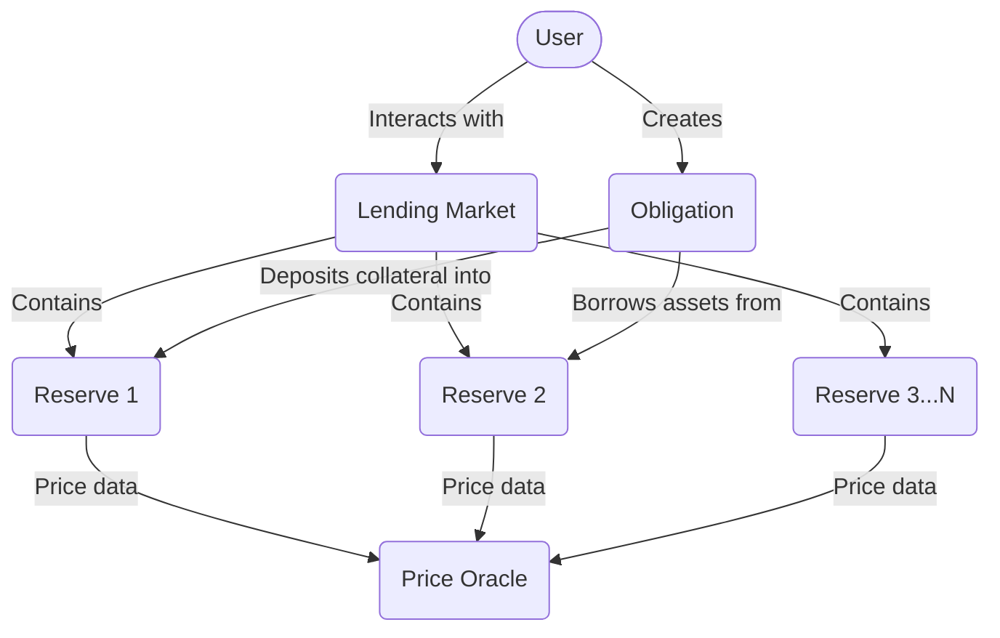
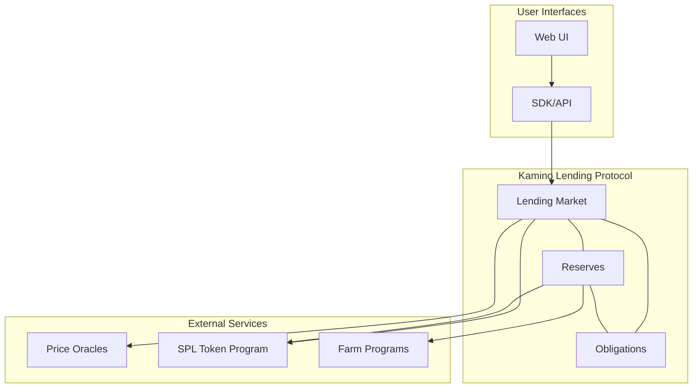
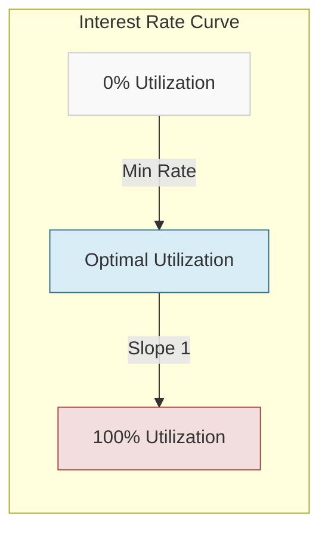

# Kamino Lending Protocol Architecture

## Protocol Overview

The Kamino Lending protocol is a sophisticated decentralized lending platform on Solana that enables users to supply assets as collateral and borrow other assets against this collateral. The protocol implements a pool-based lending model with dynamic interest rates determined by supply and demand.

## Core Components

### 1. Lending Market

The Lending Market is the central coordinator for the entire protocol:

- Manages all reserves within the market
- Enforces global protocol parameters
- Handles protocol-wide settings and emergency controls
- Manages elevation groups for special borrowing arrangements

### 2. Reserves

Each Reserve represents a pool for a specific token:

- Tracks liquidity (deposits and borrows)
- Manages collateral token issuance
- Controls token-specific risk parameters
- Handles interest rate calculations
- Determines fees for operations

### 3. Obligations

An Obligation represents a user's position in the protocol:

- Tracks collateral deposits across reserves
- Records borrowed amounts from reserves
- Calculates position health and risk metrics
- Enforces liquidation thresholds
- Manages user-specific risk settings

### 4. External Integrations

The protocol integrates with several external components:

- **Price Oracles**: Provide real-time price data for risk calculations
- **SPL Token Program**: Handles all token transfers and management
- **Farm Programs**: Optional yield farming integrations for rewards

## System Architecture

## Key Protocol Mechanisms

### Collateralization and Risk Management

The protocol uses a risk-based system for managing collateralization:

- Each asset has specific risk parameters (LTV, liquidation threshold)
- Positions must maintain sufficient collateralization ratio
- Undercollateralized positions can be liquidated
- Dynamic interest rates adjust based on utilization

### Interest Rate Model

The protocol uses a two-slope interest rate model:
- Below optimal utilization: gradually increasing rate from min to optimal
- Above optimal utilization: steeply increasing rate from optimal to max
- Interest accrues continuously to lender balances

### Liquidation Mechanism

When a position becomes undercollateralized:
- Liquidators can repay part of the borrower's debt
- In exchange, they receive the equivalent collateral value plus a bonus
- Liquidation thresholds are set per asset
- Close factors determine how much of a position can be liquidated at once

## Elevation Groups

The protocol supports specialized borrowing arrangements through elevation groups:
- Define specific debt and collateral reserve relationships
- Enforce additional constraints on certain asset combinations
- Allow for specialized risk parameters for specific asset pairs

## Security Features

The protocol implements multiple security mechanisms:
- Emergency mode to pause borrowing
- Configurable deposit and borrow limits per reserve
- Role-based access control for administrative functions
- Socialized loss handling for extreme cases
- Comprehensive error handling for every operation
