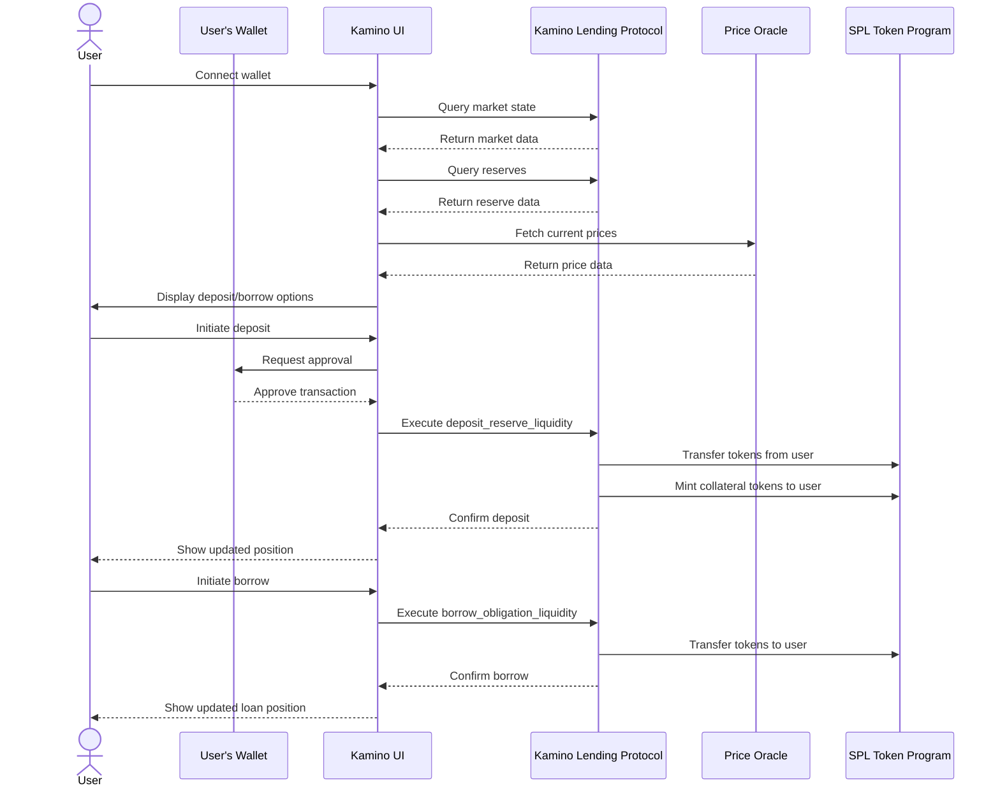
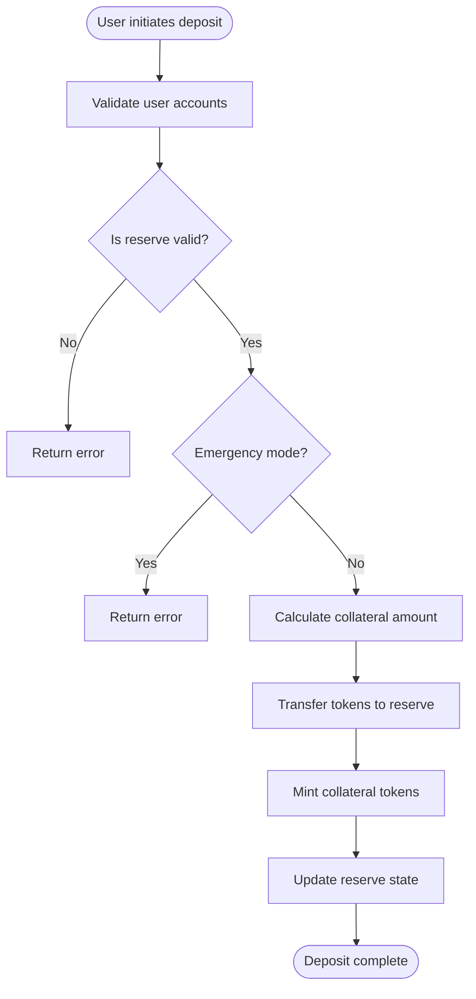
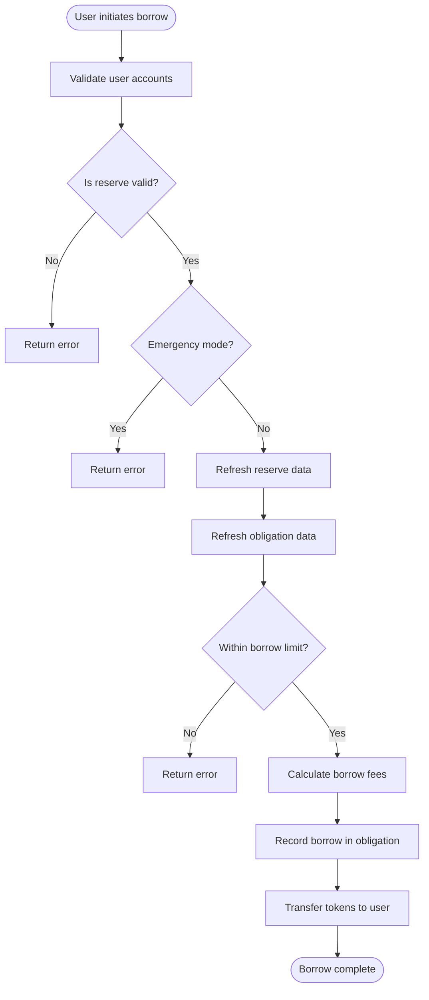
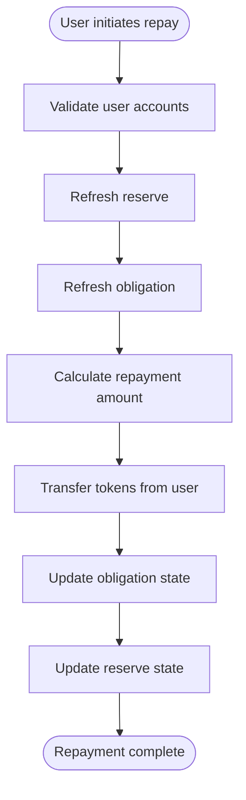
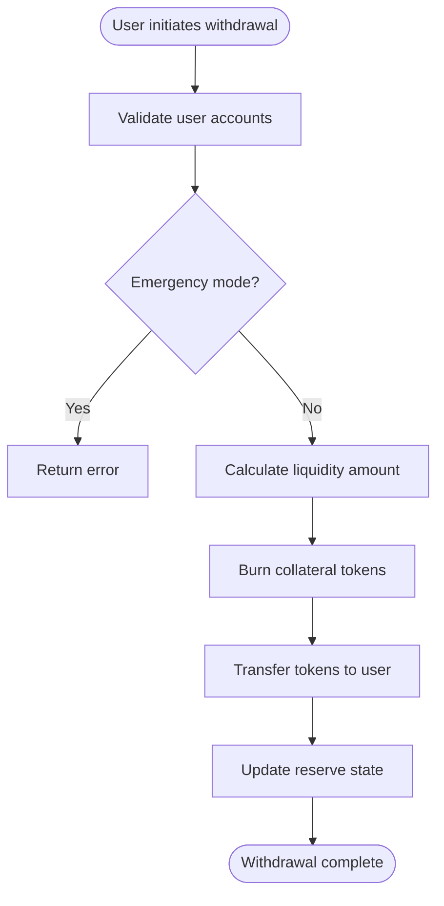
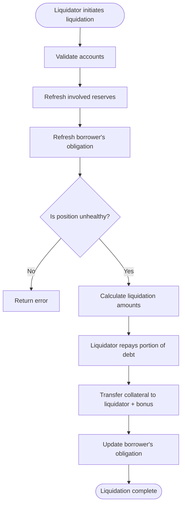
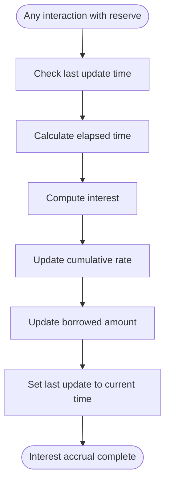

# Kamino Lending Protocol Flows

This document outlines the main interaction flows in the Kamino Lending protocol, providing a comprehensive view of how users interact with the system.

## Core User Flows

### Supply and Borrow Flow

## Detailed Protocol Flows

### 1. Deposit Flow

When a user deposits tokens into the protocol:

1. User initiates a deposit of a specific token amount
2. Protocol validates all required accounts and their relationships
3. Protocol checks if the reserve is in emergency mode
4. Protocol calculates collateral tokens to mint based on current exchange rate
5. Protocol transfers user's tokens to the reserve liquidity supply account
6. Protocol mints collateral tokens to the user's collateral account
7. Protocol updates the reserve state to reflect the new deposit

### 2. Borrow Flow

When a user borrows tokens from the protocol:

1. User initiates a borrow request for a specific token amount
2. Protocol validates all required accounts and their relationships
3. Protocol checks if the reserve is in emergency mode
4. Protocol refreshes reserve data (prices, interest)
5. Protocol refreshes the obligation to recalculate health
6. Protocol checks if the borrow would exceed the user's limit
7. Protocol calculates borrow fees
8. Protocol records the borrow in the user's obligation
9. Protocol transfers borrowed tokens to the user

### 3. Repayment Flow

When a user repays borrowed tokens:

1. User initiates a repayment of a specific token amount
2. Protocol validates all required accounts and their relationships
3. Protocol refreshes reserve data to get current interest
4. Protocol refreshes the obligation to get current borrowed amount
5. Protocol calculates the actual repayment amount (principal + interest)
6. Protocol transfers tokens from the user to the reserve
7. Protocol updates the obligation to reflect the repayment
8. Protocol updates the reserve state

### 4. Withdrawal Flow

When a user withdraws their deposited tokens:

1. User initiates a withdrawal by specifying collateral amount
2. Protocol validates all required accounts and their relationships
3. Protocol checks if the reserve is in emergency mode
4. Protocol calculates liquidity amount based on exchange rate
5. Protocol burns the user's collateral tokens
6. Protocol transfers liquidity tokens to the user
7. Protocol updates the reserve state

### 5. Liquidation Flow

When a position becomes unhealthy:

1. Liquidator identifies an unhealthy position
2. Protocol validates all required accounts
3. Protocol refreshes reserves to get current prices and interest
4. Protocol refreshes the borrower's obligation to calculate health
5. Protocol verifies the position is indeed unhealthy
6. Protocol calculates liquidation amounts and bonus
7. Liquidator repays a portion of the borrower's debt
8. Protocol transfers collateral plus bonus to the liquidator
9. Protocol updates the borrower's obligation

## Interest Accrual Flow

Interest continuously accrues in the background:

1. Any reserve interaction triggers interest accrual
2. Protocol checks when interest was last accrued
3. Protocol calculates the time elapsed since last update
4. Protocol computes interest based on current borrow rate and time
5. Protocol updates the cumulative borrow rate
6. Protocol increases the total borrowed amount by the accrued interest
7. Protocol updates the last update timestamp

These flows represent the core interactions in the Kamino Lending protocol. Each flow triggers multiple instructions, which are documented in detail in the instruction-specific documentation.
