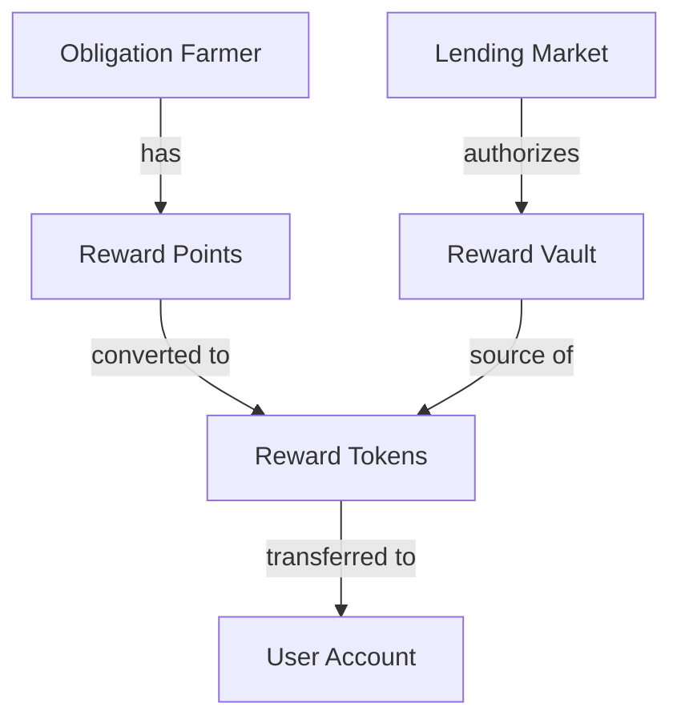
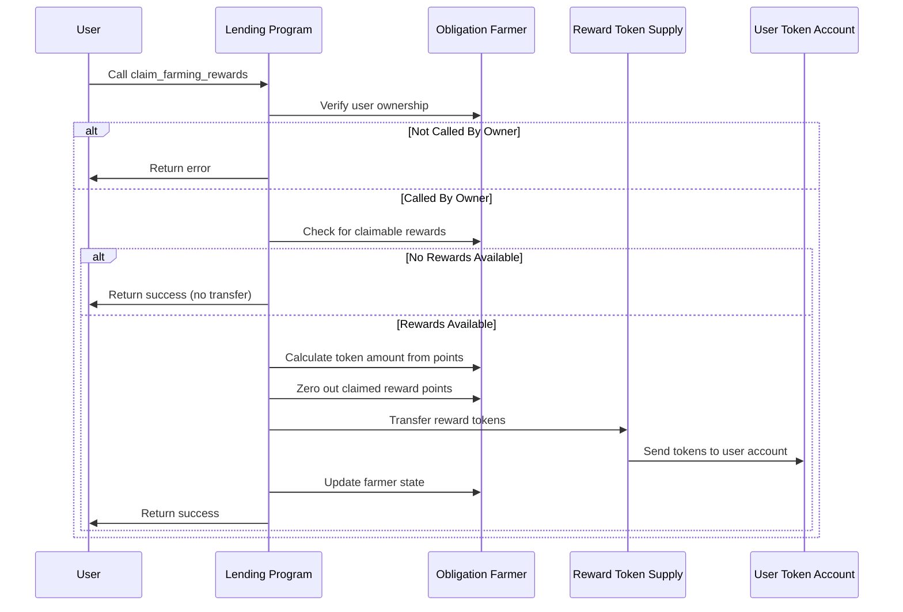

# Claim Farming Rewards

## Purpose

The `claim_farming_rewards` instruction allows users to convert accumulated reward points into actual token rewards and withdraw them to their wallet. This instruction completes the reward cycle by transferring earned incentives from the protocol to users based on their lending and borrowing activity.

## Real-World Analogy

Claiming farming rewards is similar to redeeming credit card points or loyalty rewards for cash back. For example, after accumulating airline miles through frequent flights, you can redeem those miles for free flights or upgrades. Similarly, in Kamino Lending, after accumulating reward points through lending or borrowing activity, users can claim these points as actual tokens.

## Required Accounts



| Account | Role | Signer | Writable |
|---------|------|--------|----------|
| `obligation_farmer` | Farmer account tracking rewards | No | Yes |
| `obligation_owner` | Owner of the obligation | Yes | No |
| `farmer_reward_token_account` | User's token account for rewards | No | Yes |
| `lending_market` | Parent lending market | No | No |
| `lending_market_authority` | Authority derived from the lending market | No | No |
| `reward_token_supply` | Protocol's reward token vault | No | Yes |
| `token_program` | SPL Token program | No | No |
| `clock` | Clock sysvar for timestamp | No | No |

## Parameters

| Parameter | Type | Description |
|-----------|------|-------------|
| `farm_type` | `u64` | Type of farm to claim rewards from (e.g., 0 for deposits, 1 for borrows) |
| `reward_index` | `u64` | Index of the specific reward to claim |

## Step-by-Step Process



1. **Account Validation**:
   - Verify the obligation farmer belongs to the signer
   - Check that all accounts are properly initialized
   - Validate that the token accounts match the expected mint

2. **Reward Calculation**:
   - Determine the claimable rewards based on accumulated points
   - Convert points to token amount using the configured conversion rate
   - Verify there are sufficient rewards available in the supply

3. **Token Transfer**:
   - Transfer the calculated reward amount from the protocol vault to the user
   - Update the obligation farmer to reflect the claimed rewards
   - Zero out the claimed reward balance

4. **State Update**:
   - Update the obligation farmer's claimed rewards history
   - Set the last claim timestamp to the current time

## Reward Calculation

The conversion from points to tokens follows this process:

```
// Convert points to tokens
Reward Tokens = Points / Points Per Token Conversion Rate

// Apply any multipliers or bonuses
Final Reward = Reward Tokens * User Multiplier
```

Where:
- `Points` is the accumulated reward points for the specified farm type
- `Points Per Token Conversion Rate` is the configured rate for the reward
- `User Multiplier` may apply based on user status or boost mechanisms

## Constraints and Validations

- The caller must be the obligation owner
- The obligation farmer must have positive reward points to claim
- The reward token supply must have sufficient tokens
- The user's token account must be able to receive the rewards

## Error Cases

| Error | Condition |
|-------|-----------|
| `InvalidObligationOwner` | The signer is not the obligation owner |
| `InsufficientRewardPoints` | No reward points available to claim |
| `InsufficientRewardTokens` | Insufficient tokens in the reward supply |
| `TokenTransferFailed` | The reward token transfer failed |

## Reward Types and Farms

The protocol supports multiple reward types across different farm categories:

### Farm Types

1. **Deposit Farms** (`farm_type = 0`):
   - Rewards for providing liquidity to reserves
   - Points accrue based on deposit size and duration

2. **Borrow Farms** (`farm_type = 1`):
   - Rewards for borrowing from reserves
   - Points accrue based on borrow size and duration

### Multiple Reward Indices

Each farm type may have multiple reward tokens:

- `reward_index = 0`: Primary reward token (e.g., protocol token)
- `reward_index = 1`: Secondary reward token (e.g., partner token)
- Additional indices for other reward tokens

## Example Usage

In a client application, the claim farming rewards instruction might be used like this:

```javascript
// Claim deposit farming rewards for the primary reward token
const claimDepositRewardsInstruction = await kaminoLending.createClaimFarmingRewardsInstruction(
  userObligationFarmer.address,       // obligation farmer account
  userWallet.publicKey,               // obligation owner
  userRewardTokenAccount.address,     // user's reward token account
  lendingMarket.address,              // parent lending market
  rewardTokenSupply.address,          // protocol's reward token vault
  0,                                  // farm type (0 for deposits)
  0                                   // reward index (0 for primary reward)
);

// Claim borrow farming rewards for the secondary reward token
const claimBorrowRewardsInstruction = await kaminoLending.createClaimFarmingRewardsInstruction(
  userObligationFarmer.address,
  userWallet.publicKey,
  userSecondaryRewardAccount.address,
  lendingMarket.address,
  secondaryRewardSupply.address,
  1,                                  // farm type (1 for borrows)
  1                                   // reward index (1 for secondary reward)
);

// Add to a transaction and execute
const transaction = new Transaction().add(
  // First refresh to ensure all rewards are up to date
  refreshFarmerInstruction,
  // Then claim rewards
  claimDepositRewardsInstruction
);
await sendAndConfirmTransaction(connection, transaction, [userWallet]);
```

## Related Instructions

- [Refresh Obligation Farmer](./refresh-obligation-farmer.md): Updates reward points before claiming
- [Init Obligation Farmer](./init-obligation-farmer.md): Creates the farming account
- [Update Farming Mode](./update-farming-mode.md): Changes how rewards accrue

## Reward Optimization Strategies

### Timing Considerations

For users seeking to maximize rewards:

1. **Compound Frequency**: Determine optimal claiming frequency based on:
   - Gas costs vs. reward value
   - Opportunity cost of unclaimed rewards
   - Compound benefits in other protocols

2. **Market Timing**: Consider token price when claiming:
   - Claim during favorable market conditions
   - Potentially hold rewards during market downturns
   - Align with personal investment strategy

### Reward Utilization

After claiming, users have several options:

1. **Reinvestment**: Deposit rewards back into the protocol
2. **Staking**: Stake rewards in related protocols
3. **Liquidity Provision**: Add rewards to liquidity pools
4. **Hold or Sell**: Based on market outlook and strategy

## Special Considerations

### Protocol Economics

From a protocol perspective:

1. **Reward Distribution**: Ensure fair and sustainable distribution
2. **Emission Schedule**: Plan for long-term reward emissions
3. **Token Economics**: Balance rewards with token value and inflation
4. **User Incentives**: Align rewards with desired user behavior

### User Experience

For frontend developers:

1. **Reward Visibility**: Clearly display available rewards
2. **Claim Guidance**: Provide optimal claiming strategies
3. **Transaction Bundling**: Bundle refresh and claim operations
4. **Historical Tracking**: Show reward claiming history

### Reward Source Management

For protocol administrators:

1. **Supply Monitoring**: Ensure sufficient rewards are available
2. **Replenishment Planning**: Schedule vault replenishment
3. **Emergency Procedures**: Plan for reward shortages
4. **Analytics Integration**: Track reward distribution metrics

### Multi-Token Support

When dealing with multiple reward tokens:

1. **Token Prioritization**: Guide users on which rewards to claim first
2. **Wallet Preparation**: Ensure users have accounts for all reward tokens
3. **Value Comparison**: Show relative value of different rewards
4. **Claim All Option**: Consider bundled claiming of all rewards
