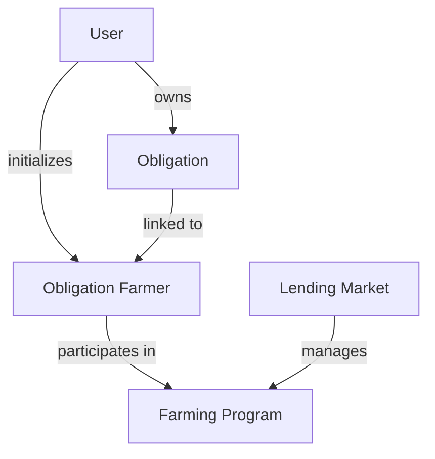
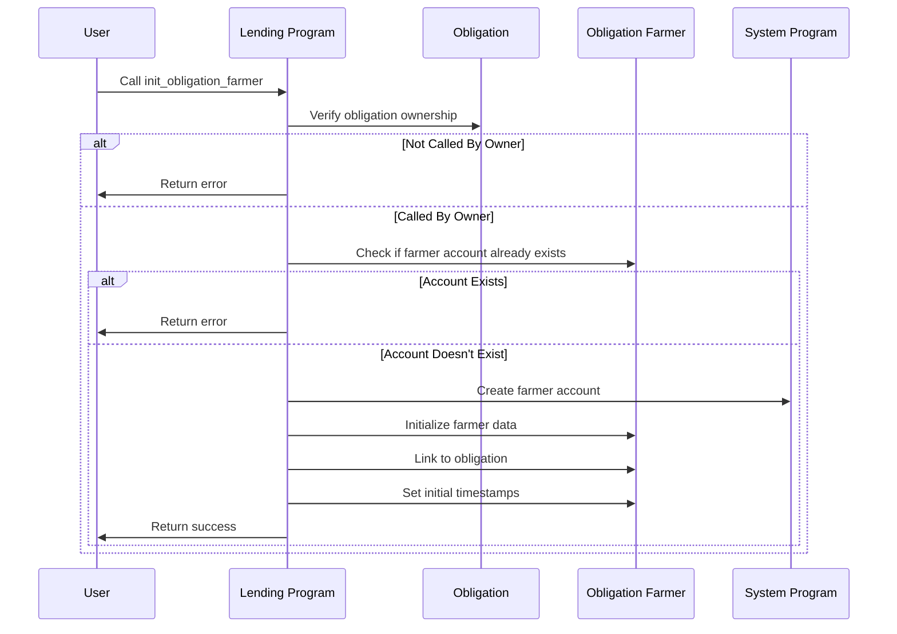
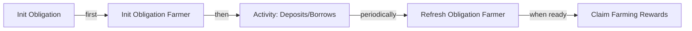

# Init Obligation Farmer

## Purpose

The `init_obligation_farmer` instruction creates a new farmer account linked to a user's obligation, enabling participation in the protocol's farming incentive system. This account tracks reward points earned through lending and borrowing activities and allows users to later claim these points as token rewards.

## Real-World Analogy

Initializing an obligation farmer is similar to enrolling in a bank's rewards program. When you open a new account at a bank, you may need to specifically register for their rewards program to start earning points on your deposits or credit card transactions. Similarly, in Kamino Lending, users need to create a dedicated farmer account to track and accumulate rewards from their lending and borrowing activities.

## Required Accounts



| Account | Role | Signer | Writable |
|---------|------|--------|----------|
| `obligation` | User's obligation account | No | No |
| `obligation_farmer` | New farmer account to initialize | No | Yes |
| `obligation_owner` | Owner of the obligation | Yes | Yes |
| `lending_market` | Parent lending market | No | No |
| `rent` | Rent sysvar | No | No |
| `system_program` | System program | No | No |
| `clock` | Clock sysvar | No | No |

## Parameters

This instruction doesn't require any parameters beyond the provided accounts.

## Step-by-Step Process



1. **Account Validation**:
   - Verify the obligation belongs to the signer
   - Check that the obligation is properly initialized
   - Validate that a farmer account doesn't already exist for this obligation

2. **Account Creation**:
   - Create a new obligation farmer account using the system program
   - Allocate enough space for the farmer data structure
   - Fund the account with rent-exemption deposit

3. **Data Initialization**:
   - Initialize the farmer account with default values
   - Link the farmer to the specific obligation
   - Set the initial reward points to zero
   - Record the current timestamp as the initialization time

## Farmer Account Data Structure

The obligation farmer account stores:

```rust
pub struct ObligationFarmer {
    pub version: u64,
    pub lending_market: Pubkey,
    pub obligation: Pubkey,
    pub deposit_rewards: [FarmPoints; 3],
    pub borrow_rewards: [FarmPoints; 3],
    pub deposit_rewards_claims: [u64; 3],
    pub borrow_rewards_claims: [u64; 3],
    pub farmer_type: u64,
    pub last_update: i64,
    pub lp_deposit_rewards: [FarmPoints; 3],
    pub lp_borrow_rewards: [FarmPoints; 3],
    pub lp_deposit_rewards_claims: [u64; 3],
    pub lp_borrow_rewards_claims: [u64; 3],
    pub lp_last_update: i64,
}

pub struct FarmPoints {
    pub points: u128,
}
```

Where:
- `version`: Version of the farmer account structure
- `lending_market`: Parent lending market public key
- `obligation`: Associated obligation public key
- `deposit_rewards`: Points earned from lending activities
- `borrow_rewards`: Points earned from borrowing activities
- `last_update`: Timestamp of the last reward update
- Additional fields for LP farming and claims tracking

## Constraints and Validations

- The caller must be the obligation owner
- The obligation must be properly initialized
- A farmer account must not already exist for this obligation
- The system program must successfully create the account

## Error Cases

| Error | Condition |
|-------|-----------|
| `InvalidObligationOwner` | The signer is not the obligation owner |
| `FarmerAlreadyInitialized` | A farmer account already exists for this obligation |
| `InsufficientFunds` | The signer lacks funds for account creation |
| `AccountCreationFailed` | The system program failed to create the account |

## Post-Initialization State

After successful initialization:

1. **Account State**:
   - A new obligation farmer account exists on-chain
   - The account is linked to the user's obligation
   - Initial reward points are set to zero
   - Last update timestamp is set to the current time

2. **User State**:
   - User now participates in the farming program
   - User can begin accumulating reward points
   - User owns the newly created farmer account

3. **Protocol State**:
   - One more participant is added to the farming program
   - Farming rewards begin to accrue for the user's activity

## Example Usage

In a client application, the init obligation farmer instruction might be used like this:

```javascript
// Create a new obligation farmer account
const initFarmerInstruction = await kaminoLending.createInitObligationFarmerInstruction(
  userObligation.address,                 // existing user obligation
  obligationFarmerKeypair.publicKey,      // new farmer account address
  userWallet.publicKey,                   // obligation owner
  lendingMarket.address                   // parent lending market
);

// Add to a transaction and execute
const transaction = new Transaction().add(initFarmerInstruction);
await sendAndConfirmTransaction(
  connection, 
  transaction, 
  [userWallet, obligationFarmerKeypair]  // Both user and new account must sign
);
```

## Related Instructions

- [Refresh Obligation Farmer](./refresh-obligation-farmer.md): Updates accumulated rewards
- [Claim Farming Rewards](./claim-farming-rewards.md): Withdraws earned rewards
- [Init Obligation](../user-borrow/init-obligation.md): Creates the obligation (prerequisite)

## User Experience Flow

The typical user journey for farming includes:



1. Create an obligation (if not already existing)
2. Initialize a farmer account (this instruction)
3. Perform lending/borrowing activities
4. Periodically refresh the farmer to accrue rewards
5. Claim rewards when desired

## Special Considerations

### Account Lifecycle Management

The farmer account has its own lifecycle:

1. **Creation**: This instruction initializes the account
2. **Activity**: Account tracks rewards during active usage
3. **Dormancy**: Account may become inactive if obligation is unused
4. **Closure**: Consider adding a close_farmer instruction for cleanup

### Multi-Program Integration

For systems integrating with multiple protocols:

1. **Account Tracking**: Keep track of all farmer accounts
2. **Cross-Protocol Strategies**: Coordinate farming across protocols
3. **Unified Experience**: Present unified reward dashboards to users

### Protocol Participation Growth

For protocol administrators:

1. **Onboarding Optimization**: Make farmer initialization seamless
2. **Automatic Creation**: Consider auto-creating farmers with obligations
3. **User Education**: Clearly explain the benefits of farming
4. **Analytics**: Track farmer initialization as a key adoption metric

### Security Considerations

When implementing client applications:

1. **Keypair Generation**: Generate unique keypairs for each farmer account
2. **Account Validation**: Verify the created account is correctly initialized
3. **Ownership Transfer**: Consider what happens if obligation ownership transfers
4. **Abandoned Accounts**: Plan for handling dormant farmer accounts
