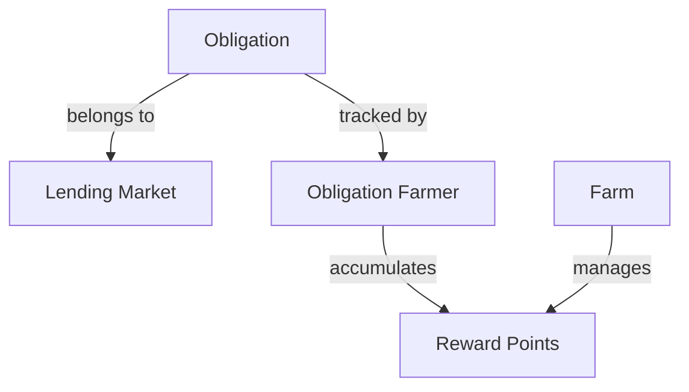
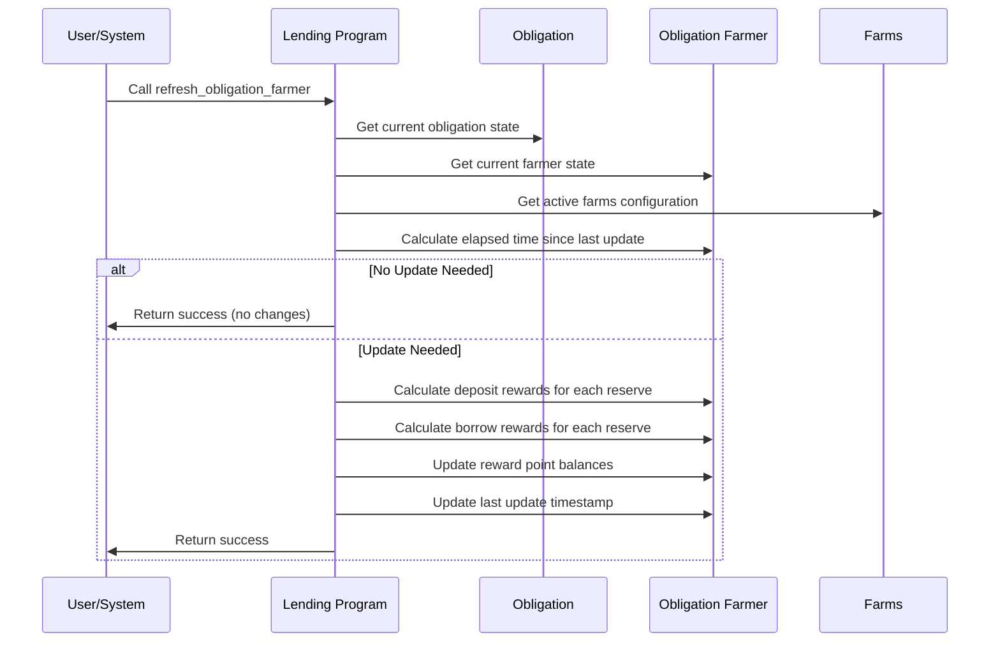
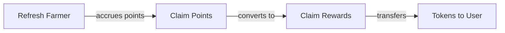

# Refresh Obligation Farmer

## Purpose

The `refresh_obligation_farmer` instruction updates an obligation's farming state, calculating and distributing any pending reward points based on the user's activity in the protocol. This instruction is a core component of the protocol's incentive system, enabling users to earn rewards for providing liquidity (deposits) and taking on risk (borrows).

## Real-World Analogy

Refreshing an obligation farmer is similar to how a bank calculates and credits loyalty points or interest on an account. For example, a credit card company might calculate reward points based on your spending patterns and credit them to your account periodically. Similarly, Kamino Lending calculates reward points based on user activity and credits them to the user's farming account.

## Required Accounts



| Account | Role | Signer | Writable |
|---------|------|--------|----------|
| `obligation` | User's obligation account | No | No |
| `obligation_farmer` | Farmer account tracking rewards | No | Yes |
| `lending_market` | Parent lending market | No | No |
| `clock` | Clock sysvar for timestamp | No | No |

## Parameters

This instruction doesn't require any parameters beyond the provided accounts.

## Step-by-Step Process



1. **Account Validation**:
   - Verify the obligation farmer belongs to the specified obligation
   - Check that the obligation belongs to the specified lending market
   - Validate that all accounts are initialized properly

2. **Time Calculation**:
   - Determine the elapsed time since the last farmer update
   - If no time has elapsed, no update is needed

3. **Reward Calculation**:
   - For each deposit in the obligation:
     - Check if the reserve has active deposit farming
     - Calculate points earned based on deposit amount, elapsed time, and reward rate
     - Add points to the user's deposit reward balance
   - For each borrow in the obligation:
     - Check if the reserve has active borrow farming
     - Calculate points earned based on borrow amount, elapsed time, and reward rate
     - Add points to the user's borrow reward balance

4. **State Update**:
   - Update the obligation farmer's reward point balances
   - Set the last update timestamp to the current time

## Farming Mechanism

The protocol's farming system works as follows:

### Reward Accrual

```
// For each reserve with active farming
Points = Amount * Time * RewardRate
```

Where:
- `Amount` is the deposit or borrow amount in the reserve
- `Time` is the elapsed time since the last update
- `RewardRate` is the configured points per token per time unit

### Multiple Farms

The protocol supports multiple farms simultaneously:

1. **Reserve-Specific Farms**: Different reserves may have different reward rates
2. **Deposit vs. Borrow Farming**: Separate reward rates for lending and borrowing
3. **Time-Limited Campaigns**: Farms may have start and end times

## Constraints and Validations

- The obligation and obligation farmer must be valid and initialized
- The obligation farmer must belong to the specified obligation
- The obligation must belong to the specified lending market

## Error Cases

| Error | Condition |
|-------|-----------|
| `InvalidAccountOwner` | An account is not owned by the expected program |
| `InvalidAccountData` | Account data is invalid or uninitialized |
| `MathOverflow` | Reward calculation would result in numeric overflow |

## Reward Distribution Flow

The farming process consists of multiple steps:



1. **Refresh Farmer**: Updates reward point accrual (this instruction)
2. **Claim Points**: Converts points to claimable rewards
3. **Claim Rewards**: Transfers actual reward tokens to the user

## Example Usage

In a client application, the refresh obligation farmer instruction might be used like this:

```javascript
// Refresh an obligation farmer to update reward points
const refreshFarmerInstruction = await kaminoLending.createRefreshObligationFarmerInstruction(
  userObligation.address,        // user's obligation
  userObligationFarmer.address,  // obligation farmer account
  lendingMarket.address          // parent lending market
);

// Add to a transaction and execute
const transaction = new Transaction().add(refreshFarmerInstruction);
await sendAndConfirmTransaction(connection, transaction, [userWallet]);

// Note: This is often called automatically before other farming operations
// or can be called periodically by the user to update their rewards
```

## Related Instructions

- [Init Obligation Farmer](./init-obligation-farmer.md): Creates the farming account for an obligation
- [Claim Farming Rewards](./claim-farming-rewards.md): Converts points to tokens and withdraws
- [Update Farm](./update-farm.md): Updates farming parameters for a reserve

## Farming Strategies

### Optimal Timing

For users seeking to maximize rewards:

1. **Regular Updates**: Frequently refresh to ensure continuous point accrual
2. **Pre-Transaction Updates**: Always refresh before deposits, withdrawals, or claims
3. **Automated Services**: Use third-party services that automatically refresh

### Reserve Selection

Different reserves may offer different farming incentives:

1. **High-Reward Reserves**: Some reserves may have boosted rewards
2. **Limited-Time Campaigns**: Special farming events may offer higher rates
3. **Balanced Approach**: Consider both APY from interest and farming rewards

## Special Considerations

### Reward Calculation Precision

The farming system uses fixed-point arithmetic:

1. **Precision Handling**: Ensures fair distribution regardless of token decimals
2. **Rounding Mechanics**: Small amounts may experience rounding effects
3. **Minimum Thresholds**: Very small positions may accrue rewards slowly

### Protocol Economics

Farming rewards serve multiple purposes:

1. **Liquidity Incentives**: Attract deposits to less-utilized reserves
2. **Borrowing Incentives**: Encourage borrowing to increase utilization
3. **Market Balance**: Help maintain optimal utilization rates
4. **User Retention**: Reward loyal users of the protocol

### User Experience Optimization

For frontend developers:

1. **Automatic Refreshing**: Integrate automatic refreshing before key actions
2. **Reward Estimation**: Show estimated rewards in the UI
3. **Unclaimed Balances**: Display pending and claimable reward amounts
4. **Historical Tracking**: Provide history of earned rewards

### Farm Configuration

For protocol administrators:

1. **Strategic Incentives**: Configure farms to incentivize desired behaviors
2. **Dynamic Adjustment**: Adjust reward rates based on market conditions
3. **Reserve Targeting**: Boost rewards for reserves needing liquidity
4. **Campaign Planning**: Design time-limited farming campaigns for specific goals
