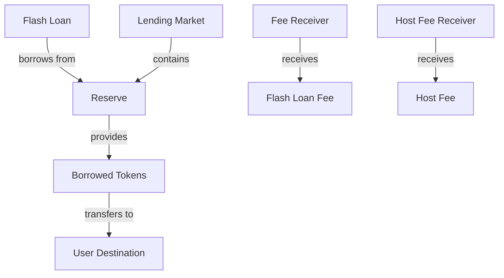
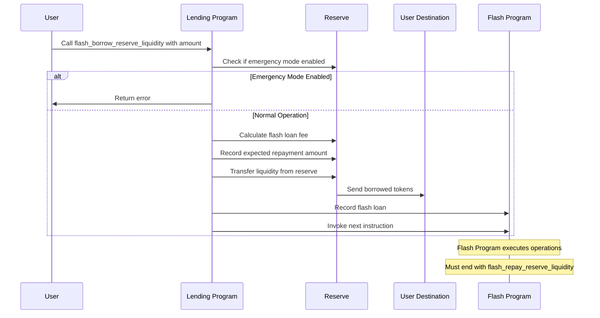
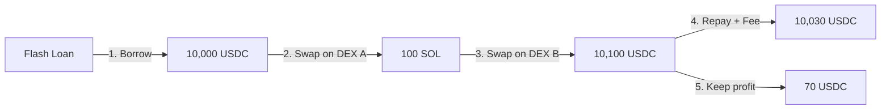
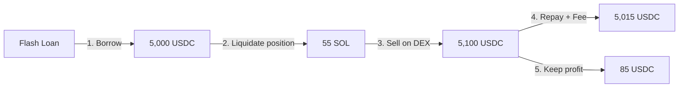
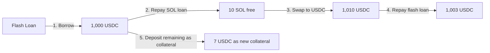

# Flash Borrow Reserve Liquidity

## Purpose

The `flash_borrow_reserve_liquidity` instruction allows users to borrow tokens from a reserve without posting collateral, with the requirement that the borrowed amount must be repaid within the same transaction. This powerful feature enables complex financial operations like arbitrage, liquidations, and collateral swaps to be executed atomically without requiring upfront capital.

## Real-World Analogy

Flash loans don't have a direct traditional finance equivalent as they're a DeFi innovation. However, they're conceptually similar to very short-term bridge loans or intraday credit facilities used by financial institutions. The key difference is that flash loans have zero risk for the lender because the entire operation must be completed atomically or the whole transaction reverts.

In traditional finance, this might be like a bank allowing you to temporarily use funds to execute a profitable arbitrage opportunity, where the loan and its repayment are guaranteed to happen simultaneously, or neither happens at all.

## Required Accounts



| Account | Role | Signer | Writable |
|---------|------|--------|----------|
| `source_liquidity` | Reserve's liquidity supply account | No | Yes |
| `destination_liquidity` | User's account to receive flash loan | No | Yes |
| `reserve` | The reserve to borrow from | No | Yes |
| `flash_loan_fee_receiver` | Account that receives the flash loan fee | No | Yes |
| `host_fee_receiver` | Account that receives the host portion of the fee | No | Yes |
| `lending_market` | The lending market | No | No |
| `lending_market_authority` | Authority derived from the lending market | No | No |
| `token_program` | SPL Token program | No | No |
| `flash_program` | Program that will utilize the flash loan | No | No |

## Parameters

| Parameter | Type | Description |
|-----------|------|-------------|
| `liquidity_amount` | `u64` | The amount of tokens to borrow |

## Step-by-Step Process



1. **Account Validation**:
   - Verify all accounts are properly owned and initialized
   - Check that the reserve belongs to the specified lending market
   - Validate that the flash program is a valid program

2. **State Verification**:
   - Check that the lending market is not in emergency mode
   - Verify the reserve is not frozen or in a special state
   - Ensure there is sufficient liquidity available

3. **Fee Calculation**:
   - Calculate the flash loan fee based on the reserve's fee configuration
   - Calculate the host fee if applicable (for frontend integrations)

4. **Token Transfer**:
   - Transfer the borrowed amount from reserve to user's destination account

5. **State Updates**:
   - Record the flash loan in the protocol's state
   - Store the expected repayment amount (loan + fees)
   - Set up the transaction to enforce atomic execution

6. **Program Invocation**:
   - Invoke the next instruction in the transaction
   - This will be the user's custom logic for using the flash loan
   - The transaction must include a `flash_repay_reserve_liquidity` instruction before completion

## Detailed Calculations

### Flash Loan Fee Calculation

The flash loan fee is calculated as:

```
Flash Loan Fee = Borrow Amount * Flash Loan Fee Rate
```

Where:
- `Flash Loan Fee Rate` is specified in the reserve's configuration
- The fee is typically slightly higher than regular borrow fees (e.g., 0.3% to 1%)

If a host (frontend or integrator) is involved, a portion of the fee goes to them:

```
Host Fee = Flash Loan Fee * Host Fee Percentage / 100
Protocol Fee = Flash Loan Fee - Host Fee
```

#### Example Calculation

If:
- Flash loan amount is 10,000 USDC
- Flash loan fee rate is 0.3% (0.003)
- Host fee percentage is 20%

Then:
```
Flash Loan Fee = 10,000 * 0.003 = 30 USDC
Host Fee = 30 * 20% = 6 USDC
Protocol Fee = 30 - 6 = 24 USDC
```

The total repayment required would be 10,030 USDC.

### Expected Repayment

The protocol records the expected repayment amount:

```
Expected Repayment = Flash Loan Amount + Flash Loan Fee
```

This amount must be repaid by the `flash_repay_reserve_liquidity` instruction in the same transaction.

## Constraints and Validations

- The flash loan amount must be greater than zero
- The reserve must have sufficient available liquidity
- The lending market must not be in emergency mode
- The transaction must complete with the borrowed amount plus fees returned to the reserve

## Error Cases

| Error | Condition |
|-------|-----------|
| `MarketInEmergencyMode` | The lending market is in emergency mode |
| `InvalidAmount` | The flash loan amount is zero |
| `InsufficientLiquidity` | The reserve doesn't have enough available liquidity |
| `FlashLoansDisabled` | Flash loans are disabled for this reserve |
| `TokenTransferFailed` | The token transfer to the user failed |
| `MathOverflow` | A calculation resulted in numeric overflow |

## Post-Flash Loan State

After the flash loan is issued:

- The user's destination account has the borrowed tokens
- The reserve's available liquidity is temporarily reduced
- The protocol has recorded the expected repayment amount
- The transaction is now committed to including a valid repayment instruction

## Flash Loan Use Cases

### Arbitrage

Flash loans enable arbitrage with zero capital requirements:



### Liquidations

Flash loans can be used to fund liquidations without upfront capital:



### Collateral Swaps

Flash loans allow users to change their collateral composition:



## Example Usage

In a client application, the flash loan instruction might be used like this:

```javascript
// Flash borrow 10,000 USDC
const flashBorrowInstruction = await kaminoLending.createFlashBorrowReserveLiquidityInstruction(
  usdcReserve.address,            // reserve to borrow from
  userUsdcAccount.address,        // destination for borrowed USDC
  flashLoanProgram.publicKey,     // program that will use the flash loan
  feeReceiver.address,            // protocol fee receiver
  hostFeeReceiver.address,        // host fee receiver (if applicable)
  new BN(10_000_000_000)          // 10,000 USDC (with 6 decimals)
);

// Create the instructions that will use the flash loan
const userLogicInstructions = [
  // Example: Arbitrage between exchanges
  swapOnExchangeAInstruction,
  swapOnExchangeBInstruction,
];

// Create the repayment instruction (must be included)
const flashRepayInstruction = await kaminoLending.createFlashRepayReserveLiquidityInstruction(
  userUsdcAccount.address,        // source for repayment
  usdcReserve.address,            // reserve to repay
  flashLoanProgram.publicKey,     // program that used the flash loan
  new BN(10_030_000_000)          // 10,030 USDC (loan + fee)
);

// Combine all instructions in the correct order
const transaction = new Transaction()
  .add(flashBorrowInstruction)
  .add(...userLogicInstructions)
  .add(flashRepayInstruction);

await sendAndConfirmTransaction(connection, transaction, [userWallet]);
```

## Related Instructions

- [Flash Repay Reserve Liquidity](./flash-repay-reserve-liquidity.md): Required to complete the flash loan
- [Liquidate Obligation](../liquidation/liquidate-obligation.md): Often used with flash loans
- [Deposit Reserve Liquidity and Obligation Collateral](../user-deposit/deposit-reserve-liquidity-and-obligation-collateral.md): Can be used with flash loans for position management

## Security Considerations

### Transaction Atomicity

Flash loans rely on Solana's transaction atomicity:

1. If any instruction in the transaction fails, the entire transaction reverts
2. This ensures that either the flash loan is properly repaid or no funds are borrowed
3. The protocol has zero risk since funds never leave its control across blocks

### Flash Loan Attacks

Flash loans have been used in some DeFi exploits:

1. Price oracle manipulation
2. Governance attacks
3. Economic exploits

The protocol should implement these safeguards:
- Time-weighted average prices (TWAPs)
- Multiple oracle sources
- Rate limiting mechanisms
- Liquidity reserves

### Gas and Computation Limits

Flash loan transactions can be complex:

1. They may involve multiple operations
2. Could hit Solana's computation unit limits
3. Users should optimize their flash loan logic

### Fees as Economic Security

Flash loan fees serve dual purposes:

1. Generate revenue for the protocol and liquidity providers
2. Create economic disincentives for certain attack vectors
3. Help ensure the protocol's sustainability
