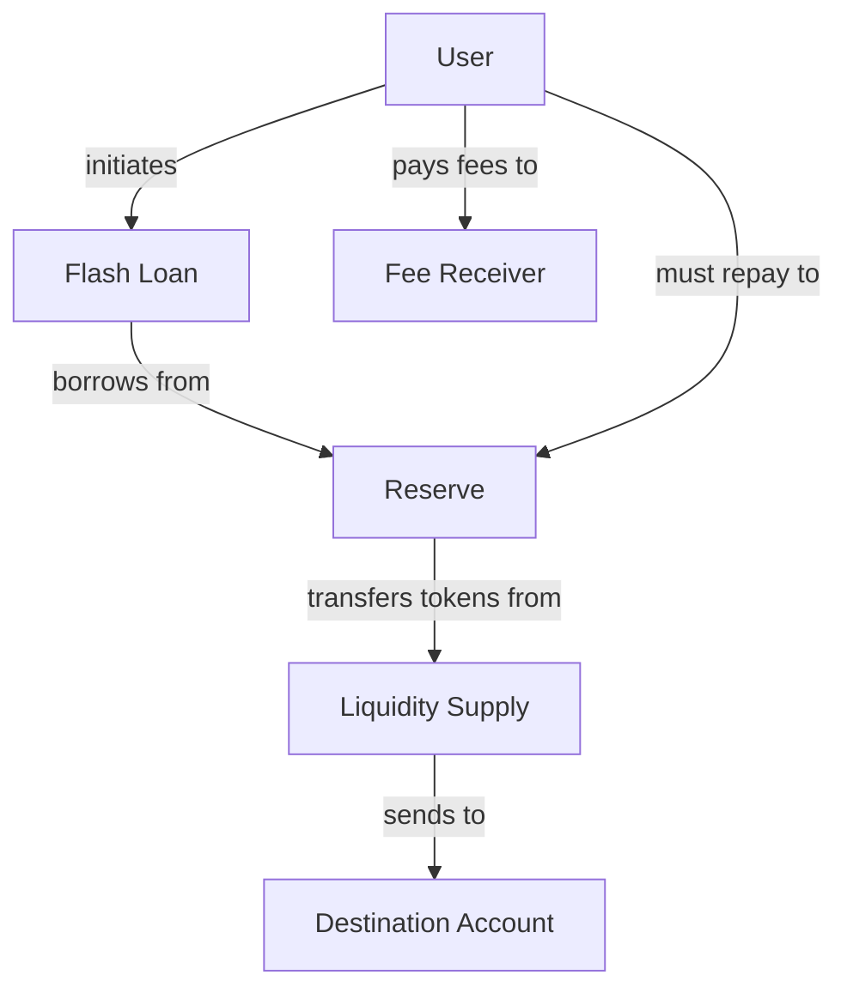
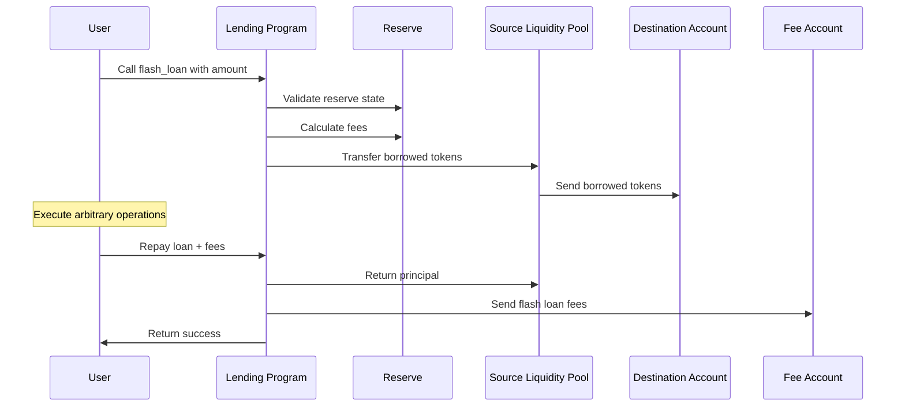

# Flash Loan

## Purpose

The `flash_loan` instruction allows users to borrow assets from the lending protocol without providing collateral, under the condition that the loan is repaid within the same transaction. This powerful primitive enables complex financial operations such as arbitrage, liquidations, and collateral swaps to be executed atomically, maximizing capital efficiency and minimizing risk.

## Real-World Analogy

Flash loans are similar to an intra-day credit facility provided by banks to trusted institutional clients. For example, a settlement bank might provide short-term credit to a broker-dealer during the trading day, with the requirement that all positions must be unwound by the end of the day. Similarly, flash loans provide temporary liquidity that must be repaid within the same transaction block.

## Required Accounts



| Account | Role | Signer | Writable |
|---------|------|--------|----------|
| `source_liquidity_supply` | Source of the flash borrowed liquidity | No | Yes |
| `destination_liquidity` | Destination for borrowed tokens | No | Yes |
| `reserve` | Reserve providing the liquidity | No | Yes |
| `lending_market` | Parent lending market | No | No |
| `lending_market_authority` | Authority for the lending market | No | No |
| `token_program` | SPL Token program | No | No |
| `flash_loan_fee_receiver` | Account receiving the flash loan fee | No | Yes |
| `host_fee_receiver` | Optional host receiving portion of fees | No | Yes |
| `transfer_authority` | Authority to repay the loan | Yes | No |

## Parameters

| Parameter | Type | Description |
|-----------|------|-------------|
| `amount` | `u64` | Amount of tokens to borrow |

## Step-by-Step Process



1. **Validation**:
   - Verify all accounts are valid
   - Check that the reserve has sufficient liquidity
   - Validate the amount is non-zero and within limits

2. **Fee Calculation**:
   - Calculate the flash loan fee based on the borrowed amount
   - Determine host fee portion if applicable

3. **Asset Transfer**:
   - Transfer the requested tokens from the reserve to the destination account
   - Record the flash loan in the reserve's state

4. **User Operations**:
   - The user's code executes arbitrary operations with the borrowed funds
   - These operations must complete and ensure repayment within the same transaction

5. **Loan Repayment**:
   - The principal is returned to the reserve
   - Fees are paid to the fee receiver
   - Host fee portion is paid if applicable

## Fee Structure

Flash loans incur a fee that is split between:

1. **Protocol Fee**: Primary fee collected by the protocol
   - Default: 0.3% of the borrowed amount
   - Configurable by governance

2. **Host Fee** (optional):
   - Portion of the fee shared with the host
   - Default: 20% of the protocol fee
   - Can be turned off by passing null for host fee receiver

Fee calculation:
```
Total Fee = Borrowed Amount × Protocol Fee Rate
Host Fee (if applicable) = Total Fee × Host Fee Percentage
Protocol Net Fee = Total Fee - Host Fee
```

## Constraints and Validations

- The borrowed amount must be greater than zero
- The reserve must have sufficient liquidity
- The destination account must be able to receive the tokens
- The loan must be repaid within the same transaction
- The loan + fee must be repaid in full

## Error Cases

| Error | Condition |
|-------|-----------|
| `InvalidAmount` | The requested amount is zero or exceeds the reserve's available liquidity |
| `InvalidSourceAccount` | The source liquidity account is invalid |
| `InvalidDestinationAccount` | The destination account cannot receive tokens |
| `InsufficientLiquidity` | The reserve lacks sufficient liquidity |
| `RepaymentFailure` | The loan was not repaid within the transaction |

## Flash Loan Use Cases

### Arbitrage

Flash loans enable capital-efficient arbitrage:

1. **DEX Arbitrage**: Exploit price differences between exchanges
   ```
   Borrow 10,000 USDC → Buy SOL on DEX A → Sell SOL on DEX B → Repay 10,030 USDC
   ```

2. **Cross-Protocol Arbitrage**: Exploit inefficiencies between protocols
   ```
   Borrow 5 ETH → Perform complex multi-step arbitrage → Repay 5.015 ETH
   ```

### Self-Liquidation

Users can liquidate their own positions to avoid liquidation penalties:

```
Borrow USDC → Repay underwater loan → Withdraw collateral → Swap for USDC → Repay flash loan
```

### Collateral Swaps

Change collateral assets without multiple transactions:

```
Borrow new collateral asset → Deposit as new collateral → Withdraw old collateral → Swap → Repay flash loan
```

## Example Usage

In a client application, the flash loan instruction might be used like this:

```javascript
// Create a transaction for a flash loan operation
const flashLoanAmount = new BN(1000000000); // 1000 USDC (assuming 6 decimals)

// 1. Get the flash loan
const flashLoanInstruction = await kaminoLending.createFlashLoanInstruction(
  usdcReserve.address,                // reserve providing the loan
  usdcReserve.state.liquiditySupply,  // source liquidity supply
  destinationTokenAccount.address,    // where to send borrowed tokens
  lendingMarket.address,              // parent lending market
  lendingMarketAuthority,             // derived lending market authority
  flashLoanFeeReceiver.address,       // account to receive fees
  null,                               // no host fee receiver
  userWallet.publicKey,               // authority to repay the loan
  flashLoanAmount                     // amount to borrow
);

// 2. Add user operations using the flash loaned funds
// ... [add operations like swaps, deposits, etc.] ...

// 3. Add repayment of the flash loan
const repaymentAmount = flashLoanAmount.mul(new BN(1003)).div(new BN(1000)); // Principal + 0.3% fee
const repayFlashLoanInstruction = await kaminoLending.createRepayFlashLoanInstruction(
  userSourceAccount.address,          // source of repayment funds
  usdcReserve.state.liquiditySupply,  // destination for principal
  flashLoanFeeReceiver.address,       // destination for fees
  usdcReserve.address,                // reserve that provided the loan
  userWallet.publicKey,               // authority to transfer tokens
  repaymentAmount                     // amount to repay (principal + fees)
);

// Combine into a single atomic transaction
const transaction = new Transaction()
  .add(flashLoanInstruction)
  .add(...userOperationInstructions)
  .add(repayFlashLoanInstruction);

// Execute the transaction
await sendAndConfirmTransaction(connection, transaction, [userWallet]);
```

## Advanced Usage Patterns

### Multi-Asset Flash Loans

Borrowing multiple assets in a single transaction:

```javascript
// Create flash loans for multiple assets
const flashLoanInstructions = [
  await kaminoLending.createFlashLoanInstruction(usdcReserve, /* ...params */),
  await kaminoLending.createFlashLoanInstruction(solReserve, /* ...params */),
  await kaminoLending.createFlashLoanInstruction(ethReserve, /* ...params */),
];

// User operations with multiple assets
// ...

// Repay all loans
const repayInstructions = [
  await kaminoLending.createRepayFlashLoanInstruction(/* USDC params */),
  await kaminoLending.createRepayFlashLoanInstruction(/* SOL params */),
  await kaminoLending.createRepayFlashLoanInstruction(/* ETH params */),
];
```

### Recursive Flash Loans

Using a flash loan to fund another flash loan:

```
FL Protocol A → FL Protocol B → Operations → Repay Protocol B → Repay Protocol A
```

## Related Instructions

- [Repay Flash Loan](./repay-flash-loan.md): The corresponding instruction to repay a flash loan
- [Refresh Reserve](../reserve-admin/refresh-reserve.md): Often needed before flash loans to ensure current state
- [Update Reserve Config](../reserve-admin/update-reserve-config.md): Used to configure flash loan fees

## Special Considerations

### Transaction Size Limits

When designing flash loan operations:

1. **Instruction Limit**: Solana transactions have instruction limits
2. **Compute Budget**: Complex operations may need compute budget extensions
3. **Account Limit**: Transactions have limits on included accounts

### Security Implications

For protocol integrators:

1. **Reentrancy Protection**: The protocol prevents nested borrowing from the same reserve
2. **Slippage Protection**: User operations should include slippage limits
3. **Failure Handling**: Flash loans revert all changes if repayment fails

### Economic Considerations

For protocol administrators:

1. **Fee Optimization**: Balance fee revenue against utilization
2. **Reserve Impact**: Flash loans temporarily reduce liquidity
3. **MEV Protection**: Consider how flash loans interact with MEV
