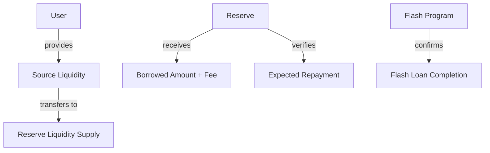
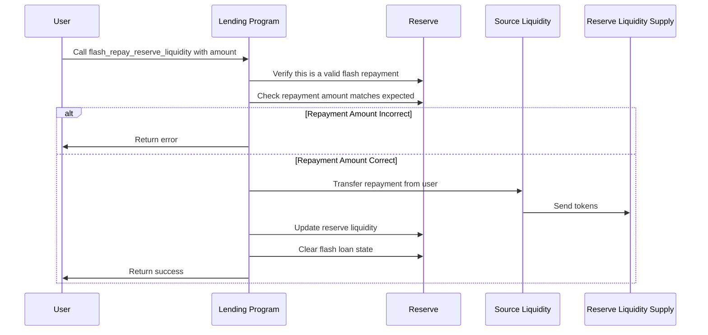
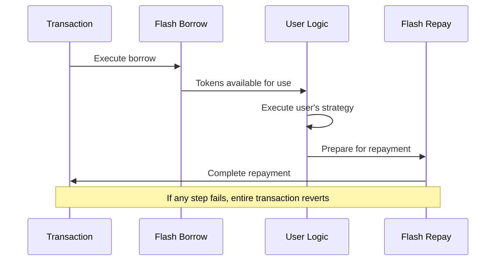

# Flash Repay Reserve Liquidity

## Purpose

The `flash_repay_reserve_liquidity` instruction is the required counterpart to the `flash_borrow_reserve_liquidity` instruction. It repays a flash loan taken within the same transaction, returning the borrowed liquidity plus a fee to the reserve. This instruction is critical for maintaining the atomic nature of flash loans and ensuring the protocol's security.

## Real-World Analogy

Flash loan repayment doesn't have a direct traditional finance equivalent, just as flash loans themselves don't. However, it can be compared to the settlement of an intraday credit facility where the entire loan plus interest must be settled by the end of the trading day. The key difference is that in DeFi, this settlement happens within the same transaction block rather than over hours or days.

## Required Accounts



| Account | Role | Signer | Writable |
|---------|------|--------|----------|
| `source_liquidity` | User's token account for repayment | No | Yes |
| `destination_liquidity` | Reserve's liquidity supply account | No | Yes |
| `reserve` | The reserve that was borrowed from | No | Yes |
| `lending_market` | The lending market | No | No |
| `lending_market_authority` | Authority derived from the lending market | No | No |
| `user_transfer_authority` | Authority over the source liquidity | Yes | No |
| `token_program` | SPL Token program | No | No |
| `flash_program` | Program that utilized the flash loan | No | No |

## Parameters

| Parameter | Type | Description |
|-----------|------|-------------|
| `liquidity_amount` | `u64` | Amount to repay (borrowed amount plus fees) |

## Step-by-Step Process



1. **Account Validation**:
   - Verify all accounts are properly owned and initialized
   - Check that the reserve belongs to the specified lending market
   - Validate that the user has authority over the source liquidity
   - Confirm this is the same flash program that borrowed the tokens

2. **Repayment Validation**:
   - Verify there is an active flash loan for this reserve
   - Check that the repayment amount matches the expected amount (borrowed plus fees)

3. **Token Transfer**:
   - Transfer the repayment amount from user to reserve liquidity supply

4. **State Updates**:
   - Increase the reserve's available liquidity by the repayment amount
   - Clear the flash loan state to indicate completion
   - Update the reserve's last update timestamp

## Detailed Calculations

### Validating the Repayment Amount

The protocol verifies that the repayment exactly matches the expected amount:

```
Required Repayment = Flash Loan Amount + Flash Loan Fee
```

Where:
- `Flash Loan Amount` is the original amount borrowed
- `Flash Loan Fee` was calculated during the borrow operation

#### Example Validation

If:
- Flash loan amount was 10,000 USDC
- Flash loan fee rate was 0.3% (0.003)
- Host fee percentage was 20%

Then:
```
Flash Loan Fee = 10,000 * 0.003 = 30 USDC
Required Repayment = 10,000 + 30 = 10,030 USDC
```

The repayment must be exactly 10,030 USDC.

### Reserve Liquidity Update

When the repayment is processed:

```
New Available Liquidity = Previous Available Liquidity + Required Repayment
```

This restores the reserve's liquidity to its original state plus the fee.

## Constraints and Validations

- The instruction must be part of the same transaction as the flash borrow
- The repayment amount must exactly match the expected amount
- The user must have sufficient tokens for the repayment
- The flash loan must not have been repaid already

## Error Cases

| Error | Condition |
|-------|-----------|
| `InvalidFlashLoan` | No active flash loan exists for this reserve |
| `InvalidAmount` | The repayment amount doesn't match the expected amount |
| `InsufficientLiquidity` | The user doesn't have enough tokens to repay |
| `TokenTransferFailed` | The token transfer to the reserve failed |
| `InvalidFlashLoanProgram` | The flash program doesn't match the one that borrowed |

## Post-Repayment State

After a successful repayment:

- The user's liquidity token balance decreases by the repayment amount
- The reserve's available liquidity increases by the repayment amount
- The flash loan state is cleared
- The transaction can continue with subsequent instructions
- The protocol has earned the flash loan fee

## Transaction Atomicity

Flash loans rely on transaction atomicity for security:



1. If the user's logic succeeds, they have the funds to repay
2. If the user's logic fails, the entire transaction reverts
3. This ensures the protocol never loses funds

## Example Usage

In a client application, the flash repay instruction must be used together with the flash borrow instruction:

```javascript
// Flash borrow 10,000 USDC
const flashBorrowInstruction = await kaminoLending.createFlashBorrowReserveLiquidityInstruction(
  usdcReserve.address,            // reserve to borrow from
  userUsdcAccount.address,        // destination for borrowed USDC
  flashLoanProgram.publicKey,     // program that will use the flash loan
  feeReceiver.address,            // protocol fee receiver
  hostFeeReceiver.address,        // host fee receiver (if applicable)
  new BN(10_000_000_000)          // 10,000 USDC (with 6 decimals)
);

// User's instructions that utilize the flash loan
const userLogicInstructions = [
  // Example: Arbitrage between exchanges
  swapOnExchangeAInstruction,
  swapOnExchangeBInstruction,
];

// Repay the flash loan with fee
const flashRepayInstruction = await kaminoLending.createFlashRepayReserveLiquidityInstruction(
  userUsdcAccount.address,        // source for repayment
  usdcReserve.address,            // reserve to repay
  flashLoanProgram.publicKey,     // program that used the flash loan
  new BN(10_030_000_000)          // 10,030 USDC (loan + fee)
);

// Combine all instructions in the correct order
const transaction = new Transaction()
  .add(flashBorrowInstruction)
  .add(...userLogicInstructions)
  .add(flashRepayInstruction);

await sendAndConfirmTransaction(connection, transaction, [userWallet]);
```

## Related Instructions

- [Flash Borrow Reserve Liquidity](./flash-borrow-reserve-liquidity.md): Required first step for flash loans

## Special Considerations

### Transaction Size Limits

Flash loan transactions can become large:

1. The flash borrow and repay instructions themselves
2. The user's custom logic in between
3. Any additional instructions needed

This may approach Solana's transaction size limits, requiring careful planning.

### Error Handling

Since flash loans must be repaid within the same transaction:

1. Users should build robust error handling in their logic
2. Any failure will revert the entire transaction
3. Failed flash loans don't cost the user anything except the transaction fee
4. This allows for risk-free "attempts" at strategies

### Security Measures

The protocol implements several security measures:

1. Strict validation of the repaying program matching the borrowing program
2. Exact amount verification to prevent partial repayments
3. State tracking to prevent double-repayment or missing repayment

### Flash Loan Fees as Economic Security

The flash loan fees serve as:

1. Compensation to the protocol for the temporary use of liquidity
2. Economic disincentive against certain attack vectors
3. Revenue source for liquidity providers

### Multiple Flash Loans

A transaction can contain multiple flash loans:

1. Each must be properly matched with its own repayment
2. The user can borrow from multiple reserves
3. This enables complex strategies involving multiple assets

The protocol tracks each flash loan separately and validates each repayment independently.
