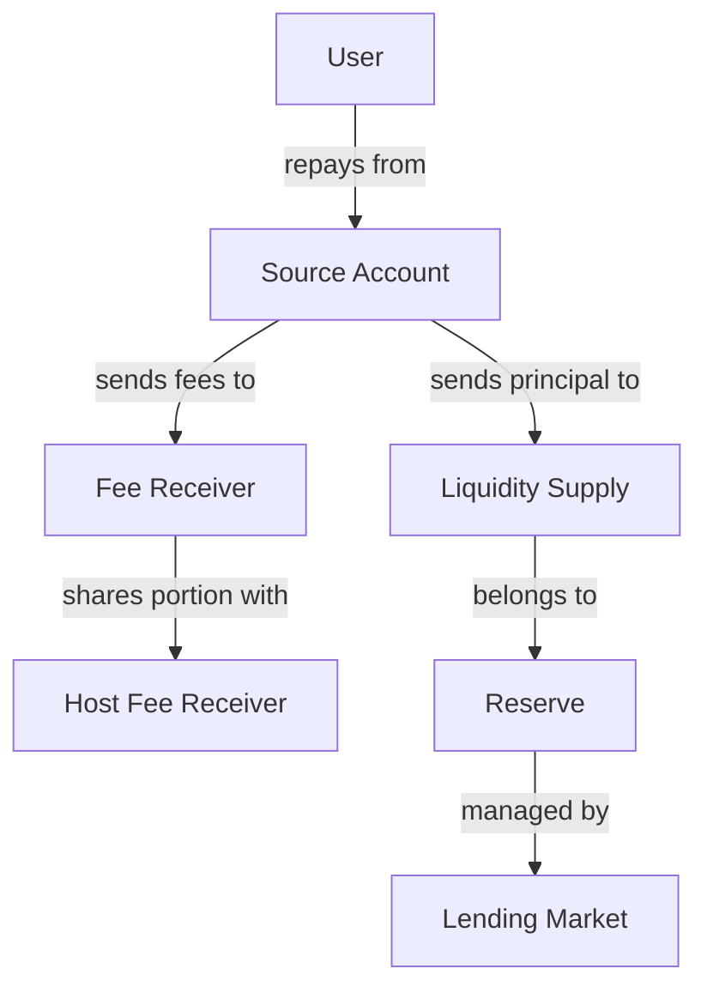
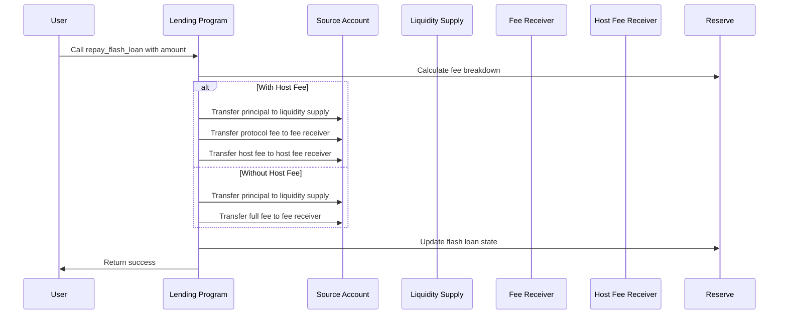

# Repay Flash Loan

## Purpose

The `repay_flash_loan` instruction is used to return borrowed funds and pay associated fees for an active flash loan. This instruction must be called within the same transaction as the initial flash loan to ensure atomicity. It transfers the principal back to the reserve's liquidity supply and distributes fees to the protocol and optional host.

## Real-World Analogy

Repaying a flash loan is similar to settling an intra-day credit line with a bank at the end of a trading day. Banks provide short-term liquidity to broker-dealers for trading operations with the strict requirement that all positions are unwound and credit is fully repaid by the day's end. Similarly, repaying a flash loan settles the temporary credit extended by the protocol within the same transaction block.

## Required Accounts



| Account | Role | Signer | Writable |
|---------|------|--------|----------|
| `source_liquidity` | Source of repayment funds | No | Yes |
| `destination_liquidity_supply` | Destination for principal repayment | No | Yes |
| `reserve` | Reserve that provided the flash loan | No | Yes |
| `flash_loan_fee_receiver` | Account receiving protocol fees | No | Yes |
| `host_fee_receiver` | Optional account receiving host fees | No | Yes |
| `transfer_authority` | Authority to transfer repayment funds | Yes | No |
| `token_program` | SPL Token program | No | No |

## Parameters

| Parameter | Type | Description |
|-----------|------|-------------|
| `amount` | `u64` | Total amount to repay (principal + all fees) |

## Step-by-Step Process



1. **Validation**:
   - Verify all accounts are valid
   - Confirm the flash loan is active
   - Validate the amount covers principal plus fees

2. **Fee Distribution**:
   - Calculate the portion of the repayment that is principal
   - Calculate the protocol fee amount
   - Calculate the host fee amount if applicable

3. **Token Transfers**:
   - Transfer the principal back to the reserve's liquidity supply
   - Transfer the protocol fee to the fee receiver
   - Transfer the host fee to the host fee receiver (if applicable)

4. **State Update**:
   - Update the reserve's state to reflect the completed flash loan
   - Clear the flash loan flag to prevent duplicate repayments

## Fee Calculation

The total repayment is divided into:

1. **Principal**: The original borrowed amount
2. **Protocol Fee**: Fee retained by the protocol
3. **Host Fee** (optional): Portion shared with the host

Fee breakdown:
```
// For a 0.3% total fee rate and 20% host fee portion
Principal = Original Borrowed Amount
Total Fee = Principal × 0.003
Host Fee (if applicable) = Total Fee × 0.2
Protocol Fee = Total Fee - Host Fee
Total Repayment = Principal + Total Fee
```

## Constraints and Validations

- The repayment must occur in the same transaction as the initial flash loan
- The repayment amount must cover the full principal plus all fees
- The source account must have sufficient funds
- The flash loan must be active (not already repaid)
- All account ownership and authority relationships must be valid

## Error Cases

| Error | Condition |
|-------|-----------|
| `NoActiveFlashLoan` | No flash loan is currently active for this reserve |
| `InsufficientRepaymentAmount` | The repayment amount is less than principal plus fees |
| `InsufficientFunds` | The source account lacks sufficient funds |
| `InvalidSourceAccount` | The source liquidity account is invalid |
| `InvalidDestinationAccount` | The destination account cannot receive tokens |

## Repayment Calculation Examples

### Standard Repayment (0.3% fee)

```
Borrowed: 1,000,000 USDC
Protocol Fee (0.3%): 3,000 USDC
Total Repayment: 1,003,000 USDC
```

### With Host Fee (0.3% total, 20% to host)

```
Borrowed: 1,000,000 USDC
Total Fee (0.3%): 3,000 USDC
Host Fee (20% of fee): 600 USDC
Protocol Fee: 2,400 USDC
Total Repayment: 1,003,000 USDC
```

## Example Usage

In a client application, the repay flash loan instruction might be used like this:

```javascript
// Assume flash loan of 1,000 USDC already executed
const flashLoanAmount = new BN(1000000000); // 1000 USDC (assuming 6 decimals)

// Calculate repayment with 0.3% fee
const feeRate = new BN(3).mul(new BN(10).pow(new BN(6))); // 0.3% = 0.003
const feeAmount = flashLoanAmount.mul(feeRate).div(new BN(10).pow(new BN(9))); 
const repaymentAmount = flashLoanAmount.add(feeAmount);

// Create repayment instruction
const repayFlashLoanInstruction = await kaminoLending.createRepayFlashLoanInstruction(
  userSourceAccount.address,          // source of repayment funds
  usdcReserve.state.liquiditySupply,  // destination for principal
  flashLoanFeeReceiver.address,       // destination for protocol fees
  usdcReserve.address,                // reserve that provided the loan
  hostFeeReceiver.address,            // optional host fee receiver
  userWallet.publicKey,               // authority to transfer tokens
  repaymentAmount                     // amount to repay (principal + fees)
);

// Add to transaction (must be in same transaction as the flash loan)
transaction.add(repayFlashLoanInstruction);

// Execute the transaction
await sendAndConfirmTransaction(connection, transaction, [userWallet]);
```

## Transaction Structure

A complete flash loan transaction includes:

```
Transaction {
  Instruction 1: Flash Loan (borrow funds)
  Instruction 2-N: User operations with borrowed funds
  Instruction N+1: Repay Flash Loan (return funds + fees)
}
```

## Related Instructions

- [Flash Loan](./flash-loan.md): The corresponding instruction to initiate a flash loan
- [Refresh Reserve](../reserve-admin/refresh-reserve.md): Often called before flash loan operations
- [Update Reserve Config](../reserve-admin/update-reserve-config.md): Configures flash loan fees

## Special Considerations

### Error Handling

When implementing flash loan repayments:

1. **Transaction Atomicity**: If repayment fails, the entire transaction reverts
2. **Fee Calculation**: Ensure accurate fee calculation to prevent underpayment
3. **Balance Verification**: Verify source account has sufficient balance
4. **Multiple Repayments**: Handle repayments for multiple flash loans correctly

### Security Implications

For protocol integrators:

1. **Order of Operations**: Repayment must come after all user operations
2. **Account Validation**: Carefully validate all account relationships
3. **Slippage Protection**: User operations should include slippage protection
4. **Fee Updates**: Account for potential fee changes in long-lived code

### Host Fee Integration

When integrating as a host:

1. **Host Registration**: Protocols must register as valid hosts
2. **Fee Collection**: Implement systems to track and collect host fees
3. **Fee Sharing**: Consider how to distribute host fees to users
4. **Integration Documentation**: Provide clear guidance on fee structure

## Advanced Use Cases

### Flash Loan Arbitrage

Example flow with repayment:

1. Flash borrow USDC
2. Swap USDC for SOL on Exchange A (low price)
3. Swap SOL for USDC on Exchange B (high price)
4. Repay flash loan (USDC principal + fee)
5. Keep profit (remaining USDC)

### Flash Loan Refinancing

Example flow for debt refinancing:

1. Flash borrow new asset
2. Use asset to repay existing high-interest loan
3. Take out new lower-interest loan
4. Repay flash loan (principal + fee)
5. Save on interest with new loan terms
