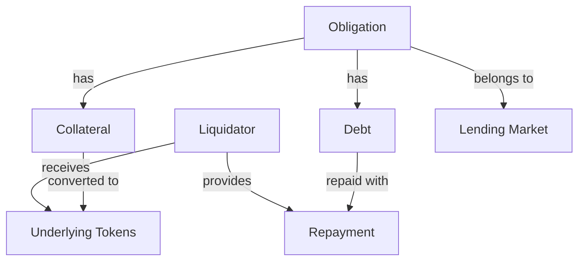
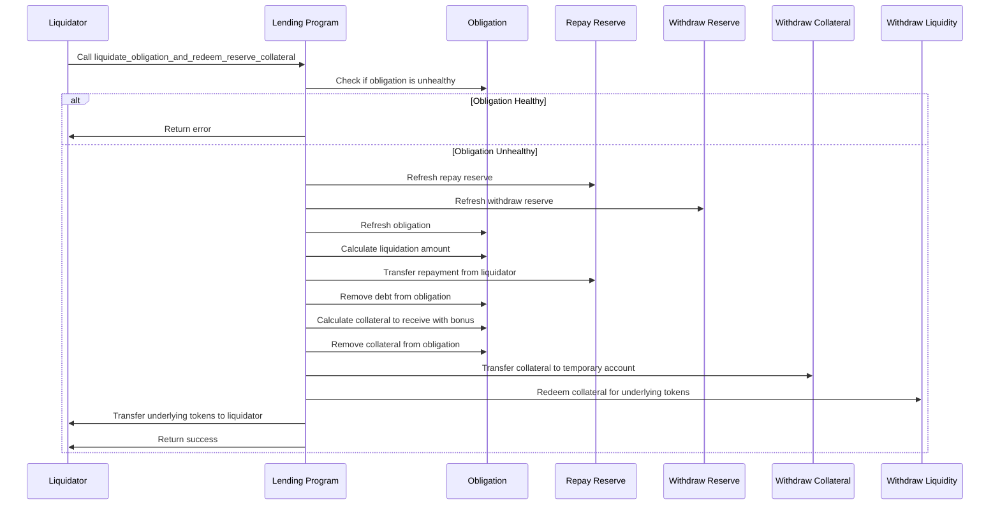

# Liquidate Obligation and Redeem Reserve Collateral

## Purpose

The `liquidate_obligation_and_redeem_reserve_collateral` instruction performs a combined liquidation of an unhealthy obligation and immediate redemption of the collateral tokens. This atomic operation allows liquidators to purchase discounted collateral from an underwater position and immediately convert it to the underlying token in a single transaction, streamlining the liquidation process.

## Real-World Analogy

This process is similar to a bank foreclosing on a defaulted loan and immediately selling the collateral in a streamlined auction process. For example, when a mortgage borrower defaults, the bank might repossess the home and arrange for an immediate sale to recover the loan value. In traditional finance, this usually takes months, but in DeFi, it happens atomically in a single transaction.

## Required Accounts



| Account | Role | Signer | Writable |
|---------|------|--------|----------|
| `source_liquidity` | Liquidator's token account for repaying debt | No | Yes |
| `destination_liquidity` | Liquidator's token account for receiving collateral | No | Yes |
| `repay_reserve` | Reserve where debt is being repaid | No | Yes |
| `repay_reserve_liquidity_supply` | Reserve's liquidity supply SPL account | No | Yes |
| `withdraw_reserve` | Reserve where collateral is being withdrawn | No | Yes |
| `withdraw_reserve_collateral_mint` | Collateral token mint | No | Yes |
| `withdraw_reserve_collateral_supply` | Reserve's collateral supply SPL account | No | Yes |
| `withdraw_reserve_liquidity_supply` | Reserve's liquidity supply SPL account | No | Yes |
| `withdraw_reserve_liquidity_fee_receiver` | Fee receiver for withdraw reserve | No | Yes |
| `obligation` | Obligation being liquidated | No | Yes |
| `lending_market` | Parent lending market | No | No |
| `lending_market_authority` | Authority derived from the lending market | No | No |
| `transfer_authority` | Owner of the source liquidity account | Yes | No |
| `clock` | Clock sysvar for timestamp | No | No |
| `token_program` | SPL Token program | No | No |

## Parameters

| Parameter | Type | Description |
|-----------|------|-------------|
| `liquidity_amount` | `u64` | Amount of liquidity to repay (in token amount) |
| `min_acceptable_received_collateral_amount` | `u64` | Minimum collateral amount acceptable to the liquidator (slippage protection) |
| `min_acceptable_received_liquidity_amount` | `u64` | Minimum underlying tokens acceptable to the liquidator (slippage protection) |

## Step-by-Step Process



1. **Health Check**:
   - Verify the obligation is unhealthy (below liquidation threshold)
   - Calculate the maximum repayable amount

2. **Reserve Updates**:
   - Refresh both the repay and withdraw reserves
   - Update interest accruals and oracle prices
   - Refresh the obligation to get current health metrics

3. **Liquidation Calculation**:
   - Determine how much debt to repay (limited by liquidator input and max liquidatable)
   - Calculate collateral to seize including the liquidation bonus
   - Check against the provided minimum acceptable collateral amount

4. **Debt Repayment**:
   - Transfer the repayment amount from the liquidator to the reserve
   - Update the obligation to reduce the debt

5. **Collateral Seizure**:
   - Remove the calculated collateral from the obligation
   - Mint equivalent collateral tokens to the liquidator's temporary account

6. **Immediate Redemption**:
   - Convert the collateral tokens to underlying tokens
   - Check against the provided minimum acceptable liquidity amount
   - Transfer the underlying tokens to the liquidator's destination account

## Liquidation Calculation

### Liquidation Bonus

Liquidators receive a bonus on the collateral they claim:

```
Bonus Rate = withdraw_reserve.config.liquidation_bonus / 100
Bonus Amount = Collateral Value * Bonus Rate
```

### Collateral Amount Calculation

```
// Convert repayment to collateral value
Collateral Value = Repayment Value / Collateral Price

// Apply liquidation bonus
Collateral With Bonus = Collateral Value * (1 + Bonus Rate)

// Convert value to token amount
Collateral Tokens = Collateral With Bonus * 10^Collateral Decimals
```

### Maximum Liquidation

The protocol limits how much can be liquidated at once:

```
// Calculate close factor based on obligation health
Close Factor = min(MaxCloseFactor, f(health_factor))

// Apply close factor to total debt
Max Liquidatable = Total Borrowed Value * Close Factor
```

Where `f(health_factor)` increases as health deteriorates, allowing more liquidation.

## Constraints and Validations

- The obligation must be unhealthy (below liquidation threshold)
- The repayment amount must not exceed the maximum liquidatable amount
- The liquidator must have sufficient tokens to repay the specified debt
- The received collateral must meet or exceed the minimum specified by the liquidator
- The final underlying tokens must meet or exceed the minimum specified by the liquidator

## Error Cases

| Error | Condition |
|-------|-----------|
| `HealthyObligation` | The obligation is not eligible for liquidation |
| `LiquidationLimitExceeded` | Attempting to liquidate more than allowed |
| `InsufficientLiquidity` | Liquidator has insufficient tokens to repay the debt |
| `SlippageExceeded` | Received collateral less than minimum specified |
| `TokenTransferFailed` | Any of the token transfers failed |

## Post-Liquidation State

After a successful liquidation and redemption:

1. **Obligation State**:
   - Debt is reduced by the repayment amount
   - Collateral is reduced by the seized amount
   - Health factor improves due to debt reduction

2. **Liquidator State**:
   - Source liquidity decreases by repayment amount
   - Destination liquidity increases by underlying token amount
   - Profits equal to the difference between repaid value and received value

3. **Reserve State**:
   - Repay reserve liquidity increases by repayment amount
   - Withdraw reserve collateral supply decreases by collateral amount
   - Withdraw reserve liquidity supply decreases by underlying token amount

## Example Usage

In a client application, this instruction might be used like this:

```javascript
// Liquidate an unhealthy obligation and redeem collateral
const liquidateAndRedeemInstruction = await kaminoLending.createLiquidateObligationAndRedeemReserveCollateralInstruction(
  liquidatorWallet.publicKey,     // liquidator authority
  {
    sourceLiquidity: liquidatorUsdcAccount.address,      // to repay USDC debt
    destinationLiquidity: liquidatorSolAccount.address,  // to receive SOL
    repayReserve: usdcReserve.address,                   // USDC reserve
    withdrawReserve: solReserve.address,                 // SOL reserve
    obligation: unhealthyObligation.address,             // unhealthy position
    lendingMarket: lendingMarket.address,                // parent lending market
    // Amount of USDC to repay
    liquidityAmount: new BN(1000000000),                 // 1,000 USDC (6 decimals)
    // Minimum SOL collateral to accept (with bonus)
    minAcceptableCollateralAmount: new BN(45000000),     // 0.045 SOL (9 decimals)
    // Minimum SOL after redemption (accounts for slippage)
    minAcceptableLiquidityAmount: new BN(44000000),      // 0.044 SOL (9 decimals)
  }
);

// Add to a transaction and execute
const transaction = new Transaction().add(liquidateAndRedeemInstruction);
await sendAndConfirmTransaction(connection, transaction, [liquidatorWallet]);
```

## Related Instructions

- [Liquidate Obligation](./liquidate-obligation.md): Basic liquidation without redemption
- [Refresh Obligation](../user-borrow/refresh-obligation.md): Updates obligation health metrics
- [Withdraw Reserve Collateral](../user-deposit/withdraw-reserve-collateral.md): Standalone redemption

## Liquidation Strategy Comparison

### Combined Liquidation and Redemption

**Advantages**:
- Atomic execution reduces transaction costs
- Eliminates price movement risk between steps
- Simplifies liquidation bot logic
- No need to hold collateral tokens

**Considerations**:
- Less flexibility in post-liquidation actions
- Must decide redemption at liquidation time

### Separate Liquidation and Redemption

**Advantages**:
- Flexibility to hold collateral if market volatile
- Can sell collateral on other platforms if better prices
- Can liquidate positions across multiple reserves

**Considerations**:
- Multiple transactions increase costs
- Exposure to price movement between transactions
- Need to manage more token types

## Special Considerations

### Liquidation Bot Development

For liquidation bot developers:

1. **Profitability Calculation**:
   - Account for transaction fees and gas costs
   - Consider price impact in larger liquidations
   - Factor in potential slippage during redemption

2. **Risk Management**:
   - Set appropriate slippage protection parameters
   - Monitor for sandwich attack vectors
   - Consider the volatility of both assets involved

3. **Optimization Strategies**:
   - Target obligations with highest liquidation bonuses
   - Focus on assets with deep secondary market liquidity
   - Balance between liquidation size and transaction costs

### Market Impact

Large liquidations may have market impact:

1. **Price Slippage**:
   - Larger redemptions might face higher slippage
   - Consider breaking into multiple smaller liquidations
   - Monitor price impact in the underlying pools

2. **Cascading Liquidations**:
   - One liquidation can trigger others as prices move
   - Be aware of market-wide liquidation cascades
   - Monitor overall market health during volatile periods

### Emergency Mode Considerations

During protocol emergency mode:

1. **Modified Rules**: Liquidation parameters may change
2. **Priority Access**: Some liquidators may get priority
3. **Changed Limits**: Maximum liquidation amounts may be adjusted
4. **Oracle Safeguards**: Additional oracle validity checks may apply
