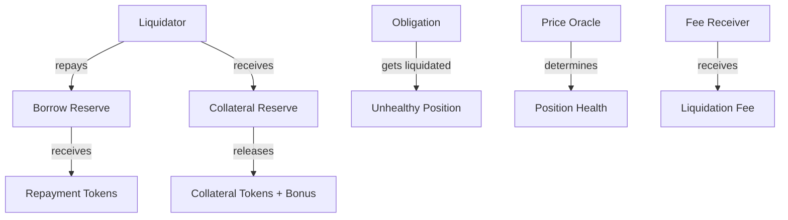
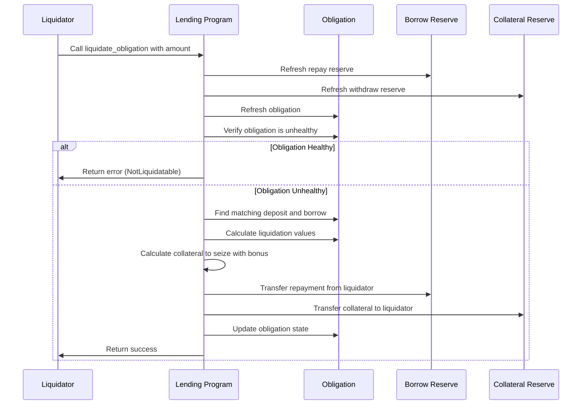

# Liquidate Obligation

## Purpose

The `liquidate_obligation` instruction allows liquidators to repay a portion of an unhealthy obligation's debt in exchange for a portion of its collateral plus a liquidation bonus. This mechanism is essential for maintaining the solvency of the Kamino Lending protocol by ensuring that borrowed funds remain adequately collateralized.

## Real-World Analogy

Liquidation in DeFi is comparable to a margin call in traditional finance. When a borrower's collateral falls below required levels, third parties (liquidators) can step in to repay the debt and claim the collateral at a discount. This is similar to how a brokerage might sell a trader's assets when their margin account falls below maintenance requirements, or how a bank might foreclose on a mortgage when payments are missed and the loan-to-value ratio becomes too high.

## Required Accounts



| Account | Role | Signer | Writable |
|---------|------|--------|----------|
| `source_liquidity` | Liquidator's token account for repayment | No | Yes |
| `destination_collateral` | Liquidator's account to receive collateral | No | Yes |
| `repay_reserve` | Reserve of the asset being repaid | No | Yes |
| `repay_reserve_liquidity_supply` | Liquidity supply for repay reserve | No | Yes |
| `withdraw_reserve` | Reserve of the collateral being liquidated | No | Yes |
| `withdraw_reserve_collateral_supply` | Collateral supply for withdraw reserve | No | Yes |
| `withdraw_reserve_collateral_mint` | Collateral mint for withdraw reserve | No | Yes |
| `obligation` | The obligation being liquidated | No | Yes |
| `lending_market` | The lending market | No | No |
| `lending_market_authority` | Authority derived from the lending market | No | No |
| `user_transfer_authority` | Liquidator's authority to transfer tokens | Yes | No |
| `clock` | Clock sysvar for timestamp | No | No |
| `token_program` | SPL Token program | No | No |

## Parameters

| Parameter | Type | Description |
|-----------|------|-------------|
| `liquidity_amount` | `u64` | Amount of liquidity to repay |

## Step-by-Step Process



1. **Account Validation**:
   - Verify all accounts are properly owned and initialized
   - Check that the reserves belong to the specified lending market
   - Validate that the liquidator has authority over the source liquidity

2. **Reserve Refresh**:
   - Update both reserves' accumulated interest
   - Update collateral exchange rates
   - Validate and update oracle prices

3. **Obligation Refresh**:
   - Update all deposit values with current prices
   - Update all borrow values with accrued interest
   - Calculate current obligation health metrics

4. **Health Verification**:
   - Verify the obligation is unhealthy (below the liquidation threshold)
   - If the obligation is still healthy, fail with NotLiquidatable error

5. **Liquidation Calculation**:
   - Find the specific borrow in the obligation matching the repay reserve
   - Find the specific deposit in the obligation matching the withdraw reserve
   - Calculate how much debt can be repaid based on provided amount
   - Calculate how much collateral the liquidator receives, including bonus

6. **Token Transfers**:
   - Transfer the repayment amount from liquidator to reserve
   - Transfer the collateral tokens (with bonus) from reserve to liquidator

7. **State Updates**:
   - Decrease the obligation's borrow by the repaid amount
   - Decrease the obligation's deposit by the seized collateral amount
   - Update the reserves' borrowed and available liquidity values
   - If any deposit or borrow is reduced to zero, remove it from arrays

## Detailed Calculations

### Liquidation Eligibility

An obligation is eligible for liquidation when:

```
Obligation Health Factor < 1.0
```

Where the health factor is calculated as:

```
Health Factor = Weighted Collateral Value / Weighted Borrow Value
```

With weights determined by the liquidation threshold for collateral and 100% for borrows.

### Liquidation Amount Calculation

The maximum amount that can be liquidated in a single transaction is typically limited to a percentage of the borrower's debt (e.g., 50%). This is calculated as:

```
Max Liquidation Amount = Borrow Value * Close Factor
```

Where the close factor is a protocol parameter (e.g., 50%).

### Collateral Seizure Calculation

The amount of collateral seized is calculated based on:

```
Collateral Seized = (Repay Amount * Repay Price) / (Collateral Price * (1 - Liquidation Bonus))
```

Where:
- `Repay Amount` is the amount of debt being repaid
- `Repay Price` is the current price of the repaid token
- `Collateral Price` is the current price of the collateral token
- `Liquidation Bonus` is the bonus percentage (e.g., 5% or 0.05)

#### Example Calculation

If:
- Liquidator repays 100 USDC (price: $1)
- Collateral is SOL (price: $100)
- Liquidation bonus is 10%

Then:
```
Collateral Seized = (100 * $1) / ($100 * (1 - 0.10))
                  = $100 / ($100 * 0.90)
                  = $100 / $90
                  = 1.11 SOL
```

The liquidator receives 1.11 SOL for repaying 100 USDC, which is worth $111 at current prices—a profit of $11 or 10%.

### Liquidation Fee

In addition to the liquidation bonus that goes to the liquidator, the protocol may also charge a liquidation fee:

```
Protocol Liquidation Fee = Collateral Value * Protocol Liquidation Fee Rate
```

This fee is subtracted from the collateral before calculating the amount the liquidator receives.

## Constraints and Validations

- The obligation must be unhealthy (below liquidation threshold)
- The repayment amount must be greater than zero
- The repayment amount cannot exceed the maximum allowed liquidation size
- The liquidator must have sufficient tokens for repayment
- The obligation must have the specified borrow and collateral deposit

## Error Cases

| Error | Condition |
|-------|-----------|
| `NotLiquidatable` | The obligation is still healthy |
| `InvalidAmount` | The repayment amount is zero |
| `LiquidationSizeTooLarge` | The repayment exceeds maximum allowed |
| `ObligationHealthy` | The obligation is above the liquidation threshold |
| `TokenTransferFailed` | Token transfer operations failed |
| `MathOverflow` | A calculation resulted in numeric overflow |
| `DepositNotFound` | The specified collateral deposit doesn't exist in the obligation |
| `BorrowNotFound` | The specified borrow doesn't exist in the obligation |

## Post-Liquidation State

After a successful liquidation:

- The obligation's borrow is reduced by the repaid amount
- The obligation's collateral is reduced by the seized amount
- The repay reserve's borrowed liquidity decreases
- The repay reserve's available liquidity increases
- The borrower loses some collateral but has less debt
- The liquidator receives collateral worth more than the repaid debt

## Liquidation Impact

For the borrower:
- Debt is reduced
- Collateral is reduced by a greater value than the debt reduction
- Overall position value decreases due to the liquidation penalty
- Position health may improve if the liquidation reduces the riskiest assets

For the liquidator:
- Spends liquidity tokens to repay the debt
- Receives collateral tokens worth more than the repaid amount
- Profit equals the liquidation bonus minus transaction costs

For the protocol:
- Risk is reduced as unhealthy positions are brought closer to healthy levels
- Protocol fee revenue is generated if a liquidation fee is charged
- Market stability is maintained by preventing bad debt

## Example Usage

In a client application, the liquidation instruction might be used like this:

```javascript
// Liquidate an unhealthy position by repaying 100 USDC and receiving SOL
const liquidateInstruction = await kaminoLending.createLiquidateObligationInstruction(
  liquidatorWallet.publicKey,     // liquidator
  liquidatorUsdcAccount.address,  // source for repayment
  liquidatorSolAccount.address,   // destination for collateral
  unhealthyObligation.address,    // obligation to liquidate
  usdcReserve.address,            // reserve being repaid
  solReserve.address,             // reserve providing collateral
  new BN(100_000_000)             // 100 USDC (with 6 decimals)
);

// Add to a transaction and execute
const transaction = new Transaction().add(liquidateInstruction);
await sendAndConfirmTransaction(connection, transaction, [liquidatorWallet]);
```

## Related Instructions

- [Refresh Obligation](../user-borrow/refresh-obligation.md): Update obligation health before liquidation
- [Auto Deleverage](./auto-deleverage.md): Protocol-driven liquidation for extended unhealthy positions

## Special Considerations

### Liquidation Thresholds

Each reserve has its own liquidation threshold, typically set slightly above its loan-to-value ratio:

- **Loan-to-Value (LTV) Ratio**: Maximum percentage of an asset's value that can be borrowed
- **Liquidation Threshold**: When collateralization drops below this percentage, liquidation can begin
- **Example**: SOL might have 75% LTV and 80% liquidation threshold

### Partial Liquidations

Liquidations are typically partial to prevent price impact:

1. The close factor limits how much debt can be repaid in one transaction
2. This allows for gradual liquidation by multiple liquidators
3. It prevents large market dumps of collateral
4. It gives borrowers a chance to add collateral or repay debt before losing all collateral

### Oracle Dependency

Liquidations depend heavily on price oracles:

- Oracle prices determine if a position is liquidatable
- Price feed delays or inaccuracies may affect liquidation timing
- The protocol may use time-weighted average prices to mitigate manipulation

### Liquidation Priority

Liquidators typically prioritize:

1. Positions furthest below the health threshold
2. Larger positions with more collateral to seize
3. Positions with more valuable or liquid collateral
4. Positions offering the highest liquidation bonus
