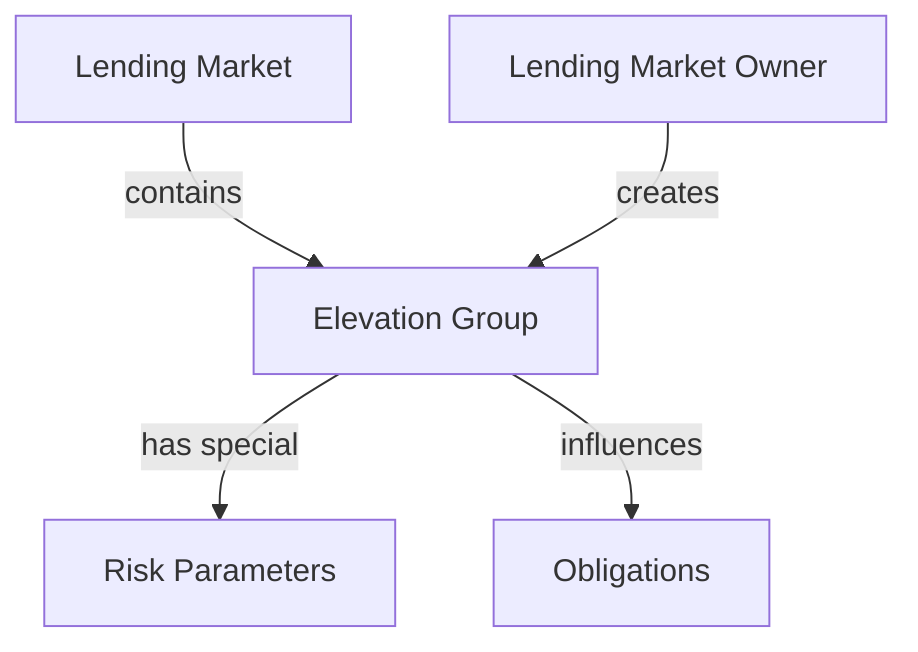
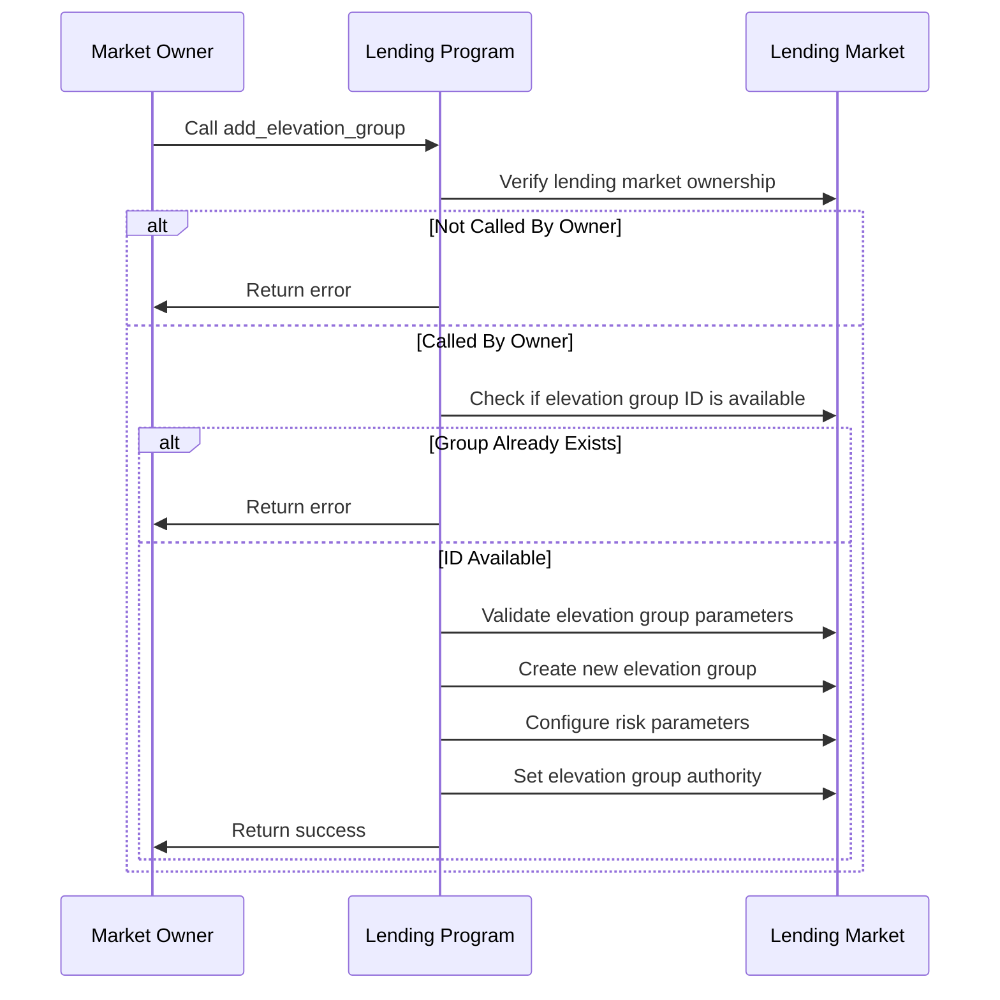

# Add Elevation Group

## Purpose

The `add_elevation_group` instruction creates a new elevation group within a lending market. Elevation groups are specialized borrowing environments with custom risk parameters, allowing the protocol to offer differentiated lending terms to various user segments. Each elevation group can have its own loan-to-value ratios, allowable assets, and risk management settings, enabling more flexible and targeted lending services.

## Real-World Analogy

Adding an elevation group is similar to how banks create tiered account programs for different customer segments. For example, a bank might offer "Silver," "Gold," and "Platinum" tiers with progressively better terms for customers who meet higher eligibility criteria. Similarly, Kamino Lending's elevation groups allow for tailored lending environments with specialized parameters for different user segments or strategic partners.

## Required Accounts



| Account | Role | Signer | Writable |
|---------|------|--------|----------|
| `lending_market` | Parent lending market | No | Yes |
| `lending_market_owner` | Owner of the lending market | Yes | No |
| `elevation_group_authority` | Authority for the elevation group | No | No |
| `payer` | Account paying for the transaction | Yes | Yes |
| `system_program` | System program | No | No |

## Parameters

| Parameter | Type | Description |
|-----------|------|-------------|
| `elevation_group` | `u8` | ID for the new elevation group (1-255, as 0 is reserved for standard) |
| `config` | `ElevationGroupConfig` | Configuration parameters for the group |

The `ElevationGroupConfig` structure contains:

| Field | Type | Description |
|-------|------|-------------|
| `max_liquidation_bonus_bps` | `u16` | Maximum liquidation bonus in basis points |
| `liquidation_threshold_offset_bps` | `u16` | Offset to standard liquidation threshold in basis points |
| `max_liquidation_threshold_ltv` | `u16` | Maximum loan-to-value ratio for liquidation threshold |
| `loan_to_value_offset_bps` | `u16` | Offset to standard LTV ratio in basis points |
| `max_loan_to_value_ltv` | `u16` | Maximum allowed LTV ratio |
| `bad_debt_liquidation_bonus_bps` | `u16` | Liquidation bonus for bad debt in basis points |
| `reserved` | `[u8; 32]` | Reserved for future use |

## Step-by-Step Process



1. **Account Validation**:
   - Verify the lending market is initialized
   - Validate that the signer is the owner of the lending market

2. **Elevation Group Validation**:
   - Check that the elevation group ID is valid (1-255)
   - Confirm the elevation group doesn't already exist
   - Validate all risk parameters are within allowed ranges

3. **Group Creation**:
   - Create the new elevation group within the lending market
   - Configure the risk parameters as specified
   - Set the elevation group authority
   - Initialize any tracking data for the group

## Risk Parameter Impacts

The elevation group parameters directly influence lending operations:

### Loan-to-Value (LTV) Adjustment

```
Adjusted LTV = Standard LTV + loan_to_value_offset_bps
Final LTV = min(Adjusted LTV, max_loan_to_value_ltv)
```

This affects how much users can borrow against their collateral.

### Liquidation Threshold Adjustment

```
Adjusted Threshold = Standard Threshold + liquidation_threshold_offset_bps
Final Threshold = min(Adjusted Threshold, max_liquidation_threshold_ltv)
```

This determines at what collateral ratio liquidations can begin.

### Liquidation Bonus Modification

```
Final Bonus = min(Standard Bonus, max_liquidation_bonus_bps)
```

For bad debt scenarios:
```
Bad Debt Bonus = bad_debt_liquidation_bonus_bps
```

## Constraints and Validations

- The caller must be the lending market owner
- The elevation group ID must be between 1 and 255 (0 is reserved for standard)
- The elevation group must not already exist
- All risk parameters must be within valid ranges:
  - Basis point values must not exceed 10000 (100%)
  - Max LTV must not exceed maximum protocol limits
  - Liquidation threshold must be higher than LTV

## Error Cases

| Error | Condition |
|-------|-----------|
| `InvalidMarketOwner` | The signer is not the market owner |
| `InvalidElevationGroup` | The elevation group ID is invalid (0 or >255) |
| `ElevationGroupAlreadyExists` | An elevation group with this ID already exists |
| `InvalidElevationGroupConfig` | One or more config parameters are invalid |

## Post-Creation State

After successful creation:

1. **Market State**:
   - The lending market now contains the new elevation group
   - The group has its defined risk parameters
   - The specified authority has permission to manage group membership

2. **User Impact**:
   - Users can be added to the elevation group via the `set_obligation_elevation_group` instruction
   - Obligations in the group will use the modified risk parameters
   - Liquidations will follow the group-specific rules

## Example Usage

In a client application, the add elevation group instruction might be used like this:

```javascript
// Create a new "Premium" elevation group with enhanced parameters
const elevationGroupConfig = {
  maxLiquidationBonusBps: 1000,              // 10% max liquidation bonus
  liquidationThresholdOffsetBps: 500,        // +5% to liquidation threshold
  maxLiquidationThresholdLtv: 9000,          // 90% maximum threshold
  loanToValueOffsetBps: 300,                 // +3% to standard LTV
  maxLoanToValueLtv: 8500,                   // 85% maximum LTV
  badDebtLiquidationBonusBps: 1500,          // 15% bonus for bad debt liquidation
};

const addElevationGroupInstruction = await kaminoLending.createAddElevationGroupInstruction(
  lendingMarket.address,                     // parent lending market
  marketOwnerWallet.publicKey,               // lending market owner
  elevationGroupAuthority.publicKey,         // authority for the group
  payerWallet.publicKey,                     // transaction fee payer
  1,                                         // elevation group ID (1)
  elevationGroupConfig                       // group configuration
);

// Add to a transaction and execute
const transaction = new Transaction().add(addElevationGroupInstruction);
await sendAndConfirmTransaction(connection, transaction, [marketOwnerWallet, payerWallet]);
```

## Related Instructions

- [Set Obligation Elevation Group](../user-borrow/set-obligation-elevation-group.md): Assigns an obligation to an elevation group
- [Update Elevation Group](./update-elevation-group.md): Modifies existing elevation group parameters
- [Remove Elevation Group](./remove-elevation-group.md): Deletes an elevation group

## Elevation Group Use Cases

### Strategic Partnerships

Creating specialized environments for partners:

1. **Protocol Integrations**: Enhanced terms for integrated protocols
2. **Institutional Clients**: Better terms for large depositors
3. **DAO Treasuries**: Special parameters for treasury management

### User Segmentation

Differentiating services by user type:

1. **VIP Program**: Enhanced terms for high-value users
2. **Staker Benefits**: Special terms for protocol token stakers
3. **Governance Rewards**: Better terms for governance participants

### Asset-Specific Strategies

Tailoring parameters for specific asset classes:

1. **Stable Asset Group**: Higher LTVs for stablecoins
2. **Blue-Chip Group**: Special terms for liquid majors
3. **Long-Tail Group**: Conservative parameters for volatile assets

## Special Considerations

### Group Management Strategy

When designing elevation group structures:

1. **Hierarchical Design**: Consider a clear progression of benefits
2. **Parameter Spacing**: Ensure meaningful differences between groups
3. **Upgrade Paths**: Design clear paths for users to advance between groups
4. **Default Parameters**: Set standard group (0) with conservative baselines

### Risk Management

For protocol administrators:

1. **Risk Simulation**: Test elevation groups under various market conditions
2. **Monitoring Requirements**: Implement specialized monitoring for groups
3. **Stress Testing**: Verify system stability with multiple active groups
4. **Emergency Controls**: Ensure emergency mode handles elevation groups properly

### Integration Guidance

For protocol integrators:

1. **Group Discovery**: Implement mechanisms to discover available groups
2. **Eligibility Checking**: Create interfaces for checking user eligibility
3. **Benefit Communication**: Clearly communicate group-specific advantages
4. **Parameter Visualization**: Help users understand how groups affect their borrowing capacity

### Governance Considerations

For protocol governance:

1. **Creation Process**: Define the governance process for creating new groups
2. **Parameter Boundaries**: Set limits on how favorable terms can be
3. **Authority Management**: Carefully control elevation group authorities
4. **Economic Analysis**: Assess protocol economics with multiple active groups
