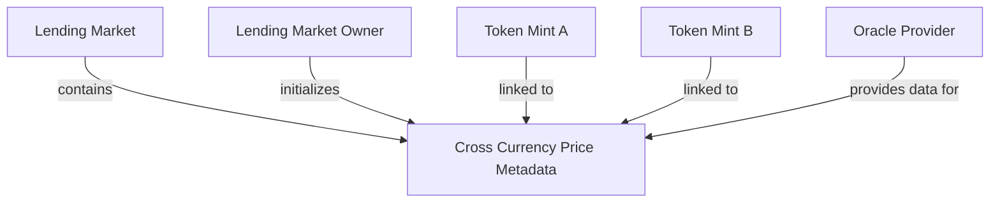
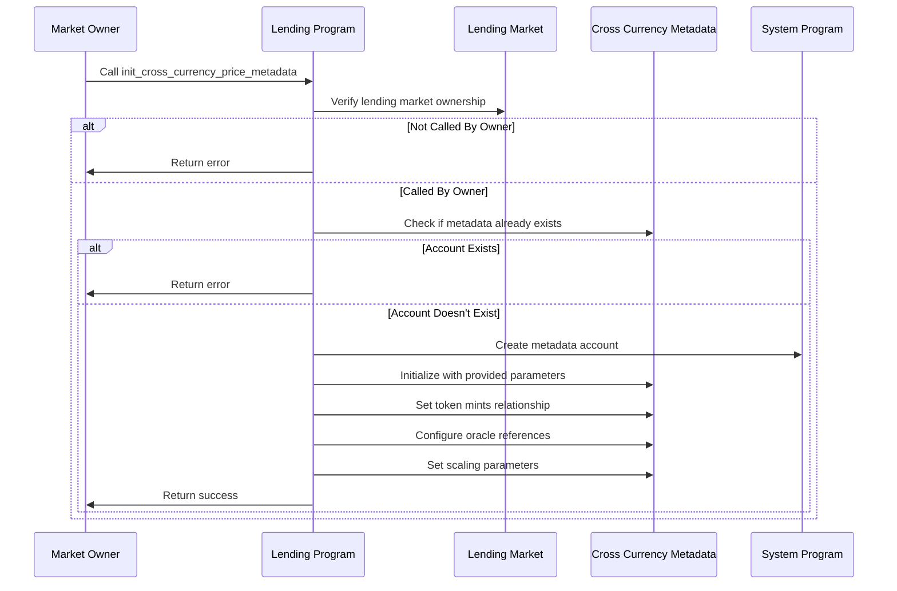

# Init Cross Currency Price Metadata

## Purpose

The `init_cross_currency_price_metadata` instruction creates a new account for tracking cross-currency price relationships between two tokens in the lending market. This metadata is essential for accurately pricing assets that don't have direct USD oracle feeds or for creating synthetic price feeds between token pairs. By initializing this metadata, the protocol can maintain more accurate risk assessments and liquidation thresholds for complex token relationships.

## Real-World Analogy

Creating cross-currency price metadata is similar to how forex trading desks establish currency pair relationships. In international banking, not all currency pairs have direct exchange rates. For example, to determine the exchange rate between the Thai Baht and the Swedish Krona, banks might use their respective rates against the US Dollar as an intermediary. Similarly, Kamino Lending uses this metadata to establish price relationships between token pairs that may not have direct oracle feeds.

## Required Accounts



| Account | Role | Signer | Writable |
|---------|------|--------|----------|
| `cross_currency_metadata` | New metadata account to initialize | No | Yes |
| `lending_market` | Parent lending market | No | No |
| `lending_market_owner` | Owner of the lending market | Yes | Yes |
| `payer` | Account paying for the initialization | Yes | Yes |
| `rent` | Rent sysvar | No | No |
| `system_program` | System program | No | No |

## Parameters

| Parameter | Type | Description |
|-----------|------|-------------|
| `token_mint_a` | `Pubkey` | Mint address of the first token |
| `token_mint_b` | `Pubkey` | Mint address of the second token |
| `price_metadata` | `CrossCurrencyPriceMetadata` | Initial metadata configuration |

The `CrossCurrencyPriceMetadata` structure contains:

| Field | Type | Description |
|-------|------|-------------|
| `provider_type` | `u64` | Type of price provider (e.g., 0=direct, 1=derived) |
| `oracle_price_a` | `Pubkey` | Oracle address for token A |
| `oracle_price_b` | `Pubkey` | Oracle address for token B |
| `decimals_a` | `u8` | Decimal places for token A |
| `decimals_b` | `u8` | Decimal places for token B |
| `multiplier` | `u64` | Price multiplier for scaling |
| `divisor` | `u64` | Price divisor for scaling |

## Step-by-Step Process



1. **Account Validation**:
   - Verify the lending market is initialized
   - Validate that the signer is the owner of the lending market
   - Check that a metadata account doesn't already exist for this token pair

2. **Account Creation**:
   - Create a new cross-currency metadata account using the system program
   - Allocate enough space for the metadata structure
   - Fund the account with rent-exemption deposit

3. **Metadata Initialization**:
   - Set the version and lending market reference
   - Configure the token mint pair (A and B)
   - Set the oracle provider type and references
   - Configure decimal precision for both tokens
   - Set the price scaling parameters (multiplier and divisor)

## Cross Currency Price Metadata Structure

The metadata account stores:

```rust
pub struct CrossCurrencyPriceMetadata {
    pub version: u64,
    pub lending_market: Pubkey,
    pub token_mint_a: Pubkey,
    pub token_mint_b: Pubkey,
    pub provider_type: u64,
    pub oracle_price_a: Pubkey,
    pub oracle_price_b: Pubkey,
    pub decimals_a: u8,
    pub decimals_b: u8,
    pub multiplier: u64,
    pub divisor: u64,
    pub last_updated_slot: u64,
    pub price_a: Decimal,
    pub price_b: Decimal,
    pub derived_price: Decimal,
    pub reserved: [u8; 128],
}
```

Where:
- `version`: Version of the metadata structure
- `lending_market`: Parent lending market public key
- `token_mint_a/b`: Mints of the token pair
- `provider_type`: How the price is determined (direct or derived)
- `oracle_price_a/b`: Oracle accounts for each token
- `multiplier/divisor`: Scaling factors for price calculations
- `derived_price`: The calculated cross-currency price

## Price Provider Types

The protocol supports multiple price derivation methods:

### 1. Direct Provider (0)

Uses direct oracle-to-oracle comparison:
```
Price = (Oracle A Price * Multiplier) / (Oracle B Price * Divisor)
```

### 2. Derived Provider (1)

Uses a more complex derivation formula, potentially involving multiple intermediary tokens.

## Constraints and Validations

- The caller must be the lending market owner
- The lending market must be initialized
- A metadata account must not already exist for this token pair
- The token mints must be valid
- The provider type must be supported
- Oracle references must be valid if specified
- Multiplier and divisor must be non-zero

## Error Cases

| Error | Condition |
|-------|-----------|
| `InvalidMarketOwner` | The signer is not the market owner |
| `MetadataAlreadyExists` | A metadata account already exists for this token pair |
| `InvalidProviderType` | The specified provider type is not supported |
| `InvalidOracle` | Oracle references are invalid |
| `InvalidParameters` | Scaling parameters are invalid |

## Price Derivation Mechanism

The cross-currency price is calculated as:

```
// For direct provider type
Derived Price = (Price A * Multiplier) / (Price B * Divisor)

// Example: ETH/BTC price from ETH/USD and BTC/USD oracles
ETH/BTC = (ETH/USD * 1) / (BTC/USD * 1)
```

The derived price is used for:
1. Risk calculations
2. Collateral valuation
3. Liquidation thresholds
4. Cross-currency borrows

## Example Usage

In a client application, the init cross currency price metadata instruction might be used like this:

```javascript
// Initialize ETH/BTC cross currency price metadata
const initCrossCurrencyMetadataInstruction = await kaminoLending.createInitCrossCurrencyPriceMetadataInstruction(
  crossCurrencyMetadataKeypair.publicKey, // new metadata account
  lendingMarket.address,                  // parent lending market
  marketOwnerWallet.publicKey,            // lending market owner
  marketOwnerWallet.publicKey,            // payer for account creation
  {
    tokenMintA: ethMint,                  // ETH token mint
    tokenMintB: btcMint,                  // BTC token mint
    priceMetadata: {
      providerType: 0,                    // direct price comparison
      oraclePriceA: ethUsdOracle,         // ETH/USD oracle
      oraclePriceB: btcUsdOracle,         // BTC/USD oracle
      decimalsA: 18,                      // ETH decimals
      decimalsB: 8,                       // BTC decimals
      multiplier: new BN(1),              // No additional scaling
      divisor: new BN(1)                  // No additional scaling
    }
  }
);

// Add to a transaction and execute
const transaction = new Transaction().add(initCrossCurrencyMetadataInstruction);
await sendAndConfirmTransaction(
  connection, 
  transaction, 
  [marketOwnerWallet, crossCurrencyMetadataKeypair]
);
```

## Related Instructions

- [Init Lending Market](./init-lending-market.md): Creates the parent lending market
- [Update Cross Currency Price Metadata](./update-cross-currency-price-metadata.md): Updates the metadata configuration
- [Refresh Cross Currency Price](./refresh-cross-currency-price.md): Updates the derived price with latest oracle data

## Use Cases

### Token Pairs Without Direct USD Feeds

For tokens that only have price feeds against non-USD currencies:

1. **Exotic Assets**: Tokens with only BTC or ETH price feeds
2. **Wrapped Assets**: Tokens representing assets from other chains
3. **Synthetic Assets**: Derived tokens without direct oracle support

### Arbitrage Risk Management

For managing risk in arbitrage strategies:

1. **CEX/DEX Arbitrage**: Managing cross-exchange price relationships
2. **Cross-Chain Bridges**: Pricing assets across different blockchains
3. **LP Token Pricing**: Valuing liquidity pool tokens accurately

### Enhanced Price Stability

Using multiple price sources for stability:

1. **Oracle Redundancy**: Fallback pricing during oracle outages
2. **TWAP Integration**: Time-weighted average prices for stability
3. **Volatility Dampening**: Smoothing extreme price movements

## Special Considerations

### Price Feed Selection

When establishing cross-currency relationships:

1. **Oracle Quality**: Choose highest-quality, most reliable oracles
2. **Update Frequency**: Consider how frequently each oracle updates
3. **Correlation Analysis**: Understand how price feeds correlate during market stress
4. **Decimal Normalization**: Ensure proper handling of different decimal precisions

### Security Implications

Cross-currency pricing introduces security considerations:

1. **Oracle Manipulation**: Multiple oracles increase attack vectors
2. **Staleness Risk**: Derived prices may become stale if any component oracle fails
3. **Circular Dependencies**: Avoid creating circular price derivation paths
4. **Extreme Market Conditions**: Plan for extreme price divergences between paired assets

### Governance Procedures

For protocol governance:

1. **Validation Process**: Thoroughly validate new cross-currency pairs
2. **Monitoring Requirements**: Establish monitoring for derived price accuracy
3. **Emergency Procedures**: Define actions for price feed failures
4. **Documentation**: Maintain clear documentation of all price relationships
