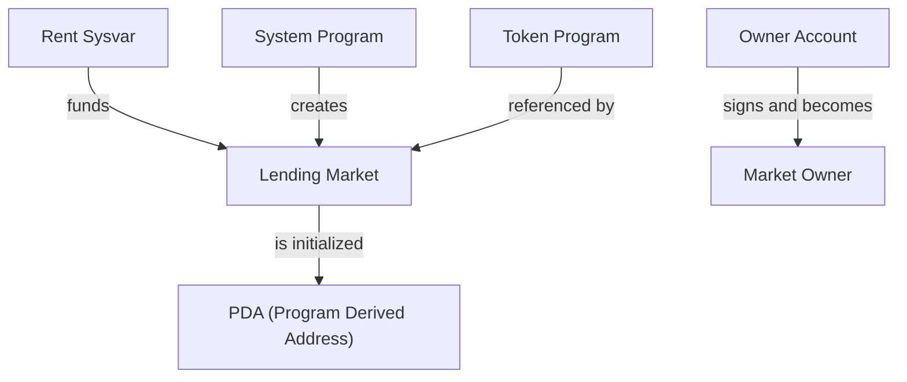
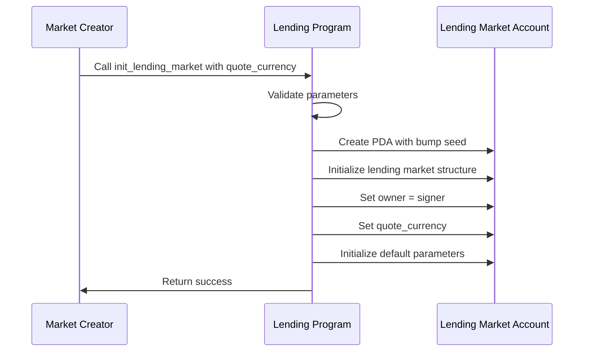

# Initialize Lending Market

## Purpose

The `init_lending_market` instruction creates a new lending market in the Kamino Lending protocol. This is the first step in setting up a lending environment and must be performed before any other operations can take place. The lending market serves as the central coordination point for all reserves and operations within a specific market instance.

## Real-World Analogy

Creating a lending market is similar to establishing a new financial institution or banking system. It sets up the core infrastructure, defines the operating rules, establishes governance, and specifies the base currency (quote currency) that will be used for valuation across the system.

## Required Accounts



| Account | Role | Signer | Writable |
|---------|------|--------|----------|
| `lending_market` | The lending market account to be initialized | No | Yes |
| `owner` | The account that will own the lending market | Yes | No |
| `rent` | The rent sysvar | No | No |
| `system_program` | The system program | No | No |
| `token_program` | The SPL Token program | No | No |

## Parameters

| Parameter | Type | Description |
|-----------|------|-------------|
| `quote_currency` | `[u8; 32]` | The currency used for quoting prices (e.g., "USD") |

## Step-by-Step Process



1. **Account Validation**:
   - Verify the `lending_market` account is uninitialized
   - Confirm the `owner` account is a signer
   - Check that all required system accounts are provided

2. **Parameter Validation**:
   - Validate that `quote_currency` is properly formatted
   - Ensure the `quote_currency` is not empty

3. **Lending Market Creation**:
   - Create the lending market as a PDA (Program Derived Address)
   - Calculate and store the bump seed for future reference

4. **Initialization of Core Fields**:
   - Set the version to the current protocol version
   - Set the `lending_market_owner` to the provided `owner`
   - Set the `quote_currency` to the provided parameter
   - Set `lending_market_owner_cached` equal to `lending_market_owner`

5. **Default Parameter Setup**:
   - Initialize `referral_fee_bps` with default value (typically 0)
   - Set emergency flags to disabled
   - Set `autodeleverage_enabled` to disabled
   - Set `borrow_disabled` to disabled
   - Initialize risk parameters with default values
   - Create empty elevation groups array
   - Set up default thresholds for liquidations and positions

6. **Complete Initialization**:
   - Mark the lending market as ready for operation
   - Return success to the caller

## Detailed Parameter Explanations

### Quote Currency

The `quote_currency` parameter defines the base currency used for all price quotations in this lending market. This is typically a stablecoin like "USD" but could be any currency. This setting:

- Determines which price oracles will be used (matching the quote currency)
- Establishes the common denomination for risk calculations
- Provides a consistent basis for valuing different assets

The quote currency is stored as a 32-byte array, typically containing an ASCII string like "USD".

## Constraints and Validations

- The `lending_market` account must be uninitialized
- The `owner` account must sign the transaction
- The `lending_market` must be a valid PDA for the program
- Only one lending market can be initialized with a specific address

## Error Cases

| Error | Condition |
|-------|-----------|
| `InvalidMarketOwner` | The owner account didn't sign the transaction |
| `InvalidAccountOwner` | The lending market is owned by a different program |
| `InvalidAccountData` | The lending market account is already initialized |

## Post-Initialization State

After successful execution, the lending market exists with:

- The specified owner having full administrative control
- The quote currency set as specified
- All parameters initialized to their default values
- No reserves (these must be added separately)
- No elevation groups configured (these can be added later)
- Emergency mode disabled
- Borrowing enabled
- Auto-deleveraging disabled

## Security Considerations

The initialization of a lending market is a critical operation that:

1. Establishes the governance of the entire market
2. Sets the foundation for all risk management
3. Creates the core structure that will hold all configuration

The owner of the lending market has significant power, including:
- Adding/updating reserves
- Setting risk parameters
- Enabling/disabling features
- Controlling emergency mode

Therefore, the owner account should be secured appropriately, potentially using multisig or governance mechanisms.

## Example Usage

In a transaction, the `init_lending_market` instruction would typically be used like this:

```javascript
// Create a new lending market with USD as the quote currency
const quoteCurrency = Buffer.from("USD", "ascii").padEnd(32, 0);
const initMarketInstruction = await kaminoLending.createInitLendingMarketInstruction(
  ownerAccount.publicKey,
  newMarketAddress,
  quoteCurrency
);

// Add to a transaction and execute
const transaction = new Transaction().add(initMarketInstruction);
await sendAndConfirmTransaction(connection, transaction, [ownerAccount]);
```

## Next Steps After Initialization

After initializing a lending market, the typical next steps are:

1. [Initialize Reserves](../reserve-admin/init-reserve.md) for different assets
2. [Configure Elevation Groups](./set-lending-market-elevation-group.md) if needed
3. [Update market parameters](./update-lending-market.md) to tune risk settings
4. [Add initial liquidity](../reserve-admin/add-reserve-liquidity.md) to reserves

These steps complete the setup of a functional lending environment.
