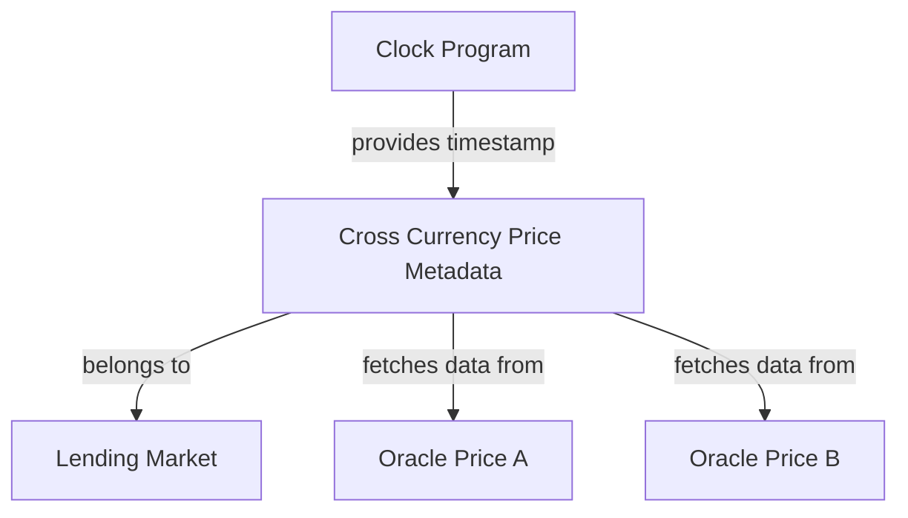
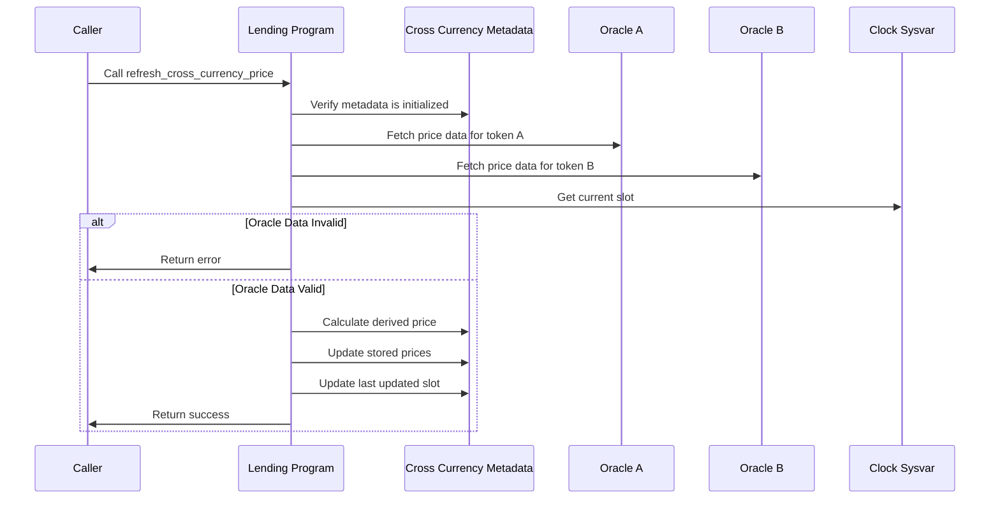

# Refresh Cross Currency Price

## Purpose

The `refresh_cross_currency_price` instruction updates the cross-currency price relationship between two tokens by fetching the latest price data from their respective oracles. This ensures that the protocol maintains accurate price relationships between token pairs for collateral valuation, risk assessment, and liquidation decisions. Regular price refreshes are essential for the protocol's risk management system to operate with current market data.

## Real-World Analogy

Refreshing cross-currency prices is similar to how currency exchange desks update their rates throughout the day. In an airport currency exchange booth, staff periodically check the latest forex rates and update their displayed exchange rates to reflect current market conditions. Similarly, the Kamino Lending protocol must refresh its cross-currency price relationships to ensure that lending and borrowing operations use the most current pricing data.

## Required Accounts



| Account | Role | Signer | Writable |
|---------|------|--------|----------|
| `cross_currency_metadata` | Metadata account to update | No | Yes |
| `oracle_price_a` | Oracle for token A | No | No |
| `oracle_price_b` | Oracle for token B | No | No |
| `token_program` | SPL Token program | No | No |
| `sysvar_clock` | Clock sysvar | No | No |

## Parameters

This instruction doesn't require any parameters beyond the provided accounts.

## Step-by-Step Process



1. **Account Validation**:
   - Verify the cross-currency metadata account exists and is initialized
   - Check that the oracle accounts match those in the metadata configuration

2. **Price Data Retrieval**:
   - Fetch the current price from Oracle A
   - Fetch the current price from Oracle B
   - Validate that both prices are fresh and not stale

3. **Derived Price Calculation**:
   - Based on the provider type, calculate the derived price
   - Apply multiplier and divisor scaling factors
   - Handle decimal normalization between tokens

4. **Metadata Update**:
   - Store the current prices from both oracles
   - Update the derived price
   - Set the last updated slot to the current slot

## Price Derivation Formulas

### Direct Provider (Type 0)

For direct price comparison between oracles:

```
Derived Price = (Price A * Multiplier) / (Price B * Divisor)

// Example: ETH/BTC price from ETH/USD and BTC/USD oracles
ETH/BTC = (ETH/USD * 1) / (BTC/USD * 1)

// Example with scaling: SOL/USDC with 2% adjustment
SOL/USDC = (SOL/USD * 102) / (USDC/USD * 100)
```

### Derived Provider (Type 1)

For more complex derivations (implementation depends on specific provider):

```
Derived Price = Custom Formula(Price A, Price B, Additional Data)
```

## Constraints and Validations

- The metadata account must be initialized
- Oracle accounts must match those specified in the metadata
- Oracle prices must be valid and not stale
- Price calculation must result in a valid number (not NaN or infinity)
- The current slot must be greater than the last updated slot

## Error Cases

| Error | Condition |
|-------|-----------|
| `InvalidMetadata` | The metadata account is invalid or uninitialized |
| `InvalidOracle` | Oracle accounts don't match metadata configuration |
| `StaleOraclePrice` | One or both oracle prices are stale |
| `MathOverflow` | Price calculation results in overflow |
| `InvalidCalculation` | Derived price calculation failed or produced invalid result |

## Oracle Integration

The instruction supports multiple oracle providers:

### Pyth Oracle

For Pyth-based price feeds:
- Validates price feed account structure
- Checks confidence intervals
- Handles price normalization based on exponent

### Switchboard Oracle

For Switchboard-based price feeds:
- Validates the aggregator account
- Checks staleness based on update frequency
- Normalizes the price to standard format

## Example Usage

In a client application, the refresh cross currency price instruction might be used like this:

```javascript
// Refresh ETH/BTC cross currency price
const refreshCrossCurrencyPriceInstruction = await kaminoLending.createRefreshCrossCurrencyPriceInstruction(
  ethBtcMetadata.address,       // existing metadata account
  ethUsdOracle.address,         // oracle price A
  btcUsdOracle.address          // oracle price B
);

// Add to a transaction and execute
const transaction = new Transaction().add(refreshCrossCurrencyPriceInstruction);
await sendAndConfirmTransaction(connection, transaction, [wallet]);
```

## Refresh Strategies

### Scheduled Refreshes

Regular updates to maintain current prices:

1. **Time-Based**: Refresh at regular intervals (e.g., every 5 minutes)
2. **Block-Based**: Refresh every N blocks
3. **Activity-Based**: Refresh before significant protocol actions

### Triggered Refreshes

Event-based updates for important actions:

1. **Pre-Transaction**: Refresh before loans, deposits, or withdrawals
2. **Market Volatility**: More frequent refreshes during high volatility
3. **Oracle Updates**: Refresh when underlying oracles update

## Related Instructions

- [Init Cross Currency Price Metadata](./init-cross-currency-price-metadata.md): Creates the initial metadata
- [Update Cross Currency Price Metadata](./update-cross-currency-price-metadata.md): Modifies metadata configuration
- [Refresh Reserve](../reserve-admin/refresh-reserve.md): Updates reserve prices (may use cross-currency prices)

## Impact on Protocol Operations

### Risk Assessment

Updated prices affect risk calculations:

1. **Collateral Valuation**: Value of collateral in related tokens
2. **Borrowing Capacity**: Maximum allowed borrowing based on collateral
3. **Health Ratios**: User position health assessments
4. **Liquidation Thresholds**: Conditions for liquidation

### Market Operations

Price updates influence market behavior:

1. **Interest Rates**: May adjust based on relative token values
2. **Utilization Metrics**: Affected by value-based calculations
3. **Reserve Limits**: Thresholds based on USD equivalence
4. **Protocol Fees**: Value-based fee calculations

## Special Considerations

### Price Impact Management

Handling significant price changes:

1. **Circuit Breakers**: Detect and handle extreme price movements
2. **Price Dampening**: Consider time-weighted average prices for stability
3. **Validation Bounds**: Check that prices stay within reasonable ranges
4. **Oracle Redundancy**: Fallback options for oracle failures

### System Performance

Optimizing refresh operations:

1. **Refresh Prioritization**: Prioritize most active or volatile pairs
2. **Batched Updates**: Group related price refreshes in transactions
3. **Caching Strategy**: Balance freshness with transaction cost
4. **Gas Optimization**: Minimize computation in on-chain code

### Integration Guidance

For protocol integrators:

1. **Refresh Before Action**: Always refresh prices before critical operations
2. **Staleness Checking**: Verify price freshness before decisions
3. **Failure Handling**: Implement graceful fallbacks for refresh failures
4. **Client Caching**: Maintain local cache of latest prices for UI display
