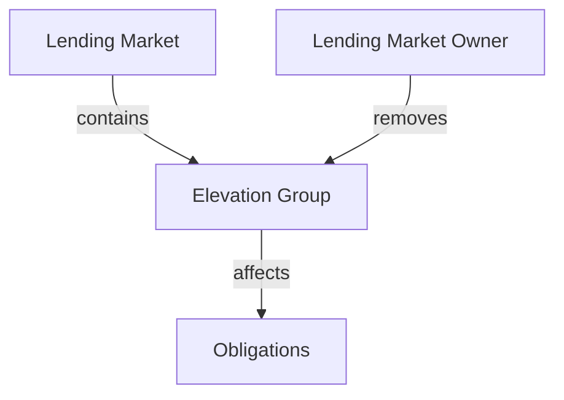
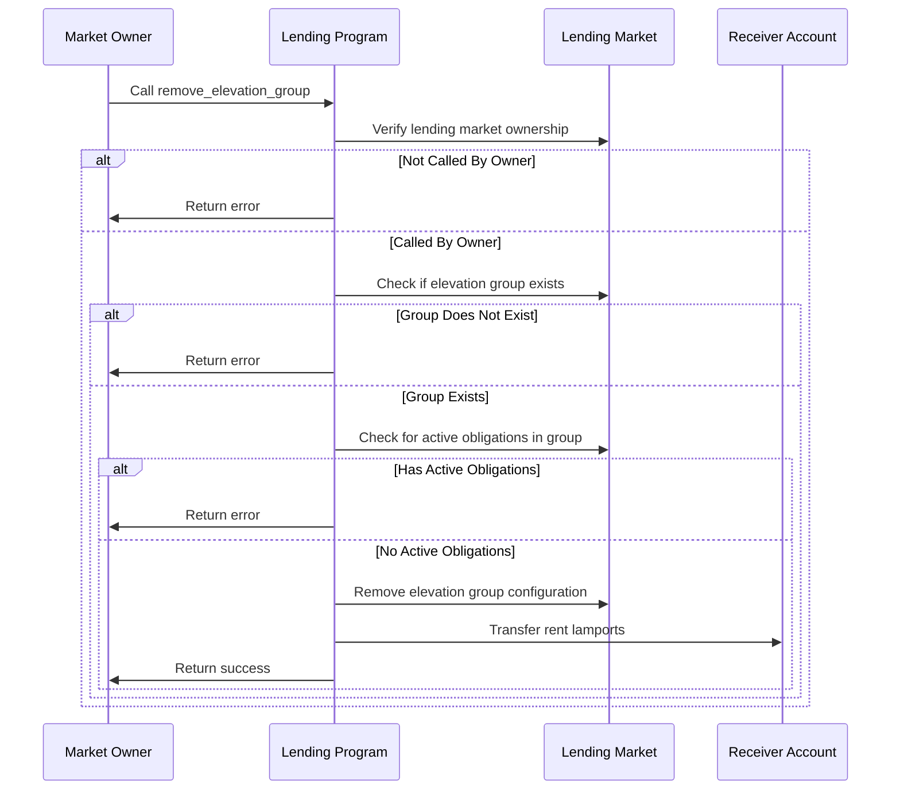
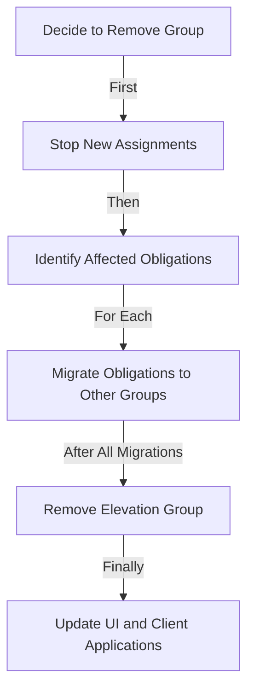

# Remove Elevation Group

## Purpose

The `remove_elevation_group` instruction allows the lending market owner to delete an existing elevation group from the lending market. This is useful when a specialized lending tier is no longer needed, when consolidating user segments, or when restructuring the protocol's risk tiers. Removing an elevation group ensures that no new obligations can be assigned to it, while existing obligations must be migrated to other groups before or as part of the removal process.

## Real-World Analogy

Removing an elevation group is similar to how a bank discontinues a particular account tier in their customer program. When a bank decides to retire their "Silver" account tier, they typically stop accepting new enrollments and transition existing customers to either standard accounts or other available tiers. Similarly, Kamino Lending can phase out an elevation group when its specialized parameters are no longer needed in the protocol's strategy.

## Required Accounts



| Account | Role | Signer | Writable |
|---------|------|--------|----------|
| `lending_market` | Parent lending market | No | Yes |
| `lending_market_owner` | Owner of the lending market | Yes | No |
| `receiver_account` | Account receiving rent lamports | No | Yes |

## Parameters

| Parameter | Type | Description |
|-----------|------|-------------|
| `elevation_group` | `u8` | ID of the elevation group to remove (1-255) |

## Step-by-Step Process



1. **Account Validation**:
   - Verify the lending market is initialized
   - Validate that the signer is the owner of the lending market

2. **Elevation Group Validation**:
   - Check that the specified elevation group exists
   - Ensure the elevation group ID is valid (1-255)
   - Verify that no active obligations are still assigned to the group

3. **Group Removal**:
   - Delete the elevation group configuration from the lending market
   - Transfer any allocated rent lamports to the receiver account
   - Update internal tracking to reflect the removal

## Constraints and Validations

- The caller must be the lending market owner
- The elevation group ID must be between 1 and 255 (0 is reserved for standard)
- The elevation group must exist
- No active obligations can be assigned to the group being removed
- The receiver account must be able to receive SOL transfers

## Error Cases

| Error | Condition |
|-------|-----------|
| `InvalidMarketOwner` | The signer is not the market owner |
| `ElevationGroupNotFound` | The specified elevation group doesn't exist |
| `InvalidElevationGroup` | The elevation group ID is invalid (0 or >255) |
| `GroupHasActiveObligations` | Obligations are still assigned to the group |
| `InvalidReceiverAccount` | The receiver account cannot receive SOL |

## Pre-Removal Requirements

Before an elevation group can be removed:

1. **Obligation Migration**:
   - All obligations must be moved to different elevation groups
   - This can be done using the `set_obligation_elevation_group` instruction
   - Typically, obligations are moved to the standard group (0)

2. **Usage Verification**:
   - Protocol integrations must stop referencing the group
   - User interfaces should be updated to remove the group option
   - Client applications should update their elevation group references

## Example Usage

In a client application, the remove elevation group instruction might be used like this:

```javascript
// Remove elevation group with ID 1 ("Premium" tier)
const removeElevationGroupInstruction = await kaminoLending.createRemoveElevationGroupInstruction(
  lendingMarket.address,              // parent lending market
  marketOwnerWallet.publicKey,        // lending market owner
  receiverWallet.publicKey,           // account receiving rent lamports
  1                                   // elevation group ID to remove
);

// Add to a transaction and execute
const transaction = new Transaction().add(removeElevationGroupInstruction);
await sendAndConfirmTransaction(connection, transaction, [marketOwnerWallet]);
```

## Related Instructions

- [Add Elevation Group](./add-elevation-group.md): Creates a new elevation group
- [Update Elevation Group](./update-elevation-group.md): Modifies existing elevation group parameters
- [Set Obligation Elevation Group](../user-borrow/set-obligation-elevation-group.md): Assigns an obligation to an elevation group

## Removal Workflow

The complete process for phasing out an elevation group:



1. **Pre-Removal Phase**:
   - Announce the discontinuation to users
   - Stop assigning new obligations to the group
   - Set a timeline for complete removal

2. **Migration Phase**:
   - Identify all obligations in the group
   - Determine appropriate destination groups
   - Migrate obligations individually or in batches

3. **Removal Execution**:
   - Verify no obligations remain in the group
   - Execute the removal instruction
   - Confirm successful removal

4. **Post-Removal Updates**:
   - Update protocol documentation
   - Remove the group from user interfaces
   - Update client applications

## Special Considerations

### Migration Strategy

When planning elevation group removal:

1. **Phased Approach**: Consider removing the group in stages
   - First phase: Stop new assignments
   - Second phase: Migrate inactive obligations
   - Third phase: Migrate active obligations
   - Final phase: Remove the empty group

2. **Destination Selection**: Choose appropriate destinations for obligations
   - Standard group (0) is often the default
   - Similar elevation groups may be better for specialized obligations
   - Consider user preferences when possible

3. **Communication Plan**: Keep users informed
   - Advance notice of removal
   - Clear explanation of alternative options
   - Guidance on how migration affects their positions

### Impact Management

Minimizing disruption during removal:

1. **Risk Parameter Changes**: Consider how migration affects risk
   - Obligations moving to stricter groups may become unhealthy
   - Consider temporary parameter adjustments to ease transition

2. **User Experience**: Make the transition seamless
   - Automate migrations when possible
   - Provide tools for users to self-migrate
   - Offer support for complex cases

3. **Market Impact**: Monitor broader effects
   - Track liquidation risk during transition
   - Observe changes in borrowing and lending behavior
   - Adjust protocol parameters as needed

### Governance Procedures

For protocol governance:

1. **Removal Criteria**: Establish clear criteria for group removal
   - Minimum active obligations threshold
   - Performance metrics that trigger consolidation
   - Strategic alignment assessment

2. **Approval Process**: Define governance steps
   - Proposal submission requirements
   - Voting procedures for removal decisions
   - Timeline constraints for implementation

3. **Documentation**: Maintain records
   - Archive elevation group parameters
   - Document reasons for removal
   - Track migration outcomes
