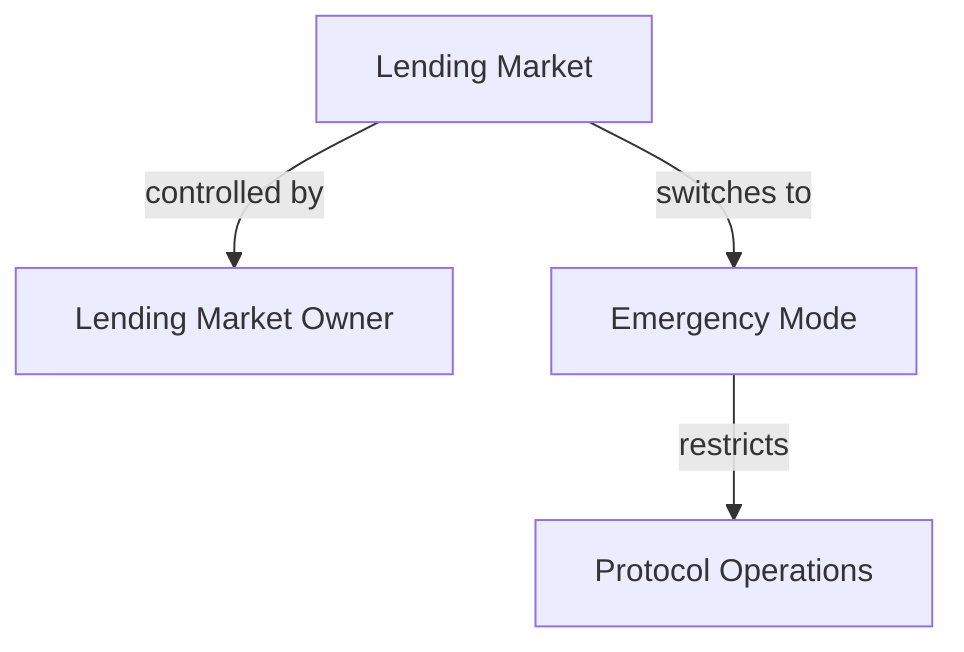
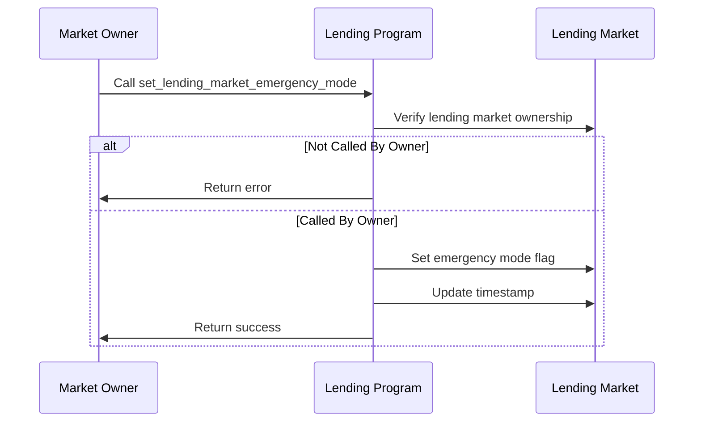

# Set Lending Market Emergency Mode

## Purpose

The `set_lending_market_emergency_mode` instruction enables or disables emergency mode for an entire lending market. Emergency mode is a critical safety mechanism that restricts certain operations within the protocol to prevent catastrophic losses during extreme market conditions, oracle failures, or other anomalous events.

## Real-World Analogy

Emergency mode is similar to circuit breakers in traditional financial markets or a bank temporarily suspending withdrawals during a bank run. When stock markets experience extreme volatility, exchanges may halt trading to prevent panic and allow for orderly price discovery. Similarly, emergency mode in Kamino Lending temporarily restricts certain high-risk activities to protect both users and the protocol itself during exceptional circumstances.

## Required Accounts



| Account | Role | Signer | Writable |
|---------|------|--------|----------|
| `lending_market` | Lending market to modify | No | Yes |
| `lending_market_owner` | Owner of the lending market | Yes | No |

## Parameters

| Parameter | Type | Description |
|-----------|------|-------------|
| `emergency_mode` | `bool` | Whether to enable (true) or disable (false) emergency mode |

## Step-by-Step Process



1. **Account Validation**:
   - Verify the lending market is initialized
   - Validate that the signer is the owner of the lending market

2. **Mode Change**:
   - Set the lending market's emergency_mode field to the specified value
   - Update the last update timestamp for the lending market

## Emergency Mode Restrictions

When emergency mode is enabled, several key protocol operations are restricted:

| Operation | Normal Mode | Emergency Mode |
|-----------|-------------|---------------|
| Deposits | Allowed | Restricted |
| Withdrawals | Allowed | Restricted |
| Borrowing | Allowed | Restricted |
| Repayments | Allowed | Always allowed |
| Liquidations | Normal thresholds | Enhanced permissions |
| Flash Loans | Allowed | Restricted |
| Admin Functions | Normal access | Enhanced permissions |

## Constraints and Validations

- The caller must be the lending market owner
- The lending market must be initialized

## Error Cases

| Error | Condition |
|-------|-----------|
| `InvalidMarketOwner` | The signer is not the market owner |
| `InvalidAccountOwner` | The lending market is not owned by the program |
| `InvalidAccountData` | The lending market data is invalid |

## Post-Update Impact

After enabling emergency mode:

1. **User Operations**:
   - Deposits may be blocked or limited
   - Withdrawals may be blocked or limited
   - New borrows are typically blocked
   - Existing positions continue accruing interest

2. **Protocol Protections**:
   - Liquidations may use different thresholds
   - Oracle failures have reduced impact
   - Extreme market moves are contained

3. **Administrative Access**:
   - Special recovery functions become available
   - Risk parameters can be adjusted more aggressively
   - Owner has enhanced control to address the emergency

## Example Usage

In a client application, the set lending market emergency mode instruction might be used like this:

```javascript
// Enable emergency mode for the lending market
const enableEmergencyModeInstruction = await kaminoLending.createSetLendingMarketEmergencyModeInstruction(
  lendingMarket.address,       // lending market
  marketOwnerWallet.publicKey, // lending market owner
  true                         // enable emergency mode
);

// Disable emergency mode for the lending market
const disableEmergencyModeInstruction = await kaminoLending.createSetLendingMarketEmergencyModeInstruction(
  lendingMarket.address,       // lending market
  marketOwnerWallet.publicKey, // lending market owner
  false                        // disable emergency mode
);

// Add to a transaction and execute
const transaction = new Transaction().add(enableEmergencyModeInstruction);
await sendAndConfirmTransaction(connection, transaction, [marketOwnerWallet]);
```

## Related Instructions

- [Set Lending Market Owner](./set-lending-market-owner.md): Changes who can control emergency mode
- [Update Reserve Config](../reserve-admin/update-reserve-config.md): May need adjustment during emergency
- [Liquidate Obligation](../liquidation/liquidate-obligation.md): Behavior changes during emergency

## Emergency Scenarios

### Oracle Failure

When price feeds become unreliable:

1. Emergency mode prevents new positions based on incorrect prices
2. Prevents liquidations using manipulated or stale prices
3. Gives administrators time to fix or replace oracles

### Market Volatility

During extreme market conditions:

1. Prevents panic-driven withdrawals that could deplete reserves
2. Limits cascading liquidations that could crash asset prices
3. Provides breathing room for market stabilization

### Asset De-pegging

When pegged assets (like stablecoins) lose their peg:

1. Prevents exploitative borrowing against over-valued collateral
2. Limits risk of under-collateralized loans
3. Gives time to adjust risk parameters appropriately

### Protocol Vulnerability

If a vulnerability is discovered:

1. Emergency mode can limit exploit vectors
2. Reduces potential damage while fixes are developed
3. Protects user funds during remediation

## Special Considerations

### Communication Protocol

During emergency mode activation:

1. **Clear Communication**: Owners should immediately communicate to users
2. **Transparency**: Explain the reason for emergency mode
3. **Timeline**: Provide estimates for resolution when possible
4. **Updates**: Regular status updates during the emergency

### Recovery Planning

Before disabling emergency mode:

1. **Risk Assessment**: Confirm the emergency has been resolved
2. **System Checks**: Verify all systems are functioning correctly
3. **Oracle Verification**: Confirm price feeds are reliable
4. **Staged Return**: Consider gradual return to normal operations

### Governance Considerations

For protocol governance:

1. **Timelocks**: Consider timelock requirements for emergency mode changes
2. **Multi-Signature**: Require multiple approvals for emergency actions
3. **Automated Triggers**: Define clear thresholds for automatic activation
4. **Oversight**: Implement post-emergency review procedures

### User Preparation

Users should understand:

1. **Risk Awareness**: Emergency mode can be activated at any time
2. **Position Management**: How their positions will be affected
3. **Repayment Priority**: Repaying loans remains possible during emergencies
4. **Liquidation Risk**: How liquidation rules may change

### Regular Testing

Protocol administrators should:

1. **Simulation Drills**: Periodically test emergency procedures
2. **Documentation**: Maintain clear emergency response documentation
3. **Training**: Ensure all operators understand emergency protocols
4. **Improvements**: Refine procedures based on drills and real events
