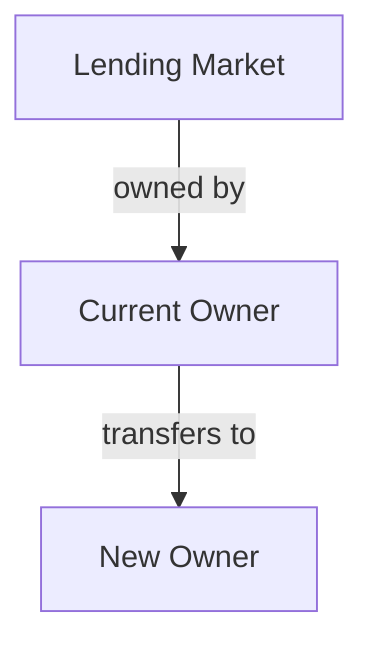
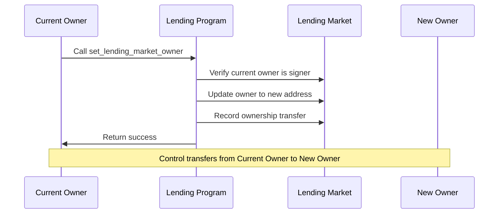

# Set Lending Market Owner

## Purpose

The `set_lending_market_owner` instruction transfers ownership of a lending market to a new address. This critical governance operation changes who has administrative control over the lending market, including the ability to configure reserves, update parameters, and manage protocol settings.

## Real-World Analogy

Transferring ownership of a lending market is similar to changing the controlling entity of a financial institution. In traditional finance, this might happen during a merger, acquisition, or corporate restructuring where control of a bank or lending platform transfers from one entity to another. The new owner gains the ability to set policies, manage risk parameters, and direct the institution's future.

## Required Accounts



| Account | Role | Signer | Writable |
|---------|------|--------|----------|
| `lending_market` | Lending market to change ownership of | No | Yes |
| `lending_market_owner` | Current owner of the lending market | Yes | No |
| `new_owner` | The new owner to receive control | No | No |

## Parameters

This instruction doesn't require any parameters beyond the provided accounts.

## Step-by-Step Process



1. **Account Validation**:
   - Verify the lending market is initialized
   - Validate that the current owner is the signer
   - Check that the new owner address is valid

2. **Ownership Transfer**:
   - Update the lending market's owner field to the new owner's address
   - Update the last update timestamp for the lending market

## Constraints and Validations

- The lending market must be initialized
- The current owner must sign the transaction
- The new owner must be a valid address

## Error Cases

| Error | Condition |
|-------|-----------|
| `InvalidMarketOwner` | The signer is not the current market owner |
| `InvalidAccountOwner` | The lending market is not owned by the program |
| `InvalidAccountData` | The lending market data is invalid |

## Post-Transfer State

After successful execution:
- The lending market's owner field contains the new owner's address
- The current owner loses all administrative control
- The new owner gains full administrative control
- All existing reserves and protocol settings remain unchanged

## Security Implications

Transferring ownership has significant security implications:

1. **Complete Control**: The new owner gains complete administrative control over the lending market
2. **Reserve Management**: Can add, update, or freeze reserves
3. **Parameter Changes**: Can modify risk parameters, fees, and interest rates
4. **Emergency Powers**: Has access to emergency mode functions

## Example Usage

In a client application, the set lending market owner instruction might be used like this:

```javascript
// Transfer lending market ownership to a new address
const setOwnerInstruction = await kaminoLending.createSetLendingMarketOwnerInstruction(
  lendingMarket.address,       // lending market
  currentOwnerWallet.publicKey, // current owner
  newOwnerAddress              // new owner
);

// Add to a transaction and execute
const transaction = new Transaction().add(setOwnerInstruction);
await sendAndConfirmTransaction(connection, transaction, [currentOwnerWallet]);
```

## Related Instructions

- [Init Lending Market](./init-lending-market.md): Creates the lending market with initial owner
- [Set Lending Market Owner and Version](./set-lending-market-owner-and-version.md): Extended version that also updates the protocol version

## Special Considerations

### Ownership Transfer Best Practices

To ensure secure ownership transfers:

1. **Verification**: Always verify the new owner address multiple times
2. **Pilot Transfer**: Consider first transferring to a test market
3. **Multi-Sig**: Use multi-signature wallets for market ownership
4. **Timelock**: Implement a timelock for sensitive ownership changes

### Governance Models

Different ownership structures can be implemented:

1. **Direct Ownership**: Individual or entity directly owns the market
2. **DAO Governance**: Ownership held by a DAO's governance program
3. **Multi-Signature**: Ownership held by a multi-sig wallet requiring multiple approvers
4. **Programmatic Control**: Ownership held by another program with specific logic

### Emergency Contingencies

Ownership transfer is critical for emergency situations:

1. **Backup Owners**: Have pre-approved backup owners in case primary becomes unavailable
2. **Recovery Procedures**: Document clear procedures for emergency transfers
3. **Circuit Breakers**: Consider implementing timeouts or restrictions on rapid ownership changes

### Permanent Transfers

Unlike some parameters, ownership transfers are immediate and complete:

1. There is no "pending" state for ownership transfers
2. Once executed, the previous owner has no special access
3. The new owner immediately gains all privileges

### Protocol Evolution

Ownership transfers enable protocol evolution:

1. **Team Changes**: Smoothly transition between operating teams
2. **Protocol Upgrades**: Facilitate major version upgrades with new owners
3. **DAO Transition**: Move from centralized to decentralized governance
