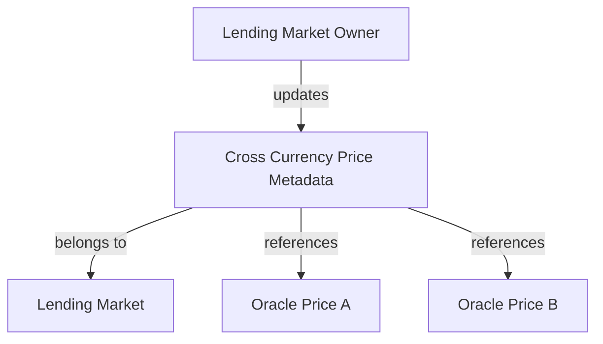
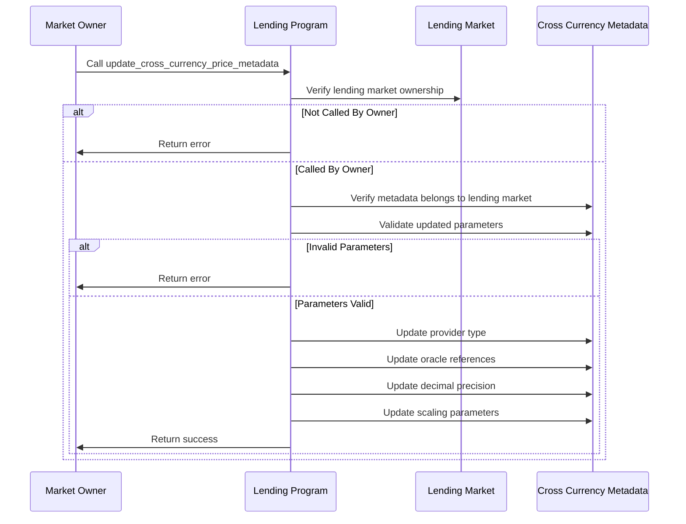

# Update Cross Currency Price Metadata

## Purpose

The `update_cross_currency_price_metadata` instruction allows the lending market owner to modify the configuration of an existing cross-currency price metadata account. This enables adjusting oracle sources, price scaling factors, and other parameters to maintain accurate price relationships between token pairs as market conditions or oracle availability changes over time.

## Real-World Analogy

Updating cross-currency price metadata is similar to how central banks periodically adjust their currency valuation methodologies. For example, a central bank might change how it calculates a currency's value against a basket of other currencies, or update its data sources for foreign exchange rates. Similarly, Kamino Lending's administrators can update how token pairs are priced relative to each other to ensure accurate valuations for risk management.

## Required Accounts



| Account | Role | Signer | Writable |
|---------|------|--------|----------|
| `cross_currency_metadata` | Metadata account to update | No | Yes |
| `lending_market` | Parent lending market | No | No |
| `lending_market_owner` | Owner of the lending market | Yes | No |

## Parameters

| Parameter | Type | Description |
|-----------|------|-------------|
| `price_metadata` | `CrossCurrencyPriceMetadata` | Updated metadata configuration |

The `CrossCurrencyPriceMetadata` structure contains:

| Field | Type | Description |
|-------|------|-------------|
| `provider_type` | `u64` | Type of price provider (e.g., 0=direct, 1=derived) |
| `oracle_price_a` | `Pubkey` | Oracle address for token A |
| `oracle_price_b` | `Pubkey` | Oracle address for token B |
| `decimals_a` | `u8` | Decimal places for token A |
| `decimals_b` | `u8` | Decimal places for token B |
| `multiplier` | `u64` | Price multiplier for scaling |
| `divisor` | `u64` | Price divisor for scaling |

## Step-by-Step Process



1. **Account Validation**:
   - Verify the cross-currency metadata account exists
   - Validate that the metadata belongs to the specified lending market
   - Confirm the signer is the owner of the lending market

2. **Parameter Validation**:
   - Check that the provider type is supported
   - Validate oracle references if specified
   - Ensure multiplier and divisor are non-zero

3. **Metadata Update**:
   - Update the provider type if changed
   - Replace oracle references with new ones if provided
   - Update decimal precision settings
   - Modify the price scaling parameters (multiplier and divisor)
   - Mark the metadata as requiring a refresh

## Update Scenarios

### 1. Oracle Source Change

Switching from one price oracle to another:

```
// Before
oracle_price_a: Pyth ETH/USD Oracle
oracle_price_b: Pyth BTC/USD Oracle

// After
oracle_price_a: Switchboard ETH/USD Oracle
oracle_price_b: Pyth BTC/USD Oracle
```

### 2. Scaling Factor Adjustment

Adjusting price scaling for better precision:

```
// Before
multiplier: 1
divisor: 1

// After (e.g., to handle price discrepancies)
multiplier: 103
divisor: 100
```

### 3. Provider Type Change

Changing how the price is derived:

```
// Before
provider_type: 0 (direct comparison)

// After
provider_type: 1 (derived through intermediate token)
```

## Constraints and Validations

- The caller must be the lending market owner
- The metadata account must exist and be initialized
- The metadata must belong to the specified lending market
- The provider type must be supported
- Oracle references must be valid if specified
- Multiplier and divisor must be non-zero

## Error Cases

| Error | Condition |
|-------|-----------|
| `InvalidMarketOwner` | The signer is not the market owner |
| `InvalidMetadata` | The metadata account is invalid or uninitialized |
| `InvalidProviderType` | The specified provider type is not supported |
| `InvalidOracle` | Oracle references are invalid |
| `InvalidParameters` | Scaling parameters are invalid (e.g., zero divisor) |

## Post-Update Impact

After updating the metadata:

1. **Price Recalculation**:
   - The derived price will be recalculated on next refresh
   - This may affect asset valuations across the protocol
   - Risk calculations will use the new price relationship

2. **Risk Management**:
   - Collateral values may change based on new price relationships
   - Borrowing capacity may increase or decrease
   - Liquidation thresholds may be affected

3. **System Integration**:
   - External systems relying on the price feed need to adapt
   - Users may see different valuations for their positions
   - Trading strategies based on these prices should be reviewed

## Example Usage

In a client application, the update cross currency price metadata instruction might be used like this:

```javascript
// Update ETH/BTC cross currency price metadata
const updateCrossCurrencyMetadataInstruction = await kaminoLending.createUpdateCrossCurrencyPriceMetadataInstruction(
  ethBtcMetadata.address,             // existing metadata account
  lendingMarket.address,              // parent lending market
  marketOwnerWallet.publicKey,        // lending market owner
  {
    providerType: 0,                  // direct price comparison (unchanged)
    oraclePriceA: newEthUsdOracle,    // new ETH/USD oracle
    oraclePriceB: btcUsdOracle,       // unchanged BTC/USD oracle
    decimalsA: 18,                    // ETH decimals (unchanged)
    decimalsB: 8,                     // BTC decimals (unchanged)
    multiplier: new BN(102),          // adjusted multiplier
    divisor: new BN(100)              // adjusted divisor
  }
);

// Add to a transaction and execute
const transaction = new Transaction().add(updateCrossCurrencyMetadataInstruction);
await sendAndConfirmTransaction(connection, transaction, [marketOwnerWallet]);
```

## Related Instructions

- [Init Cross Currency Price Metadata](./init-cross-currency-price-metadata.md): Creates the initial metadata
- [Refresh Cross Currency Price](./refresh-cross-currency-price.md): Updates the derived price with latest data
- [Delete Cross Currency Price Metadata](./delete-cross-currency-price-metadata.md): Removes metadata if no longer needed

## Update Strategy Best Practices

### Oracle Transitions

When changing oracle sources:

1. **Comparative Analysis**: Verify new oracle provides similar prices
2. **Monitoring Period**: Monitor both oracles before switching
3. **Gradual Transition**: Consider a phased approach for critical pairs
4. **Communication**: Notify stakeholders of oracle source changes

### Parameter Tuning

When adjusting scaling parameters:

1. **Historical Analysis**: Analyze price history to identify discrepancies
2. **Incremental Changes**: Make small adjustments rather than large ones
3. **Back-testing**: Verify new parameters against historical data
4. **Impact Assessment**: Evaluate effects on existing positions

### Emergency Updates

During market disruptions:

1. **Quick Response**: Be prepared for rapid parameter changes
2. **Circuit Breakers**: Consider pausing systems during significant updates
3. **Fallback Options**: Maintain alternative price sources
4. **Coordinated Action**: Sync with emergency mode if necessary

## Special Considerations

### Market Impact Management

Managing the impact of price relationship changes:

1. **Timing**: Choose update timing to minimize market impact
2. **Transparency**: Communicate changes to users in advance when possible
3. **Position Protection**: Consider measures to protect existing positions
4. **Price Continuity**: Ensure smooth transition between price configurations

### Governance Procedures

For protocol governance:

1. **Change Proposals**: Document proposed changes and rationale
2. **Review Process**: Establish multi-party review for parameter changes
3. **Approval Workflows**: Define approval chain for different change types
4. **Audit Trail**: Maintain records of all metadata updates

### System Integration

For protocol integrations:

1. **Notification System**: Notify dependent systems of parameter changes
2. **Version Tracking**: Track metadata versions for troubleshooting
3. **Compatibility Checks**: Verify compatibility with other protocol components
4. **Documentation**: Update technical documentation after changes
