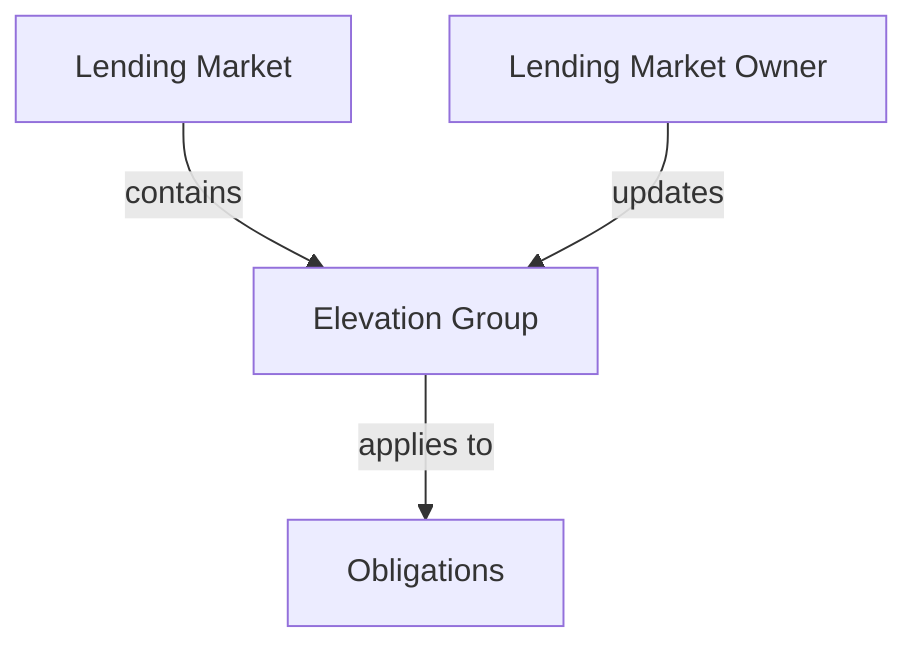
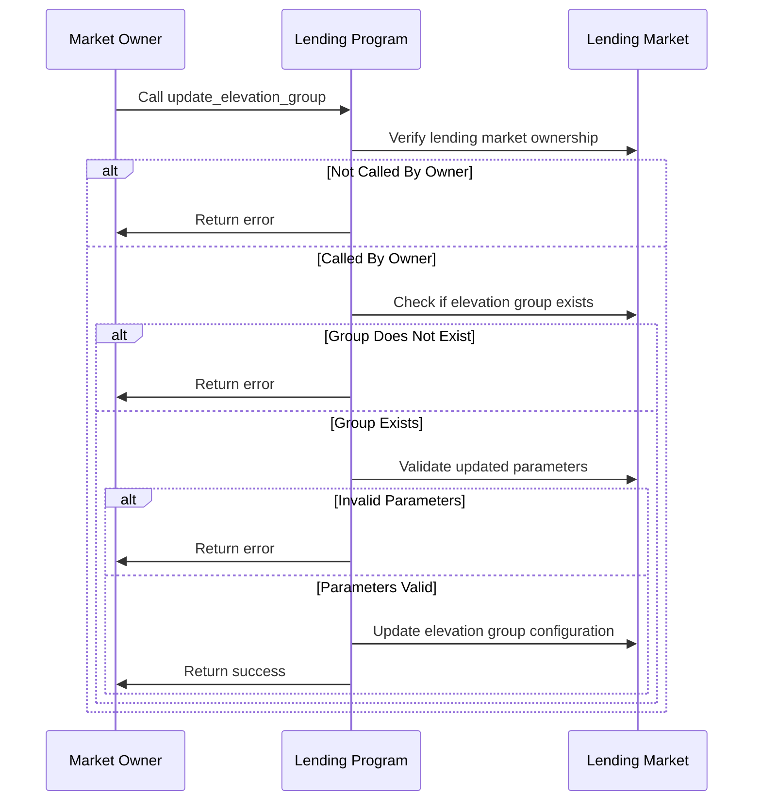

# Update Elevation Group

## Purpose

The `update_elevation_group` instruction allows the lending market owner to modify the configuration of an existing elevation group. This enables adjusting risk parameters, liquidation settings, and loan-to-value ratios in response to changing market conditions, evolving risk assessments, or strategic shifts. The ability to update elevation groups ensures the protocol can maintain optimal risk management while adapting to market developments.

## Real-World Analogy

Updating an elevation group is similar to how banks periodically revise the terms and benefits of their tiered account programs. For instance, a bank might adjust the interest rates, fee structures, or minimum balance requirements for their "Gold" tier accounts in response to competitive pressures or changing market conditions. Similarly, Kamino Lending can modify elevation group parameters to optimize for current market dynamics or strategic objectives.

## Required Accounts



| Account | Role | Signer | Writable |
|---------|------|--------|----------|
| `lending_market` | Parent lending market | No | Yes |
| `lending_market_owner` | Owner of the lending market | Yes | No |

## Parameters

| Parameter | Type | Description |
|-----------|------|-------------|
| `elevation_group` | `u8` | ID of the elevation group to update (1-255) |
| `config` | `ElevationGroupConfig` | Updated configuration parameters |

The `ElevationGroupConfig` structure contains:

| Field | Type | Description |
|-------|------|-------------|
| `max_liquidation_bonus_bps` | `u16` | Maximum liquidation bonus in basis points |
| `liquidation_threshold_offset_bps` | `u16` | Offset to standard liquidation threshold in basis points |
| `max_liquidation_threshold_ltv` | `u16` | Maximum loan-to-value ratio for liquidation threshold |
| `loan_to_value_offset_bps` | `u16` | Offset to standard LTV ratio in basis points |
| `max_loan_to_value_ltv` | `u16` | Maximum allowed LTV ratio |
| `bad_debt_liquidation_bonus_bps` | `u16` | Liquidation bonus for bad debt in basis points |
| `reserved` | `[u8; 32]` | Reserved for future use |

## Step-by-Step Process



1. **Account Validation**:
   - Verify the lending market is initialized
   - Validate that the signer is the owner of the lending market

2. **Elevation Group Validation**:
   - Check that the specified elevation group exists
   - Ensure the elevation group ID is valid (1-255)
   - Validate all updated risk parameters are within allowed ranges

3. **Parameter Update**:
   - Update the elevation group's risk parameters with new values
   - Maintain the elevation group authority unchanged
   - Recalculate any derived values based on new parameters

## Parameter Impact Analysis

### Before and After Comparison

For example, changing from conservative to more aggressive parameters:

| Parameter | Before | After | Impact |
|-----------|--------|-------|--------|
| `max_liquidation_bonus_bps` | 800 (8%) | 1000 (10%) | Increased incentive for liquidators |
| `liquidation_threshold_offset_bps` | 300 (3%) | 500 (5%) | More buffer before liquidation |
| `max_loan_to_value_ltv` | 7500 (75%) | 8000 (80%) | Higher borrowing capacity |

### Effective Parameter Calculation

The actual parameters applied to obligations combine base reserve parameters with elevation group adjustments:

```
Effective LTV = min(
    Reserve LTV + elevation_group.loan_to_value_offset_bps,
    elevation_group.max_loan_to_value_ltv
)

Effective Liquidation Threshold = min(
    Reserve Liquidation Threshold + elevation_group.liquidation_threshold_offset_bps,
    elevation_group.max_liquidation_threshold_ltv
)

Effective Liquidation Bonus = min(
    Reserve Liquidation Bonus,
    elevation_group.max_liquidation_bonus_bps
)
```

## Constraints and Validations

- The caller must be the lending market owner
- The elevation group ID must be between 1 and 255 (0 is reserved for standard)
- The elevation group must already exist
- All risk parameters must be within valid ranges:
  - Basis point values must not exceed 10000 (100%)
  - Max LTV must not exceed maximum protocol limits
  - Liquidation threshold must be higher than LTV
  - The configuration must not create unsafe risk conditions

## Error Cases

| Error | Condition |
|-------|-----------|
| `InvalidMarketOwner` | The signer is not the market owner |
| `ElevationGroupNotFound` | The specified elevation group doesn't exist |
| `InvalidElevationGroup` | The elevation group ID is invalid (0 or >255) |
| `InvalidElevationGroupConfig` | One or more config parameters are invalid |

## Post-Update Impact

After successful update:

1. **Immediate Effects**:
   - New parameters apply to all obligations in the elevation group
   - Risk calculations use updated parameters for health checks
   - New borrows and liquidations follow the updated rules

2. **Risk Reassessment**:
   - Previously healthy positions may become unhealthy (if parameters tightened)
   - Previously restricted borrows may become available (if parameters loosened)
   - Liquidation incentives change based on new bonus parameters

3. **User Experience**:
   - Users in the elevation group see updated borrowing capacities
   - Liquidators see different liquidation opportunities and rewards
   - UI displays reflect the new parameters and limits

## Example Usage

In a client application, the update elevation group instruction might be used like this:

```javascript
// Update "Premium" elevation group (ID: 1) with new parameters
const updatedElevationGroupConfig = {
  maxLiquidationBonusBps: 1200,              // Increased from 1000 to 1200
  liquidationThresholdOffsetBps: 600,        // Increased from 500 to 600
  maxLiquidationThresholdLtv: 9000,          // Unchanged at 90%
  loanToValueOffsetBps: 400,                 // Increased from 300 to 400
  maxLoanToValueLtv: 8500,                   // Unchanged at 85%
  badDebtLiquidationBonusBps: 1800,          // Increased from 1500 to 1800
};

const updateElevationGroupInstruction = await kaminoLending.createUpdateElevationGroupInstruction(
  lendingMarket.address,                     // parent lending market
  marketOwnerWallet.publicKey,               // lending market owner
  1,                                         // elevation group ID
  updatedElevationGroupConfig                // updated configuration
);

// Add to a transaction and execute
const transaction = new Transaction().add(updateElevationGroupInstruction);
await sendAndConfirmTransaction(connection, transaction, [marketOwnerWallet]);
```

## Related Instructions

- [Add Elevation Group](./add-elevation-group.md): Creates a new elevation group
- [Set Obligation Elevation Group](../user-borrow/set-obligation-elevation-group.md): Assigns an obligation to an elevation group
- [Remove Elevation Group](./remove-elevation-group.md): Deletes an elevation group

## Update Scenarios and Strategies

### Market Condition Responses

Adjusting parameters based on market changes:

1. **Volatility Increase**: Reduce LTV offsets and max values
2. **Stability Periods**: Increase LTV offsets for better capital efficiency
3. **Liquidation Activity**: Adjust liquidation bonuses to ensure adequate incentives

### Strategic Adjustments

Modifying parameters for strategic purposes:

1. **Competitive Response**: Improve terms to match competitor offerings
2. **Growth Phase**: Increase LTVs to attract borrowers
3. **Risk Reduction**: Tighten parameters during uncertain periods
4. **User Retention**: Enhance terms for important user segments

### Staged Implementation

For significant parameter changes:

1. **Gradual Approach**: Implement changes in smaller increments
2. **Monitoring Periods**: Observe impact before further adjustments
3. **Targeted Updates**: Update specific parameters while leaving others stable
4. **Communication Plan**: Notify affected users before and after changes

## Special Considerations

### Impact Assessment

Before updating elevation group parameters:

1. **Position Analysis**: Simulate impact on existing positions
2. **Liquidation Risk**: Identify positions at risk due to parameter tightening
3. **Capital Efficiency**: Calculate changes in borrowing capacity
4. **Competitive Analysis**: Compare resulting terms to market alternatives

### User Communication

When changing elevation group parameters:

1. **Advance Notice**: Provide users time to adjust positions
2. **Explanation**: Clearly communicate the rationale for changes
3. **Impact Summary**: Help users understand how changes affect them
4. **Adjustment Period**: Consider grace periods for major tightening

### Governance Considerations

For protocol governance:

1. **Parameter Limits**: Define acceptable ranges for each parameter
2. **Approval Processes**: Establish governance procedures for updates
3. **Emergency Updates**: Create expedited processes for urgent situations
4. **Transparency**: Document and publish all parameter changes

### Monitoring Requirements

After updating elevation group parameters:

1. **Position Health**: Track obligation health metrics closely
2. **Liquidation Activity**: Monitor for unusual liquidation patterns
3. **User Behavior**: Observe changes in borrowing and repayment behavior
4. **Market Response**: Gauge competitive response to parameter changes
