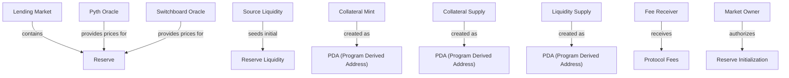
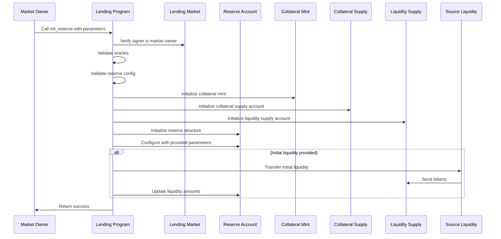

# Initialize Reserve

## Purpose

The `init_reserve` instruction creates a new reserve in a lending market for a specific token. A reserve represents a pool of assets that can be deposited and borrowed, along with all the associated configuration parameters that govern how the token is handled within the protocol.

## Real-World Analogy

Initializing a reserve is similar to a bank adding support for a new currency or asset class. The bank must set up dedicated accounts, determine interest rates, establish risk parameters, and create the necessary infrastructure to handle deposits and loans in this new asset.

## Required Accounts



| Account | Role | Signer | Writable |
|---------|------|--------|----------|
| `lending_market` | The parent lending market | No | No |
| `reserve` | The reserve account to initialize | No | Yes |
| `reserve_liquidity_mint` | The mint of the token for this reserve | No | No |
| `reserve_liquidity_supply` | Supply account for the reserve's liquidity | No | Yes |
| `fee_receiver` | Account that will receive fees | No | No |
| `reserve_collateral_mint` | Mint for the reserve's collateral tokens | No | Yes |
| `reserve_collateral_supply` | Supply account for collateral tokens | No | Yes |
| `pyth_product` | Pyth oracle product account | No | No |
| `pyth_price` | Pyth oracle price account | No | No |
| `switchboard_feed` | Switchboard oracle feed account | No | No |
| `lending_market_owner` | Owner of the lending market | Yes | No |
| `lending_market_authority` | Authority derived from the lending market | No | No |
| `user_transfer_authority` | Authority over the source liquidity | Yes | No |
| `source_liquidity` | Source of initial liquidity | No | Yes |
| `rent` | Rent sysvar | No | No |
| `token_program` | SPL Token program | No | No |
| `system_program` | System program | No | No |

## Parameters

| Parameter | Type | Description |
|-----------|------|-------------|
| `liquidity_amount` | `u64` | Initial amount of liquidity to deposit |
| `reserve_config` | `ReserveConfig` | Configuration parameters for the reserve |

Where `ReserveConfig` includes:
- `optimal_utilization_rate`: Target utilization rate for optimal interest
- `max_utilization_rate`: Maximum utilization rate before max interest applies
- `loan_to_value_ratio`: Maximum loan-to-value ratio for this asset
- `liquidation_threshold`: LTV at which liquidation can occur
- `liquidation_bonus`: Bonus for liquidators
- `min_borrow_rate`: Minimum interest rate
- `optimal_borrow_rate`: Interest rate at optimal utilization
- `max_borrow_rate`: Maximum interest rate
- `fees`: Structure containing various fee settings
- `deposit_limit`: Maximum deposit allowed
- `borrow_limit`: Maximum borrow allowed
- `protocol_take_rate`: Percentage of interest taken by protocol
- `protocol_liquidation_fee`: Fee on liquidations
- `token_info`: Information about the token (symbol, decimals, etc.)

## Step-by-Step Process



1. **Account Validation**:
   - Verify the `lending_market` is initialized and not in emergency mode
   - Confirm the `lending_market_owner` is a signer and matches the market's owner
   - Validate all account relationships and ownerships

2. **Oracle Validation**:
   - Verify the Pyth oracle accounts match the token
   - Verify the Switchboard oracle feed is valid
   - Ensure at least one oracle is operational

3. **Token Setup**:
   - Initialize the collateral mint as a PDA with the program as authority
   - Configure the collateral mint with the same decimals as the liquidity mint
   - Initialize the collateral supply account
   - Initialize the liquidity supply account

4. **Reserve Configuration**:
   - Initialize the reserve structure with its core fields
   - Set up the liquidity and collateral structures
   - Apply the provided reserve configuration
   - Set up references to the lending market and oracles

5. **Initial Liquidity**:
   - If `liquidity_amount` is greater than 0, transfer tokens from source
   - Update the reserve's available amount

6. **Final Validation**:
   - Verify all parameters are within allowed ranges
   - Ensure the reserve is properly linked to the lending market
   - Check that the fee receiver is a valid token account

## Detailed Parameter Explanations

### Reserve Config

The `reserve_config` contains multiple critical parameters:

- **Interest Rate Model**:
  - `optimal_utilization_rate`: The target utilization where interest rates start to increase more rapidly (typically 70-80%)
  - `max_utilization_rate`: The utilization point beyond which the maximum interest rate applies (typically 90-95%)
  - `min_borrow_rate`: The minimum interest rate when utilization is 0%
  - `optimal_borrow_rate`: The interest rate at the optimal utilization point
  - `max_borrow_rate`: The maximum interest rate at 100% utilization

- **Risk Parameters**:
  - `loan_to_value_ratio`: The maximum percentage of an asset's value that can be borrowed against
  - `liquidation_threshold`: The loan-to-value ratio at which liquidation can begin
  - `liquidation_bonus`: The bonus liquidators receive (incentive to liquidate)

- **Limits**:
  - `deposit_limit`: Maximum amount that can be deposited into this reserve
  - `borrow_limit`: Maximum amount that can be borrowed from this reserve

- **Fee Structure**:
  - `fees.borrow_fee_sf`: Fee charged on borrows (scaled fraction)
  - `fees.flash_loan_fee_sf`: Fee charged on flash loans (scaled fraction)
  - `fees.host_fee_percentage`: Percentage of fees allocated to the host/frontend

## Constraints and Validations

- The lending market must not be in emergency mode
- The signer must be the lending market owner
- The oracles must be valid for the token being added
- The token must not already have a reserve in this market
- The configuration parameters must be within valid ranges:
  - Interest rates must be properly ordered (min ≤ optimal ≤ max)
  - Loan-to-value ratio must be less than or equal to 100%
  - Liquidation threshold must be greater than loan-to-value ratio

## Error Cases

| Error | Condition |
|-------|-----------|
| `InvalidMarketOwner` | Signer is not the market owner |
| `InvalidOracleConfig` | Oracle accounts don't match or are invalid |
| `InvalidConfig` | Reserve configuration has invalid parameters |
| `MarketInEmergencyMode` | The lending market is in emergency mode |

## Post-Initialization State

After successful execution, the reserve exists with:

- Initialized liquidity and collateral accounts
- The specified configuration applied
- Initial liquidity if provided
- Ready to accept deposits and issue loans
- Connected to price oracles for valuation

## Security Considerations

Initializing a reserve is a critical operation that:

1. Determines how a token will be treated in the protocol
2. Sets risk parameters that affect system solvency
3. Connects external price oracles that will be trusted for valuations

The risk parameters must be carefully calibrated based on:
- Token volatility
- Market liquidity
- Price oracle reliability
- Expected utilization patterns

Improper configuration could lead to:
- Insufficient collateralization
- Delayed or ineffective liquidations
- Interest rate misalignment
- Oracle failures

## Example Usage

In a transaction, the `init_reserve` instruction would typically be used like this:

```javascript
// Create a reserve for the SOL token
const reserveConfig = {
  optimalUtilizationRate: 80,
  maxUtilizationRate: 90,
  loanToValueRatio: 75,
  liquidationThreshold: 80,
  liquidationBonus: 5,
  minBorrowRate: 1,
  optimalBorrowRate: 10,
  maxBorrowRate: 120,
  fees: {
    borrowFeeSf: 0.001 * 1e15, // 0.1%
    flashLoanFeeSf: 0.003 * 1e15, // 0.3%
    hostFeePercentage: 20, // 20%
  },
  depositLimit: 1000000 * 1e9, // 1M SOL
  borrowLimit: 800000 * 1e9, // 800K SOL
  protocolTakeRate: 20, // 20%
  tokenInfo: {
    symbol: "SOL",
    decimals: 9
  }
};

const initReserveInstruction = await kaminoLending.createInitReserveInstruction(
  marketOwner.publicKey,
  newReserveAddress,
  reserveConfig,
  solMint,
  initialLiquidity
);

// Add to a transaction and execute
const transaction = new Transaction().add(initReserveInstruction);
await sendAndConfirmTransaction(connection, transaction, [marketOwner]);
```

## Next Steps After Initialization

After initializing a reserve, the typical next steps are:

1. [Add additional liquidity](./add-reserve-liquidity.md) to the reserve
2. [Configure farming programs](./update-reserve-config-with-farms.md) if applicable
3. Allow users to [deposit](../user-deposit/deposit-reserve-liquidity.md) and [borrow](../user-borrow/borrow-obligation-liquidity.md)
4. Monitor and [update reserve config](./update-reserve-config.md) as market conditions change

These steps establish a fully functional token market within the lending protocol.
