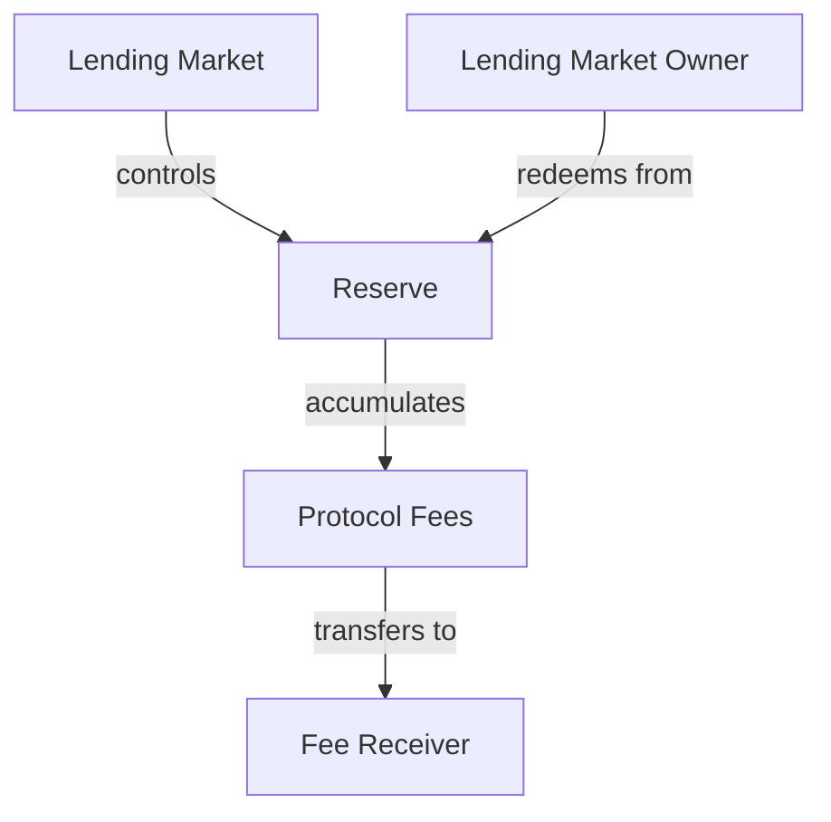
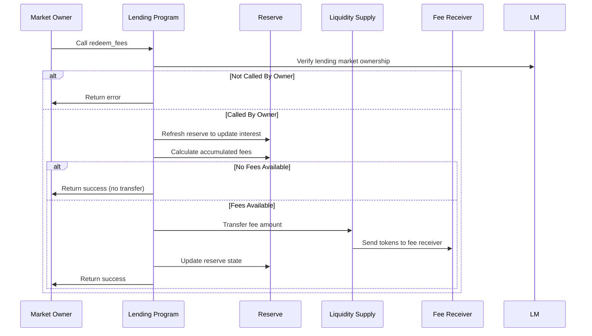

# Redeem Fees

## Purpose

The `redeem_fees` instruction allows the lending market owner to collect accumulated protocol fees from a reserve. These fees are generated from borrower interest, liquidations, and flash loans, and can be redeemed periodically as part of the protocol's revenue model. This instruction transfers the accumulated fees from the reserve to a designated fee receiver account.

## Real-World Analogy

Redeeming fees is similar to a bank collecting service charges and interest income from its operations. Banks charge various fees for their services and earn interest spreads between what they pay depositors and what they charge borrowers. Periodically, these revenues are recognized and transferred to the bank's income statement. Similarly, in Kamino Lending, protocol fees accumulate in reserves and are periodically "harvested" by the protocol administrators.

## Required Accounts



| Account | Role | Signer | Writable |
|---------|------|--------|----------|
| `reserve` | Reserve containing fees to redeem | No | Yes |
| `lending_market` | Parent lending market | No | No |
| `lending_market_owner` | Owner of the lending market | Yes | No |
| `reserve_liquidity_supply` | Reserve's liquidity supply SPL account | No | Yes |
| `fee_receiver` | Account to receive the redeemed fees | No | Yes |
| `lending_market_authority` | Authority derived from the lending market | No | No |
| `clock` | Clock sysvar for timestamp | No | No |
| `token_program` | SPL Token program | No | No |

## Parameters

This instruction doesn't require any parameters beyond the provided accounts.

## Step-by-Step Process



1. **Account Validation**:
   - Verify the reserve belongs to the specified lending market
   - Validate that the signer is the owner of the lending market
   - Check that the fee receiver is a valid token account for the reserve's currency

2. **Reserve Refresh**:
   - Update the reserve's accumulated interest
   - Recalculate the total protocol fees

3. **Fee Calculation**:
   - Determine how many tokens have accumulated as protocol fees
   - Check if the amount is greater than zero

4. **Token Transfer**:
   - Transfer the fee amount from the reserve's liquidity supply to the fee receiver
   - Update the reserve's state to reflect the redeemed fees

## Fee Accumulation Mechanisms

Fees accumulate in reserves through multiple mechanisms:

### 1. Interest Spread

A portion of borrower interest payments is allocated as protocol fees:

```
Protocol Interest Fee = Total Interest * Protocol Take Rate
```

Where Protocol Take Rate is a percentage defined in the reserve's configuration.

### 2. Origination Fees

Fees charged on new borrows:

```
Origination Fee = Borrow Amount * Borrow Fee Rate
Protocol Share = Origination Fee * Protocol Take Rate
```

### 3. Liquidation Fees

Fees from liquidation operations:

```
Liquidation Fee = Liquidation Amount * Liquidation Fee Rate
Protocol Share = Liquidation Fee * Protocol Take Rate
```

### 4. Flash Loan Fees

Fees from flash loan operations:

```
Flash Loan Fee = Flash Loan Amount * Flash Loan Fee Rate
Protocol Share = Flash Loan Fee * Protocol Take Rate
```

## Constraints and Validations

- The caller must be the lending market owner
- The reserve must belong to the lending market
- The fee receiver must be a valid token account for the reserve's currency
- The fee amount must be greater than zero to initiate a transfer

## Error Cases

| Error | Condition |
|-------|-----------|
| `InvalidMarketOwner` | The signer is not the market owner |
| `InvalidAccountOwner` | An account is not owned by the expected program |
| `TokenTransferFailed` | The fee transfer operation failed |

## Post-Redemption State

After successful fee redemption:

- The reserve's tracked protocol fees are reduced to zero
- The fee receiver's token balance increases by the fee amount
- The reserve's liquidity supply decreases by the fee amount

## Fee Management Strategy

Effective fee management involves:

1. **Regular Collection**:
   - Periodic redemption prevents large fee accumulation
   - Helps maintain accurate protocol revenue tracking
   - Allows timely distribution to stakeholders

2. **Reserve-Specific Strategies**:
   - Different reserves may have different fee collection schedules
   - High-activity reserves may need more frequent collection
   - Some reserves may accumulate fees faster due to higher volumes

3. **Revenue Optimization**:
   - Timing fee collection with favorable market conditions
   - Balancing between immediate collection and allowing compounding
   - Strategic reinvestment of collected fees

## Example Usage

In a client application, the redeem fees instruction might be used like this:

```javascript
// Redeem fees from USDC reserve
const redeemFeesInstruction = await kaminoLending.createRedeemFeesInstruction(
  usdcReserve.address,         // reserve containing fees
  lendingMarket.address,       // parent lending market
  marketOwnerWallet.publicKey, // lending market owner
  usdcFeeReceiver.address      // fee receiver account
);

// Add to a transaction and execute
const transaction = new Transaction().add(redeemFeesInstruction);
await sendAndConfirmTransaction(connection, transaction, [marketOwnerWallet]);
```

## Related Instructions

- [Refresh Reserve](./refresh-reserve.md): Should be called before fee redemption
- [Update Reserve Config](./update-reserve-config.md): Used to adjust fee parameters

## Protocol Economics

### Revenue Streams

The protocol generates revenue through multiple channels:

1. **Interest Spread**: Portion of interest paid by borrowers
2. **Origination Fees**: Upfront fees on new borrows
3. **Liquidation Penalties**: Fees from liquidation operations
4. **Flash Loan Fees**: Charges for uncollateralized flash loans

### Fee Distribution

Collected fees can be used for various purposes:

1. **Protocol Treasury**: Building protocol-owned liquidity
2. **Token Buybacks**: Purchasing and burning protocol tokens
3. **Staking Rewards**: Distributing to protocol token stakers
4. **Development Funding**: Supporting ongoing development
5. **Insurance Fund**: Building safety reserves for the protocol

### Protocol Sustainability

Fee revenues contribute to protocol sustainability:

1. **Operational Costs**: Covering ongoing maintenance and development
2. **Risk Mitigation**: Building reserves against bad debt
3. **Growth Initiatives**: Funding expansion and feature development
4. **Token Value Accrual**: Increasing value for token holders

## Special Considerations

### Market Conditions

Market conditions affect fee collection strategies:

1. **Token Price Volatility**: May affect optimal collection timing
2. **Gas Costs**: Consider transaction costs vs. fee amounts
3. **Liquidity Conditions**: Ensure fee collection doesn't impact reserves negatively

### Transparency Best Practices

For protocol governance:

1. **Regular Reporting**: Publish fee collection amounts and frequency
2. **Revenue Allocation**: Clearly communicate how fees are used
3. **Stakeholder Input**: Allow community input on fee parameters

### Emergency Considerations

During market stress:

1. **Collection Frequency**: May need adjustment during volatile periods
2. **Emergency Reserves**: Some fees might be retained in reserves
3. **Flexible Parameters**: Fee parameters may need adjustment
