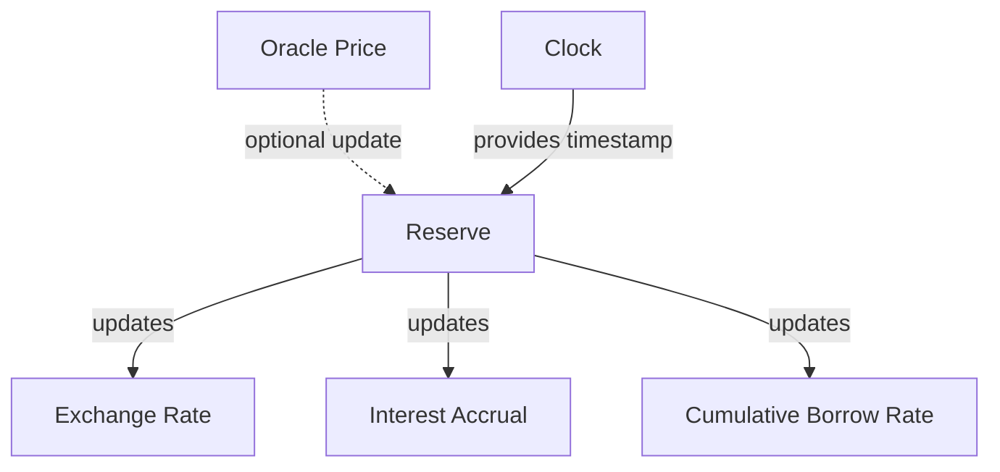
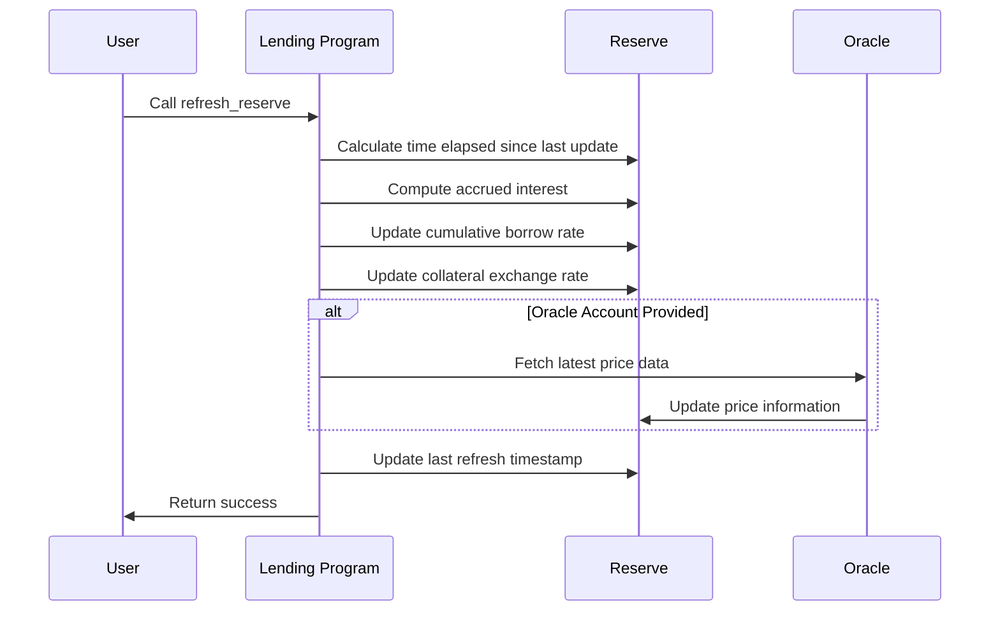

# Refresh Reserve

## Purpose

The `refresh_reserve` instruction updates a reserve's internal state by incorporating accrued interest, recalculating exchange rates, and optionally updating price information from external oracles. This instruction is critical for maintaining accurate accounting of protocol assets and ensuring that all subsequent operations use up-to-date values.

## Real-World Analogy

Refreshing a reserve is similar to a bank's end-of-day settlement process, where interest is calculated on all accounts and the bank's books are updated to reflect the new balances. In traditional finance, this process might happen once daily, but in DeFi, it must happen on-demand whenever the latest state is needed for operations.

## Required Accounts



| Account | Role | Signer | Writable |
|---------|------|--------|----------|
| `reserve` | Reserve to refresh | No | Yes |
| `reserve_liquidity_oracle` | Pyth/Switchboard price oracle for reserve | No | No |
| `clock` | Clock sysvar for timestamp | No | No |
| `switchboard_feed_account` | Optional Switchboard feed for direct lookup | No | No |

## Parameters

This instruction doesn't require any parameters beyond the provided accounts.

## Step-by-Step Process



1. **Time Calculation**:
   - Determine the time elapsed since the reserve was last refreshed
   - This period is used to calculate accrued interest

2. **Interest Accrual**:
   - Calculate the interest accrued on borrowed funds
   - Update the cumulative borrow rate
   - Update the total borrowed amount to include accrued interest

3. **Exchange Rate Update**:
   - Recalculate the collateral exchange rate based on new total liquidity
   - This rate determines how much underlying asset each collateral token is worth

4. **Oracle Update (Optional)**:
   - If oracle accounts are provided, fetch the latest price data
   - Update the reserve's price information for valuation calculations

5. **State Update**:
   - Update the reserve's last update timestamp
   - Store the new cumulative borrow rate and exchange rate values

## Detailed Calculations

### Interest Accrual

Interest accrues on the borrowed amount using the reserve's interest rate model:

```
Elapsed Slots = Current Slot - Last Update Slot
Slot Interest Rate = Borrow APY / SLOTS_PER_YEAR
Interest Factor = Slot Interest Rate * Elapsed Slots
New Total Borrows = Previous Total Borrows * (1 + Interest Factor)
Interest Accrued = New Total Borrows - Previous Total Borrows
```

The accrued interest increases the total borrowed amount.

### Cumulative Borrow Rate Update

The cumulative borrow rate tracks the total interest accumulated since the reserve's inception:

```
New Cumulative Rate = Previous Cumulative Rate * (1 + Interest Factor)
```

This rate is used to calculate the current value of outstanding borrows in obligations.

### Collateral Exchange Rate Calculation

The collateral exchange rate determines how much underlying asset each collateral token represents:

```
Total Liquidity = Available Liquidity + Total Borrows - Total Protocol Fees
If Collateral Supply > 0:
    Collateral Exchange Rate = Total Liquidity / Collateral Supply
Else:
    Collateral Exchange Rate = Initial Exchange Rate
```

#### Example Calculation

If:
- Available liquidity is 500,000 USDC
- Total borrows is 1,500,000 USDC
- Total protocol fees is 50,000 USDC
- Collateral supply is 1,900,000 cUSDC

Then:
```
Total Liquidity = 500,000 + 1,500,000 - 50,000 = 1,950,000 USDC
Collateral Exchange Rate = 1,950,000 / 1,900,000 ≈ 1.026
```

This means each cUSDC is worth 1.026 USDC.

## Oracle Price Update

If oracle accounts are provided, the reserve's price information is updated:

```
New Price = Oracle Price * Price Multiplier / Price Factor
```

The price is adjusted by the reserve's price multiplier/factor to account for decimals and other normalization.

## Constraints and Validations

- The reserve must be initialized
- Oracle accounts must match the reserve's expected oracles
- The time elapsed must not cause calculation overflows

## Error Cases

| Error | Condition |
|-------|-----------|
| `InvalidOracle` | The provided oracle doesn't match the reserve's oracle |
| `MathOverflow` | A calculation resulted in numeric overflow |
| `OracleError` | Failed to get valid price from oracle |

## Post-Refresh State

After a successful refresh:

- The reserve's borrow rate reflects current market conditions
- The cumulative borrow rate is updated for accurate obligation calculations
- The collateral exchange rate captures all interest accrued
- Price information is updated if oracles were provided
- The last update timestamp is set to the current time

## Performance Considerations

Refreshing a reserve is a computationally intensive operation:

1. It performs multiple floating-point calculations
2. It may involve oracle lookups which add complexity
3. It must happen frequently to maintain accurate state

The protocol is designed to minimize the impact by:
- Using efficient mathematical implementations
- Batching updates where possible
- Carefully timing refreshes to balance accuracy and cost

## Example Usage

In a client application, the refresh reserve instruction might be used like this:

```javascript
// Refresh USDC reserve with price update
const refreshInstruction = await kaminoLending.createRefreshReserveInstruction(
  usdcReserve.address,         // reserve to refresh
  usdcOracle.address           // price oracle
);

// Add to a transaction and execute
const transaction = new Transaction().add(refreshInstruction);
await sendAndConfirmTransaction(connection, transaction, []);

// Refresh multiple reserves in one transaction
const refreshInstructions = [
  await kaminoLending.createRefreshReserveInstruction(usdcReserve.address, usdcOracle.address),
  await kaminoLending.createRefreshReserveInstruction(solReserve.address, solOracle.address),
  await kaminoLending.createRefreshReserveInstruction(ethReserve.address, ethOracle.address)
];

const batchTransaction = new Transaction().add(...refreshInstructions);
await sendAndConfirmTransaction(connection, batchTransaction, []);
```

## Related Instructions

- [Deposit Reserve Liquidity](../user-deposit/deposit-reserve-liquidity.md): Requires up-to-date exchange rates
- [Borrow Obligation Liquidity](../user-borrow/borrow-obligation-liquidity.md): Needs current interest rates
- [Refresh Obligation](../user-borrow/refresh-obligation.md): Uses refreshed reserves for accurate valuation

## Special Considerations

### Refresh Before Operations

Most protocol operations require up-to-date reserves:

1. It's best practice to refresh reserves before any operation that depends on current values
2. This ensures the most accurate exchange rates and interest calculations
3. The protocol may enforce this requirement for certain instructions

### Oracle Dependency

When price oracles are refreshed:

1. The protocol's risk calculations depend on accurate price data
2. Oracle failures or stale prices can impact protocol operations
3. The protocol has fallback mechanisms for oracle issues

### Forced Refreshes

In some scenarios, refreshes are mandatory:

1. Before liquidations to ensure fair pricing
2. During emergency mode transitions
3. When certain protocol parameters are updated

### Gas Optimization

For gas efficiency:

1. Batch multiple reserve refreshes in a single transaction
2. Skip oracle updates if only interest calculations are needed
3. Consider the tradeoff between refresh frequency and precision

### Interest Rate Model Impact

The refresh process applies the reserve's interest rate model:

1. Different reserves may have different interest rate curves
2. Utilization rates directly affect borrowing costs
3. Interest rate jumps can occur at certain utilization thresholds
