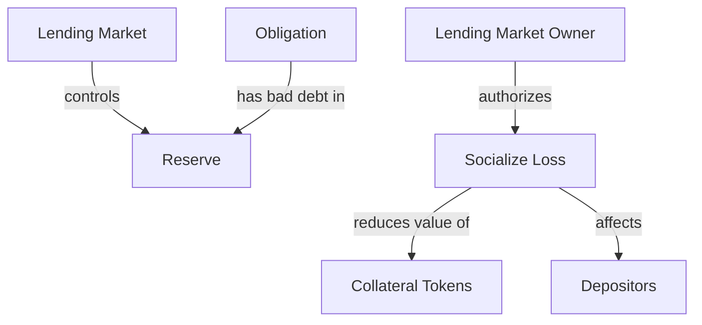
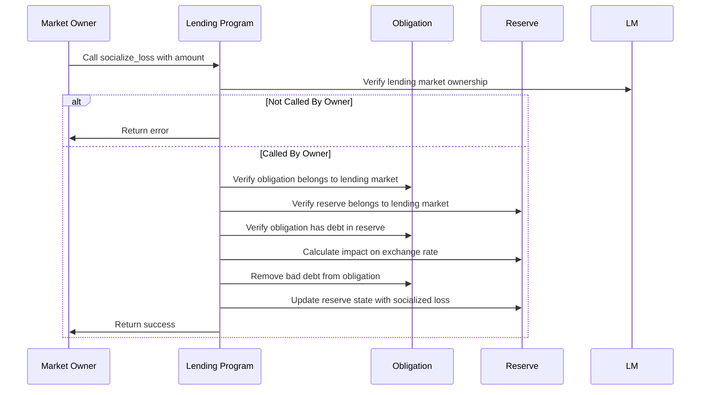

# Socialize Loss

## Purpose

The `socialize_loss` instruction is a critical recovery mechanism that allows the lending market owner to handle bad debt within the protocol. When borrowers default and liquidations cannot fully cover the debt due to extreme market conditions, this instruction distributes the remaining losses across all depositors in the affected reserve, ensuring protocol solvency and continued operation.

## Real-World Analogy

Socializing loss is similar to how deposit insurance funds or bank recovery mechanisms work in traditional finance. When a bank faces significant losses that exceed its capital reserves, regulators might implement a "bail-in" where depositors share a portion of the losses to keep the institution solvent. Similarly, in Kamino Lending, when liquidations cannot fully recover bad debt, the loss is distributed proportionally among all depositors in the affected reserve.

## Required Accounts



| Account | Role | Signer | Writable |
|---------|------|--------|----------|
| `lending_market` | Parent lending market | No | No |
| `lending_market_owner` | Owner of the lending market | Yes | No |
| `obligation` | Obligation with bad debt | No | Yes |
| `reserve` | Reserve to socialize losses | No | Yes |
| `obligation_liquidity` | Liquidity that will be written off | No | No |
| `clock` | Clock sysvar for timestamp | No | No |

## Parameters

| Parameter | Type | Description |
|-----------|------|-------------|
| `liquidity_amount` | `u64` | Amount of bad debt to socialize (in token amount) |

## Step-by-Step Process



1. **Account Validation**:
   - Verify the obligation and reserve belong to the specified lending market
   - Validate that the signer is the owner of the lending market
   - Confirm the obligation has outstanding debt in the specified reserve

2. **Amount Validation**:
   - Ensure the liquidity amount is not greater than the obligation's debt in the reserve
   - Validate that the reserve can absorb the loss without dropping below minimum requirements

3. **Obligation Update**:
   - Decrease the obligation's borrowed amount for the specified reserve
   - Recalculate the obligation's health factors

4. **Reserve Update**:
   - Decrease the reserve's total borrowed amount
   - Recalculate the reserve's exchange rate (LTokens to underlying)
   - Update the reserve's last update timestamp

## Loss Socialization Mechanism

When a loss is socialized, it affects all depositors proportionally:

### Exchange Rate Impact

```
// Current exchange rate
Current Rate = Liquidity / Collateral Tokens

// After socialization
New Rate = (Liquidity - Loss Amount) / Collateral Tokens
```

This means each collateral token (LToken) is now worth less of the underlying asset.

### Example Calculation

Assume a reserve with:
- 1,000,000 USDC liquidity
- 1,000,000 lUSDC collateral tokens
- Current exchange rate: 1 lUSDC = 1 USDC

After socializing 100,000 USDC of bad debt:
- Liquidity becomes 900,000 USDC
- Collateral tokens remain 1,000,000 lUSDC
- New exchange rate: 1 lUSDC = 0.9 USDC

Each depositor effectively loses 10% of their deposit value.

## Constraints and Validations

- The caller must be the lending market owner
- The obligation must have outstanding debt in the specified reserve
- The liquidity amount must be less than or equal to the obligation's debt
- The reserve must remain solvent after the socialization

## Error Cases

| Error | Condition |
|-------|-----------|
| `InvalidMarketOwner` | The signer is not the market owner |
| `InvalidObligationDebt` | The obligation doesn't have debt in the specified reserve |
| `InvalidSocializeAmount` | The amount exceeds the obligation's debt |
| `MathOverflow` | Calculation would result in numeric overflow |

## Post-Socialization Impact

After a successful loss socialization:

1. **Depositor Impact**:
   - All depositors see a reduction in the value of their deposits
   - The redemption rate for collateral tokens decreases
   - The loss is proportional to deposit size

2. **Obligation Impact**:
   - The bad debt is removed from the obligation
   - The obligation may become healthy again
   - The borrower effectively receives debt forgiveness

3. **Reserve Impact**:
   - Total borrows decrease by the socialized amount
   - The exchange rate between collateral tokens and underlying decreases
   - The reserve's utilization rate decreases

## Example Usage

In a client application, the socialize loss instruction might be used like this:

```javascript
// Socialize loss from an underwater obligation
const socializeLossInstruction = await kaminoLending.createSocializeLossInstruction(
  lendingMarket.address,          // parent lending market
  marketOwnerWallet.publicKey,    // lending market owner
  badDebtObligation.address,      // obligation with bad debt
  usdcReserve.address,            // reserve to socialize loss
  new BN(100000000)               // 100 USDC of bad debt (with 6 decimals)
);

// Add to a transaction and execute
const transaction = new Transaction().add(socializeLossInstruction);
await sendAndConfirmTransaction(connection, transaction, [marketOwnerWallet]);
```

## Related Instructions

- [Liquidate Obligation](../liquidation/liquidate-obligation.md): Used before socialization to recover maximum debt
- [Refresh Reserve](./refresh-reserve.md): Should be called before loss socialization
- [Refresh Obligation](../user-borrow/refresh-obligation.md): Updates obligation health metrics

## Protocol Health Management

### When to Socialize Losses

Loss socialization should be a last resort after:

1. **Full Liquidation**:
   - All possible collateral has been liquidated
   - Liquidation bonuses have been adjusted to attract liquidators
   - Multiple liquidation attempts have failed

2. **Market Recovery Waiting Period**:
   - Reasonable time allowed for market recovery
   - Oracle prices have stabilized
   - No prospect of debt recovery through market rebounds

3. **Risk Assessment**:
   - Bad debt amount threatens protocol solvency
   - Cost of carrying bad debt exceeds socialization impact
   - Transparent communication to depositors has occurred

### Minimizing Socialization Impact

Protocols should implement measures to reduce the need for socialization:

1. **Conservative LTV Ratios**: Setting lower initial LTV ratios
2. **Effective Liquidation Mechanisms**: Ensuring quick and efficient liquidations
3. **Insurance Funds**: Building reserves to cover potential bad debt
4. **Diversification**: Spreading risk across multiple reserves and asset types

## Special Considerations

### Governance Best Practices

For protocol governance:

1. **Transparency**: Clear communication about the bad debt and socialization need
2. **Voting**: Consider requiring governance votes for significant socializations
3. **Phased Approach**: Implement loss socialization in stages if possible
4. **Compensation Plans**: Consider future compensation for affected depositors

### Market Impact Management

Managing socialization announcements:

1. **Timing**: Choose announcement timing to minimize market impact
2. **Clear Messaging**: Explain the necessity and long-term benefits
3. **Future Prevention**: Outline steps to prevent future occurrences
4. **User Education**: Help users understand the implications

### Recovery Mechanisms

After socialization, protocols might implement:

1. **Repayment Plans**: Using future protocol revenue to repay depositors
2. **Tokenized Debt**: Issuing tokens representing the socialized debt
3. **Priority Returns**: Giving affected depositors priority in future profits
4. **Protocol Improvements**: Implementing better risk controls

### Emergency Mode Coordination

During extreme market conditions:

1. **Coordinated Response**: Sync socialization with emergency mode activation
2. **Paused Withdrawals**: Temporarily pause withdrawals during socialization
3. **Oracle Safeguards**: Ensure accurate pricing during socialization
4. **Recovery Planning**: Develop comprehensive recovery plan
