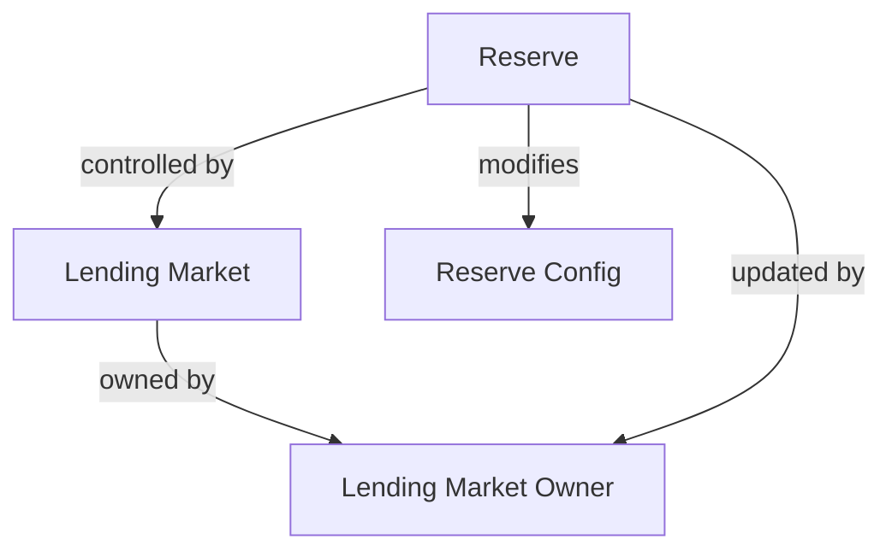
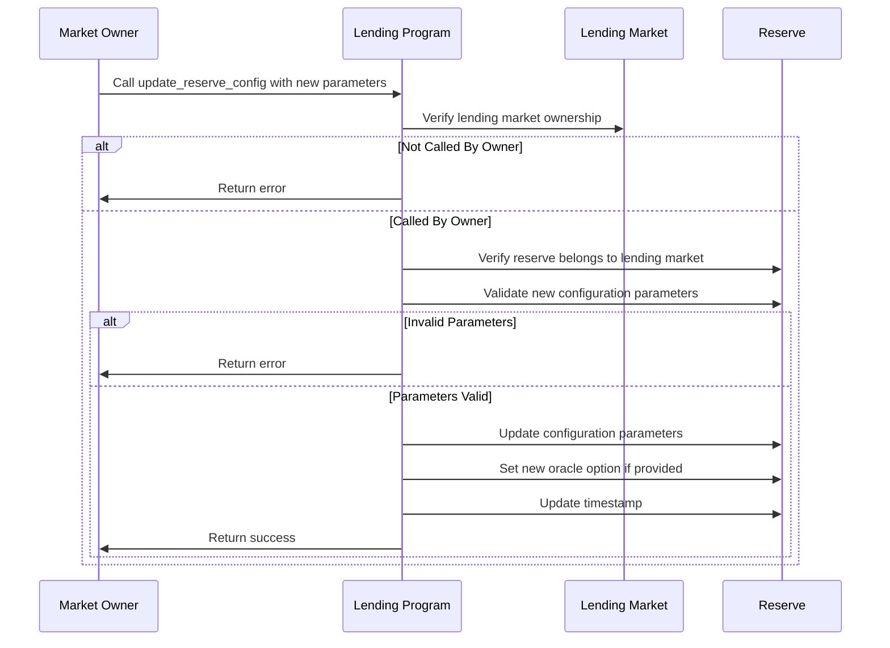
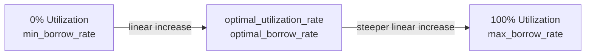

# Update Reserve Config

## Purpose

The `update_reserve_config` instruction allows the lending market owner to modify a reserve's configuration parameters. This powerful administrative function enables adjusting risk parameters, fee structures, and other settings to respond to market conditions or implement protocol governance decisions.

## Real-World Analogy

Updating a reserve's configuration is similar to a central bank adjusting monetary policy or a bank modifying its lending terms. For example, when economic conditions change, a bank might adjust interest rates, collateral requirements, or lending limits for certain asset classes. These policy changes allow the institution to manage risk and ensure stability in changing market environments.

## Required Accounts



| Account | Role | Signer | Writable |
|---------|------|--------|----------|
| `reserve` | Reserve to update | No | Yes |
| `lending_market` | Parent lending market | No | No |
| `lending_market_owner` | Owner of the lending market | Yes | No |
| `pyth_product` | Pyth product account (optional) | No | No |
| `pyth_price` | Pyth price account (optional) | No | No |
| `switchboard_feed` | Switchboard feed account (optional) | No | No |

## Parameters

| Parameter | Type | Description |
|-----------|------|-------------|
| `config` | `ReserveConfig` | The new configuration for the reserve |

The `ReserveConfig` structure contains numerous fields:

| Field | Type | Description |
|-------|------|-------------|
| `optimal_utilization_rate` | `u8` | Target utilization rate, as a percentage (0-100) |
| `loan_to_value_ratio` | `u8` | Maximum LTV ratio, as a percentage (0-100) |
| `liquidation_threshold` | `u8` | LTV at which liquidations begin, as a percentage (0-100) |
| `liquidation_bonus` | `u8` | Liquidation bonus, as a percentage (0-100) |
| `min_borrow_rate` | `u8` | Minimum interest rate when utilization is 0%, as a percentage |
| `optimal_borrow_rate` | `u8` | Interest rate at optimal utilization, as a percentage |
| `max_borrow_rate` | `u8` | Maximum interest rate when utilization is 100%, as a percentage |
| `fees` | `ReserveFees` | Fee structure for the reserve |
| `deposit_limit` | `u64` | Maximum amount of tokens allowed in the reserve |
| `borrow_limit` | `u64` | Maximum amount of tokens allowed to be borrowed |
| `fee_receiver` | `Pubkey` | Account that receives the reserve's fees |
| `protocol_liquidation_fee` | `u8` | Fee taken by the protocol on liquidations, as a percentage |
| `protocol_take_rate` | `u8` | Percentage of fees allocated to the protocol |
| `add_information` | `[u8; 32]` | Reserved bytes for future upgrades |
| `borrow_factor` | `u16` | Additional weight for borrow calculations (elevation groups) |
| `asset_tier` | `u8` | Tier classification of the asset (0-3) |
| `reserved` | `u8` | Reserved bytes for future upgrades |
| `deposit_withdrawal_cap` | `ReserveLimits` | Structure defining deposit withdrawal limits |
| `debt_withdrawal_cap` | `ReserveLimits` | Structure defining borrow withdrawal limits |
| `elevation_groups` | `ElevationGroupConfig` | Configuration for elevation groups |

## Step-by-Step Process



1. **Account Validation**:
   - Verify the reserve belongs to the specified lending market
   - Validate that the signer is the owner of the lending market
   - Check that all optional oracle accounts are valid if provided

2. **Parameter Validation**:
   - Ensure all percentage parameters are within valid ranges
   - Verify that liquidation_threshold ≥ loan_to_value_ratio
   - Validate interest rate model parameters (min ≤ optimal ≤ max)
   - Check that fee parameters are within allowed limits

3. **Configuration Update**:
   - Replace the reserve's current configuration with the new one
   - Update oracle information if new oracle accounts are provided
   - Update the last update timestamp for the reserve

## Parameter Details

### Interest Rate Model

The interest rate model determines borrowing costs based on utilization:

```
Utilization Rate = Total Borrows / Total Liquidity
```

Interest rates follow this model:
- At 0% utilization: `min_borrow_rate`
- At `optimal_utilization_rate`: `optimal_borrow_rate`
- At 100% utilization: `max_borrow_rate`
- Between these points: Linear interpolation



### Risk Parameters

Key risk parameters include:

- **Loan-to-Value (LTV) Ratio**: Maximum percentage of collateral value that can be borrowed
- **Liquidation Threshold**: When an obligation's LTV exceeds this, it becomes eligible for liquidation
- **Liquidation Bonus**: Extra collateral liquidators receive as incentive

These must satisfy: `liquidation_threshold ≥ loan_to_value_ratio`

### Fee Structure

The `ReserveFees` structure contains:

- `borrow_fee_wad`: Fee charged on borrows (in wad, 10^18)
- `flash_loan_fee_wad`: Fee charged on flash loans (in wad)
- `host_fee_percentage`: Percentage of fees allocated to frontend hosts

### Caps and Limits

- `deposit_limit`: Maximum tokens allowed in the reserve
- `borrow_limit`: Maximum tokens allowed to be borrowed
- `deposit_withdrawal_cap`: Rate-limiting for deposits/withdrawals
- `debt_withdrawal_cap`: Rate-limiting for borrows/repayments

## Constraints and Validations

- The caller must be the lending market owner
- All percentage parameters must be within valid ranges (0-100%)
- Liquidation threshold must be greater than or equal to LTV ratio
- Optimal borrow rate must be between min and max rates
- Fee parameters must be within allowed limits

## Error Cases

| Error | Condition |
|-------|-----------|
| `InvalidMarketOwner` | The signer is not the market owner |
| `InvalidAccountOwner` | The reserve is not owned by the program |
| `InvalidConfig` | Configuration parameters are invalid or inconsistent |
| `InvalidOracle` | Oracle accounts don't match expected types |

## Post-Update Impact

After a configuration update:

1. **Risk Management**:
   - Changed LTV ratio immediately affects borrowing capacity
   - Changed liquidation threshold affects liquidation eligibility
   - Changed liquidation bonus affects liquidation economics

2. **Interest Rates**:
   - New interest rate model applies to all future interest accruals
   - Doesn't retroactively change previously accrued interest
   - May cause immediate rate changes based on current utilization

3. **Limits and Caps**:
   - New deposit/borrow limits apply to future operations
   - Existing positions exceeding new limits are grandfathered in
   - Withdrawal caps affect the rate of deposits/withdrawals/borrows

## Example Usage

In a client application, the update reserve config instruction might be used like this:

```javascript
// Create new reserve configuration
const newConfig = {
  optimalUtilizationRate: 80,      // 80%
  loanToValueRatio: 75,            // 75%
  liquidationThreshold: 80,         // 80%
  liquidationBonus: 5,             // 5%
  minBorrowRate: 1,                // 1%
  optimalBorrowRate: 5,            // 5%
  maxBorrowRate: 30,               // 30%
  fees: {
    borrowFeeWad: new BN("10000000000000"),  // 0.001%
    flashLoanFeeWad: new BN("3000000000000000"),  // 0.3%
    hostFeePercentage: 20,         // 20%
  },
  depositLimit: new BN("10000000000000"),  // 10M USDC (with 6 decimals)
  borrowLimit: new BN("8000000000000"),    // 8M USDC
  feeReceiver: feeReceiverAddress,
  protocolLiquidationFee: 2,       // 2%
  protocolTakeRate: 20,            // 20%
  borrowFactor: 100,               // Standard weight
  assetTier: 1,                    // Tier 1 asset
};

// Update reserve configuration
const updateConfigInstruction = await kaminoLending.createUpdateReserveConfigInstruction(
  usdcReserve.address,             // reserve to update
  lendingMarket.address,           // parent lending market
  marketOwnerWallet.publicKey,     // lending market owner
  newConfig,                       // new configuration
  usdcPriceOracle.address          // price oracle (optional)
);

// Add to a transaction and execute
const transaction = new Transaction().add(updateConfigInstruction);
await sendAndConfirmTransaction(connection, transaction, [marketOwnerWallet]);
```

## Related Instructions

- [Init Reserve](./init-reserve.md): Creates a reserve with initial configuration
- [Refresh Reserve](./refresh-reserve.md): Updates reserve state with current interest/prices

## Special Considerations

### Economic Impact Assessment

Before updating parameters, consider the economic impact:

1. **Interest Rate Changes**:
   - How will users react to higher/lower rates?
   - What effect will this have on utilization?
   - Is there risk of deposit flight or liquidity crunch?

2. **Risk Parameter Adjustments**:
   - Will changing LTV trigger forced liquidations?
   - Does liquidation threshold provide sufficient safety margin?
   - Is liquidation bonus sufficient to incentivize liquidators?

3. **Fee Adjustments**:
   - Will fee changes affect protocol competitiveness?
   - How will revenue projections change?
   - Is fee distribution between protocol and hosts appropriate?

### Governance Best Practices

For protocol governance:

1. **Signaling Period**: Announce parameter changes before implementation
2. **Gradual Changes**: Make incremental changes to avoid market shocks
3. **Emergency Procedures**: Have special processes for emergency updates

### Market Condition Responsiveness

Parameters should adapt to market conditions:

1. **Volatile Assets**: Lower LTV and higher liquidation bonuses
2. **Stable Assets**: Higher LTV and lower liquidation bonuses
3. **Liquidity Adjustments**: Adjust interest model based on liquidity needs
4. **Risk Correlation**: Consider how assets correlate during market stress

### Oracle Considerations

When changing oracle sources:

1. **Price Continuity**: Ensure new oracle reports similar prices
2. **Feed Quality**: Validate oracle feed quality and reliability
3. **Fallback Mechanisms**: Implement fallbacks if oracle fails

### Reserve Parameter Harmonization

Consider how reserves interact within the ecosystem:

1. **Relative Parameters**: Set parameters relative to other assets
2. **Elevation Groups**: Ensure compatibility with elevation group strategies
3. **Ecosystem Impact**: Consider effects on other protocols using these assets
