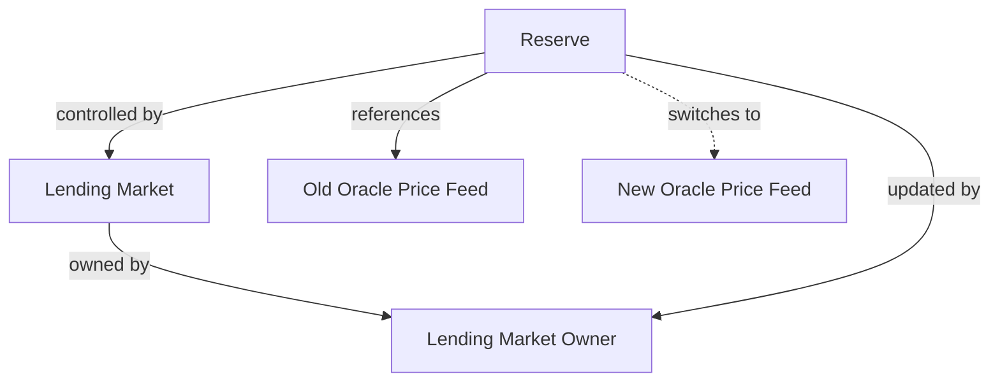
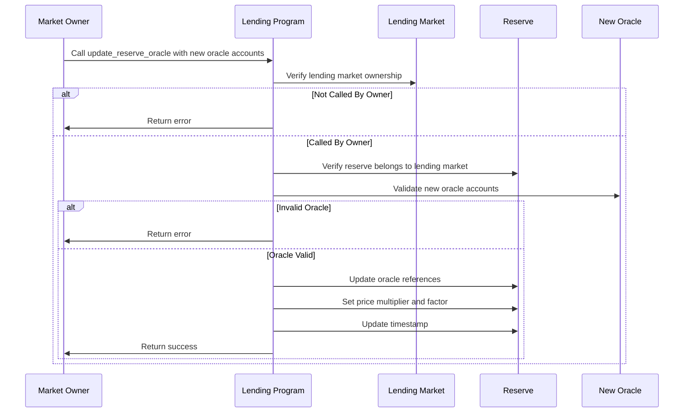

# Update Reserve Oracle

## Purpose

The `update_reserve_oracle` instruction allows the lending market owner to change the price oracle for a reserve. This operation is critical for maintaining accurate asset pricing within the protocol, especially when replacing deprecated oracles, improving price feed quality, or responding to oracle failures.

## Real-World Analogy

Updating a reserve's oracle is similar to a financial institution changing its data provider for market prices. For example, a bank might switch from one market data service to another if they find a provider with more accurate, reliable, or timely price data. This ensures that all loan collateralization and risk calculations are based on the most accurate market information available.

## Required Accounts



| Account | Role | Signer | Writable |
|---------|------|--------|----------|
| `reserve` | Reserve to update | No | Yes |
| `lending_market` | Parent lending market | No | No |
| `lending_market_owner` | Owner of the lending market | Yes | No |
| `pyth_product` | New Pyth product account (optional) | No | No |
| `pyth_price` | New Pyth price account (optional) | No | No |
| `switchboard_feed` | New Switchboard feed account (optional) | No | No |

## Parameters

| Parameter | Type | Description |
|-----------|------|-------------|
| `price_multiplier` | `u64` | Factor to multiply raw oracle price for scaling |
| `price_factor` | `u64` | Factor to divide by after multiplication for scaling |

## Step-by-Step Process



1. **Account Validation**:
   - Verify the reserve belongs to the specified lending market
   - Validate that the signer is the owner of the lending market
   - Check that at least one new oracle account is provided

2. **Oracle Validation**:
   - Validate that the provided oracle accounts match the expected types
   - Ensure the oracles contain valid price data
   - Verify compatibility with the reserve's asset

3. **Oracle Update**:
   - Replace the reserve's current oracle references with the new ones
   - Update the price multiplier and factor for scaling
   - Update the last update timestamp for the reserve

## Oracle Configuration Types

The protocol supports multiple oracle providers:

### 1. Pyth Oracle

Requires both a product and price account:
- `pyth_product`: Contains metadata about the price feed
- `pyth_price`: Contains the actual price data

### 2. Switchboard Oracle

Requires a single feed account:
- `switchboard_feed`: Contains the price data and metadata

### 3. Oracle Scaling

The raw oracle price is adjusted using:

```
Scaled Price = Raw Oracle Price * price_multiplier / price_factor
```

This allows normalizing prices from different sources or with different decimal precision.

## Oracle Selection Strategy

When multiple oracles are provided, the protocol follows this priority:

1. If valid Pyth accounts are provided, use Pyth as the primary oracle
2. If valid Switchboard account is provided, use it as fallback or primary if no Pyth
3. If both are provided, Pyth is primary with Switchboard as backup

## Constraints and Validations

- The caller must be the lending market owner
- At least one valid oracle account must be provided
- Price multiplier and factor must be non-zero
- The oracle must provide price data compatible with the reserve's asset

## Error Cases

| Error | Condition |
|-------|-----------|
| `InvalidMarketOwner` | The signer is not the market owner |
| `InvalidAccountOwner` | The reserve is not owned by the program |
| `InvalidOracle` | Oracle accounts don't match expected types |
| `MathOverflow` | Price scaling calculation would overflow |

## Post-Update Impact

After an oracle update:

1. **Immediate Price Effect**:
   - The reserve's reported asset price may change
   - This affects collateral values and borrow capacity calculations
   - May change health factors across multiple obligations

2. **Risk Adjustments**:
   - New oracle may have different update frequencies or precision
   - May affect liquidation triggers and timing
   - Could influence market stability and user behavior

3. **Operations**:
   - All future operations will use the new price feed
   - Historical price data from the old oracle is no longer referenced

## Example Usage

In a client application, the update reserve oracle instruction might be used like this:

```javascript
// Update reserve to use new Pyth oracle
const updateOracleInstruction = await kaminoLending.createUpdateReserveOracleInstruction(
  usdcReserve.address,             // reserve to update
  lendingMarket.address,           // parent lending market
  marketOwnerWallet.publicKey,     // lending market owner
  newPythProduct.publicKey,        // new Pyth product account
  newPythPrice.publicKey,          // new Pyth price account
  null,                            // no Switchboard feed
  new BN(1),                       // price multiplier
  new BN(1)                        // price factor
);

// Update reserve to use new Switchboard oracle
const updateSwitchboardInstruction = await kaminoLending.createUpdateReserveOracleInstruction(
  solReserve.address,              // reserve to update
  lendingMarket.address,           // parent lending market
  marketOwnerWallet.publicKey,     // lending market owner
  null,                            // no Pyth product
  null,                            // no Pyth price
  newSwitchboardFeed.publicKey,    // new Switchboard feed
  new BN(1),                       // price multiplier
  new BN(1)                        // price factor
);

// Add to transactions and execute
const transaction1 = new Transaction().add(updateOracleInstruction);
await sendAndConfirmTransaction(connection, transaction1, [marketOwnerWallet]);

const transaction2 = new Transaction().add(updateSwitchboardInstruction);
await sendAndConfirmTransaction(connection, transaction2, [marketOwnerWallet]);
```

## Related Instructions

- [Init Reserve](./init-reserve.md): Creates a reserve with initial oracle configuration
- [Refresh Reserve](./refresh-reserve.md): Updates reserve state with current price data

## Special Considerations

### Oracle Security

Oracles are critical security components:

1. **Price Manipulation Risk**: Oracles must be resistant to manipulation
2. **Decentralization**: Consider oracle decentralization and independence
3. **Verification Delays**: New oracles should be verified before deployment
4. **Failure Modes**: Understand how the oracle behaves during market disruptions

### Price Continuity

When switching oracles:

1. **Price Alignment**: Ensure new and old oracle report similar prices
2. **Transitional Period**: Consider a monitoring period before full switch
3. **Gradual Integration**: For critical assets, consider phased oracle updates

### Scaling Considerations

Price scaling parameters are powerful tools:

1. **Decimal Normalization**: Adjust for different decimal precision between oracles
2. **Asset Variations**: Handle pricing differences for wrapped vs. native assets
3. **Reference Currency**: Ensure consistent base currency (usually USD)

### Oracle Redundancy

Multiple oracle support enables redundancy strategies:

1. **Primary/Backup Model**: Set up failover between oracle providers
2. **Consensus Mechanism**: Create custom programs that aggregate multiple price sources
3. **TWAP Integration**: Consider time-weighted average prices for stability

### Special Asset Classes

Different assets may require specialized oracle approaches:

1. **Low-Liquidity Assets**: May need additional safety margins
2. **Synthetic Assets**: May require complex pricing mechanisms
3. **Pegged Assets**: May need monitoring for depeg events
4. **LP Tokens**: May require custom pricing logic

### Emergency Procedures

Have procedures for urgent oracle updates:

1. **Oracle Failure Response**: Define steps when an oracle fails
2. **Circuit Breakers**: Consider automatic pauses if prices move dramatically
3. **Manual Overrides**: Define governance process for emergency interventions
