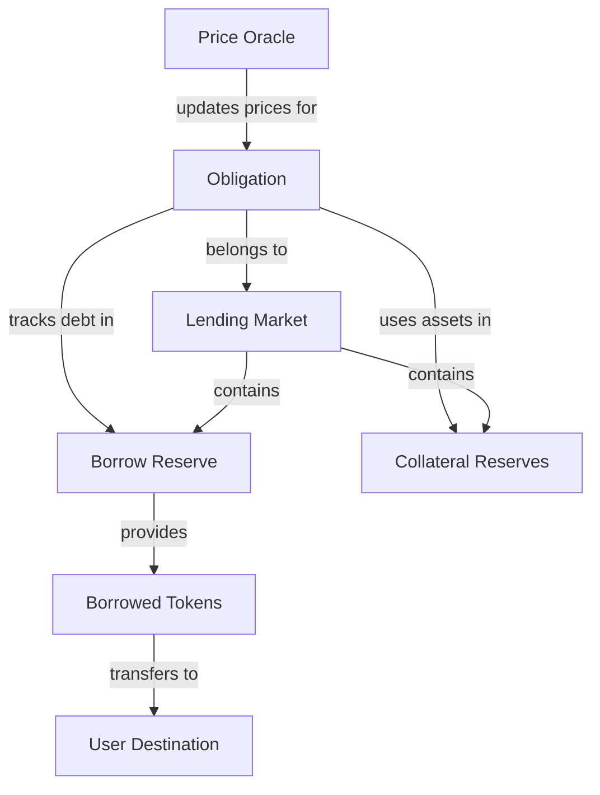
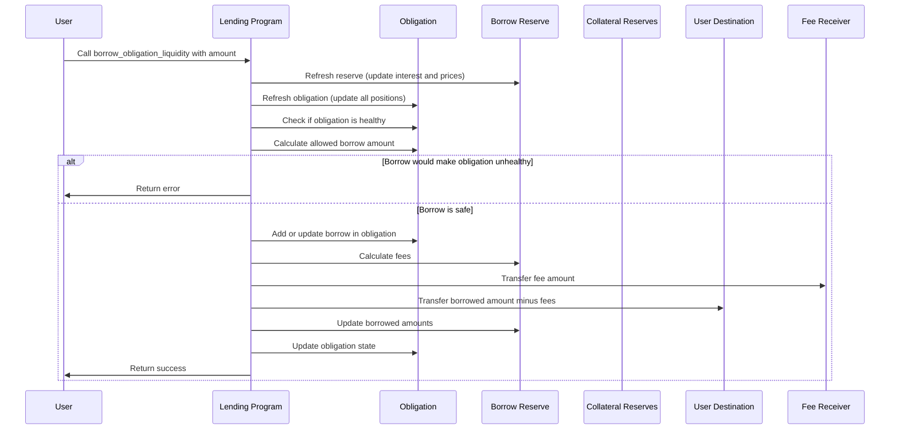

# Borrow Obligation Liquidity

## Purpose

The `borrow_obligation_liquidity` instruction allows users to borrow tokens from a reserve using their deposited collateral as security. This is one of the core features of the Kamino Lending protocol, enabling users to access liquidity without selling their assets.

## Real-World Analogy

Borrowing from the protocol is similar to taking out a collateralized loan from a bank. For example, when you get a mortgage, you put up your house as collateral and receive cash in return. You must pay interest on the loan and eventually repay it, or risk losing your collateral if you fail to maintain the required collateralization ratio.

In Kamino Lending:
- Your deposited assets (e.g., SOL or BTC) serve as collateral
- You borrow other assets (e.g., USDC) against this collateral
- You pay interest on the borrowed amount
- You must maintain a healthy loan-to-value ratio or risk liquidation

## Required Accounts



| Account | Role | Signer | Writable |
|---------|------|--------|----------|
| `source_borrow_reserve` | Reserve to borrow from | No | Yes |
| `source_borrow_reserve_liquidity_supply` | Liquidity supply for the reserve | No | Yes |
| `destination_liquidity` | User's account to receive borrowed tokens | No | Yes |
| `borrow_reserve_liquidity_fee_receiver` | Account that receives borrow fees | No | Yes |
| `obligation` | User's obligation (tracks loans and collateral) | No | Yes |
| `lending_market` | The lending market | No | No |
| `lending_market_authority` | Authority derived from the lending market | No | No |
| `obligation_owner` | Owner of the obligation | Yes | No |
| `clock` | Clock sysvar for timestamp | No | No |
| `token_program` | SPL Token program | No | No |

## Parameters

| Parameter | Type | Description |
|-----------|------|-------------|
| `liquidity_amount` | `u64` | The amount of tokens to borrow |

## Step-by-Step Process



1. **Account Validation**:
   - Verify all accounts are properly owned and initialized
   - Check that the reserve belongs to the specified lending market
   - Validate that the user is the owner of the obligation

2. **State Verification**:
   - Check that the lending market is not in emergency mode
   - Verify the market's `borrow_disabled` flag is not set
   - Ensure the reserve's `borrow_disabled` flag is not set
   - Check the obligation is not in a blacklisted state

3. **Reserve Refresh**:
   - Update the reserve's accumulated interest
   - Update collateral exchange rate
   - Validate and update oracle prices

4. **Obligation Refresh**:
   - Update all deposit values with current prices
   - Update all borrow values with accrued interest
   - Calculate current obligation health metrics

5. **Borrow Capacity Check**:
   - Calculate the maximum amount the user can borrow based on:
     - Current collateral value
     - Existing borrows
     - Loan-to-value ratios of all collateral assets
     - Any special elevation group parameters if applicable
   - Verify the requested amount is within this limit

6. **Fee Calculation**:
   - Calculate the borrow fee based on the reserve's fee configuration
   - Calculate host fee if applicable (for frontend integrations)

7. **Token Transfers**:
   - Transfer the fee amount to the fee receiver
   - Transfer the borrowed amount (minus fees) to the user's destination

8. **State Updates**:
   - Increase the reserve's borrowed liquidity by the full amount
   - Decrease the reserve's available liquidity by the full amount
   - Add or update the borrow in the obligation
   - Update the obligation's borrowed value
   - Store the current cumulative borrow rate for future interest calculation

## Detailed Calculations

### Borrowing Capacity

The maximum amount a user can borrow is calculated based on their deposited collateral:

```
Borrowing Capacity = Sum(Deposit Value * LTV) - Sum(Current Borrows)
```

Where:
- `Deposit Value` is the current market value of each deposited asset
- `LTV` is the loan-to-value ratio for each asset (e.g., 75% for SOL, 85% for USDC)
- `Current Borrows` is the current value of all existing borrows

#### Example Calculation

If:
- User has deposited 10 SOL worth $1,000 (LTV 75%)
- User has deposited 500 USDC worth $500 (LTV 85%)
- User already has borrowed 200 USDC

Then:
```
Borrowing Capacity = (1000 * 0.75 + 500 * 0.85) - 200
                    = (750 + 425) - 200
                    = 1175 - 200
                    = $975 worth of additional borrowing capacity
```

### Borrow Fee Calculation

The borrow fee is calculated as:

```
Borrow Fee = Borrow Amount * Borrow Fee Rate
```

Where:
- `Borrow Fee Rate` is specified in the reserve's configuration
- The fee is typically a small percentage (e.g., 0.1% to 0.5%)

If the fee is 0.3% and the borrow amount is 100 USDC, the fee would be 0.3 USDC.

### Interest Accrual

Interest begins accruing immediately on the borrowed amount:

1. The obligation stores the reserve's cumulative borrow rate at the time of borrowing
2. When the obligation is refreshed, it compares the current rate with the stored rate
3. The difference represents the accrued interest
4. The borrowed amount is increased accordingly

## Constraints and Validations

- The lending market must not be in emergency mode
- The reserve must not have borrowing disabled
- The lending market must not have borrowing disabled globally
- The borrow amount must be greater than zero
- The borrow must not cause the obligation to become unhealthy
- The borrow must not cause the reserve to exceed its borrow limit
- The user must be the owner of the obligation
- If using an elevation group, the borrow must conform to group restrictions

## Error Cases

| Error | Condition |
|-------|-----------|
| `MarketInEmergencyMode` | The lending market is in emergency mode |
| `BorrowsDisabled` | Borrowing is disabled for the reserve or market |
| `InvalidAmount` | The borrow amount is zero |
| `BorrowLimitExceeded` | The borrow would exceed the reserve's limit |
| `UnhealthyBorrow` | The borrow would make the obligation unhealthy |
| `InsufficientLiquidity` | The reserve doesn't have enough available liquidity |
| `TokenTransferFailed` | The token transfer to the user failed |
| `MathOverflow` | A calculation resulted in numeric overflow |

## Post-Borrow State

After a successful borrow:

- The user's liquidity token balance increases by the borrowed amount minus fees
- The reserve's available liquidity decreases by the borrowed amount
- The reserve's borrowed liquidity increases by the borrowed amount
- The obligation records a new borrow or updates an existing one
- The obligation stores the current cumulative borrow rate
- The fee receiver receives the borrow fee

## Interest Costs

The borrower starts paying interest immediately. Interest accrues continuously based on:

1. The reserve's current borrow rate, which depends on utilization
2. The time elapsed since the borrow
3. The borrowed amount

The interest is added to the borrowed amount and must be repaid along with the principal.

## Risk Considerations

When borrowing, users should consider:

- **Liquidation Risk**: If collateral value drops or borrow value increases, the position may become liquidatable
- **Interest Rate Risk**: Rates can increase based on market conditions and utilization
- **Oracle Risk**: Price feed issues can affect position valuation
- **Market Risk**: Volatility in collateral assets increases liquidation risk
- **Protocol Risk**: Smart contract vulnerabilities or exploits

## Example Usage

In a client application, the borrow instruction might be used like this:

```javascript
// Borrow 100 USDC against deposited collateral
const borrowInstruction = await kaminoLending.createBorrowObligationLiquidityInstruction(
  userWallet.publicKey,         // obligation owner
  userObligation.address,       // user's obligation
  usdcReserve.address,          // reserve to borrow from
  userUsdcAccount.address,      // destination for borrowed USDC
  new BN(100_000_000)           // 100 USDC (with 6 decimals)
);

// Add to a transaction and execute
const transaction = new Transaction().add(borrowInstruction);
await sendAndConfirmTransaction(connection, transaction, [userWallet]);
```

## Related Instructions

- [Initialize Obligation](./init-obligation.md): Create a new obligation
- [Deposit Reserve Liquidity and Obligation Collateral](../user-deposit/deposit-reserve-liquidity-and-obligation-collateral.md): Add collateral
- [Repay Obligation Liquidity](./repay-obligation-liquidity.md): Repay borrowed tokens
- [Refresh Obligation](./refresh-obligation.md): Update obligation with current values

## Special Considerations

- Borrowing from a reserve with high utilization will incur higher interest rates
- The first borrow in an obligation sets up the obligation's borrow structure
- Borrowing near the maximum capacity increases liquidation risk if prices fluctuate
- Elevation groups may provide special borrowing conditions, typically with higher LTV ratios for specific asset pairs
- The protocol may limit borrowing during market stress or volatility
