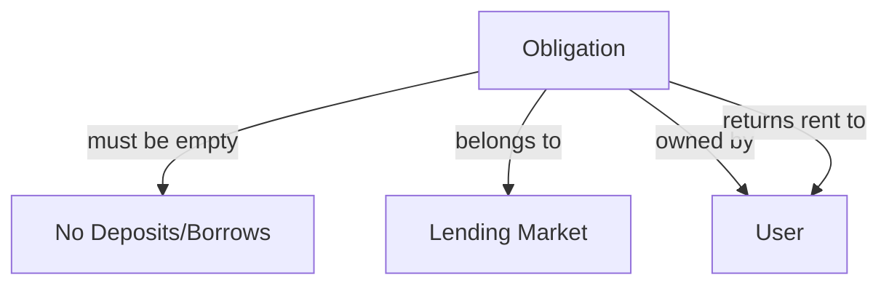
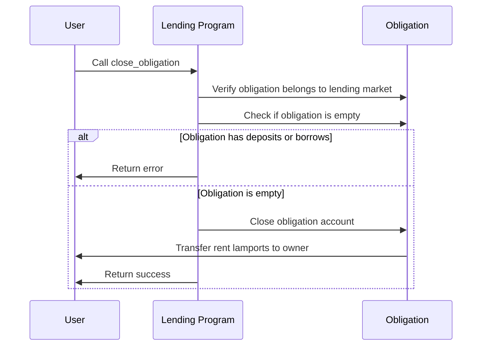

# Close Obligation

## Purpose

The `close_obligation` instruction allows users to close an obligation account when it no longer contains any deposits or borrows. This instruction recovers the rent lamports from the obligation account and returns them to the user. Closing unused obligations helps users reclaim their SOL and keeps the protocol state clean.

## Real-World Analogy

Closing an obligation is similar to closing an unused line of credit or margin account at a bank. Once you've repaid all loans and withdrawn all deposits, you can request to close the account to stop any ongoing fees and remove the relationship from the bank's records. The bank returns any security deposits or minimum balance requirements back to you.

## Required Accounts



| Account | Role | Signer | Writable |
|---------|------|--------|----------|
| `obligation` | Obligation account to close | No | Yes |
| `lending_market` | Parent lending market | No | No |
| `obligation_owner` | Owner of the obligation | Yes | Yes |

## Parameters

This instruction doesn't require any parameters beyond the provided accounts.

## Step-by-Step Process



1. **Account Validation**:
   - Verify the obligation belongs to the specified lending market
   - Validate that the owner account is a signer and matches the obligation's owner
   - Confirm the obligation has no deposits and no borrows

2. **Account Closure**:
   - Close the obligation account
   - Transfer all rent lamports to the obligation owner
   - Remove the obligation from the program's state

## Constraints and Validations

- The obligation must have zero deposits (deposits_count = 0)
- The obligation must have zero borrows (borrows_count = 0)
- The obligation owner must be the signer
- The obligation must belong to the specified lending market

## Error Cases

| Error | Condition |
|-------|-----------|
| `ObligationHasCollateral` | The obligation still has collateral deposits |
| `ObligationHasLoans` | The obligation still has outstanding borrows |
| `InvalidObligationOwner` | The signer is not the obligation owner |
| `InvalidAccountOwner` | The obligation is not owned by the program |

## Post-Closure State

After successful execution:
- The obligation account no longer exists
- The obligation owner receives the rent lamports
- The user's relationship with the lending market for this obligation is terminated

## Preparation Steps

Before closing an obligation, users need to:

1. **Repay All Borrows**:
   - Use `repay_obligation_liquidity` to fully repay any outstanding loans
   - Ensure the borrows_count is zero

2. **Withdraw All Collateral**:
   - Use `withdraw_obligation_collateral` to withdraw all deposited collateral
   - Ensure the deposits_count is zero

3. **Refresh Obligation**:
   - Use `refresh_obligation` to ensure all metrics are up-to-date
   - Verify that the obligation is truly empty

## Example Usage

In a client application, the close obligation instruction might be used like this:

```javascript
// First ensure the obligation has no deposits or borrows

// Create close obligation instruction
const closeObligationInstruction = await kaminoLending.createCloseObligationInstruction(
  userWallet.publicKey,      // obligation owner
  obligationAddress,         // obligation to close
  lendingMarket.address      // lending market
);

// Add to a transaction and execute
const transaction = new Transaction().add(closeObligationInstruction);
await sendAndConfirmTransaction(connection, transaction, [userWallet]);
```

## Related Instructions

- [Repay Obligation Liquidity](./repay-obligation-liquidity.md): Must be used to clear all borrows
- [Withdraw Obligation Collateral](../user-deposit/withdraw-obligation-collateral.md): Must be used to clear all deposits
- [Refresh Obligation](./refresh-obligation.md): Should be called before closing to ensure up-to-date state
- [Init Obligation](./init-obligation.md): The counterpart that creates an obligation

## Special Considerations

### Multiple Obligations Strategy

Users may maintain multiple obligations for different purposes:

1. **Risk Isolation**: Keeping risky assets separate from safer ones
2. **Strategy Separation**: Different obligations for different lending/borrowing strategies
3. **Elevation Groups**: Specialized obligations for specific elevation groups

When a specific strategy or use case is complete, closing the corresponding obligation recovers the rent.

### Rent Recovery

The amount of SOL recovered depends on:

1. The size of the obligation account
2. Current rent exemption rates
3. Any additional space allocated for future extensions

### Reopening Obligations

After closing an obligation:

1. The user can always create a new obligation later
2. New obligations start fresh with no history from previous obligations
3. New PDA derivation ensures unique obligations even for the same user/market

### Protocol Cleanup

Closing unused obligations helps the protocol by:

1. Reducing the total state stored on-chain
2. Improving the efficiency of protocol-wide operations
3. Ensuring accurate metrics for active users and positions

### Partial Exit Strategy

If a user wants to temporarily exit but may return:

1. They could keep the obligation open with minimal deposits
2. This avoids paying rent again when they return
3. However, this leaves funds locked in the protocol

For complete exit from the protocol, closing all obligations is recommended.

### Conditional Closures

Some advanced use cases might include:

1. Automated closure of obligations when certain conditions are met
2. Bulk closure of multiple obligations in a script
3. Integration with position management tools
