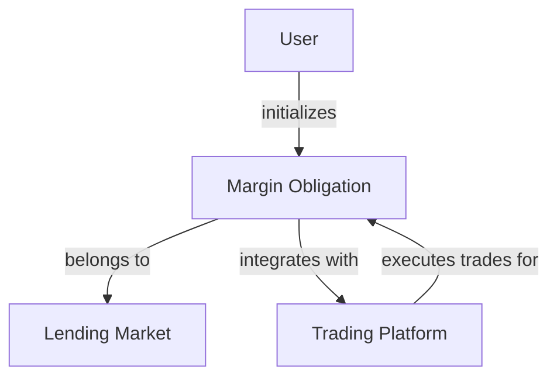
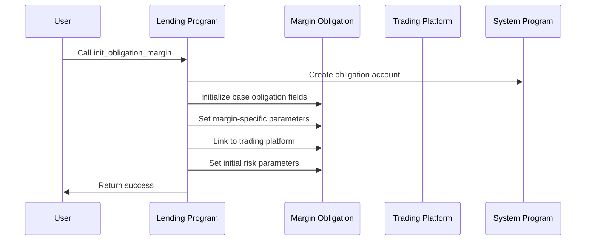
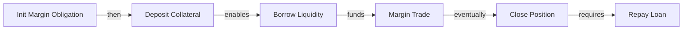

# Init Obligation Margin

## Purpose

The `init_obligation_margin` instruction creates a specialized obligation account designed for margin trading operations. Unlike standard obligations, margin obligations include additional parameters and integration points for trading platforms, enabling leveraged trading while utilizing Kamino Lending's liquidity. This instruction sets up the necessary account structure for users to engage in margin trading activities.

## Real-World Analogy

Creating a margin obligation is similar to opening a margin account with a brokerage firm. When you want to trade securities using borrowed funds, you need to specifically open a margin account that has different terms, requirements, and risk management compared to regular investment accounts. Similarly, in Kamino Lending, margin obligations have specialized parameters for managing leveraged trading positions.

## Required Accounts



| Account | Role | Signer | Writable |
|---------|------|--------|----------|
| `obligation` | New margin obligation to initialize | No | Yes |
| `lending_market` | Parent lending market | No | No |
| `obligation_owner` | Owner of the obligation | Yes | Yes |
| `clock` | Clock sysvar | No | No |
| `rent` | Rent sysvar | No | No |
| `system_program` | System program | No | No |
| `token_program` | SPL Token program | No | No |
| `trading_platform` | External trading platform integration | No | No |

## Parameters

| Parameter | Type | Description |
|-----------|------|-------------|
| `bump` | `u8` | Bump seed for obligation address derivation |
| `margin_account_type` | `u8` | Type of margin account (e.g., spot, perpetual) |

## Step-by-Step Process



1. **Account Creation**:
   - Create a new obligation account using the system program
   - Derive the address using the owner, lending market, and provided bump seed
   - Allocate space for both standard obligation data and margin-specific fields

2. **Basic Initialization**:
   - Set the version and lending market fields
   - Initialize empty deposits and borrows arrays
   - Set the owner to the provided obligation_owner
   - Set the last update timestamp to the current time

3. **Margin Configuration**:
   - Set the account as a margin type obligation
   - Configure the margin account type (spot, perpetual, etc.)
   - Link to the specified trading platform
   - Initialize margin-specific risk parameters and state

## Margin Obligation Data Structure

The margin obligation extends the standard obligation with additional fields:

```rust
pub struct MarginObligation {
    // Standard obligation fields
    pub version: u8,
    pub lending_market: Pubkey,
    pub owner: Pubkey,
    pub deposits: [ObligationCollateral; MAX_OBLIGATION_DEPOSITS],
    pub borrows: [ObligationLiquidity; MAX_OBLIGATION_BORROWS],
    pub deposited_value: Decimal,
    pub borrowed_value: Decimal,
    pub allowed_borrow_value: Decimal,
    pub unhealthy_borrow_value: Decimal,
    pub last_update: LastUpdate,
    
    // Margin-specific fields
    pub margin_account_type: u8,
    pub trading_platform: Pubkey,
    pub position_status: u8,
    pub risk_tier: u8,
    pub max_leverage: u16,
    pub margin_ratio: u16,
    pub maintenance_margin_ratio: u16,
    pub open_orders: [Pubkey; MAX_OPEN_ORDERS],
    pub reserved: [u8; 128],
}
```

Where:
- `margin_account_type`: Defines the type of margin trading (0=spot, 1=perpetual, etc.)
- `trading_platform`: Public key of the integrated trading platform
- `position_status`: Current status of margin positions (open, closing, liquidating)
- `risk_tier`: Risk classification for the margin account
- `max_leverage`: Maximum allowed leverage as a percentage multiplier
- `margin_ratio`: Required initial margin ratio
- `maintenance_margin_ratio`: Minimum margin ratio before liquidation
- `open_orders`: Array of open order accounts on the trading platform

## Constraints and Validations

- The lending market must be initialized
- The trading platform must be a valid registered integration
- The obligation account must not already exist
- The owner must sign the transaction
- The margin account type must be valid

## Error Cases

| Error | Condition |
|-------|-----------|
| `InvalidMarketState` | Lending market is not properly initialized |
| `InvalidTradingPlatform` | Trading platform is not registered or invalid |
| `AccountAlreadyExists` | Obligation account already exists |
| `InvalidMarginAccountType` | The specified margin account type is invalid |
| `InsufficientFunds` | The owner lacks funds to create the account |

## Post-Initialization State

After successful initialization:

1. **Account State**:
   - A new margin obligation account exists on-chain
   - The account is configured for the specified margin account type
   - The account has zero deposits and borrows
   - Initial risk parameters are set based on account type

2. **User Permissions**:
   - Only the owner can modify the obligation directly
   - Trading platform can execute trades on behalf of the obligation
   - Lending market can perform administrative functions

3. **Next Steps**:
   - User needs to deposit collateral (via deposit instructions)
   - User can then borrow assets for margin trading
   - Trading platform can execute trades using the borrowed liquidity

## Example Usage

In a client application, the init obligation margin instruction might be used like this:

```javascript
// Derive obligation address
const [obligationAddress, obligationBump] = await PublicKey.findProgramAddress(
  [
    Buffer.from("margin_obligation"),
    lendingMarket.toBuffer(),
    userWallet.publicKey.toBuffer(),
  ],
  kaminoLendingProgramId
);

// Create a new margin obligation
const initMarginObligationInstruction = await kaminoLending.createInitObligationMarginInstruction(
  obligationAddress,            // derived obligation address
  lendingMarket.address,        // parent lending market
  userWallet.publicKey,         // obligation owner
  tradingPlatform.address,      // integrated trading platform
  obligationBump,               // bump seed for address derivation
  0                             // margin account type (0 for spot trading)
);

// Add to a transaction and execute
const transaction = new Transaction().add(initMarginObligationInstruction);
await sendAndConfirmTransaction(connection, transaction, [userWallet]);
```

## Related Instructions

- [Init Obligation](./init-obligation.md): Creates a standard obligation (non-margin)
- [Deposit Reserve Liquidity And Obligation Collateral](../user-deposit/deposit-reserve-liquidity-and-obligation-collateral.md): Adds collateral to the obligation
- [Margin Trade](./margin-trade.md): Executes a leveraged trade using the margin obligation

## Margin Trading Workflow

The typical margin trading workflow includes:



1. Initialize margin obligation (this instruction)
2. Deposit collateral to secure the position
3. Borrow assets based on collateral value and leverage limits
4. Execute margin trades via the trading platform
5. Close positions and repay loans when done

## Risk Management

### Leverage and Risk Tiers

Margin obligations use risk tiers that define:

1. **Maximum Leverage**: How much borrowing power relative to collateral
2. **Initial Margin Ratio**: Required collateral percentage at position open
3. **Maintenance Margin Ratio**: Minimum collateral percentage to avoid liquidation

Risk tiers are assigned based on:
- Asset volatility and liquidity
- User trading history and account size
- Market conditions and platform policies

### Position Monitoring

Margin positions require active monitoring:

1. **Health Calculations**: More frequent updates than standard obligations
2. **Risk Indicators**: Additional metrics specific to trading positions
3. **Liquidation Process**: Specialized liquidation flow for margin positions

## Special Considerations

### Platform Integration

When implementing margin trading:

1. **Trading Platform Coordination**:
   - Ensure trading platform is compatible with the lending protocol
   - Validate permissions and access controls
   - Coordinate liquidation procedures between platforms

2. **Settlement Mechanisms**:
   - Define how trades settle against the margin obligation
   - Establish profit/loss accounting procedures
   - Create mechanisms for handling trading fees

### User Experience Design

For frontend developers:

1. **Risk Disclosure**: Clearly communicate margin trading risks
2. **Leverage Controls**: Provide intuitive leverage adjustment interfaces
3. **Position Monitoring**: Display real-time health metrics and warnings
4. **Liquidation Alerts**: Notify users of approaching liquidation thresholds

### Protocol Safety

For protocol administrators:

1. **Risk Parameters**: Configure conservative initial parameters
2. **Gradual Scaling**: Start with limited assets and leverage options
3. **Circuit Breakers**: Implement automatic trading halts during extreme volatility
4. **Stress Testing**: Regularly test margin systems with extreme scenarios
