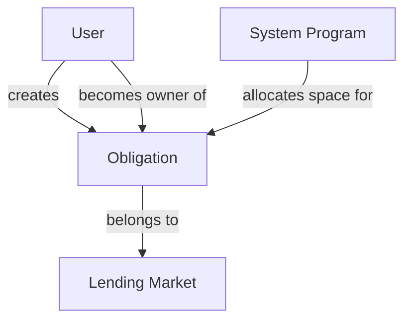
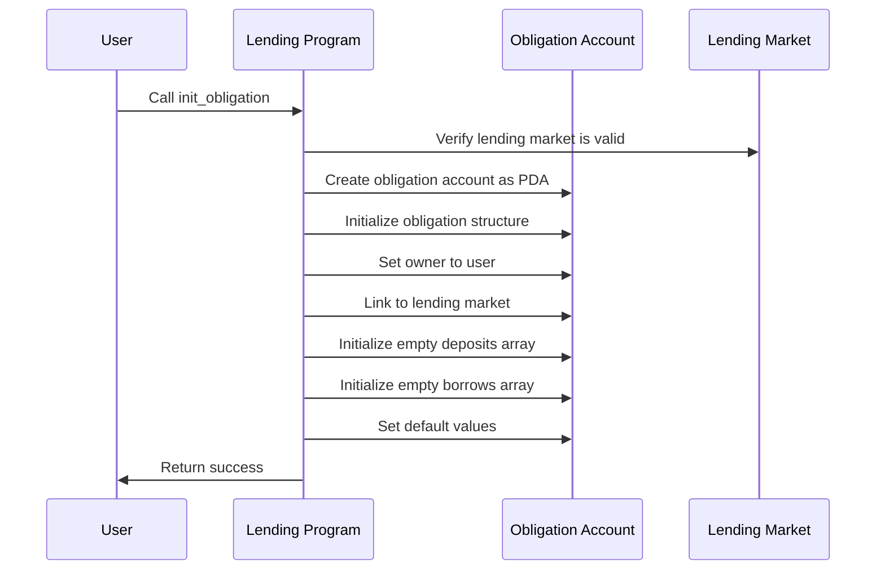

# Initialize Obligation

## Purpose

The `init_obligation` instruction creates a new obligation account for a user in the Kamino Lending protocol. An obligation is a data structure that tracks a user's deposits, borrows, and overall position health. This instruction is the first step for any user who wants to borrow assets or use the protocol's advanced features.

## Real-World Analogy

Initializing an obligation is similar to opening a line of credit or a margin account with a bank. When you open such an account, the bank creates a record to track what assets you deposit as collateral, how much you've borrowed, and the health of your position. This record doesn't contain any assets or debts initially—it's just the container that will hold this information as you make transactions.

## Required Accounts



| Account | Role | Signer | Writable |
|---------|------|--------|----------|
| `obligation` | New obligation account to initialize | No | Yes |
| `lending_market` | Parent lending market | No | No |
| `obligation_owner` | User who will own the obligation | Yes | No |
| `system_program` | System program | No | No |
| `rent` | Rent sysvar | No | No |

## Parameters

This instruction doesn't require any parameters beyond the provided accounts.

## Step-by-Step Process



1. **Account Validation**:
   - Verify the lending market is initialized and valid
   - Check that the obligation account is uninitialized
   - Validate that the owner account is a signer

2. **Account Creation**:
   - Create the obligation as a Program Derived Address (PDA)
   - Allocate the necessary space for the obligation data structure
   - Set the owner of the obligation to the provided signer

3. **Obligation Initialization**:
   - Initialize the obligation structure with its core fields
   - Set the version to the current protocol version
   - Link the obligation to the lending market
   - Create empty arrays for deposits and borrows
   - Initialize health metrics to default values
   - Set the last update timestamp

## Detailed Data Structure

The initialized obligation contains these core components:

### Core Fields
- `version`: Protocol version
- `last_update`: Timestamp of the last update
- `lending_market`: Public key of the lending market
- `owner`: Public key of the obligation owner
- `deposits_count`: Number of active deposits (initially 0)
- `borrows_count`: Number of active borrows (initially 0)

### Arrays
- `deposits`: Empty array that will store collateral deposits
- `borrows`: Empty array that will store borrowing positions

### Health Metrics
- `deposited_value`: Value of all deposits (initially 0)
- `borrowed_value`: Value of all borrows (initially 0)
- `allowed_borrow_value`: Maximum borrowing capacity (initially 0)
- `unhealthy_borrow_value`: Threshold for liquidation (initially 0)

### Special Settings
- `elevation_group`: Initially set to 0 (no elevation group)
- `revision`: Version tracking for the obligation structure
- `cached_cusps`: Reserved space for certain computations

## Constraints and Validations

- The lending market must be initialized
- The obligation account must be uninitialized
- The obligation owner must sign the transaction
- The obligation must be a valid PDA for the program

## Error Cases

| Error | Condition |
|-------|-----------|
| `InvalidMarketVersion` | The lending market has an incompatible version |
| `InvalidAccountOwner` | The obligation is owned by a different program |
| `InvalidAccountData` | The obligation account is already initialized |
| `InvalidSignatory` | The owner did not sign the transaction |

## Post-Initialization State

After successful execution, the obligation exists with:

- The specified owner having full control
- Linked to the specified lending market
- Empty arrays for deposits and borrows
- Zero values for all health metrics
- Ready to accept deposits and borrows

## Cost Considerations

Creating an obligation requires:

1. Rent for the obligation account (based on its size)
2. Transaction fee for the instruction
3. Compute units for processing the instruction

The user must have sufficient SOL to cover these costs.

## Example Usage

In a client application, the initialize obligation instruction might be used like this:

```javascript
// Generate a new obligation address
const [obligationAddress, obligationBump] = PublicKey.findProgramAddressSync(
  [
    Buffer.from("obligation"),
    lendingMarket.toBuffer(),
    userWallet.publicKey.toBuffer(),
  ],
  kaminoLendingProgramId
);

// Create initialize obligation instruction
const initObligationInstruction = await kaminoLending.createInitObligationInstruction(
  userWallet.publicKey,      // obligation owner
  obligationAddress,         // new obligation address
  lendingMarket.address      // lending market
);

// Add to a transaction and execute
const transaction = new Transaction().add(initObligationInstruction);
await sendAndConfirmTransaction(connection, transaction, [userWallet]);
```

## Related Instructions

- [Deposit Reserve Liquidity and Obligation Collateral](../user-deposit/deposit-reserve-liquidity-and-obligation-collateral.md): Add collateral to the obligation
- [Borrow Obligation Liquidity](./borrow-obligation-liquidity.md): Borrow against the obligation's collateral
- [Refresh Obligation](./refresh-obligation.md): Update the obligation's health metrics

## Special Considerations

### Multiple Obligations

A user can create multiple obligations:

1. Each obligation is a separate position with its own health metrics
2. Collateral and borrows in different obligations are not netted against each other
3. This enables strategies like isolating risky positions or managing different risk profiles

### Elevation Groups

After initialization, an obligation can be assigned to an elevation group:

1. Elevation groups may provide special borrowing conditions
2. They typically have higher LTV ratios for specific asset pairs
3. They restrict what assets can be used as collateral and borrowed
4. Assignment to an elevation group is done through a separate instruction

### Obligation Lifecycle

The typical lifecycle of an obligation is:

1. **Creation**: Initialize the obligation
2. **Building**: Add deposits and borrows
3. **Management**: Adjust positions, repay loans, withdraw collateral
4. **Closure**: Repay all borrows and withdraw all collateral

There is no explicit "close obligation" instruction. An obligation is effectively closed when it has no deposits or borrows.

### Security Implications

The obligation structure is critical for protocol security:

1. It enforces risk parameters like loan-to-value ratios
2. It ensures positions remain properly collateralized
3. It enables liquidations when positions become unhealthy
4. It isolates risk between different users

Creating an obligation is the entry point to these risk management systems.
