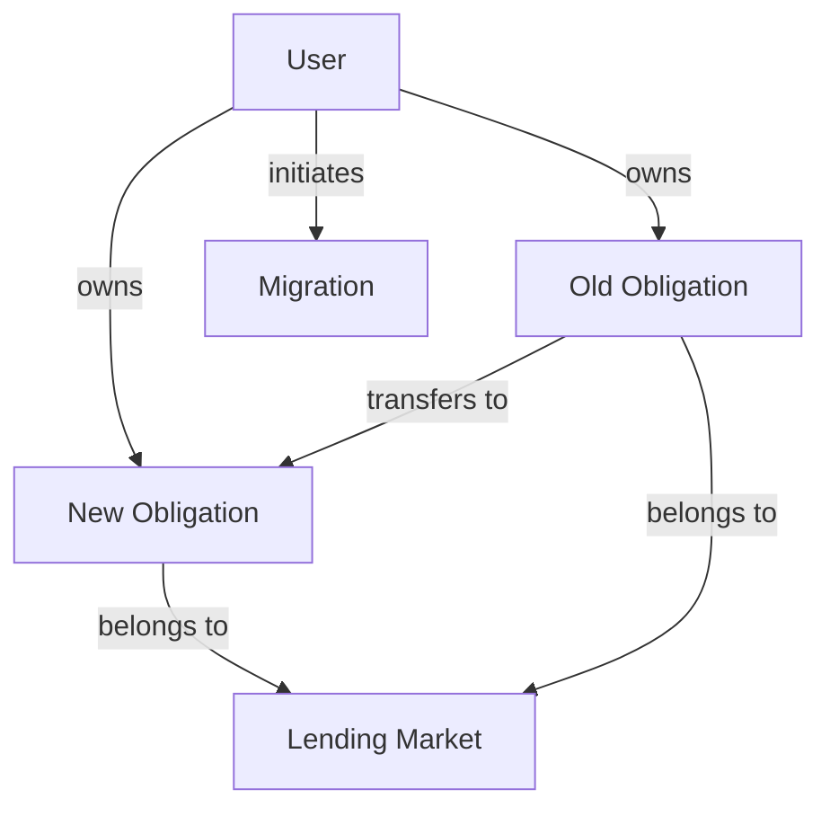
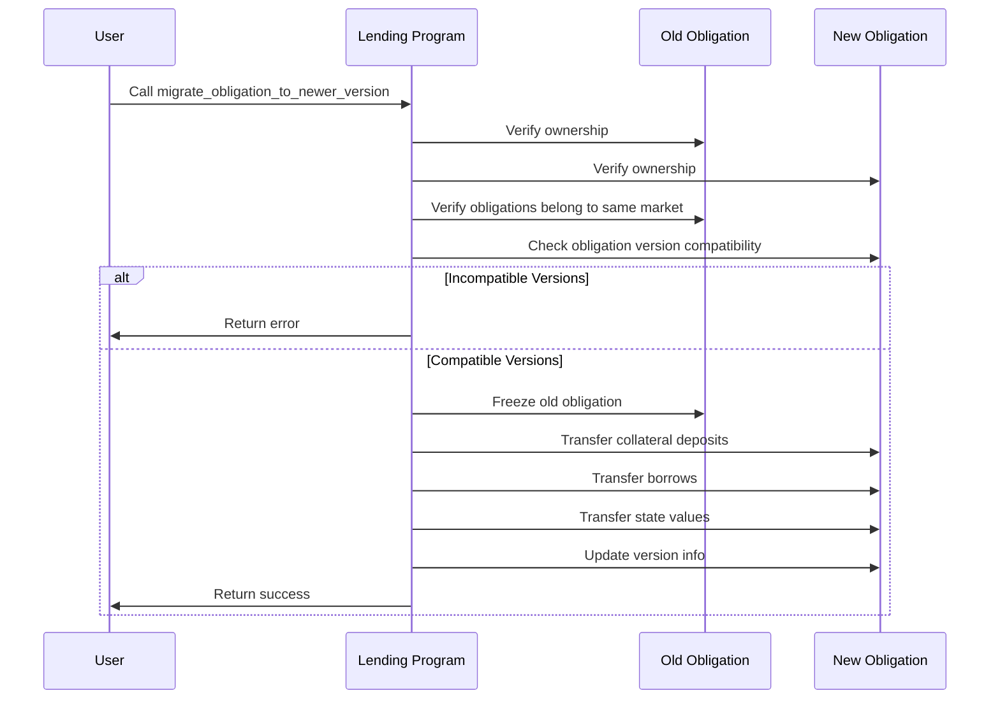
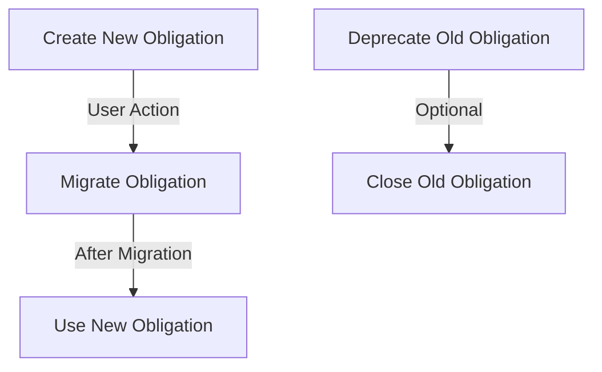
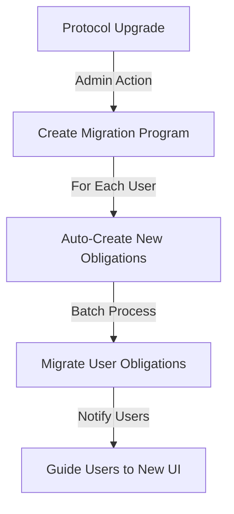

# Migrate Obligation to Newer Version

## Purpose

The `migrate_obligation_to_newer_version` instruction allows users to transfer their lending positions from an older version of the obligation account to a newer version. This enables the protocol to evolve with new features and improvements while allowing existing users to seamlessly transition without closing and reopening positions. Migration preserves all collateral deposits and borrows while adopting new data structures and capabilities.

## Real-World Analogy

Migrating an obligation is similar to a bank account upgrade process. When banks introduce new account types with improved features or better terms, they often offer existing customers the option to upgrade their accounts while preserving their balance, transaction history, and linked services. Similarly, Kamino Lending enables users to upgrade their obligation accounts to newer versions that support enhanced functionality without disrupting their active lending positions.

## Required Accounts



| Account | Role | Signer | Writable |
|---------|------|--------|----------|
| `old_obligation` | Source obligation account | No | Yes |
| `new_obligation` | Destination obligation account | No | Yes |
| `lending_market` | Parent lending market | No | No |
| `obligation_owner` | Owner of both obligations | Yes | No |
| `clock` | Clock sysvar | No | No |

## Parameters

This instruction doesn't require any parameters beyond the provided accounts.

## Step-by-Step Process



1. **Account Validation**:
   - Verify both obligations belong to the same owner
   - Confirm both obligations belong to the same lending market
   - Check that the new obligation has a newer version than the old one
   - Ensure the new obligation is empty (no existing deposits or borrows)

2. **State Migration**:
   - Freeze the old obligation to prevent further operations
   - Copy all collateral deposit entries to the new obligation
   - Copy all borrow entries to the new obligation
   - Transfer metadata like deposited value, borrowed value, etc.

3. **Version Update**:
   - Update the version number of the new obligation
   - Initialize any new fields with appropriate default values
   - Set the last update timestamp to the current time

## Version Compatibility

The protocol supports migration between specific version pairs:

| Old Version | New Version | Compatible | Notes |
|-------------|-------------|------------|-------|
| 1 | 2 | Yes | Base to enhanced data model |
| 2 | 3 | Yes | Enhanced to elevation-aware model |
| 1 | 3 | No | Must migrate to v2 first |

## Obligation Data Evolution

As obligations evolve through versions:

### Version 1 (Original)
```rust
pub struct ObligationV1 {
    pub version: u8,
    pub lending_market: Pubkey,
    pub owner: Pubkey,
    pub deposits: [ObligationCollateral; MAX_OBLIGATION_DEPOSITS],
    pub borrows: [ObligationLiquidity; MAX_OBLIGATION_BORROWS],
    pub deposited_value: Decimal,
    pub borrowed_value: Decimal,
    pub allowed_borrow_value: Decimal,
    pub unhealthy_borrow_value: Decimal,
    pub last_update: LastUpdate,
}
```

### Version 2 (Enhanced)
```rust
pub struct ObligationV2 {
    // All fields from V1
    pub version: u8,
    pub lending_market: Pubkey,
    // ...existing fields...
    
    // New fields
    pub obligation_type: u8,
    pub collateral_factor: u8,
}
```

### Version 3 (Elevation-Aware)
```rust
pub struct ObligationV3 {
    // All fields from V2
    pub version: u8,
    pub lending_market: Pubkey,
    // ...existing fields...
    
    // New fields
    pub elevation_group: u8,
    pub reserved_bytes_1: u8,
}
```

## Constraints and Validations

- Both obligations must belong to the same owner
- Both obligations must belong to the same lending market
- The new obligation must have a higher version number
- The new obligation must not have existing deposits or borrows
- The version pair must be compatible for migration
- The old obligation must not be in a locked state

## Error Cases

| Error | Condition |
|-------|-----------|
| `InvalidObligationOwner` | The signer doesn't own both obligations |
| `IncompatibleVersions` | The version pair isn't supported for direct migration |
| `ObligationNotEmpty` | The new obligation already has deposits or borrows |
| `ObligationLocked` | The old obligation is in a locked state |
| `MismatchedMarket` | The obligations belong to different lending markets |

## Post-Migration State

After successful migration:

1. **Old Obligation**:
   - Marked as migrated (frozen)
   - Remains on-chain for historical reference
   - Cannot be used for new operations

2. **New Obligation**:
   - Contains all deposits and borrows from old obligation
   - Has same collateral value and debt as old obligation
   - Features new fields and capabilities
   - Becomes the active obligation for future operations

3. **User Experience**:
   - Seamless transition with no position disruption
   - Access to new features and improvements
   - Same collateral and debt balances preserved

## Example Usage

In a client application, the migration instruction might be used like this:

```javascript
// Migrate user obligation from v1 to v2
const migrateObligationInstruction = await kaminoLending.createMigrateObligationToNewerVersionInstruction(
  oldObligationV1.address,      // old obligation (v1)
  newObligationV2.address,      // new obligation (v2)
  lendingMarket.address,        // parent lending market
  userWallet.publicKey          // owner of both obligations
);

// Add to a transaction and execute
const transaction = new Transaction().add(migrateObligationInstruction);
await sendAndConfirmTransaction(connection, transaction, [userWallet]);
```

## Migration Strategy

For protocol upgrades, there are multiple approaches:

### 1. User-Initiated Migration

Individual users migrate at their convenience:



### 2. Programmatic Migration

Protocol automates migration for users:



## Related Instructions

- [Init Obligation](./init-obligation.md): Creates a new obligation (required before migration)
- [Refresh Obligation](./refresh-obligation.md): Update obligation with current market data
- [Close Obligation](./close-obligation.md): Optionally close the old obligation after migration

## Special Considerations

### Data Preservation

Critical for successful migrations:

1. **Complete Transfer**: Ensure all position data is completely transferred
2. **Data Integrity**: Validate data consistency before and after migration
3. **State Verification**: Verify collateral and debt values match between versions
4. **History Preservation**: Consider how to maintain historical data

### User Experience Design

For frontend developers:

1. **Migration Prompts**: Create clear UX for prompting migration
2. **Progress Indicators**: Show migration status transparently
3. **Verification Step**: Allow users to verify positions post-migration
4. **Fallback Mechanisms**: Provide access to old positions if migration fails

### Protocol Administration

For protocol administrators:

1. **Version Support**: Clearly communicate which versions are supported
2. **Migration Windows**: Set reasonable timeframes for migration
3. **Incentives**: Consider offering incentives for early migration
4. **Monitoring**: Track migration progress and assist users as needed

### Security Considerations

When implementing migrations:

1. **Access Controls**: Verify ownership rigorously
2. **Migration Limits**: Consider rate-limiting migrations during peak times
3. **Testing**: Thoroughly test migration paths with real-world data
4. **Reversibility**: Have a plan for reversing migrations if issues arise
