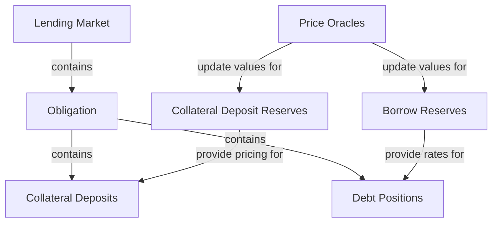
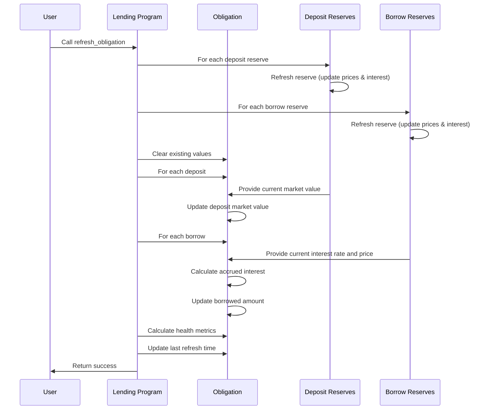

# Refresh Obligation

## Purpose

The `refresh_obligation` instruction updates an obligation with the current prices of all assets, accrued interest, and recalculates the obligation's health metrics. This instruction is a prerequisite for most user operations like borrowing, withdrawing collateral, or repaying debt, as it ensures decisions are made with the most up-to-date information.

## Real-World Analogy

Refreshing an obligation is similar to a bank recalculating your loan-to-value ratio before you request additional credit or attempt to withdraw equity. The bank checks current property values, updates your outstanding loan balance with accrued interest, and determines if your position is still within acceptable risk parameters.

## Required Accounts



| Account | Role | Signer | Writable |
|---------|------|--------|----------|
| `obligation` | Obligation to refresh | No | Yes |
| `lending_market` | Parent lending market | No | No |
| `0..N deposits` | All reserves used as collateral | No | No |
| `0..N borrows` | All reserves borrowed from | No | No |
| `clock` | Clock sysvar for timestamp | No | No |

## Parameters

This instruction does not require any parameters beyond the provided accounts.

## Step-by-Step Process



1. **Account Validation**:
   - Verify the obligation belongs to the specified lending market
   - Validate that all deposit and borrow reserves are provided

2. **Reserve Updates**:
   - For each deposit reserve, update prices and interest
   - For each borrow reserve, update prices and interest

3. **Deposit Value Updates**:
   - For each collateral deposit in the obligation:
     - Find the corresponding reserve in the provided accounts
     - Calculate current deposit value using updated prices
     - Update the deposit market value in the obligation

4. **Borrow Value Updates**:
   - For each borrow in the obligation:
     - Find the corresponding reserve in the provided accounts
     - Calculate accrued interest since last refresh
     - Update the borrowed amount to include accrued interest
     - Calculate current borrow value using updated prices
     - Update the borrow market value in the obligation

5. **Health Calculation**:
   - Calculate weighted collateral sum using liquidation thresholds
   - Calculate weighted borrow sum
   - Determine overall health metrics
   - Update health status flags if necessary

6. **State Updates**:
   - Update the obligation's last refresh timestamp
   - Store updated deposit and borrow values
   - Store updated health metrics

## Detailed Calculations

### Interest Accrual

Interest accrual for each borrow is calculated as:

```
New Borrowed Amount = Initial Borrowed Amount * (Current Cumulative Rate / Initial Cumulative Rate)
```

Where:
- `Initial Borrowed Amount` is the amount recorded when the borrow was created or last refreshed
- `Initial Cumulative Rate` is the cumulative interest rate at the time of borrowing or last refresh
- `Current Cumulative Rate` is the reserve's current cumulative interest rate

#### Example Calculation

If:
- Initial borrowed amount was 100 USDC
- Initial cumulative rate was 1.20 (representing 20% interest since protocol inception)
- Current cumulative rate is 1.25 (representing 25% interest since protocol inception)

Then:
```
New Borrowed Amount = 100 * (1.25 / 1.20)
                    = 100 * 1.0416
                    = 104.16 USDC
```

The borrowed amount has increased by 4.16 USDC due to accrued interest.

### Health Factor Calculation

The health factor is calculated as:

```
Health Factor = Weighted Collateral Sum / Borrowed Value
```

Where:
- `Weighted Collateral Sum` is the sum of all deposits multiplied by their liquidation thresholds
- `Borrowed Value` is the sum of all borrows at current prices

#### Example Calculation

If:
- User has deposited 10 SOL worth $1,000 with 80% liquidation threshold
- User has deposited 500 USDC worth $500 with 90% liquidation threshold
- User has borrowed 600 USDC worth $600

Then:
```
Weighted Collateral Sum = (1000 * 0.80) + (500 * 0.90)
                        = 800 + 450
                        = $1,250

Health Factor = 1250 / 600
              = 2.08
```

A health factor above 1.0 indicates the position is healthy.

## Constraints and Validations

- All reserves used in the obligation must be provided to the instruction
- The obligation must belong to the specified lending market
- The provided reserves must match those in the obligation's deposits and borrows

## Error Cases

| Error | Condition |
|-------|-----------|
| `InvalidObligationOwner` | The obligation doesn't belong to the lending market |
| `InvalidAccountInput` | A required reserve account is missing |
| `InvalidOracleConfig` | An oracle price feed is invalid or stale |
| `MathOverflow` | A calculation resulted in numeric overflow |

## Post-Refresh State

After a successful refresh:

- All deposits have updated market values based on current prices
- All borrows include accrued interest and updated market values
- The obligation's health metrics are recalculated
- The last refresh timestamp is updated

## Triggering Events

Refresh obligation is triggered:

1. **Automatically** as part of other instructions:
   - When borrowing
   - When withdrawing collateral
   - When repaying debt
   - When liquidating an unhealthy position

2. **Manually** in specific cases:
   - To check current health metrics
   - To view accrued interest
   - Before executing sensitive operations

## Example Usage

In a client application, the refresh obligation instruction might be used like this:

```javascript
// Get all deposit and borrow reserves for the obligation
const depositReserves = await kaminoLending.getObligationDepositReserves(userObligation);
const borrowReserves = await kaminoLending.getObligationBorrowReserves(userObligation);

// Create refresh obligation instruction
const refreshInstruction = await kaminoLending.createRefreshObligationInstruction(
  userObligation.address,
  depositReserves.map(r => r.address),
  borrowReserves.map(r => r.address)
);

// Add to a transaction and execute
const transaction = new Transaction().add(refreshInstruction);
await sendAndConfirmTransaction(connection, transaction, [userWallet]);
```

## Related Instructions

- [Borrow Obligation Liquidity](./borrow-obligation-liquidity.md): Requires a refreshed obligation
- [Withdraw Obligation Collateral](../user-deposit/withdraw-obligation-collateral.md): Requires a refreshed obligation
- [Repay Obligation Liquidity](./repay-obligation-liquidity.md): Benefits from a refreshed obligation
- [Liquidate Obligation](../liquidation/liquidate-obligation.md): Requires a refreshed obligation

## Special Considerations

### Oracle Dependency

The refresh operation depends heavily on price oracles:

- Invalid or stale oracle prices can cause refresh to fail
- Oracle confidence intervals may affect price calculations
- Multiple oracle sources may be used for redundancy

### Performance Considerations

- Refreshing obligations with many deposits and borrows is more computationally expensive
- Transaction size increases with the number of reserves
- Large obligations may hit transaction size limits

### Refresh Frequency

- Obligations are not automatically refreshed by the protocol over time
- Interest continues to accrue whether or not an obligation is refreshed
- More frequent refreshes provide more accurate health metrics

### Interest Compounding

- Each refresh compounds the accrued interest
- Interest is not actually added to the borrowed amount until refresh occurs
- However, the protocol tracks the actual amount owed regardless of refresh timing
