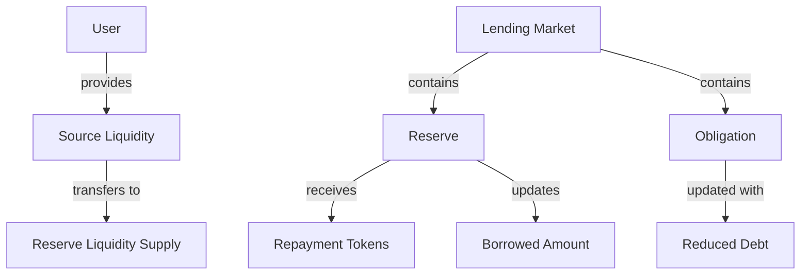
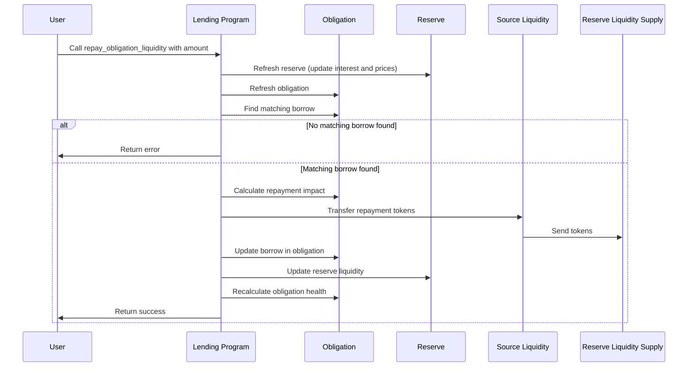

# Repay Obligation Liquidity

## Purpose

The `repay_obligation_liquidity` instruction allows users to repay borrowed assets to a reserve, reducing their debt in the protocol. This operation reduces the user's outstanding debt, increases their borrowing capacity, and improves their obligation health factor.

## Real-World Analogy

Repaying obligation liquidity is similar to making a payment on a loan. When you make a payment to your mortgage or credit card, you reduce your outstanding debt, decrease your interest costs, and free up your borrowing capacity. The principal portion of your payment goes to reducing the loan balance, while any interest that has accrued is paid first.

## Required Accounts



| Account | Role | Signer | Writable |
|---------|------|--------|----------|
| `source_liquidity` | User's token account for repayment | No | Yes |
| `destination_borrow_reserve` | Reserve with the borrowed liquidity | No | Yes |
| `destination_borrow_reserve_liquidity_supply` | Reserve's liquidity supply account | No | Yes |
| `obligation` | User's obligation to update | No | Yes |
| `lending_market` | Parent lending market | No | No |
| `lending_market_authority` | Authority derived from the lending market | No | No |
| `user_transfer_authority` | Authority over the source liquidity | Yes | No |
| `clock` | Clock sysvar for timestamp | No | No |
| `token_program` | SPL Token program | No | No |

## Parameters

| Parameter | Type | Description |
|-----------|------|-------------|
| `liquidity_amount` | `u64` | The amount of tokens to repay |

## Step-by-Step Process



1. **Account Validation**:
   - Verify the obligation belongs to the specified lending market
   - Validate that the user has authority over the source liquidity
   - Check that the reserve belongs to the lending market

2. **Reserve Refresh**:
   - Update the reserve's accumulated interest
   - Update collateral exchange rate
   - Validate oracle prices if necessary

3. **Obligation Refresh**:
   - Update all deposit values with current prices
   - Update all borrow values with accrued interest
   - Calculate current obligation health metrics

4. **Find Matching Borrow**:
   - Locate the borrow in the obligation that matches the repay reserve
   - If no matching borrow is found, return an error

5. **Repayment Amount Validation**:
   - If repayment amount is u64::MAX, set to full borrow amount
   - Otherwise, ensure repayment amount doesn't exceed borrow amount
   - Calculate actual repayment amount including accrued interest

6. **Token Transfer**:
   - Transfer the repayment amount from user to reserve
   - Increase reserve's available liquidity
   - Decrease reserve's borrowed liquidity

7. **Update Obligation**:
   - Decrease the borrow amount
   - If borrow is fully repaid, remove it from the borrows array
   - Recalculate obligation health metrics
   - Update obligation's last refresh timestamp

## Detailed Calculations

### Determining Repayment Amount

If the user specifies the maximum amount (u64::MAX), the instruction will repay the entire outstanding debt:

```
Repayment Amount = Borrowed Amount
```

Otherwise, the repayment amount is capped at the current borrowed amount:

```
Repayment Amount = min(Requested Amount, Borrowed Amount)
```

### Interest Settlement

When repaying, accrued interest is settled first:

```
Principal Repayment = Repayment Amount - Accrued Interest
```

If repaying partially, the remaining borrowed amount is:

```
New Borrowed Amount = Previous Borrowed Amount - Principal Repayment
```

### Reserve Liquidity Updates

The reserve's liquidity is updated as follows:

```
New Available Liquidity = Previous Available Liquidity + Repayment Amount
New Borrowed Liquidity = Previous Borrowed Liquidity - Repayment Amount
```

#### Example Calculation

If:
- User had borrowed 100 USDC
- Interest accrued is 5 USDC
- Total outstanding debt is 105 USDC
- User repays 60 USDC

Then:
```
Interest Settled = 5 USDC (fully paid)
Principal Repayment = 60 - 5 = 55 USDC
New Borrowed Amount = 100 - 55 = 45 USDC
```

After repayment:
- Reserve's available liquidity increases by 60 USDC
- Reserve's borrowed liquidity decreases by 60 USDC
- User's obligation shows 45 USDC remaining borrowed principal

## Constraints and Validations

- The repayment amount must be greater than zero
- The obligation must have an existing borrow from the repay reserve
- The user must have sufficient liquidity tokens for the repayment
- The user must have authority over the source liquidity account

## Error Cases

| Error | Condition |
|-------|-----------|
| `InvalidAmount` | The repayment amount is zero |
| `BorrowNotFound` | No matching borrow found in the obligation |
| `InsufficientLiquidity` | The user doesn't have enough tokens to repay |
| `TokenTransferFailed` | The token transfer to the reserve failed |
| `MathOverflow` | A calculation resulted in numeric overflow |

## Post-Repayment State

After a successful repayment:

- The user's liquidity token balance decreases by the repayment amount
- The reserve's available liquidity increases by the repayment amount
- The reserve's borrowed liquidity decreases by the repayment amount
- The obligation's borrow amount decreases (or is removed if fully repaid)
- The obligation's health factor improves

## Impact on Borrow Capacity

Repaying debt directly increases borrowing capacity:

1. Reduced debt means lower required collateral
2. The same collateral can now support additional borrowing
3. Lowers the risk of liquidation
4. May reduce interest expenses if the reserve has a high utilization rate

## Example Usage

In a client application, the repay instruction might be used like this:

```javascript
// Repay 50 USDC to the USDC reserve
const repayInstruction = await kaminoLending.createRepayObligationLiquidityInstruction(
  userWallet.publicKey,         // user making the repayment
  userUsdcAccount.address,      // source of USDC tokens
  userObligation.address,       // user's obligation
  usdcReserve.address,          // USDC reserve
  new BN(50_000_000)            // 50 USDC (with 6 decimals)
);

// To repay the full amount, use u64::MAX
const repayFullInstruction = await kaminoLending.createRepayObligationLiquidityInstruction(
  userWallet.publicKey,
  userUsdcAccount.address,
  userObligation.address,
  usdcReserve.address,
  new BN("18446744073709551615")  // u64::MAX
);

// Add to a transaction and execute
const transaction = new Transaction().add(repayInstruction);
await sendAndConfirmTransaction(connection, transaction, [userWallet]);
```

## Related Instructions

- [Borrow Obligation Liquidity](./borrow-obligation-liquidity.md): Creates the debt that needs repayment
- [Refresh Obligation](./refresh-obligation.md): Updates obligation with current interest before repayment
- [Withdraw Obligation Collateral](../user-deposit/withdraw-obligation-collateral.md): Often performed after repaying debt

## Special Considerations

### Full Repayment

When a borrow is fully repaid, the protocol performs additional cleanup:

1. The borrow is completely removed from the obligation's borrows array
2. This reduces the obligation's storage size and complexity
3. If it was the last borrow, the obligation becomes debt-free

### Interest Accrual

Interest accrues continuously, so the actual repayment amount needed to fully repay a loan increases over time:

1. When using a fixed amount, it's possible the debt will still have a small remainder
2. Using u64::MAX ensures complete repayment by calculating the exact current debt

### Emergency Mode

Repayment is typically still allowed even when the protocol is in emergency mode:

1. Risk reduction operations are prioritized during emergencies
2. Allowing repayments reduces protocol risk
3. Other operations like borrowing may be disabled

### Protocol Revenue

Interest payments on repaid debt contribute to protocol revenue:

1. Part of the interest goes to depositors
2. Part may go to the protocol treasury
3. Part may go to referrers or frontend integrators

This makes repayments important for the overall protocol economics and sustainability.
