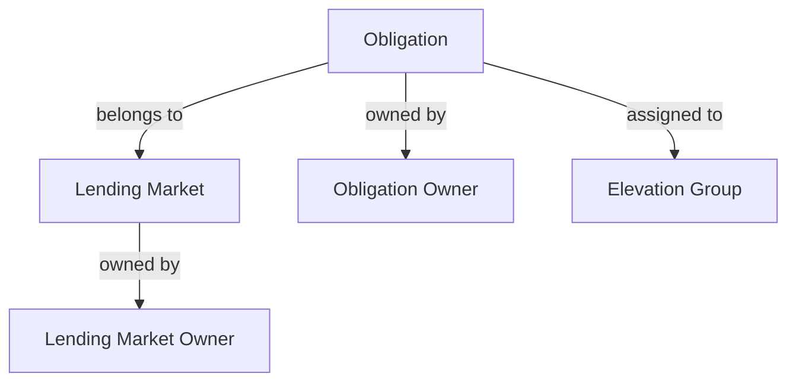
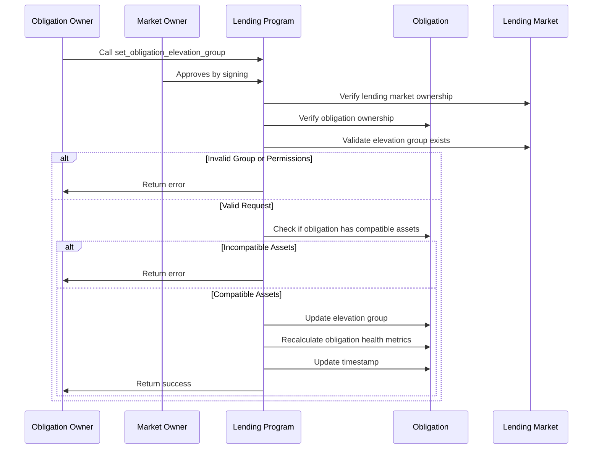

# Set Obligation Elevation Group

## Purpose

The `set_obligation_elevation_group` instruction assigns an obligation to a specific elevation group or removes it from its current group. Elevation groups are specialized borrowing environments that provide preferential loan-to-value ratios for specific asset pairs, enabling more capital-efficient borrowing for certain strategies while applying appropriate risk controls.

## Real-World Analogy

Elevation groups are similar to specialized lending programs in traditional finance. For example, a bank might offer a preferential mortgage rate if you maintain other accounts with them, or provide better terms for specific types of business loans in certain industries. These programs have stricter qualification requirements but offer better terms for customers who meet the criteria.

In Kamino Lending:
- Elevation groups provide better borrowing terms for specific strategies
- They implement tighter restrictions on which assets can be used
- They create specialized "lanes" for different borrowing purposes

## Required Accounts



| Account | Role | Signer | Writable |
|---------|------|--------|----------|
| `obligation` | Obligation to modify | No | Yes |
| `lending_market` | Parent lending market | No | No |
| `obligation_owner` | Owner of the obligation | Yes | No |
| `lending_market_owner` | Owner of the lending market | Yes | No |
| `clock` | Clock sysvar for timestamp | No | No |

## Parameters

| Parameter | Type | Description |
|-----------|------|-------------|
| `elevation_group` | `u8` | The elevation group ID to assign (0 for no elevation group) |

## Step-by-Step Process



1. **Account Validation**:
   - Verify the obligation belongs to the specified lending market
   - Validate that the obligation owner is a signer
   - Confirm the lending market owner is a signer

2. **Elevation Group Validation**:
   - Check that the requested elevation group exists or is 0 (no group)
   - Validate that the elevation group is compatible with the obligation's assets

3. **Compatibility Check**:
   - Examine all deposits in the obligation
   - Verify each deposit is allowed in the elevation group
   - Examine all borrows in the obligation
   - Verify each borrow is allowed in the elevation group

4. **Obligation Update**:
   - Set the obligation's elevation_group field to the new value
   - Update health metrics based on the new elevation group's parameters
   - Update the last update timestamp

## Elevation Group Benefits and Restrictions

Each elevation group has specific rules:

1. **Asset Whitelists**:
   - Only certain assets can be used as collateral
   - Only certain assets can be borrowed
   - Assets must be used in compatible pairs

2. **Specialized LTV Ratios**:
   - Higher loan-to-value ratios for whitelisted asset pairs
   - May have custom liquidation thresholds
   - Custom borrow factors for risk weighting

3. **Risk Isolation**:
   - Specific risk parameters tailored to the allowed assets
   - Custom liquidation logic in some cases
   - May have special price feed requirements

## Constraints and Validations

- Both the obligation owner and lending market owner must sign
- The requested elevation group must exist or be 0
- All deposits and borrows must be compatible with the elevation group
- The obligation must remain healthy after the change

## Error Cases

| Error | Condition |
|-------|-----------|
| `InvalidMarketOwner` | The market owner did not sign the transaction |
| `InvalidObligationOwner` | The obligation owner did not sign the transaction |
| `InvalidElevationGroup` | The requested elevation group doesn't exist |
| `IncompatibleDeposit` | A deposit asset is not allowed in the elevation group |
| `IncompatibleBorrow` | A borrow asset is not allowed in the elevation group |
| `UnhealthyObligation` | The obligation would be unhealthy with the new parameters |

## Post-Update Impact

After changing the elevation group:

1. **Borrowing Capacity**:
   - LTV ratios change according to the new group's parameters
   - Maximum borrow amount may increase or decrease
   - Health factors are recalculated immediately

2. **Liquidation Risk**:
   - Liquidation thresholds may change
   - Liquidation incentives might be different
   - Obligations closer to liquidation need careful management

3. **Asset Restrictions**:
   - User may need to adjust their position to remain compliant
   - Some assets may no longer be valid for deposit/borrow
   - Specific asset pairs may be required

## Example Usage

In a client application, setting an obligation's elevation group might be used like this:

```javascript
// Assign obligation to elevation group 1 (example: SOL-USDC pair)
const setElevationGroupInstruction = await kaminoLending.createSetObligationElevationGroupInstruction(
  userObligation.address,         // obligation to modify
  lendingMarket.address,          // parent lending market
  userWallet.publicKey,           // obligation owner
  marketOwnerWallet.publicKey,    // lending market owner
  1                               // elevation group ID
);

// Remove obligation from any elevation group (back to standard parameters)
const removeElevationGroupInstruction = await kaminoLending.createSetObligationElevationGroupInstruction(
  userObligation.address,
  lendingMarket.address,
  userWallet.publicKey,
  marketOwnerWallet.publicKey,
  0                               // 0 means no elevation group
);

// Add to a transaction and execute
// Note: Both user and market owner must sign
const transaction = new Transaction().add(setElevationGroupInstruction);
await sendAndConfirmTransaction(
  connection, 
  transaction, 
  [userWallet, marketOwnerWallet]
);
```

## Related Instructions

- [Init Obligation](./init-obligation.md): Creates an obligation (initially without elevation group)
- [Refresh Obligation](./refresh-obligation.md): Updates obligation metrics (important after changing groups)
- [Borrow Obligation Liquidity](./borrow-obligation-liquidity.md): Affected by elevation group parameters

## Common Elevation Group Strategies

### SOL-USDC Pair (Example Group 1)

A specialized group for SOL-USDC trading:

1. **Allowed Assets**:
   - Collateral: SOL only
   - Borrow: USDC only

2. **Benefits**:
   - Higher LTV ratio for SOL when borrowing USDC
   - Optimized for leveraged SOL positions
   - Reduced liquidation risk for specific strategy

### Stable-Stable Pairs (Example Group 2)

A group for stablecoin-to-stablecoin lending:

1. **Allowed Assets**:
   - Collateral: USDC, USDT, DAI
   - Borrow: USDC, USDT, DAI

2. **Benefits**:
   - Very high LTV ratios (up to 98%)
   - Low liquidation thresholds
   - Minimal price risk between stablecoins

## Special Considerations

### Dual-Authorization Requirement

This instruction requires two signers:

1. **Obligation Owner**:
   - Must approve the elevation group change
   - Ensures users maintain control of their positions

2. **Market Owner**:
   - Acts as a gatekeeper for elevation groups
   - Provides oversight against misuse or manipulation
   - May enforce additional off-chain verification

### Position Management After Changes

Users should consider these actions after changing groups:

1. **Position Adjustment**:
   - May need to rebalance assets to align with group requirements
   - Consider depositing more of preferred assets
   - Potentially repay borrows that don't align with the group

2. **Risk Assessment**:
   - Understand the new liquidation thresholds
   - Monitor health factor more closely during transition
   - Consider market volatility when using higher LTVs

### Strategic Elevation Group Selection

Different groups serve different purposes:

1. **Capital Efficiency**:
   - Higher LTVs enable more efficient capital use
   - Can enhance yield strategies and leverage
   - May reduce overall collateral requirements

2. **Risk Management**:
   - Asset restrictions create natural risk boundaries
   - Specialized parameters match specific risk profiles
   - Helps prevent cross-contamination between strategies

3. **Protocol Governance**:
   - Elevation groups enable controlled innovation
   - Allow testing new parameters in isolated environments
   - Can be tailored to market conditions and user demand
