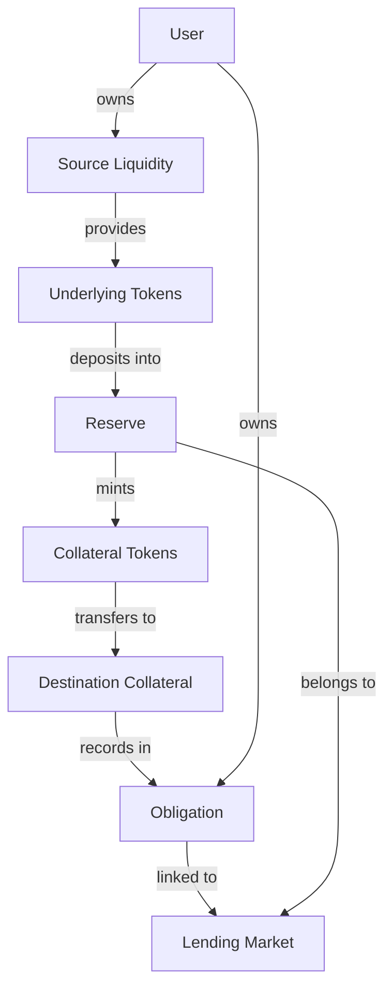
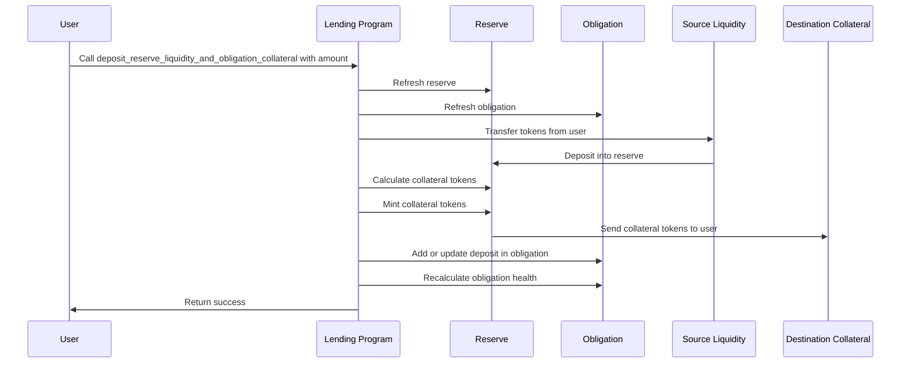

# Deposit Reserve Liquidity and Obligation Collateral

## Purpose

The `deposit_reserve_liquidity_and_obligation_collateral` instruction allows users to deposit tokens into a reserve and add them as collateral to an obligation in a single, atomic operation. This combines what would otherwise require two separate instructions (`deposit_reserve_liquidity` and `deposit_obligation_collateral`) into one efficient transaction, making it ideal for users who want to use their deposits as collateral for borrowing.

## Real-World Analogy

This operation is similar to making a deposit into a secured line of credit account at a bank. When you deposit funds into such an account, the money is simultaneously added to your balance and registered as collateral that increases your borrowing power. For example, when you deposit cash into a margin account with a brokerage, that cash immediately becomes available as collateral for margin loans.

## Required Accounts



| Account | Role | Signer | Writable |
|---------|------|--------|----------|
| `source_liquidity` | User's token account for deposit | No | Yes |
| `destination_collateral` | User's collateral token account | No | Yes |
| `deposit_reserve` | Reserve to deposit into | No | Yes |
| `obligation` | User's obligation | No | Yes |
| `lending_market` | Parent lending market | No | No |
| `lending_market_authority` | Authority derived from the lending market | No | No |
| `user_transfer_authority` | Authority over source liquidity | Yes | No |
| `clock` | Clock sysvar for timestamp | No | No |
| `token_program` | SPL Token program | No | No |

## Parameters

| Parameter | Type | Description |
|-----------|------|-------------|
| `liquidity_amount` | `u64` | The amount of tokens to deposit |

## Step-by-Step Process



1. **Account Validation**:
   - Verify the reserve belongs to the lending market
   - Confirm the obligation belongs to the lending market
   - Validate that the user has authority over the source liquidity

2. **Reserve and Obligation Refresh**:
   - Update the reserve's accumulated interest and exchange rates
   - Update the obligation's deposits, borrows, and health metrics

3. **Token Operations**:
   - Transfer underlying tokens from user to reserve
   - Calculate the equivalent amount of collateral tokens
   - Mint collateral tokens to the user's destination account

4. **Obligation Update**:
   - Add the deposited amount to the user's obligation as collateral
   - If a matching deposit already exists, increment its amount
   - Otherwise, add a new deposit entry to the obligation
   - Recalculate the obligation's health metrics

5. **State Updates**:
   - Update the reserve's available liquidity
   - Update the reserve's collateral supply
   - Update the obligation's deposits and deposited value
   - Update timestamps for both reserve and obligation

## Detailed Calculations

### Collateral Token Calculation

The amount of collateral tokens received is calculated using the current collateral exchange rate:

```
Collateral Token Amount = Underlying Token Amount / Collateral Exchange Rate
```

Where the exchange rate represents how much underlying token each collateral token is worth.

#### Example Calculation

If:
- User deposits 1,000 USDC
- Current collateral exchange rate is 1.05 (each cUSDC is worth 1.05 USDC)

Then:
```
Collateral Token Amount = 1,000 / 1.05 ≈ 952.38 cUSDC
```

The user receives approximately 952.38 cUSDC, which represents their share of the reserve pool.

### Deposit Value Calculation

The value of the deposit is calculated in USD terms for the obligation's health metrics:

```
Deposit USD Value = Collateral Amount * Collateral Exchange Rate * Asset Price
```

This value is used to determine how much the user can borrow against their collateral.

## Constraints and Validations

- The deposit amount must be greater than zero
- The lending market must not be in emergency mode restricting deposits
- The reserve must not be full (at capacity)
- The reserve must not be frozen
- The user must have sufficient tokens for the deposit

## Error Cases

| Error | Condition |
|-------|-----------|
| `InvalidAmount` | The deposit amount is zero |
| `ReserveFull` | The reserve is at capacity |
| `ReserveFrozen` | The reserve is frozen and not accepting deposits |
| `TokenTransferFailed` | The token transfer from user failed |
| `MathOverflow` | A calculation resulted in numeric overflow |
| `ObligationDepositsLimitExceeded` | The obligation already has the maximum number of deposits |
| `MarketEmergencyMode` | The market is in emergency mode restricting deposits |

## Post-Deposit State

After a successful deposit:

- The user's underlying token balance decreases by the deposit amount
- The user's collateral token balance increases by the calculated collateral amount
- The reserve's available liquidity increases
- The reserve's collateral supply increases
- The obligation records the deposit and updates its health metrics
- The user's borrowing capacity increases based on the deposit's value and LTV ratio

## Impact on Borrowing Capacity

Adding collateral directly increases borrowing capacity:

```
Additional Borrowing Capacity = Deposit Value * LTV Ratio
```

Where the LTV (Loan-to-Value) ratio is specific to the asset and determined by the reserve's configuration.

## Example Usage

In a client application, this instruction might be used like this:

```javascript
// Deposit 1,000 USDC into reserve and add as collateral to obligation
const depositInstruction = await kaminoLending.createDepositReserveLiquidityAndObligationCollateralInstruction(
  userWallet.publicKey,         // user transfer authority
  userUsdcAccount.address,      // source liquidity
  userCusdcAccount.address,     // destination collateral
  userObligation.address,       // user's obligation
  usdcReserve.address,          // USDC reserve
  new BN(1_000_000_000)         // 1,000 USDC (with 6 decimals)
);

// Add to a transaction and execute
const transaction = new Transaction().add(depositInstruction);
await sendAndConfirmTransaction(connection, transaction, [userWallet]);
```

## Related Instructions

- [Deposit Reserve Liquidity](./deposit-reserve-liquidity.md): Only deposits without adding to obligation
- [Withdraw Obligation Collateral](./withdraw-obligation-collateral.md): Reverses this operation
- [Borrow Obligation Liquidity](../user-borrow/borrow-obligation-liquidity.md): Often used after this instruction

## Special Considerations

### Combined Operation Benefits

This combined instruction offers several advantages:

1. Reduced transaction costs compared to separate deposit and collateral instructions
2. Atomic execution ensures the deposit is immediately available as collateral
3. Simplified client integration for common borrowing workflows

### Auto-creation of Collateral Account

Before calling this instruction:

1. The user must have a valid SPL token account for the collateral token
2. If the account doesn't exist, it should be created in advance
3. The account must be owned by the user

### First-time vs. Additional Deposits

The instruction handles both scenarios:

1. For first-time deposits of a specific asset, a new deposit entry is created in the obligation
2. For additional deposits of an already-used asset, the existing entry is updated
3. The obligation has a limit on the number of unique assets that can be deposited (typically 8)

### Interest Accrual

When depositing:

1. Interest accrues from the moment tokens are deposited
2. The collateral exchange rate captures this interest over time
3. The obligation's collateral value increases as interest accumulates

### Emergency Mode and Capacity Limits

The protocol implements safety mechanisms:

1. During emergency mode, deposits might be restricted
2. Reserves may have capacity limits to manage risk
3. Deposits may be temporarily frozen for specific assets

### Elevation Groups

If the obligation is part of an elevation group:

1. Only certain assets may be accepted as collateral
2. Special LTV ratios may apply to the deposited assets
3. The deposit might affect eligibility for the elevation group
