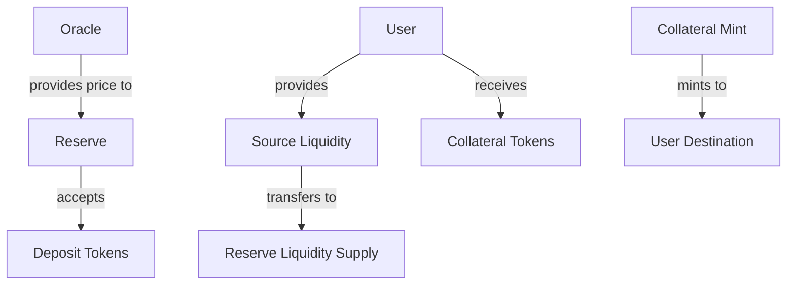
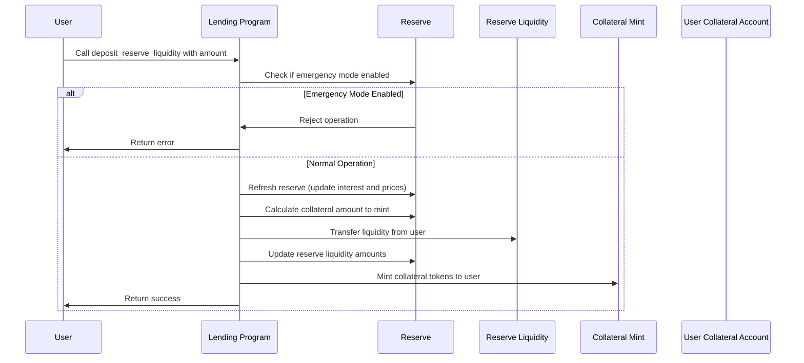

# Deposit Reserve Liquidity

## Purpose

The `deposit_reserve_liquidity` instruction allows users to deposit tokens into a reserve and receive collateral tokens in return. This is the primary way users provide liquidity to the Kamino Lending protocol, enabling others to borrow while the depositor earns interest.

## Real-World Analogy

Depositing reserve liquidity is similar to making a deposit at a bank. You provide your money to the bank, which then issues you a claim (like a deposit certificate or account balance) representing your deposit plus any accrued interest. The bank can then use your deposited money to make loans to other customers.

Similarly, in Kamino Lending:
- You deposit tokens (like USDC or SOL) into a reserve
- You receive collateral tokens (like cUSDC or cSOL) representing your share of the reserve
- The protocol can lend your tokens to borrowers
- Your collateral tokens appreciate in value as interest accrues

## Required Accounts



| Account | Role | Signer | Writable |
|---------|------|--------|----------|
| `source_liquidity` | User's token account for the liquidity | No | Yes |
| `destination_collateral` | User's token account to receive collateral tokens | No | Yes |
| `reserve` | The reserve to deposit into | No | Yes |
| `reserve_liquidity_supply` | The reserve's liquidity supply account | No | Yes |
| `reserve_collateral_mint` | The reserve's collateral mint | No | Yes |
| `lending_market` | The lending market the reserve belongs to | No | No |
| `lending_market_authority` | Authority derived from the lending market | No | No |
| `user_transfer_authority` | Authority to transfer user's tokens | Yes | No |
| `clock` | Clock sysvar for timestamp | No | No |
| `token_program` | SPL Token program | No | No |

## Parameters

| Parameter | Type | Description |
|-----------|------|-------------|
| `liquidity_amount` | `u64` | The amount of liquidity tokens to deposit |

## Step-by-Step Process



1. **Account Validation**:
   - Verify all accounts are properly owned and initialized
   - Check that the reserve belongs to the specified lending market
   - Validate that the user has authority over the source liquidity

2. **State Verification**:
   - Check that the lending market is not in emergency mode
   - Verify the reserve is not at its deposit limit
   - Ensure the user is depositing a non-zero amount

3. **Reserve Refresh**:
   - Update the reserve's accumulated interest
   - Update collateral exchange rate
   - Validate oracles if necessary

4. **Collateral Calculation**:
   - Calculate how many collateral tokens the user will receive based on:
     - Amount of liquidity being deposited
     - Current exchange rate between collateral and liquidity
     - Any deposit fees if applicable

5. **Token Transfers**:
   - Transfer the liquidity tokens from the user to the reserve's supply account
   - Mint the corresponding amount of collateral tokens to the user's destination account

6. **State Updates**:
   - Increase the reserve's available liquidity by the deposited amount
   - Update the reserve's total collateral supply if necessary
   - Update the reserve's last update timestamp

## Detailed Calculations

### Collateral Amount Calculation

The amount of collateral tokens minted to the user is calculated as:

```
Collateral Amount = Liquidity Amount / Collateral Exchange Rate
```

Where the collateral exchange rate is:

```
Collateral Exchange Rate = Total Reserve Liquidity / Collateral Token Supply
```

Total Reserve Liquidity includes both available liquidity and borrowed liquidity:

```
Total Reserve Liquidity = Available Liquidity + Borrowed Liquidity
```

#### Example Calculation

If:
- User deposits 100 USDC
- Available liquidity in reserve is 900 USDC
- Borrowed liquidity is 1,000 USDC
- Collateral token supply is 1,800 cUSDC

Then:
```
Exchange Rate = (900 + 1,000) / 1,800 = 1,900 / 1,800 = 1.0556

Collateral Amount = 100 / 1.0556 = 94.73 cUSDC
```

The user receives 94.73 cUSDC for their 100 USDC deposit.

### Deposit Limit Check

Before processing the deposit, the protocol checks if it would exceed the reserve's deposit limit:

```
If (Available Liquidity + Deposit Amount > Deposit Limit) then FAIL
```

## Constraints and Validations

- The lending market must not be in emergency mode
- The deposit amount must be greater than zero
- The deposit must not cause the reserve to exceed its deposit limit
- The user must have sufficient liquidity tokens
- The reserve must be enabled for deposits (`can_deposit` flag must be `1`)

## Error Cases

| Error | Condition |
|-------|-----------|
| `MarketInEmergencyMode` | The lending market is in emergency mode |
| `InvalidAmount` | The deposit amount is zero |
| `DepositLimitExceeded` | The deposit would exceed the reserve's limit |
| `TokenTransferFailed` | The token transfer from user to reserve failed |
| `MathOverflow` | A calculation resulted in numeric overflow |
| `DepositsDisabled` | The reserve has deposits disabled |

## Post-Deposit State

After a successful deposit:

- The user's liquidity token balance decreases by the deposit amount
- The user's collateral token balance increases by the calculated collateral amount
- The reserve's available liquidity increases by the deposit amount
- The total collateral token supply increases by the minted collateral amount
- The collateral exchange rate remains unchanged (by design)

## Interest Accrual

The user's deposit begins earning interest immediately. Interest accrues as:

1. Borrowers pay interest on borrowed liquidity
2. This increases the total reserve liquidity
3. The collateral exchange rate increases over time
4. The same amount of collateral tokens becomes worth more liquidity tokens
5. When the user redeems their collateral, they receive more than they deposited

## Risk Considerations

When depositing, users should consider:

- **Interest Rate Risk**: Interest rates fluctuate based on reserve utilization
- **Liquidity Risk**: Ability to withdraw depends on available liquidity
- **Oracle Risk**: Asset valuations depend on price oracle accuracy
- **Protocol Risk**: Smart contract vulnerabilities or exploits
- **Market Risk**: Underlying asset may decrease in value

## Example Usage

In a client application, the deposit instruction might be used like this:

```javascript
// Deposit 100 USDC into the USDC reserve
const depositInstruction = await kaminoLending.createDepositReserveLiquidityInstruction(
  userWallet.publicKey,       // user who's depositing
  userUsdcAccount.address,    // source of USDC tokens
  userCusdcAccount.address,   // destination for cUSDC tokens
  usdcReserve.address,        // USDC reserve address
  new BN(100_000_000)         // 100 USDC (with 6 decimals)
);

// Add to a transaction and execute
const transaction = new Transaction().add(depositInstruction);
await sendAndConfirmTransaction(connection, transaction, [userWallet]);
```

## Related Instructions

- [Redeem Reserve Collateral](./redeem-reserve-collateral.md): Convert collateral tokens back to underlying tokens
- [Deposit Reserve Liquidity and Obligation Collateral](./deposit-reserve-liquidity-and-obligation-collateral.md): Deposit and use as collateral in one step
- [Withdraw Reserve Liquidity](./withdraw-reserve-liquidity.md): Withdraw tokens from the reserve

## Special Considerations

- The first deposit to a reserve requires special handling, as it establishes the initial exchange rate
- Very small deposits may be subject to rounding, which could result in receiving slightly fewer collateral tokens than mathematically expected
- The deposit amount is limited by the reserve's deposit limit, which is configured at reserve initialization
- When a reserve reaches high utilization, deposits become more valuable as they help meet borrowing demand
