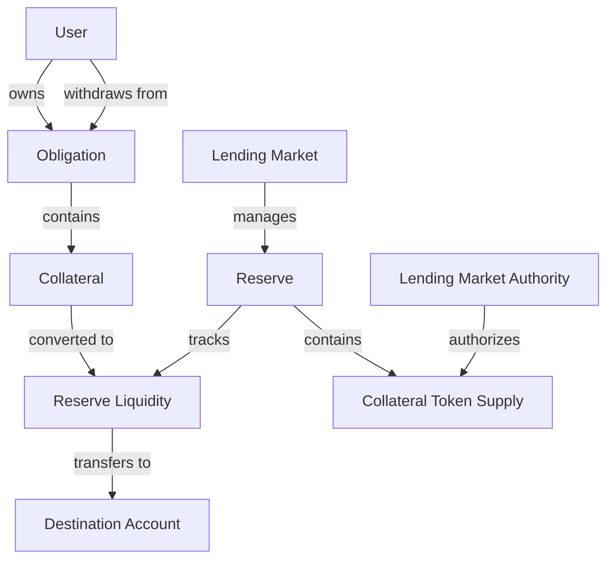
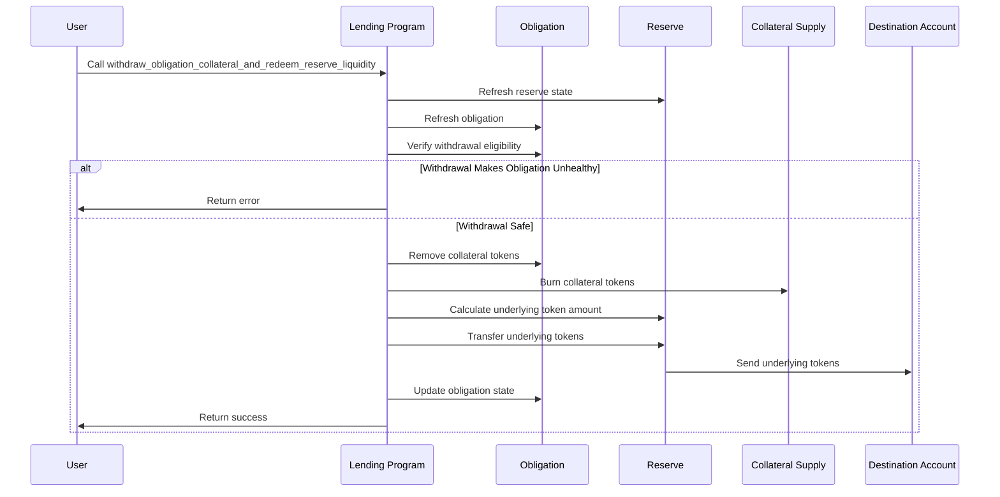

# Withdraw Obligation Collateral and Redeem Reserve Liquidity

## Purpose

The `withdraw_obligation_collateral_and_redeem_reserve_liquidity` instruction enables users to withdraw collateral from their obligation and immediately redeem it for the underlying tokens. This combined instruction performs two operations atomically: first removing collateral tokens from the obligation, then converting those collateral tokens back to the original deposited asset. This allows users to access their deposited funds in a single transaction when they need liquidity or want to reduce their position in the protocol.

## Real-World Analogy

This operation is similar to withdrawing funds from a certificate of deposit (CD) at a bank. When you have money in a CD, you're lending it to the bank in exchange for interest. When you want your money back, you redeem the CD and receive your original deposit plus any accrued interest. In Kamino Lending, withdrawing collateral and redeeming reserve liquidity works the same way—you're taking back your deposited assets along with any yield earned during the deposit period.

## Required Accounts



| Account | Role | Signer | Writable |
|---------|------|--------|----------|
| `source_collateral` | Source of collateral tokens | No | Yes |
| `destination_liquidity` | Destination for withdrawn liquidity | No | Yes |
| `reserve` | Reserve for the collateral being withdrawn | No | Yes |
| `obligation` | User's lending obligation | No | Yes |
| `lending_market` | Parent lending market | No | No |
| `lending_market_authority` | Authority for the lending market | No | No |
| `obligation_owner` | Owner of the obligation | Yes | No |
| `clock` | Clock sysvar | No | No |
| `token_program` | SPL Token program | No | No |

## Parameters

| Parameter | Type | Description |
|-----------|------|-------------|
| `collateral_amount` | `u64` | Amount of collateral tokens to withdraw |

## Step-by-Step Process



1. **State Refresh**:
   - Refresh the reserve to get current exchange rate and interest accrual
   - Update the obligation with current market values
   - Calculate current health factors and borrow capacity

2. **Withdrawal Validation**:
   - Verify the user owns the obligation
   - Check if the collateral is present in the obligation
   - Calculate if the withdrawal would make the obligation unhealthy
   - Validate that the withdrawal amount is not zero and is available

3. **Collateral Removal**:
   - Remove collateral tokens from the obligation's deposits
   - Update the obligation's deposited value
   - Recalculate borrowing capacity and health metrics

4. **Redemption Process**:
   - Burn the collateral tokens from the user's account
   - Calculate the equivalent amount of underlying tokens
   - Transfer underlying tokens from the reserve to the destination account

5. **State Update**:
   - Update the reserve's total liquidity and collateral
   - Update the obligation's deposited value and allowed borrow value
   - Record the current timestamp for the transaction

## Withdrawal Calculations

### Collateral to Liquidity Conversion

The amount of underlying tokens received is calculated using the reserve's current exchange rate:

```
Underlying Tokens = Collateral Tokens × Exchange Rate

Where:
Exchange Rate = Total Reserve Liquidity / Total Collateral Tokens
```

### Health Check Calculation

Before allowing withdrawal, the protocol verifies that the obligation remains healthy:

```
Remaining Deposited Value = Current Deposited Value - Withdrawal Value
Remaining Allowed Borrow Value = Remaining Deposited Value × Weighted LTV
Obligation Remains Healthy If: Remaining Allowed Borrow Value ≥ Current Borrowed Value
```

## Constraints and Validations

- The obligation must be owned by the signer
- The withdrawal must not make the obligation unhealthy
- The collateral token must be present in the obligation
- The user must have sufficient collateral tokens to withdraw
- The reserve must have sufficient liquidity for the redemption
- The destination account must be able to receive the underlying tokens

## Error Cases

| Error | Condition |
|-------|-----------|
| `InvalidObligationOwner` | The signer is not the obligation owner |
| `InvalidAccountInput` | The obligation doesn't contain this collateral |
| `InsufficientObligationCollateral` | Not enough collateral in the obligation |
| `WithdrawalWouldCauseHealthFactorViolation` | Withdrawal would make the obligation unhealthy |
| `InsufficientReserveLiquidity` | The reserve lacks sufficient liquidity |

## Practical Examples

### Standard Withdrawal

For a user with healthy overcollateralized position:

```
Initial State:
- Deposited: 10 ETH (worth $18,000)
- Borrowed: $5,000 USDC
- Health Factor: 2.7 (healthy)

Withdrawal:
- Withdraw 2 ETH (worth $3,600)

Resulting State:
- Deposited: 8 ETH (worth $14,400)
- Borrowed: $5,000 USDC
- Health Factor: 2.16 (still healthy)
```

### Maximum Safe Withdrawal

Calculating the maximum amount a user can safely withdraw:

```
Initial State:
- Deposited: 10 ETH (worth $18,000)
- Borrowed: $10,000 USDC
- LTV: 75%
- Health Factor: 1.35 (healthy)

Maximum Safe Withdrawal:
- Max Withdrawal = $18,000 - ($10,000 / 0.75) = $4,666.67
- Approximately 2.59 ETH at $1,800 per ETH

Resulting State:
- Deposited: 7.41 ETH (worth $13,333.33)
- Borrowed: $10,000 USDC
- Health Factor: 1.0 (at minimum safety threshold)
```

## Example Usage

In a client application, the withdraw and redeem instruction might be used like this:

```javascript
// Withdraw 2 ETH collateral from obligation
const collateralAmount = new BN(2000000000); // 2 ETH in lamports (assuming 9 decimals)

const withdrawInstruction = await kaminoLending.createWithdrawObligationCollateralAndRedeemReserveLiquidityInstruction(
  userCollateralAccount.address,        // source of collateral tokens
  userTokenAccount.address,             // destination for underlying tokens
  ethReserve.address,                   // reserve for the collateral
  userObligation.address,               // user's obligation
  lendingMarket.address,                // parent lending market
  lendingMarketAuthority,               // derived authority
  userWallet.publicKey,                 // obligation owner
  collateralAmount                      // amount to withdraw
);

// Add to a transaction and execute
const transaction = new Transaction().add(withdrawInstruction);
await sendAndConfirmTransaction(connection, transaction, [userWallet]);
```

## Related Instructions

- [Deposit Reserve Liquidity And Obligation Collateral](./deposit-reserve-liquidity-and-obligation-collateral.md): The counterpart deposit operation
- [Refresh Reserve](../reserve-admin/refresh-reserve.md): Updates reserve state with current market data
- [Refresh Obligation](../user-borrow/refresh-obligation.md): Updates obligation with current market values

## Withdrawal Strategies

### Full Position Exit

For users wanting to close their position entirely:

1. **Repay Outstanding Loans**: First repay all borrowed amounts
2. **Withdraw All Collateral**: Then withdraw all collateral in one or multiple transactions
3. **Close Obligation**: Optionally close the empty obligation account

### Partial Withdrawals

For users adjusting their position:

1. **Calculate Safe Withdrawal**: Determine maximum safe withdrawal amount
2. **Withdraw Incrementally**: Make smaller withdrawals to avoid market impact
3. **Monitor Health**: Track obligation health after each withdrawal

### Emergency Withdrawals

For users needing immediate liquidity:

1. **Repay Some Debt**: First repay enough to create withdrawal headroom
2. **Withdraw Available Collateral**: Extract what's safely available
3. **Consider Alternatives**: Flash loans or liquidation protection strategies for larger amounts

## Special Considerations

### Market Volatility Management

When making withdrawals during volatile periods:

1. **Buffer Maintenance**: Keep a safety buffer above minimum health requirements
2. **Timing Considerations**: Consider market conditions for optimal timing
3. **Slippage Protection**: Be aware of potential exchange rate fluctuations
4. **Incremental Approach**: Consider smaller withdrawals to reduce risk

### User Experience Design

For frontend developers:

1. **Withdrawal Calculators**: Provide tools to calculate maximum safe withdrawal
2. **Health Indicators**: Display real-time health metrics and post-withdrawal projections
3. **Warning Systems**: Alert users when withdrawals approach safety thresholds
4. **Fee Transparency**: Clearly display any fees or slippage

### Protocol Safety

For protocol integrators:

1. **Rate Limiting**: Consider implementing withdrawal rate limits during extreme conditions
2. **Circuit Breakers**: Design emergency pause mechanisms for systemic risks
3. **Oracles**: Ensure price feeds are reliable before processing large withdrawals
4. **Monitoring**: Track withdrawal patterns for anomaly detection
