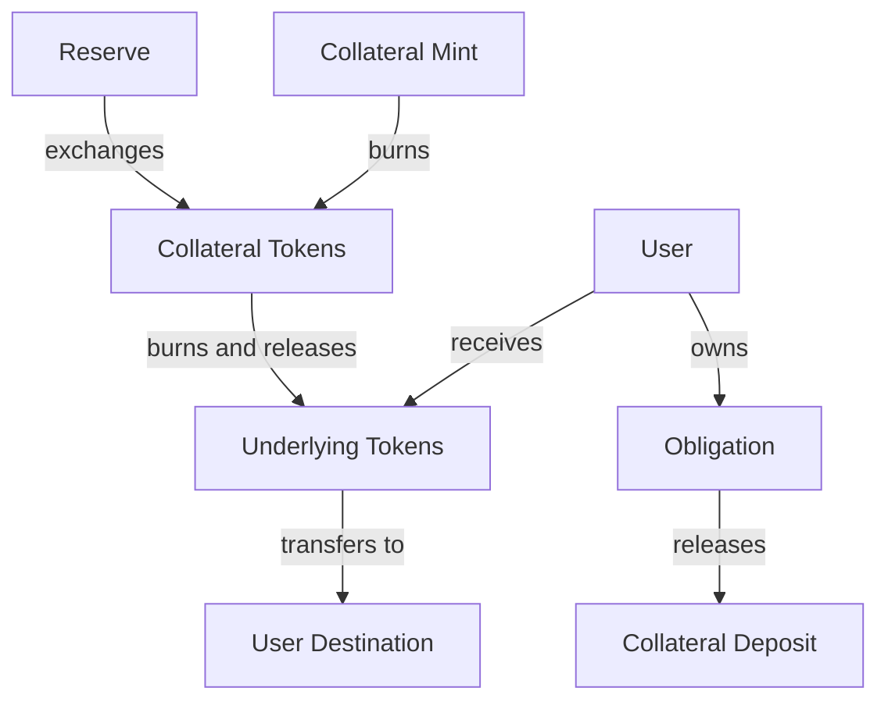
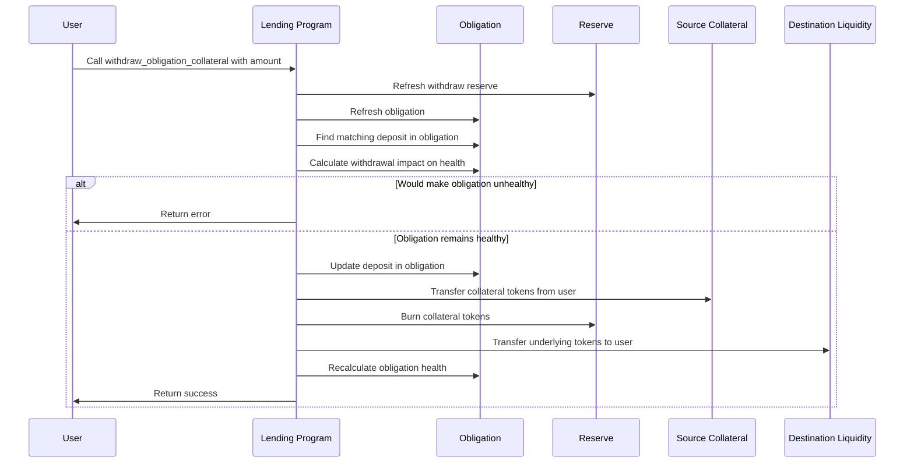

# Withdraw Obligation Collateral

## Purpose

The `withdraw_obligation_collateral` instruction allows users to withdraw collateral from their obligation. This operation reduces the user's collateral in the protocol, decreasing their borrowing capacity. It is typically used when a user wants to retrieve assets they no longer need as collateral, provided their obligation remains healthy after the withdrawal.

## Real-World Analogy

Withdrawing obligation collateral is similar to removing equity from a secured loan. For example, if you have paid down a significant portion of your mortgage or your home's value has increased, you might be able to take out some of your equity while still maintaining sufficient collateral for the remaining loan balance. In traditional finance, this might be done through a home equity line of credit or a cash-out refinance.

Similarly, in Kamino Lending:
- You withdraw collateral that is no longer needed to secure your loan
- The protocol ensures your remaining collateral is sufficient for your outstanding borrows
- You regain full access to your assets for other uses

## Required Accounts



| Account | Role | Signer | Writable |
|---------|------|--------|----------|
| `source_collateral` | User's collateral token account | No | Yes |
| `destination_liquidity` | User's account to receive underlying tokens | No | Yes |
| `withdraw_reserve` | Reserve that holds the collateral | No | Yes |
| `obligation` | User's obligation | No | Yes |
| `lending_market` | Parent lending market | No | No |
| `lending_market_authority` | Authority derived from the lending market | No | No |
| `obligation_owner` | Owner of the obligation | Yes | No |
| `clock` | Clock sysvar for timestamp | No | No |
| `token_program` | SPL Token program | No | No |

## Parameters

| Parameter | Type | Description |
|-----------|------|-------------|
| `collateral_amount` | `u64` | The amount of collateral tokens to withdraw |

## Step-by-Step Process



1. **Account Validation**:
   - Verify the obligation belongs to the specified lending market
   - Validate that the user is the owner of the obligation
   - Check that the reserve belongs to the lending market

2. **Reserve Refresh**:
   - Update the reserve's accumulated interest
   - Update collateral exchange rate
   - Validate oracle prices if necessary

3. **Obligation Refresh**:
   - Update all deposit values with current prices
   - Update all borrow values with accrued interest
   - Calculate current obligation health metrics

4. **Find Matching Deposit**:
   - Locate the deposit in the obligation that matches the withdraw reserve
   - If no matching deposit is found, return an error

5. **Health Calculation**:
   - Calculate the impact of the withdrawal on the obligation's health
   - Ensure the obligation will remain healthy after withdrawal
   - If the withdrawal would make the obligation unhealthy, return an error

6. **Token Operations**:
   - Transfer collateral tokens from user's account to lending market authority
   - Burn the collateral tokens to reduce supply
   - Transfer underlying tokens from reserve to user's destination account

7. **Update Obligation**:
   - Decrease the deposit amount
   - If deposit is fully withdrawn, remove it from the deposits array
   - Recalculate obligation health metrics
   - Update obligation's last refresh timestamp

## Detailed Calculations

### Determining Withdrawal Amount

If the user specifies the maximum amount (u64::MAX), the instruction will withdraw the maximum safe amount:

```
Safe Withdrawal Amount = min(Deposited Amount, Maximum Safe Withdrawal)
```

Otherwise, the withdrawal amount is capped at the current deposited amount:

```
Withdrawal Amount = min(Requested Amount, Deposited Amount)
```

### Maximum Safe Withdrawal Calculation

The maximum safe withdrawal is calculated by determining how much collateral can be removed while keeping the health factor above 1.0:

```
Remaining Weighted Value = Total Weighted Borrowed Value - Other Weighted Collateral Value
Maximum Safe Withdrawal Value = (Deposit Value - (Remaining Weighted Value / Liquidation Threshold))
```

Where:
- `Total Weighted Borrowed Value` is the sum of all borrows
- `Other Weighted Collateral Value` is the sum of all other deposits weighted by their liquidation thresholds
- `Liquidation Threshold` is the specific threshold for the asset being withdrawn

### Underlying Token Calculation

The amount of underlying tokens the user receives is calculated using the current collateral exchange rate:

```
Underlying Token Amount = Collateral Amount * Collateral Exchange Rate
```

#### Example Calculation

If:
- User has deposited 100 cUSDC
- Current collateral exchange rate is 1.05
- User requests to withdraw 50 cUSDC

Then:
```
Underlying Token Amount = 50 * 1.05 = 52.5 USDC
```

The user receives 52.5 USDC for their 50 cUSDC.

## Constraints and Validations

- The withdrawal amount must be greater than zero
- The obligation must have an existing deposit in the withdraw reserve
- The obligation must remain healthy after the withdrawal
- The user must be the owner of the obligation
- The user must have sufficient collateral tokens

## Error Cases

| Error | Condition |
|-------|-----------|
| `InvalidAmount` | The withdrawal amount is zero |
| `DepositNotFound` | No matching deposit found in the obligation |
| `InsufficientObligationCollateral` | Not enough collateral in the deposit |
| `UnhealthyWithdrawal` | Withdrawal would make the obligation unhealthy |
| `TokenTransferFailed` | A token transfer operation failed |
| `MathOverflow` | A calculation resulted in numeric overflow |

## Post-Withdrawal State

After a successful withdrawal:

- The user's collateral token balance decreases by the collateral amount
- The user's underlying token balance increases by the calculated underlying amount
- The obligation's deposit amount decreases (or is removed if fully withdrawn)
- The reserve's collateral token supply decreases
- The reserve's available liquidity decreases

## Impact on Borrow Capacity

Withdrawing collateral directly reduces borrowing capacity:

1. Reduced collateral means lower maximum borrow amount
2. May reduce the health factor of the obligation
3. Could increase the risk of liquidation if prices move unfavorably

## Example Usage

In a client application, the withdraw instruction might be used like this:

```javascript
// Withdraw 50 cUSDC from obligation
const withdrawInstruction = await kaminoLending.createWithdrawObligationCollateralInstruction(
  userWallet.publicKey,         // obligation owner
  userCusdcAccount.address,     // source of cUSDC tokens
  userUsdcAccount.address,      // destination for USDC tokens
  userObligation.address,       // user's obligation
  usdcReserve.address,          // USDC reserve
  new BN(50_000_000)            // 50 cUSDC (with 6 decimals)
);

// To withdraw the maximum safe amount, use u64::MAX
const withdrawMaxInstruction = await kaminoLending.createWithdrawObligationCollateralInstruction(
  userWallet.publicKey,
  userCusdcAccount.address,
  userUsdcAccount.address,
  userObligation.address,
  usdcReserve.address,
  new BN("18446744073709551615")  // u64::MAX
);

// Add to a transaction and execute
const transaction = new Transaction().add(withdrawInstruction);
await sendAndConfirmTransaction(connection, transaction, [userWallet]);
```

## Related Instructions

- [Deposit Reserve Liquidity and Obligation Collateral](./deposit-reserve-liquidity-and-obligation-collateral.md): Adds collateral to an obligation
- [Refresh Obligation](../user-borrow/refresh-obligation.md): Updates obligation with current values before withdrawal
- [Repay Obligation Liquidity](../user-borrow/repay-obligation-liquidity.md): Often performed before withdrawing collateral

## Special Considerations

### Health Factor Priority

The protocol prioritizes maintaining obligation health above all else:

1. Withdrawals that would make an obligation unhealthy are rejected
2. Even if a user has more collateral than needed, they can only withdraw what keeps the obligation healthy
3. To withdraw all collateral, all borrows must be repaid first

### Partial Withdrawals

Users can make partial withdrawals to adjust their position:

1. Partial withdrawals can optimize capital efficiency
2. Allow users to reduce over-collateralization when needed
3. Enable strategic rebalancing of collateral across different assets

### Interest and Exchange Rate Effects

Because of interest accrual and exchange rate changes:

1. The underlying value of collateral tokens increases over time
2. The same amount of collateral tokens will redeem more underlying tokens later
3. This represents the interest earned by providing liquidity

### Emergency Mode

Collateral withdrawals might be restricted during emergency mode:

1. The protocol may prevent withdrawals to reduce systemic risk
2. This helps maintain overall protocol stability
3. Users should be aware of this possibility when using the protocol
