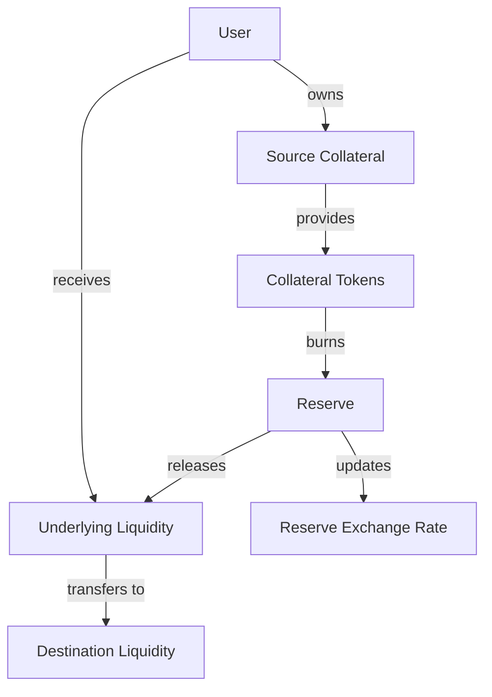
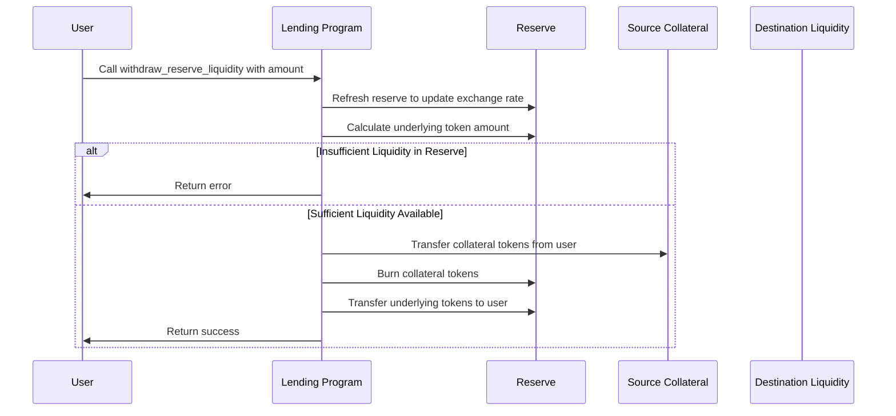
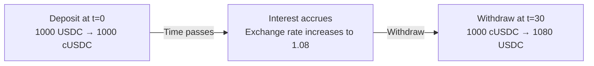

# Withdraw Reserve Liquidity

## Purpose

The `withdraw_reserve_liquidity` instruction allows users to redeem their collateral tokens (such as cUSDC) for the underlying reserve tokens (such as USDC). This operation is used when a user wants to exit a lending position without having an obligation, or when managing liquidity separately from borrowing positions.

## Real-World Analogy

Withdrawing reserve liquidity is similar to redeeming shares in a money market fund or withdrawing from a savings account. When you deposit into a savings account, you don't typically keep the physical cash; instead, the bank records your deposit as a balance. When you want to withdraw, you're converting that balance entry back into actual currency.

In Kamino Lending:
- The collateral tokens (e.g., cUSDC) represent your share of the lending pool
- When you withdraw, you're redeeming these shares for the underlying assets
- The value of your shares may have increased due to interest accrual

## Required Accounts



| Account | Role | Signer | Writable |
|---------|------|--------|----------|
| `source_collateral` | User's collateral token account | No | Yes |
| `destination_liquidity` | User's account to receive underlying tokens | No | Yes |
| `reserve` | Reserve that holds the collateral | No | Yes |
| `reserve_collateral_mint` | Mint for the reserve's collateral token | No | Yes |
| `reserve_liquidity_supply` | Reserve's liquidity supply account | No | Yes |
| `lending_market` | Parent lending market | No | No |
| `lending_market_authority` | Authority derived from the lending market | No | No |
| `user_transfer_authority` | Authority over source collateral | Yes | No |
| `clock` | Clock sysvar for timestamp | No | No |
| `token_program` | SPL Token program | No | No |

## Parameters

| Parameter | Type | Description |
|-----------|------|-------------|
| `collateral_amount` | `u64` | The amount of collateral tokens to withdraw |

## Step-by-Step Process



1. **Account Validation**:
   - Verify the reserve belongs to the specified lending market
   - Validate that the user has authority over the source collateral
   - Check that all token accounts match their respective reserves

2. **Reserve Refresh**:
   - Update the reserve's accumulated interest
   - Update collateral exchange rate
   - Update reserve liquidity and collateral values

3. **Token Amount Calculation**:
   - Calculate the underlying token amount based on the collateral amount and current exchange rate
   - Ensure the reserve has sufficient liquidity for withdrawal

4. **Token Operations**:
   - Transfer collateral tokens from user's account to lending market authority
   - Burn the collateral tokens to reduce supply
   - Transfer underlying tokens from reserve to user's destination account

5. **Reserve Update**:
   - Decrease available liquidity by the withdrawn amount
   - Update the reserve's last update timestamp

## Detailed Calculations

### Underlying Token Calculation

The amount of underlying tokens the user receives is calculated using the current collateral exchange rate:

```
Underlying Token Amount = Collateral Amount * Collateral Exchange Rate
```

The collateral exchange rate represents how much underlying token each collateral token is worth, and it increases over time as interest accrues.

#### Example Calculation

If:
- User has 100 cUSDC
- Current collateral exchange rate is 1.05
- User withdraws 50 cUSDC

Then:
```
Underlying Token Amount = 50 * 1.05 = 52.5 USDC
```

The user receives 52.5 USDC for their 50 cUSDC.

### Maximum Withdrawal Limit

The maximum amount a user can withdraw is limited by the reserve's available liquidity:

```
Maximum Withdrawal = min(User's Collateral Balance, Reserve's Available Liquidity / Exchange Rate)
```

## Constraints and Validations

- The withdrawal amount must be greater than zero
- The user must have sufficient collateral tokens
- The reserve must have sufficient available liquidity
- The lending market must not be in emergency mode that restricts withdrawals

## Error Cases

| Error | Condition |
|-------|-----------|
| `InvalidAmount` | The withdrawal amount is zero |
| `InsufficientCollateral` | User doesn't have enough collateral tokens |
| `InsufficientLiquidity` | Reserve doesn't have enough available liquidity |
| `MarketInEmergencyMode` | The market is in emergency mode restricting withdrawals |
| `TokenTransferFailed` | A token transfer operation failed |
| `MathOverflow` | A calculation resulted in numeric overflow |

## Post-Withdrawal State

After a successful withdrawal:

- The user's collateral token balance decreases by the collateral amount
- The user's underlying token balance increases by the calculated underlying amount
- The reserve's collateral supply decreases
- The reserve's available liquidity decreases

## Impact on Interest Accrual

Withdrawing from a reserve has these effects on interest:

1. The user realizes any interest earned up to the withdrawal time
2. The exchange rate captures the interest accrual
3. Earlier withdrawals may result in lower interest earned



## Example Usage

In a client application, the withdraw instruction might be used like this:

```javascript
// Withdraw 50 cUSDC from the reserve
const withdrawInstruction = await kaminoLending.createWithdrawReserveLiquidityInstruction(
  userWallet.publicKey,         // user transfer authority
  userCusdcAccount.address,     // source of cUSDC tokens
  userUsdcAccount.address,      // destination for USDC tokens
  usdcReserve.address,          // USDC reserve
  new BN(50_000_000)            // 50 cUSDC (with 6 decimals)
);

// Add to a transaction and execute
const transaction = new Transaction().add(withdrawInstruction);
await sendAndConfirmTransaction(connection, transaction, [userWallet]);

// To withdraw the maximum amount
const userCollateralBalance = await connection.getTokenAccountBalance(userCusdcAccount.address);
const withdrawMaxInstruction = await kaminoLending.createWithdrawReserveLiquidityInstruction(
  userWallet.publicKey,
  userCusdcAccount.address,
  userUsdcAccount.address,
  usdcReserve.address,
  new BN(userCollateralBalance.value.amount)
);
```

## Related Instructions

- [Deposit Reserve Liquidity](./deposit-reserve-liquidity.md): Counterpart to this instruction
- [Withdraw Obligation Collateral](./withdraw-obligation-collateral.md): Similar operation for collateral in obligations

## Special Considerations

### Direct vs. Obligation Withdrawal

There are two ways to withdraw assets from the protocol:

1. **Direct Withdrawal** (this instruction):
   - Simpler, doesn't involve an obligation
   - Suitable for lenders who only supply liquidity
   - No health checks or collateralization requirements

2. **Obligation Withdrawal**:
   - Requires an obligation account
   - Subject to health checks and collateralization requirements
   - Suitable for borrowers who use assets as collateral

### Reserve Liquidity Limits

The protocol may have limits on reserve withdrawals:

1. The reserve must maintain minimum liquidity for protocol stability
2. Large withdrawals might be limited by available liquidity
3. In extreme cases, a liquidity crunch could temporarily prevent withdrawals

### Exchange Rate Benefits

The exchange rate mechanism provides important benefits:

1. Users automatically earn interest without claiming
2. Interest compounds continuously within the reserve
3. The exact amount of underlying tokens received depends on when the user withdraws

### Emergency Mode

During emergency mode:

1. The protocol may restrict or pause withdrawals
2. This helps prevent bank runs during extreme market conditions
3. Protocol governance can enable/disable emergency mode

### Gas Optimization

For gas efficiency when fully exiting a position:

1. Use this instruction rather than multiple small withdrawals
2. Consider transaction priorities during high network congestion
3. Be aware of potential slippage in exchange rates due to other transactions
