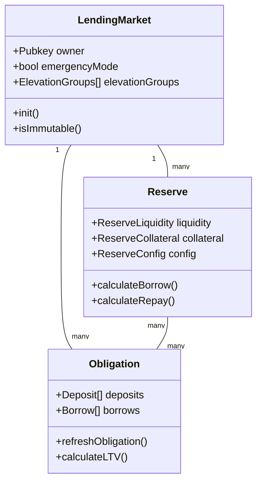

# Kamino Lending Protocol States

## Overview

States in the Kamino Lending protocol represent the persistent on-chain data structures that store all information about the lending market, reserves, and user positions. Understanding these states is fundamental to comprehending how the protocol works.

## Core State Types

### [Lending Market](./lending-market/overview.md)

The Lending Market is the central entity that coordinates all activity within a lending market instance:

- Controls global protocol parameters
- Manages all reserves within the market
- Enforces protocol-wide settings
- Handles emergency controls
- Manages elevation groups

### [Reserve](./reserve/overview.md)

Each Reserve represents a specific token pool available for depositing and borrowing:

- Tracks liquidity (available and borrowed amounts)
- Manages collateral token issuance
- Controls token-specific risk parameters
- Handles interest rate calculations
- Determines fees for operations

### [Obligation](./obligation/overview.md)

An Obligation represents a user's position in the protocol:

- Tracks collateral deposits across reserves
- Records borrowed amounts from reserves
- Calculates position health and risk metrics
- Enforces liquidation thresholds
- Manages user-specific risk settings

## State Relationships

## Data Lifecycle

All states in the protocol follow similar lifecycle patterns:

1. **Initialization**: States are created with initial values
2. **Updates**: Regular operations modify state values
3. **Refresh**: Price and interest updates keep states current
4. **Specialized Operations**: Specific operations for risk management

## Additional States

Beyond the core states, the protocol includes several supporting state structures:

- **LastUpdate**: Tracks when a state was last updated
- **TokenInfo**: Stores metadata about tokens
- **GlobalConfig**: Manages protocol-wide configuration
- **ReferralState**: Tracks referral relationships and rewards

## State Security

The protocol implements several security mechanisms for state management:

- Ownership validation to prevent unauthorized access
- Update authority controls for administrative functions
- Version tracking for upgrade management
- Emergency modes to freeze operations when needed

Explore each state in detail through the links above to understand their specific structures, fields, and operations.
