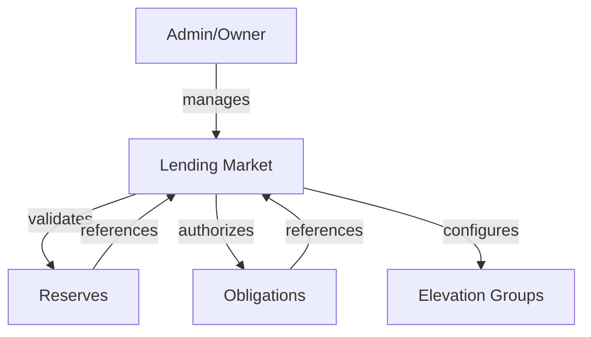
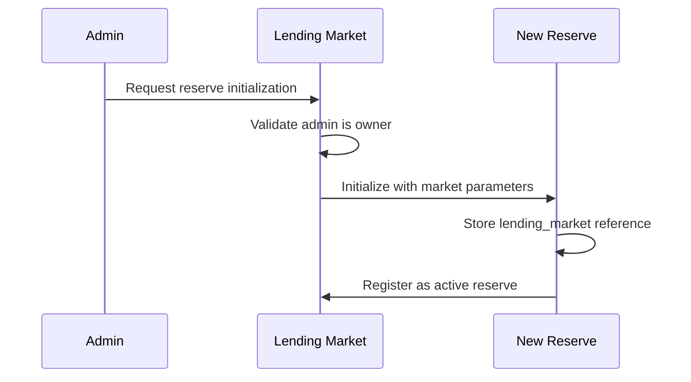
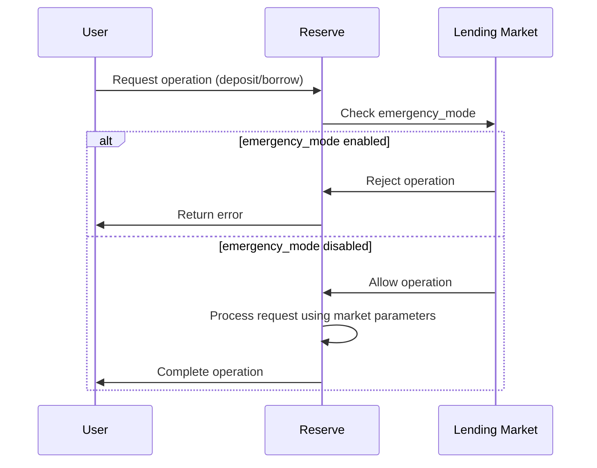
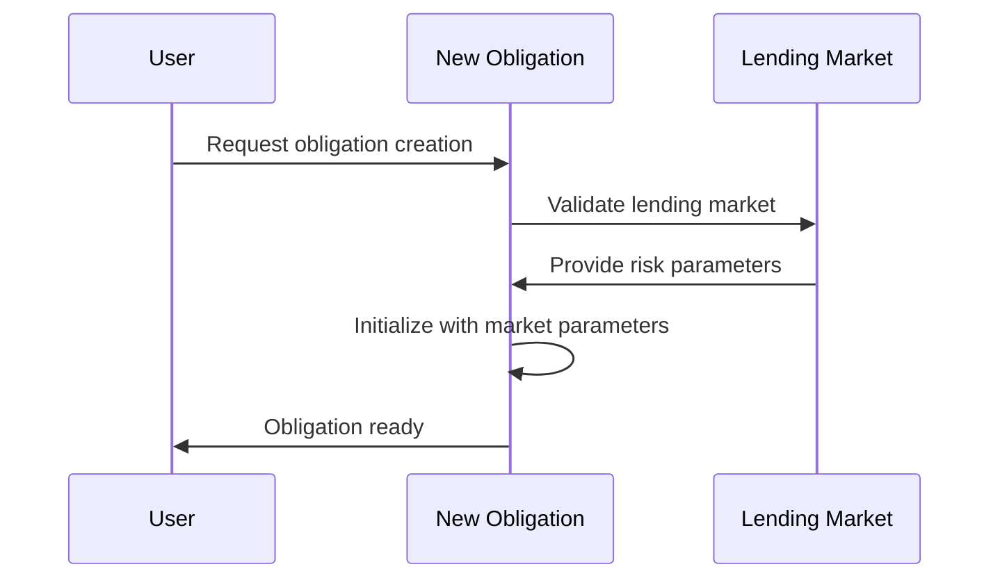
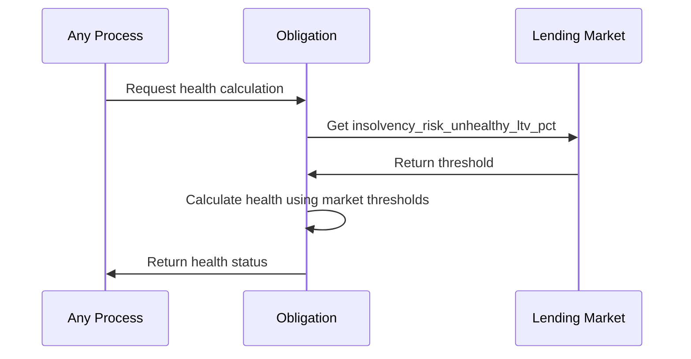
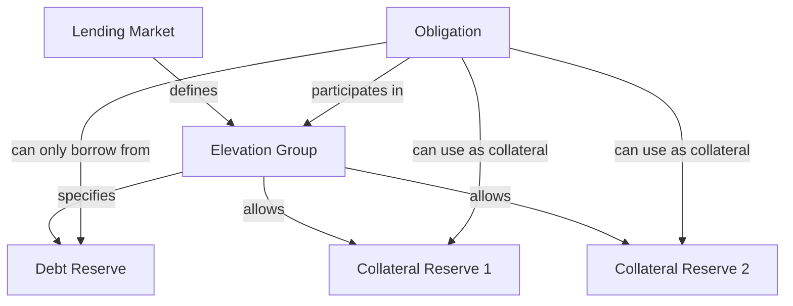
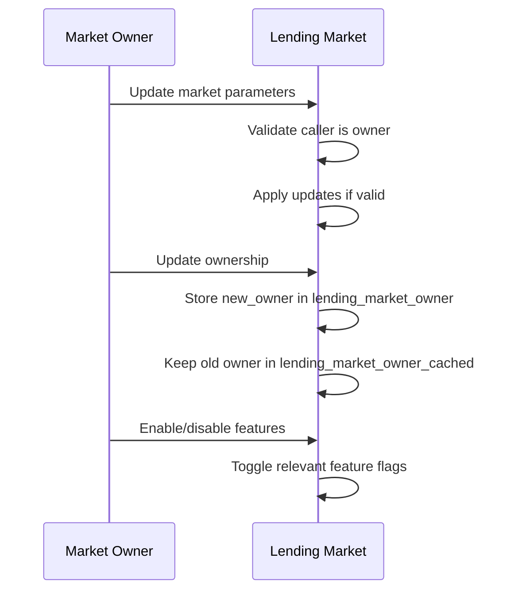
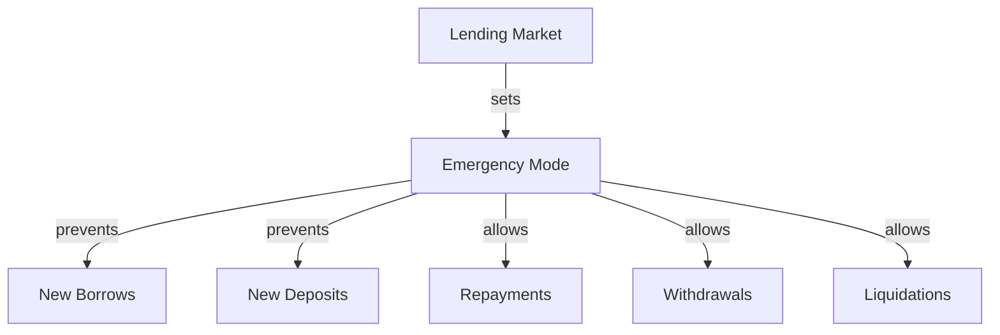

# Lending Market Interactions

This document explains how the Lending Market interacts with other components of the Kamino Lending protocol.

## Key Interaction Patterns

## Reserve Interactions

The Lending Market interacts with Reserves in the following ways:

### 1. Reserve Initialization

When a new Reserve is initialized:
- The Lending Market validates the initialization request
- The Reserve stores a reference to its parent Lending Market
- The Lending Market's parameters affect the Reserve's operation

### 2. Reserve Operations

During normal Reserve operations:
- Reserves check the Lending Market's emergency mode status
- Reserves apply global risk parameters from the Lending Market
- Fee calculations incorporate the Lending Market's referral fee settings

## Obligation Interactions

The Lending Market interacts with Obligations in the following ways:

### 1. Obligation Initialization

When a new Obligation is created:
- The Obligation must reference a valid Lending Market
- The Lending Market's parameters affect the Obligation's risk calculations

### 2. Obligation Health Calculation

During health checks and liquidation evaluation:
- The Lending Market provides critical risk thresholds
- The global parameters define liquidation behaviors

## Elevation Group Interactions

Elevation Groups create special relationships between Reserves and Obligations:

### 1. Elevation Group Configuration

- The Lending Market defines all Elevation Group parameters
- Each Elevation Group has specific LTV and liquidation thresholds
- Elevation Groups define which reserves can interact with each other

### 2. Borrowing with Elevation Groups

When an Obligation borrows with Elevation Groups:
1. The Lending Market validates the borrowing request against group rules
2. The Obligation can only borrow from the designated debt reserve
3. The Obligation must follow the group's collateral restrictions
4. The borrow uses the group's specific risk parameters

## Administrative Interactions

The Lending Market owner has special privileges:

The owner can:
1. Update global risk parameters
2. Configure Elevation Groups
3. Enable/disable protocol features
4. Transfer ownership
5. Set the market as immutable (preventing further changes)

## Emergency Mode Interactions

When emergency mode is enabled:

This special mode:
1. Prevents new borrows across all reserves
2. Prevents new deposits
3. Still allows repayments and withdrawals
4. Still allows liquidations to reduce risk
5. Can only be toggled by the market owner

## Protocol Feature Flags

The Lending Market controls several protocol-wide features:

| Feature Flag | When Enabled | Impact on Protocol |
|-------------|--------------|-------------------|
| `borrow_disabled` | Prevents all new borrowing | Users can still repay, deposit, withdraw |
| `autodeleverage_enabled` | Allows automatic deleveraging | Risky positions can be automatically reduced |
| `obligation_order_creation_enabled` | Allows creating obligation orders | Users can create conditional orders |
| `obligation_order_execution_enabled` | Allows executing obligation orders | Existing orders can be executed |

These flags give the protocol governance fine-grained control over protocol functionality.

## Lending Market as a Gatekeeper

The Lending Market serves as a central gatekeeper for the protocol:

1. **Access Control**: Validates caller permissions for admin functions
2. **Feature Control**: Enables/disables protocol capabilities
3. **Risk Management**: Sets global risk parameters
4. **Protocol Configuration**: Defines operating rules for all components
5. **Emergency Management**: Provides mechanisms to handle emergencies

Understanding these interactions is crucial for comprehending how the entire protocol operates cohesively.
