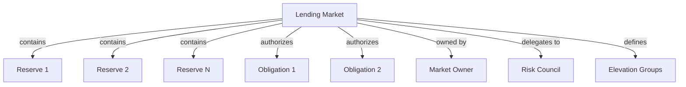

# Lending Market Overview

## What is a Lending Market?

The Lending Market is the central coordinating entity in the Kamino Lending protocol. It serves as the primary control point for the entire lending marketplace, managing all reserves, global parameters, and protocol-wide settings.

## Real-World Analogy

In traditional finance, the Lending Market is comparable to a central bank or financial authority that:

- Sets the rules for all participating banks in a financial system
- Establishes regulatory parameters that all participants must follow
- Provides oversight and governance for the entire system
- Can intervene during emergencies to stabilize the market

Similarly, the Lending Market in Kamino Lending:

- Defines the operating parameters for all reserves
- Sets protocol-wide risk thresholds and limits
- Provides centralized governance controls
- Can activate emergency measures when needed

## Purpose in the Protocol

The Lending Market serves several critical functions:

1. **Central Registry**: Maintains a registry of all reserves within the market
2. **Governance Control**: Provides owner-controlled settings for the entire protocol
3. **Risk Parameters**: Defines global risk thresholds for liquidations and other operations
4. **Emergency Controls**: Enables protocol-wide emergency modes
5. **Elevation Groups**: Manages special asset relationships through elevation groups

## Key Relationships

## Lifecycle of a Lending Market

1. **Creation**: A Lending Market is initialized with an owner and quote currency
2. **Configuration**: Risk parameters and settings are established
3. **Reserve Addition**: Reserves are added to the market over time
4. **Operational Phase**: The market facilitates lending and borrowing activities
5. **Parameter Updates**: Risk parameters may be adjusted by governance
6. **Emergency Actions**: In extreme conditions, emergency controls may be activated

## Key Components

### 1. Market Ownership

The Lending Market has a designated owner who can:
- Update market parameters
- Add new reserves
- Configure risk settings
- Transfer ownership
- Enable/disable protocol features

### 2. Global Risk Parameters

The market defines protocol-wide risk parameters including:
- Liquidation factors and thresholds
- Minimum position values
- Referral fee structures
- Auto-deleveraging settings

### 3. Elevation Groups

Elevation groups are special configurations that define relationships between assets:
- Each group has a designated debt reserve
- Groups can have limited collateral reserves
- Custom risk parameters for specific asset relationships
- Special LTV and liquidation thresholds

### 4. Emergency Controls

The market includes emergency control mechanisms:
- Emergency mode flag to pause borrowing
- Controls for liquidation parameters
- Ability to disable specific operations

## Impact on Protocol Operations

The Lending Market settings have far-reaching effects:

1. **Reserve Operations**: All reserve operations check market parameters for validation
2. **User Positions**: Obligation health calculations use market-defined thresholds
3. **Liquidations**: Liquidation processes follow market-defined rules
4. **Interest Rates**: While reserves define specific rates, market settings influence utilization

Understanding the Lending Market is fundamental to comprehending how the entire protocol operates, as it establishes the rules and parameters that all other components must follow.
