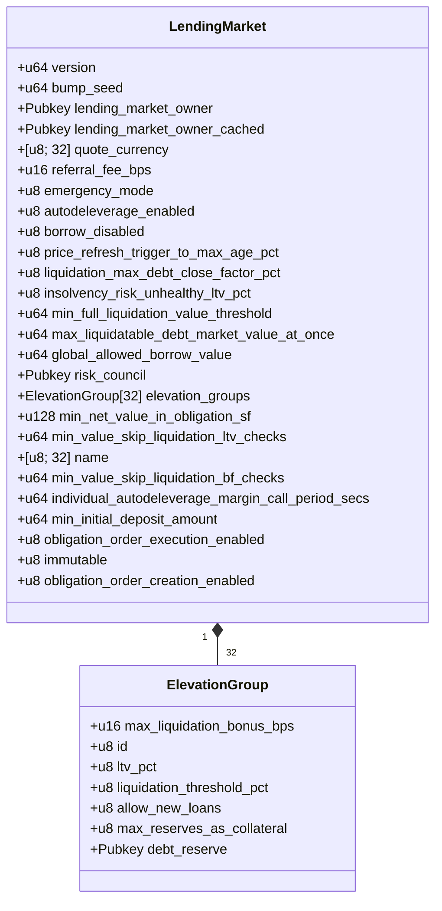

# Lending Market Structure

The Lending Market structure contains all the fields necessary to manage the protocol's global parameters, ownership, and elevation groups.

## Data Structure Overview



## Field Descriptions

### Core Identification

| Field | Type | Description |
|-------|------|-------------|
| `version` | `u64` | Protocol version identifier, used for migrations and upgrades |
| `bump_seed` | `u64` | PDA bump seed for the lending market account |
| `name` | `[u8; 32]` | Human-readable name of the lending market |

### Ownership & Control

| Field | Type | Description |
|-------|------|-------------|
| `lending_market_owner` | `Pubkey` | The current owner of the lending market who has admin rights |
| `lending_market_owner_cached` | `Pubkey` | Cached value of the owner, used during ownership transfers |
| `risk_council` | `Pubkey` | Secondary authority that can make specific risk adjustments |
| `immutable` | `u8` | When set to 1, prevents further updates to the lending market |

### Market Configuration

| Field | Type | Description |
|-------|------|-------------|
| `quote_currency` | `[u8; 32]` | Identifier for the market's quote currency (e.g., "USD") |
| `referral_fee_bps` | `u16` | Referral fee in basis points (1/100th of a percent) |
| `min_initial_deposit_amount` | `u64` | Minimum amount required for initial deposits |

### Risk Parameters

| Field | Type | Description |
|-------|------|-------------|
| `liquidation_max_debt_close_factor_pct` | `u8` | Maximum percentage of debt that can be repaid in a single liquidation |
| `insolvency_risk_unhealthy_ltv_pct` | `u8` | LTV percentage at which a position is considered unhealthy |
| `min_full_liquidation_value_threshold` | `u64` | Minimum position value for applying full liquidation |
| `max_liquidatable_debt_market_value_at_once` | `u64` | Maximum debt value that can be liquidated in one transaction |
| `global_allowed_borrow_value` | `u64` | Maximum total borrowing value allowed across the protocol |
| `min_net_value_in_obligation_sf` | `u128` | Minimum net value required in an obligation (stored as scaled fraction) |
| `min_value_skip_liquidation_ltv_checks` | `u64` | Value threshold below which certain LTV checks are skipped |
| `min_value_skip_liquidation_bf_checks` | `u64` | Value threshold below which certain borrow factor checks are skipped |

### Feature Flags

| Field | Type | Description |
|-------|------|-------------|
| `emergency_mode` | `u8` | When set to 1, enables emergency mode, restricting certain operations |
| `autodeleverage_enabled` | `u8` | When set to 1, enables automatic deleveraging of risky positions |
| `borrow_disabled` | `u8` | When set to 1, disables all borrowing across the protocol |
| `obligation_order_execution_enabled` | `u8` | When set to 1, allows execution of obligation orders |
| `obligation_order_creation_enabled` | `u8` | When set to 1, allows creation of new obligation orders |

### Operational Parameters

| Field | Type | Description |
|-------|------|-------------|
| `price_refresh_trigger_to_max_age_pct` | `u8` | Percentage of max price age that triggers a refresh |
| `individual_autodeleverage_margin_call_period_secs` | `u64` | Grace period in seconds before auto-deleveraging |

### Elevation Groups

| Field | Type | Description |
|-------|------|-------------|
| `elevation_groups` | `ElevationGroup[32]` | Array of up to 32 elevation groups |

## Elevation Group Structure

Each elevation group defines a special relationship between reserves:

| Field | Type | Description |
|-------|------|-------------|
| `max_liquidation_bonus_bps` | `u16` | Maximum liquidation bonus in basis points for this group |
| `id` | `u8` | Unique identifier for the elevation group (1-32) |
| `ltv_pct` | `u8` | Loan-to-value percentage specific to this group |
| `liquidation_threshold_pct` | `u8` | Liquidation threshold percentage for this group |
| `allow_new_loans` | `u8` | When set to 0, prevents new loans in this group |
| `max_reserves_as_collateral` | `u8` | Maximum number of reserves that can be used as collateral |
| `debt_reserve` | `Pubkey` | The reserve that serves as the debt reserve for this group |

## Key Methods

The Lending Market structure implements several important methods:

### Initialization

```
init(&mut self, params: InitLendingMarketParams)
```
Initializes a new lending market with the provided parameters.

### Elevation Group Management

```
get_elevation_group(&self, id: u8) -> Result<Option<&ElevationGroup>>
```
Retrieves an elevation group by its ID.

```
set_elevation_group(&mut self, elevation_group: ElevationGroup) -> Result<()>
```
Adds or updates an elevation group.

### Feature Status Checks

```
is_borrowing_disabled(&self) -> bool
```
Checks if borrowing is currently disabled.

```
is_autodeleverage_enabled(&self) -> bool
```
Checks if automatic deleveraging is enabled.

```
is_obligation_order_execution_enabled(&self) -> bool
```
Checks if obligation order execution is enabled.

```
is_obligation_order_creation_enabled(&self) -> bool
```
Checks if obligation order creation is enabled.

```
is_immutable(&self) -> bool
```
Checks if the lending market is immutable (cannot be modified).

## Detailed Implementation Notes

### Memory Layout

The Lending Market structure is carefully aligned for optimal memory layout:
- Total size is exactly `LENDING_MARKET_SIZE` bytes
- The structure is 8-byte aligned for efficient memory access
- Padding fields ensure proper alignment and reserve space for future additions

### Feature Flags

Feature flags use a boolean representation as `u8`:
- `0` = disabled/false
- `1` = enabled/true

This pattern is used for all boolean flags in the structure.

### Elevation Groups

- Elevation groups are indexed starting from 1 (not 0)
- The special value `ELEVATION_GROUP_NONE` (0) indicates no elevation group
- A maximum of 32 elevation groups can be defined
- Each elevation group has a unique ID between 1 and 32

### Owner Management

The lending market uses a dual-owner field design:
- `lending_market_owner` is the current active owner
- `lending_market_owner_cached` stores the previous owner during ownership transfers

This design adds security during ownership transitions.
