# Obligation Interactions

This document explains how the Obligation component interacts with other parts of the Kamino Lending protocol.

## Key Interaction Patterns

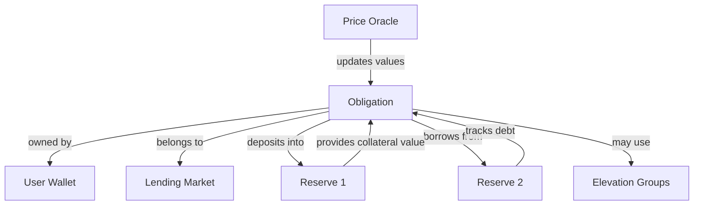

## User Interactions

### Deposit Collateral Flow

When a user deposits collateral into their obligation:

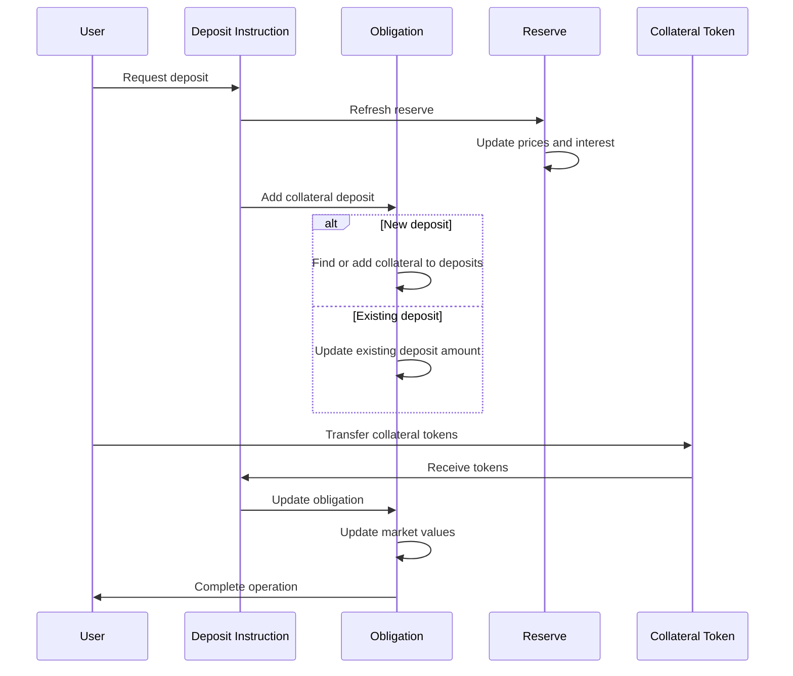

### Borrow Flow

When a user borrows against their obligation:

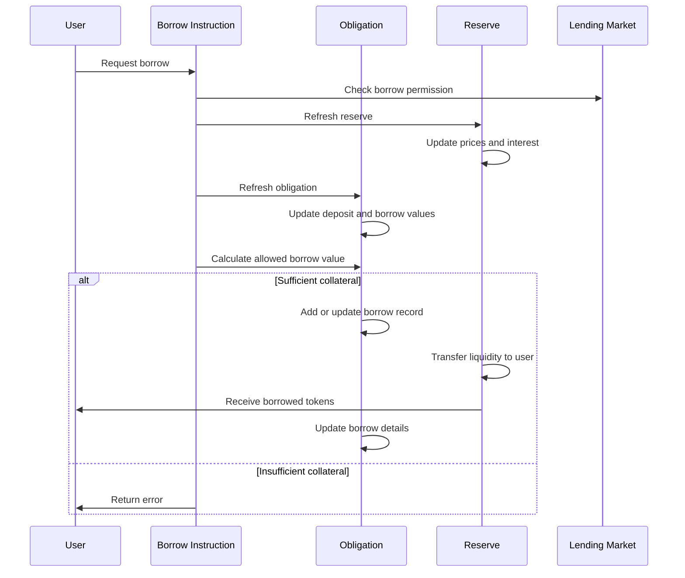

### Repay Flow

When a user repays a loan:

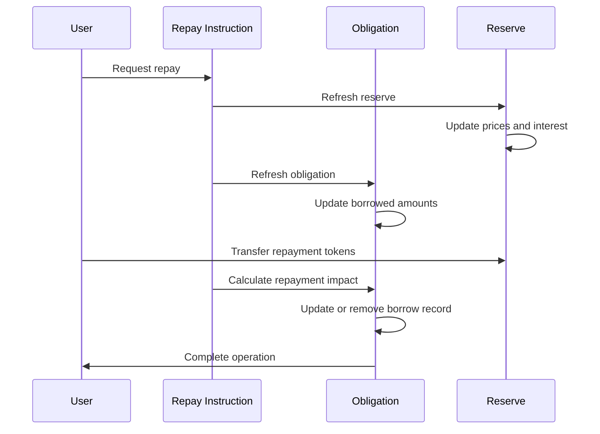

### Withdraw Collateral Flow

When a user withdraws collateral:

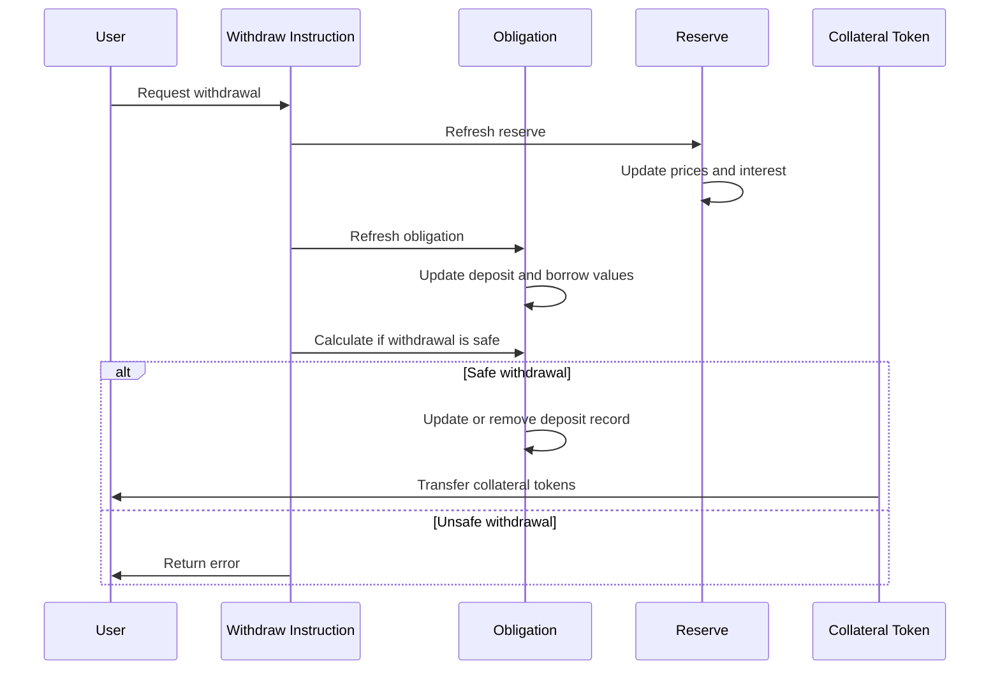

## Reserve Interactions

The Obligation interacts with Reserves in these ways:

### 1. Collateral Management

When a user deposits collateral:
- The Reserve provides collateral tokens
- The Obligation tracks these tokens as collateral
- The Reserve's collateral exchange rate affects valuation
- The Reserve's LTV and liquidation threshold parameters apply

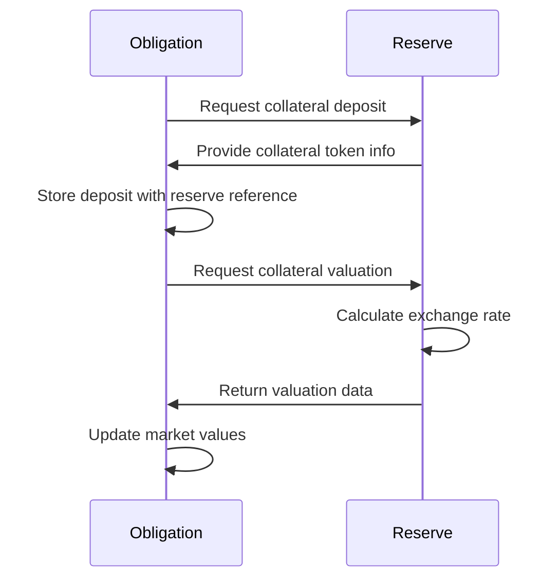

### 2. Borrowing

When a user borrows from a reserve:
- The Obligation records the borrow details
- The Reserve provides the liquidity
- The Reserve's cumulative borrow rate is recorded for interest tracking
- The Obligation uses Reserve risk parameters to calculate borrowing capacity

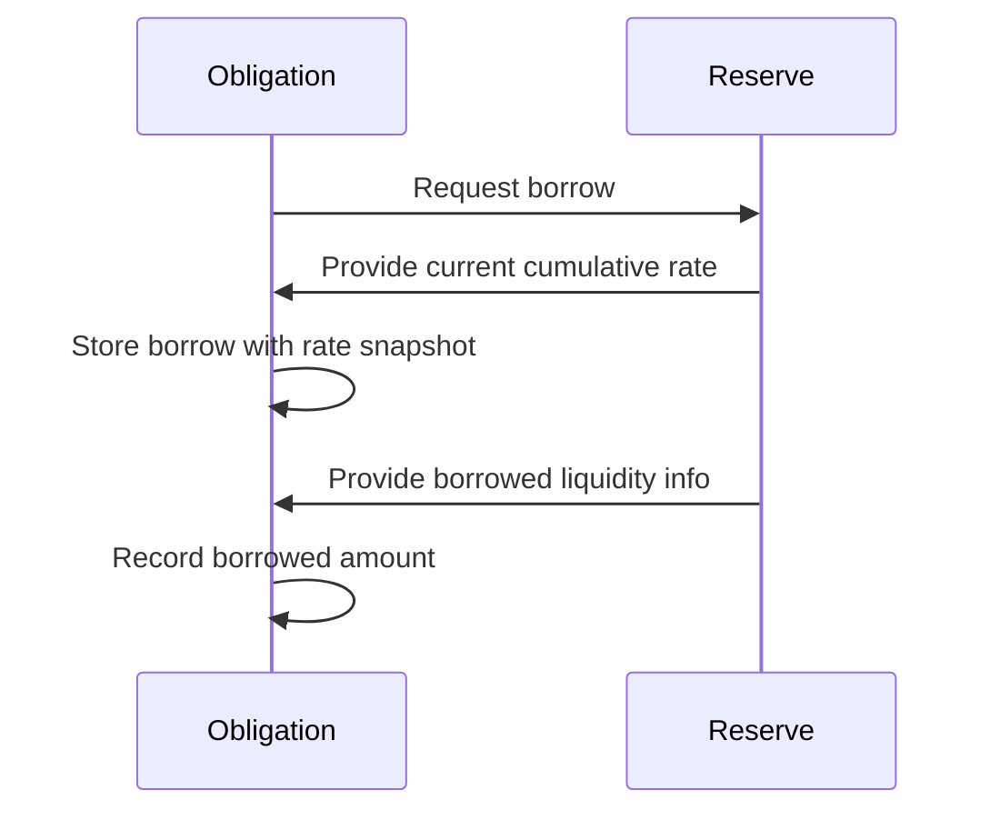

### 3. Interest Accrual

During obligation refresh:
- The Obligation compares current Reserve rates with recorded rates
- Interest is calculated based on rate changes
- Borrowed amounts are updated to include accrued interest

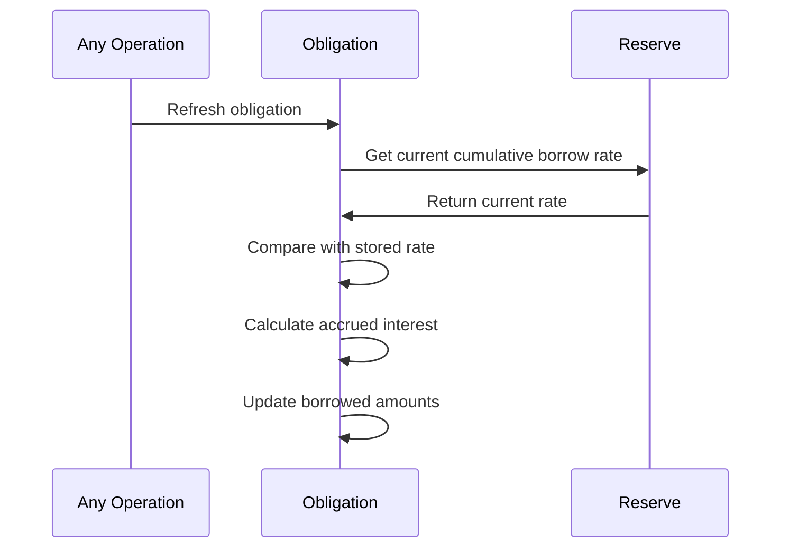

## Lending Market Interactions

The Obligation interacts with the Lending Market in these ways:

### 1. Initialization

When an Obligation is created:
- It must reference a valid Lending Market
- It inherits parameters from the Lending Market
- The Lending Market tracks the Obligation as part of its risk management

### 2. Risk Parameter Application

During operations:
- The Obligation uses Lending Market parameters like insolvency thresholds
- Global liquidation parameters from the Lending Market apply to the Obligation
- Elevation Group definitions from the Lending Market may apply

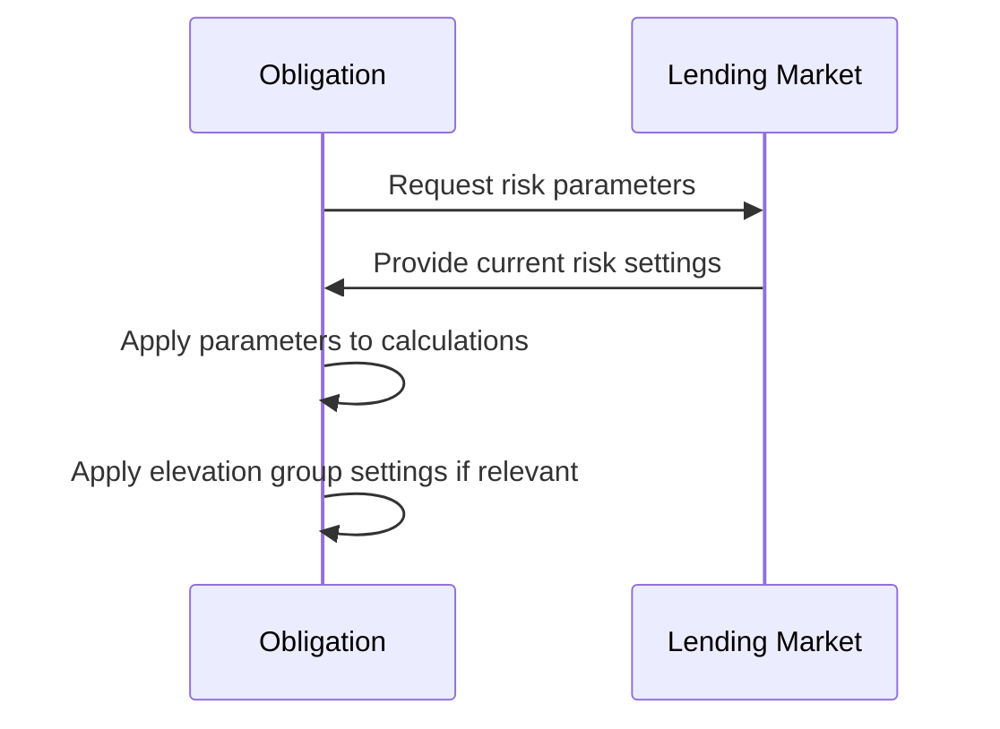

### 3. Emergency Mode

In emergency situations:
- The Lending Market may enable emergency mode
- This affects what operations are allowed on the Obligation
- Borrowing may be disabled, but repayments still allowed

## Price Oracle Interactions

Obligations rely heavily on price oracles for valuation:

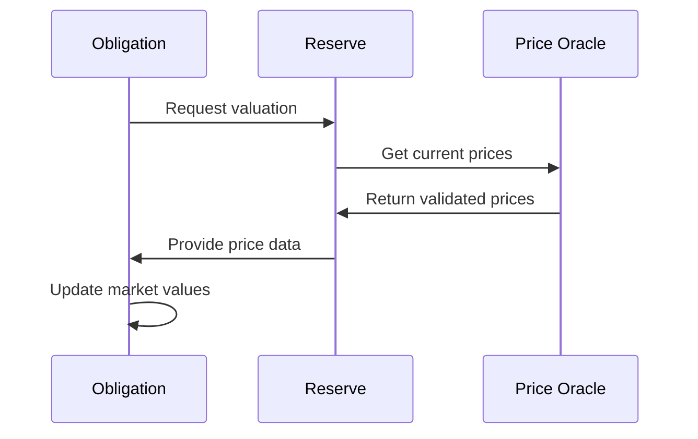

The Obligation:
- Doesn't interact with oracles directly but through Reserves
- Uses current prices to value all deposits and borrows
- Recalculates health metrics whenever prices change
- May become unhealthy due to price movements

## Elevation Group Interactions

If an Obligation is part of an Elevation Group:

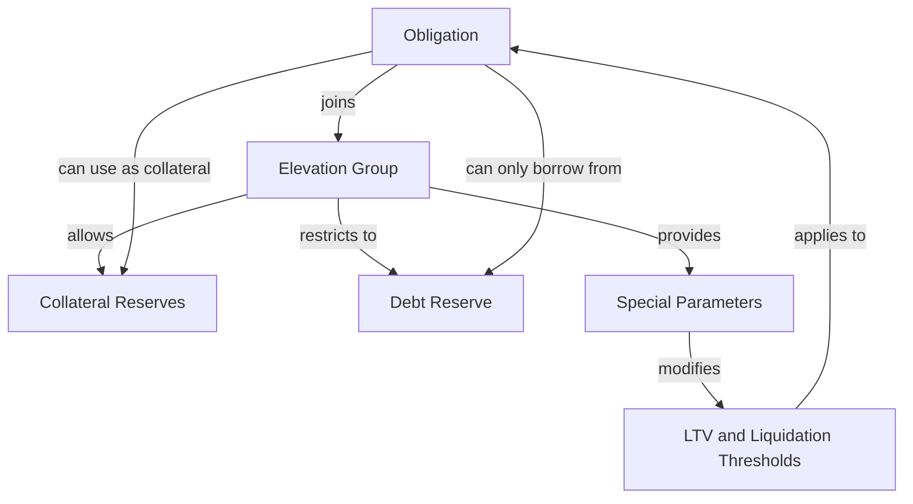

Special interactions include:

1. **Group Membership**: The Obligation can only be part of one elevation group at a time
2. **Borrowing Restrictions**: Can only borrow from the designated debt reserve
3. **Collateral Limitations**: May be limited to specific collateral reserves in the group
4. **Special Parameters**: Uses the group's LTV and liquidation thresholds (typically higher)
5. **Isolation**: Cannot mix with assets outside the group in certain ways

## Liquidation Interactions

When an Obligation becomes unhealthy:

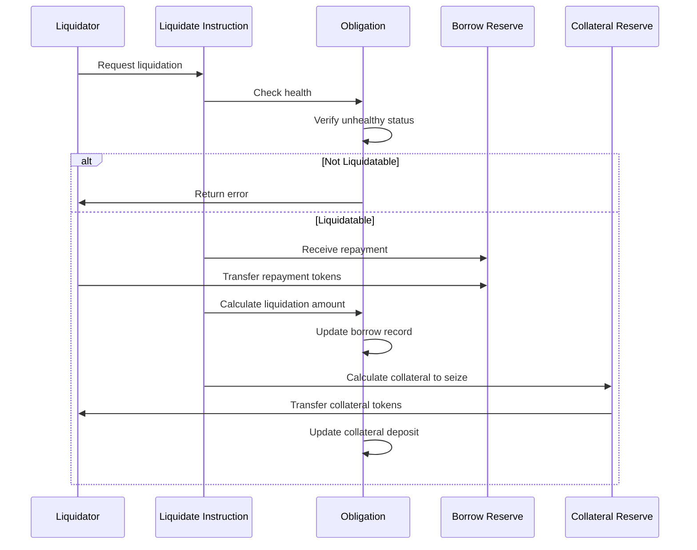

The liquidation process:
1. Verifies the Obligation is actually unhealthy
2. Calculates how much debt can be repaid
3. Determines how much collateral the liquidator receives
4. Updates the Obligation's borrow and deposit records
5. May completely remove a borrow or deposit if fully liquidated

## Auto-Deleveraging Interactions

If the protocol has auto-deleveraging enabled:

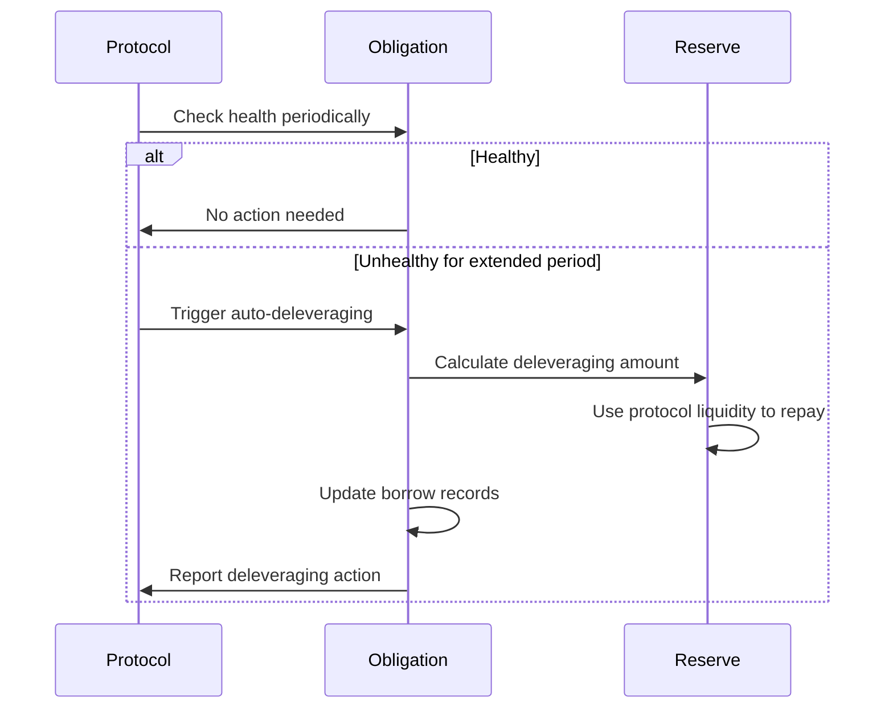

This process:
1. Identifies unhealthy obligations that have remained unhealthy beyond the grace period
2. Uses protocol liquidity to repay part of the debt
3. Updates the obligation's borrow records
4. Charges a fee for the service
5. May restore the obligation to health

## Obligation as a User Position Manager

The Obligation serves as the central manager for a user's position:

1. **Position Tracking**: Maintains the complete record of a user's assets and liabilities
2. **Risk Assessment**: Continuously evaluates position health as prices change
3. **Borrowing Capacity**: Calculates how much the user can safely borrow
4. **Liquidation Management**: Determines when positions are at risk
5. **Record Keeping**: Tracks all collateral and debt across multiple reserves

Understanding these interactions is essential for comprehending how users interact with the protocol and how risk is managed at the individual position level.
