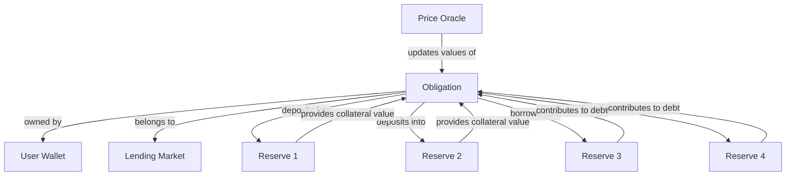
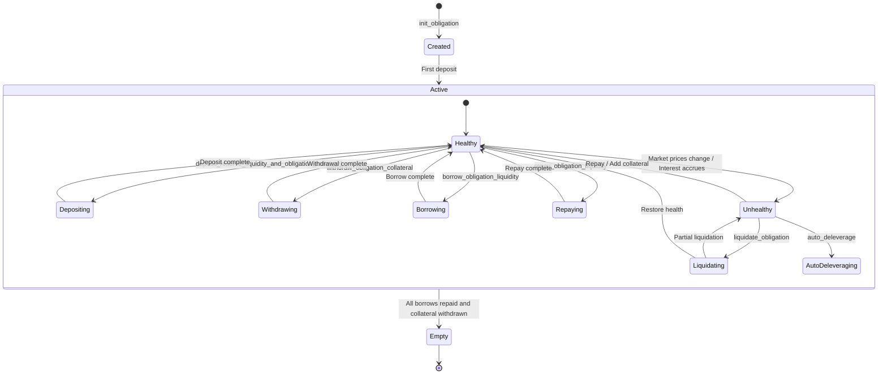

# Obligation Overview

## What is an Obligation?

An Obligation in the Kamino Lending protocol represents a user's complete position, tracking all their collateral deposits and outstanding borrows across multiple reserves. It's the central record of a user's lending and borrowing activity.

## Real-World Analogy

In traditional finance, an Obligation is comparable to your complete relationship with a bank:

- It's like having all your loans and deposits with a bank tracked in a single account
- It includes your collateral (like property or investments backing your loans)
- It tracks your outstanding debts across different types of loans
- It determines your overall credit health and borrowing capacity
- It's used to assess your risk of default and need for margin calls

Similarly, a Kamino Lending Obligation:

- Tracks all your collateral deposits across different token reserves
- Records all your outstanding borrows from various reserves
- Calculates your overall position health based on collateral and borrows
- Determines your liquidation risk based on market prices
- Manages your borrowing capacity across the entire protocol

## Purpose in the Protocol

Obligations serve several critical functions:

1. **Position Tracking**: They provide a unified view of a user's assets and liabilities
2. **Risk Management**: They enable the protocol to assess and manage user risk
3. **Health Calculation**: They facilitate real-time calculation of position health
4. **Liquidation Management**: They determine when positions are eligible for liquidation
5. **Multi-Asset Collateralization**: They allow borrowing against diverse collateral types

## Key Relationships

## Lifecycle of an Obligation

1. **Creation**: An Obligation is initialized for a user in a specific Lending Market
2. **Deposit Phase**: The user deposits collateral into the Obligation from various Reserves
3. **Borrow Phase**: The user borrows liquidity against their collateral
4. **Management Phase**: The user manages their position through additional deposits, withdrawals, borrows, or repayments
5. **Potential Liquidation**: If market conditions change and position health deteriorates, the Obligation may be liquidated
6. **Closure**: The user repays all borrows and withdraws all collateral

## Key Components

An Obligation consists of several key components:

### 1. Basic Information

- Owner: The wallet that owns this Obligation
- Lending Market: The market this Obligation belongs to
- Last update: When the Obligation was last refreshed

### 2. Collateral Deposits

A collection of all collateral deposits across different reserves:
- Reserve address: Which reserve the collateral belongs to
- Deposit amount: How many collateral tokens are deposited
- Market value: Current USD value of the deposit

### 3. Borrows

A collection of all outstanding borrows across different reserves:
- Reserve address: Which reserve the liquidity was borrowed from
- Borrowed amount: How many tokens were borrowed plus accrued interest
- Market value: Current USD value of the borrow

### 4. Position Health Metrics

Various calculated values that indicate position health:
- Allowed borrow value: Maximum value that can be borrowed based on collateral
- Unhealthy borrow value: Value at which the position becomes eligible for liquidation
- Liquidation threshold: Percentage of collateral value that can be borrowed before liquidation
- Loan-to-value ratio: Current ratio of borrowed value to collateral value

## Impact on Protocol Operations

The Obligation state directly affects several critical protocol operations:

1. **Borrowing Capacity**: Determines how much a user can borrow
2. **Liquidation Risk**: Defines when a position becomes eligible for liquidation
3. **Interest Accrual**: Tracks interest on outstanding borrows
4. **Collateral Management**: Manages which reserves are used as collateral
5. **Risk Isolation**: Keeps each user's risk separate from others

Understanding the Obligation structure is essential for comprehending how users interact with the protocol and how risk is managed at the individual position level.
