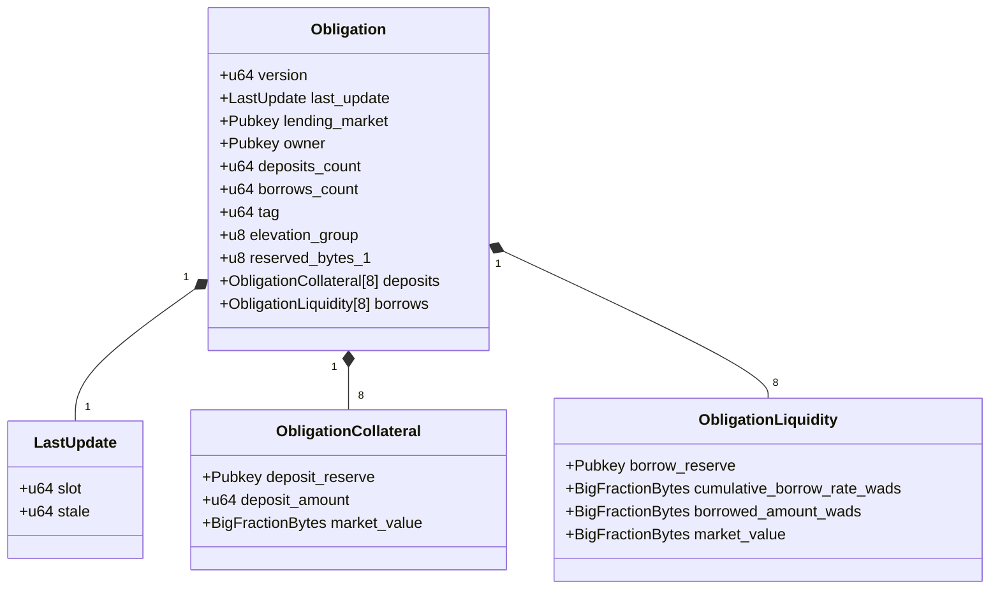

# Obligation Structure

The Obligation structure is a complex data structure that tracks a user's complete position in the Kamino Lending protocol, including all collateral deposits and borrows across multiple reserves.

## Data Structure Overview



## Field Descriptions

### Core Fields

| Field | Type | Description |
|-------|------|-------------|
| `version` | `u64` | Protocol version identifier, used for migrations and upgrades |
| `last_update` | `LastUpdate` | Tracks when the obligation was last updated |
| `lending_market` | `Pubkey` | Address of the parent lending market |
| `owner` | `Pubkey` | Address of the wallet that owns this obligation |
| `deposits_count` | `u64` | Number of active collateral deposits (max 8) |
| `borrows_count` | `u64` | Number of active borrows (max 8) |
| `tag` | `u64` | Optional user-defined tag for identification |
| `elevation_group` | `u8` | ID of the elevation group if active (0 = none) |
| `reserved_bytes_1` | `u8` | Reserved for future use (padding) |

### Collateral Deposits

The `deposits` array contains up to 8 `ObligationCollateral` structures, each with:

| Field | Type | Description |
|-------|------|-------------|
| `deposit_reserve` | `Pubkey` | Address of the reserve where collateral is deposited |
| `deposit_amount` | `u64` | Amount of collateral tokens deposited |
| `market_value` | `BigFractionBytes` | USD value of the deposit (high precision) |

### Borrows

The `borrows` array contains up to 8 `ObligationLiquidity` structures, each with:

| Field | Type | Description |
|-------|------|-------------|
| `borrow_reserve` | `Pubkey` | Address of the reserve borrowed from |
| `cumulative_borrow_rate_wads` | `BigFractionBytes` | Cumulative interest rate when the borrow was created/refreshed |
| `borrowed_amount_wads` | `BigFractionBytes` | Amount borrowed plus accrued interest (high precision) |
| `market_value` | `BigFractionBytes` | USD value of the borrowed amount (high precision) |

## Key Methods

The Obligation structure implements several important methods:

### Initialization

```rust
init(&mut self, params: InitObligationParams)
```
Initializes a new obligation with the provided parameters.

### Deposit Management

```rust
find_or_add_collateral_to_deposits(&mut self, deposit_reserve: Pubkey) -> Result<&mut ObligationCollateral>
```
Finds an existing deposit or adds a new one for the specified reserve.

```rust
find_collateral_in_deposits(&self, deposit_reserve: Pubkey) -> Result<(&ObligationCollateral, usize)>
```
Finds a specific collateral deposit by reserve address.

### Borrow Management

```rust
find_or_add_liquidity_to_borrows(&mut self, borrow_reserve: Pubkey) -> Result<&mut ObligationLiquidity>
```
Finds an existing borrow or adds a new one for the specified reserve.

```rust
find_liquidity_in_borrows(&self, borrow_reserve: Pubkey) -> Result<(&ObligationLiquidity, usize)>
```
Finds a specific borrow by reserve address.

### Health Calculation

```rust
borrowed_value(&self) -> BigFractionBytes
```
Calculates the total borrowed value across all reserves.

```rust
unhealthy_borrow_value(&self, insolvency_risk_unhealthy_ltv_pct: u8) -> BigFractionBytes
```
Calculates the borrowed value that would make this obligation unhealthy.

```rust
allowed_borrow_value(&self) -> BigFractionBytes
```
Calculates the maximum value that can be borrowed based on collateral.

### Position Management

```rust
deposited_value(&self) -> BigFractionBytes
```
Calculates the total value of all deposits.

```rust
remove_collateral_deposit(&mut self, deposit_reserve: Pubkey) -> Result<u64>
```
Removes a collateral deposit from this obligation.

```rust
repay_liquidity_borrow(&mut self, borrow_reserve: Pubkey) -> Result<()>
```
Marks a borrow as fully repaid.

## Detailed Implementation Notes

### Memory Layout

The Obligation structure has a carefully managed memory layout:
- Total size is exactly `OBLIGATION_SIZE` bytes
- The structure is 8-byte aligned for efficient memory access
- Deposits and borrows are fixed arrays for predictable memory usage

### Deposit and Borrow Limits

The obligation has strict limits on the number of positions:
- Maximum of 8 different collateral deposits
- Maximum of 8 different borrows
- This limit helps with gas efficiency and predictable execution

### BigFractionBytes

High-precision values like borrowed amounts and market values use the `BigFractionBytes` type:
- Provides higher precision than standard integers
- Supports fractional values needed for accurate financial calculations
- Backed by the `BigFraction` utility type for mathematical operations

### Elevation Group Integration

If an obligation is part of an elevation group:
- `elevation_group` field will contain the group ID (1-32)
- Special loan-to-value and liquidation thresholds apply
- Borrowing is restricted to the designated debt reserve for that group
- Collateral may be limited to specific reserves in that group

### Position Health Calculation

Position health uses several related calculations:
- `deposited_value()`: Sum of all collateral values
- `borrowed_value()`: Sum of all borrowed amounts
- `allowed_borrow_value()`: Maximum borrowing capacity based on collateral LTVs
- `unhealthy_borrow_value()`: Threshold at which liquidation becomes possible

### Refresh Process

The obligation refresh process is critical:
1. Updates market values of all deposits based on current prices
2. Accrues interest on all borrows based on time elapsed
3. Recalculates position health metrics
4. Updates the `last_update` timestamp

### Liquidation Eligibility

An obligation becomes eligible for liquidation when:
- `borrowed_value > unhealthy_borrow_value`
- Which occurs when the loan-to-value ratio exceeds the liquidation threshold

### Elevation Groups and Isolation

The obligation structure supports two special lending modes:
1. **Elevation Groups**: Special asset relationships with custom parameters
2. **Isolated Assets**: Assets that have specific borrowing restrictions

When using these modes, the obligation may have additional constraints on which reserves can be used together.
