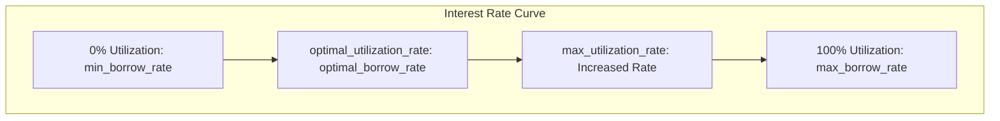

# Reserve Calculations

This document provides detailed explanations of the key calculations performed by Reserve objects in the Kamino Lending protocol.

## Interest Rate Model

The interest rate model is fundamental to the protocol's operation. It determines the cost of borrowing and the yield for lenders based on the current utilization of the reserve.

### Utilization Ratio

The utilization ratio measures what percentage of the total liquidity is currently being borrowed:

```
Utilization = Borrowed Amount / (Borrowed Amount + Available Liquidity)
```

For example, if a reserve has 100 USDC borrowed and 400 USDC available:
```
Utilization = 100 / (100 + 400) = 0.2 = 20%
```

### Interest Rate Calculation

The interest rate curve is a two-slope model defined by five key parameters:

1. `min_borrow_rate` - The minimum interest rate when utilization is 0%
2. `optimal_borrow_rate` - The interest rate at the optimal utilization point
3. `max_borrow_rate` - The maximum interest rate at 100% utilization
4. `optimal_utilization_rate` - The target utilization percentage (typically 70-80%)
5. `max_utilization_rate` - The utilization rate before maximum rates apply (typically 90-95%)



The borrow rate is calculated as follows:

For utilization ≤ optimal_utilization_rate:
```
Borrow Rate = min_borrow_rate + (utilization / optimal_utilization_rate) * (optimal_borrow_rate - min_borrow_rate)
```

For optimal_utilization_rate < utilization ≤ max_utilization_rate:
```
Borrow Rate = optimal_borrow_rate + ((utilization - optimal_utilization_rate) / (max_utilization_rate - optimal_utilization_rate)) * (max_borrow_rate - optimal_borrow_rate)
```

For utilization > max_utilization_rate:
```
Borrow Rate = max_borrow_rate
```

#### Example Calculation

With parameters:
- min_borrow_rate = 1% (0.01)
- optimal_borrow_rate = 10% (0.10)
- max_borrow_rate = 150% (1.50)
- optimal_utilization_rate = 80% (0.80)
- max_utilization_rate = 90% (0.90)

For a utilization of 60%:
```
Borrow Rate = 0.01 + (0.60 / 0.80) * (0.10 - 0.01)
Borrow Rate = 0.01 + 0.75 * 0.09
Borrow Rate = 0.01 + 0.0675
Borrow Rate = 0.0775 = 7.75%
```

### Interest Accrual

Interest accrues on every slot that has activity and is calculated as:

```
New Cumulative Borrow Rate = Previous Cumulative Borrow Rate * (1 + Borrow Rate * Elapsed Time)
```

Where:
- Elapsed Time = (Current Slot - Last Updated Slot) / Slots Per Year

For example, if 1000 slots have passed with a 10% borrow rate and slots per year = 63,072,000:
```
Elapsed Time = 1000 / 63,072,000 = 0.0000158...
Interest Factor = 1 + (0.10 * 0.0000158...) = 1.00000158...
New Cumulative Rate = Previous Cumulative Rate * 1.00000158...
```

The borrowed amount is then updated:
```
New Borrowed Amount = Borrowed Principal * New Cumulative Borrow Rate
```

## Collateral Exchange Rate

The collateral exchange rate determines how much underlying liquidity a collateral token represents:

```
Collateral Exchange Rate = Total Liquidity / Collateral Supply
```

Where:
- Total Liquidity = Available Amount + Borrowed Amount

For example, if a reserve has:
- Available Amount: 400 USDC
- Borrowed Amount: 600 USDC
- Collateral Supply: 950 cUSDC

```
Collateral Exchange Rate = (400 + 600) / 950 = 1000 / 950 = 1.0526...
```

This means each cUSDC token is worth 1.0526... USDC.

### Deposit Calculation

When a user deposits liquidity, they receive collateral tokens based on the exchange rate:

```
Collateral Amount = Liquidity Amount / Collateral Exchange Rate
```

For example, depositing 100 USDC with the above exchange rate:
```
Collateral Amount = 100 / 1.0526... = 95.0 cUSDC
```

### Withdrawal Calculation

When a user redeems collateral, they receive liquidity based on the exchange rate:

```
Liquidity Amount = Collateral Amount * Collateral Exchange Rate
```

For example, redeeming 50 cUSDC with the above exchange rate:
```
Liquidity Amount = 50 * 1.0526... = 52.63 USDC
```

## Borrow Calculations

### Maximum Borrow Amount

The maximum amount a user can borrow depends on their collateral value and the loan-to-value (LTV) ratio:

```
Max Borrow Value = Collateral Value * LTV Ratio
```

For example, with $1000 of collateral and 80% LTV:
```
Max Borrow Value = $1000 * 0.80 = $800
```

### Borrow Fee Calculation

When borrowing, fees are calculated as:

```
Borrow Fee = Amount to Borrow * Borrow Fee Rate
```

The fees are divided between:
- Protocol Fee: Collected by the protocol
- Host Fee: Collected by the frontend/referrer
- Flash Loan Fee: Applied on flash loans

For example, borrowing 100 USDC with a 0.3% borrow fee:
```
Borrow Fee = 100 * 0.003 = 0.3 USDC
```

### Borrow Limit Verification

Before allowing a borrow, the protocol checks:
1. User position remains healthy (borrowed value ≤ max borrow value)
2. Global borrow limit is not exceeded
3. Reserve-specific borrow limit is not exceeded

## Liquidation Calculations

### Liquidation Threshold

A position becomes liquidatable when its loan-to-value ratio exceeds the liquidation threshold:

```
Current LTV = Total Borrowed Value / Total Collateral Value
Liquidatable if Current LTV > Liquidation Threshold
```

For example, with:
- Total Borrowed Value: $850
- Total Collateral Value: $1000
- Liquidation Threshold: 83%

```
Current LTV = $850 / $1000 = 85%
85% > 83%, so the position is liquidatable
```

### Liquidation Amount

The maximum amount that can be liquidated in a single transaction is:

```
Max Liquidation Amount = Min(
    Borrowed Amount,
    Borrowed Amount * Liquidation Close Factor,
    Max Liquidatable Debt Market Value
)
```

Where:
- Liquidation Close Factor: Percentage of debt that can be closed (e.g., 50%)
- Max Liquidatable Debt Market Value: Protocol-wide maximum for a single liquidation

### Liquidation Bonus

The bonus received by liquidators is calculated as:

```
Liquidation Value = Repayment Amount * (1 + Liquidation Bonus)
```

The liquidation bonus varies by asset and is constrained by the maximum liquidation bonus parameter. For example, repaying 100 USDC with a 10% liquidation bonus:

```
Liquidation Value = 100 * (1 + 0.10) = 110 USDC
```

This means the liquidator can claim $110 worth of collateral for repaying $100 of debt.

## Fee Calculations

### Protocol Fees

Protocol fees are calculated based on interest accrued:

```
Protocol Fee = Accrued Interest * Protocol Take Rate
```

For example, if $10 of interest accrued with a 20% protocol take rate:
```
Protocol Fee = $10 * 0.20 = $2
```

### Referral Fees

Referral fees are calculated as a percentage of the borrow fee:

```
Referral Fee = Borrow Fee * Referral Fee Percentage
```

For example, with a $0.3 borrow fee and 20% referral fee percentage:
```
Referral Fee = $0.3 * 0.20 = $0.06
```

## Scaling and Precision

Many calculations in the protocol use high-precision arithmetic to avoid rounding errors:

- Borrow amounts and cumulative rates use `BigFractionBytes` for 128+ bits of precision
- Interest rates use scaled fractions (e.g., `min_borrow_rate_sf`) representing values as x/10^15
- Exchange rates use specialized types to maintain precision during calculations

For example, a value stored as 10,000,000,000,000,000 in `min_borrow_rate_sf` represents:
```
10,000,000,000,000,000 / 10^15 = 0.01 = 1%
```

## Token Price Impact

All value calculations incorporate token prices from oracles:

```
Token Value = Token Amount * Token Price
```

Oracle prices are regularly refreshed to ensure accurate valuation of collateral and debt.

## Elevation Group Adjustments

When elevation groups are involved, borrowing calculations adjust:

1. The loan-to-value ratio may be higher for designated collateral-debt pairings
2. Borrowed amounts are tracked separately by elevation group
3. Special liquidation thresholds may apply to elevation group positions

For example, if SOL and USDC are in an elevation group with 90% LTV (vs. normal 80% LTV):
```
Max Borrow Value (elevated) = $1000 * 0.90 = $900
Max Borrow Value (normal) = $1000 * 0.80 = $800
```

## Risk Parameter Impact

Several risk parameters directly affect calculations:

- `loan_to_value_pct`: Controls maximum borrowing capacity
- `liquidation_threshold_pct`: Determines when positions become liquidatable
- `max_liquidation_bonus_bps`: Limits the bonus for liquidators
- `optimal_utilization_rate`: Influences the interest rate model
- `protocol_take_rate_pct`: Determines fee distribution

These parameters are carefully calibrated for each asset based on its volatility, liquidity, and market conditions.
