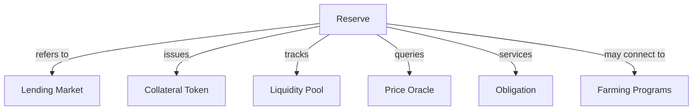
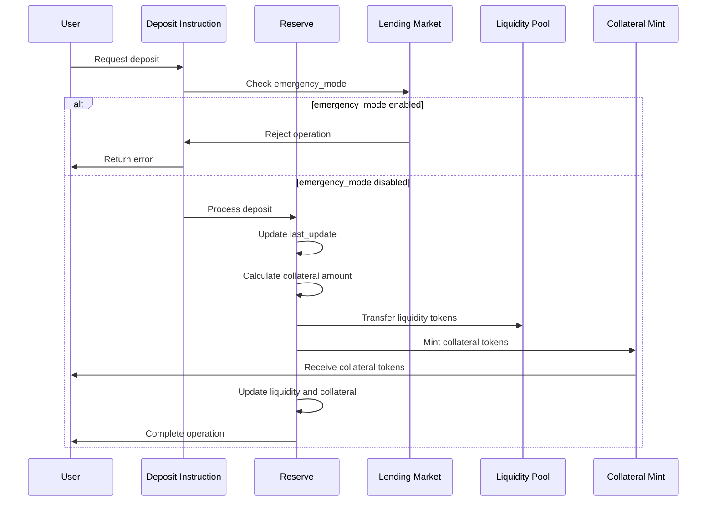
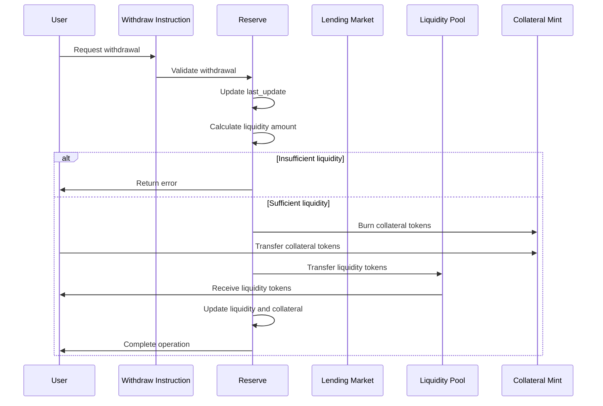
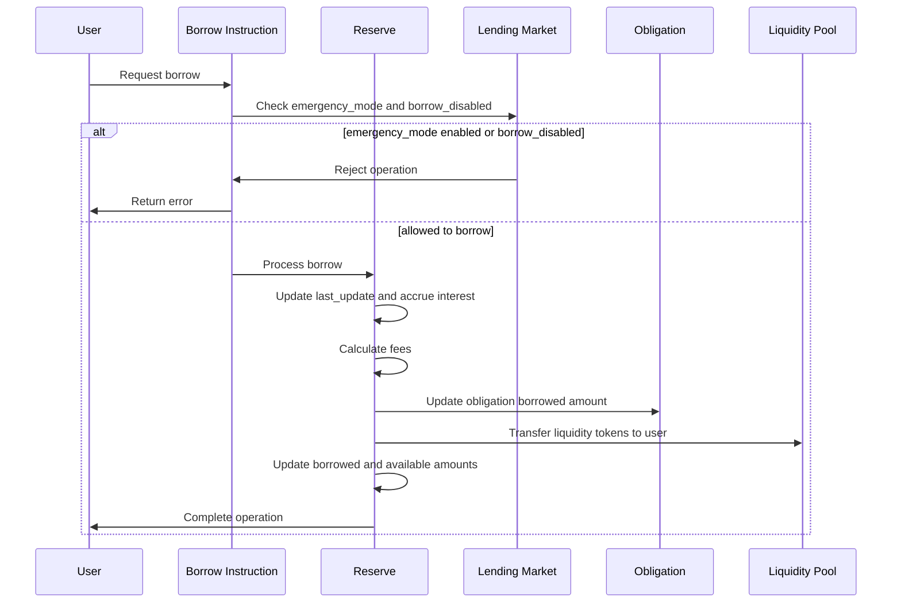
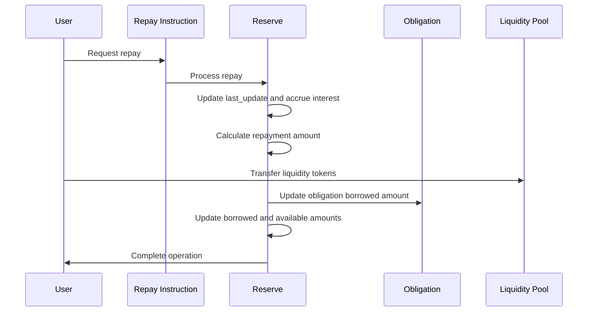
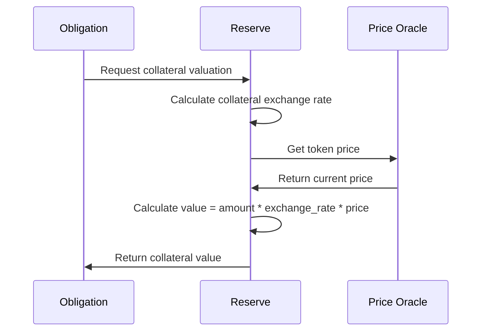
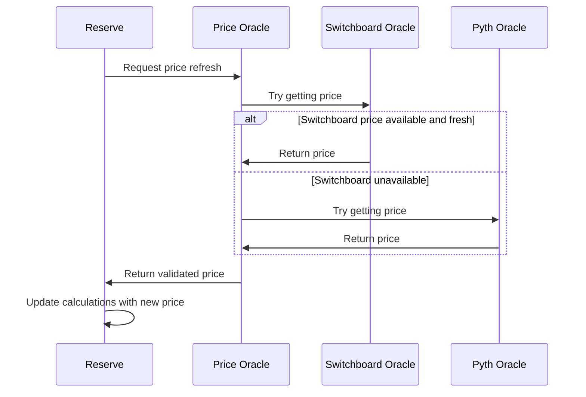
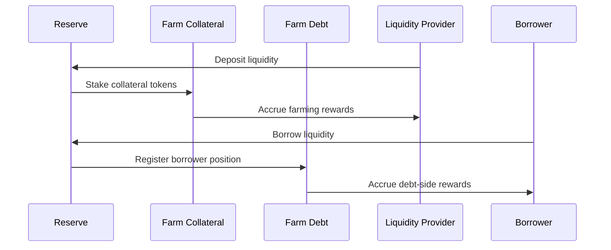
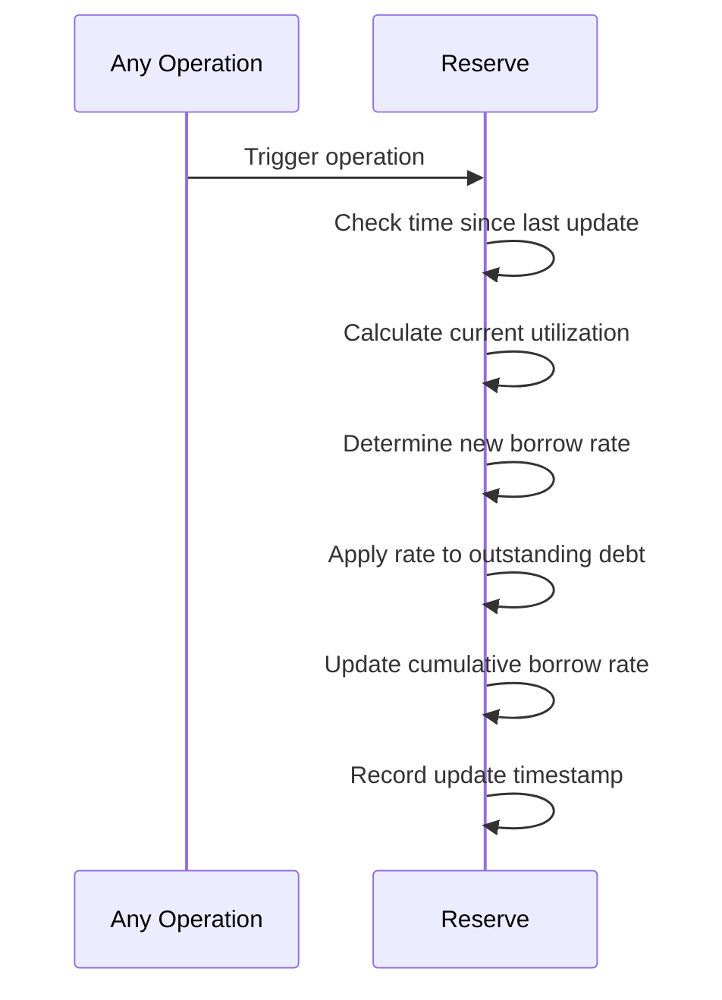
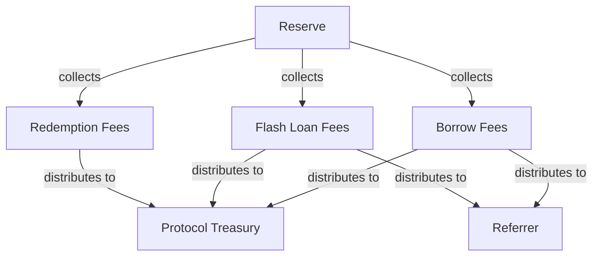

# Reserve Interactions

This document explains how the Reserve component interacts with other parts of the Kamino Lending protocol.

## Key Interaction Patterns

## User Interactions

### Deposit Flow

When a user deposits liquidity into a reserve:

### Withdraw Flow

When a user withdraws from a reserve:

### Borrow Flow

When a user borrows from a reserve:

### Repay Flow

When a user repays a loan:

## Lending Market Interactions

The Reserve interacts with the Lending Market in these ways:

### 1. Initialization

When a new Reserve is created:
- The Lending Market owner must authorize the creation
- The Reserve stores a reference to its parent Lending Market
- The Reserve inherits certain global parameters from the Lending Market

### 2. Parameter Verification

During operations, the Reserve:
- Checks the Lending Market's emergency mode status
- Validates that borrowing is not disabled globally
- Applies the Lending Market's referral fee settings
- May apply Elevation Group settings from the Lending Market

### 3. Risk Parameter Updates

When risk parameters are updated:
- The Lending Market owner typically initiates the change
- The Reserve applies the new parameters to its configuration
- Existing and new loans are affected by the parameter changes

## Obligation Interactions

Reserves interact with Obligations in several important ways:

### 1. Collateral Management

When an Obligation uses a Reserve's collateral:
- The Obligation tracks the collateral deposit amount
- The Reserve provides the collateral exchange rate
- The Reserve's collateral valuation affects the Obligation's borrow limit

### 2. Loan Servicing

When an Obligation borrows from a Reserve:
- The Reserve provides the liquidity tokens
- The Obligation records the borrowed amount
- The Reserve tracks the total borrowed amount
- Interest accrues on the borrowed amount

### 3. Health Calculation

During Obligation health checks:
- The Reserve provides current token prices
- The Reserve supplies liquidation thresholds
- The Reserve's loan-to-value parameters affect liquidation risk

## Oracle Interactions

Reserves rely heavily on price oracles:

The Reserve:
- Regularly refreshes price data for accurate valuations
- Validates price freshness to avoid stale data
- May use multiple oracle sources for redundancy
- Uses price data for all value calculations

## Farm Program Interactions

If farming programs are connected:

The Reserve may:
1. Connect with a collateral farm to provide yield to depositors
2. Connect with a debt farm to provide incentives to borrowers
3. Track farming positions alongside lending positions
4. Route rewards to appropriate users

## Interest Rate Updates

Interest rates are dynamically updated based on reserve utilization:

This happens:
- On every operation that affects the reserve
- When the reserve is explicitly refreshed
- Before any borrow or liquidation calculation

## Fee Collection and Distribution

The Reserve manages several types of fees:

When fees are collected:
1. The fee amount is calculated based on the operation
2. A portion goes to the protocol treasury
3. A portion may go to referrers
4. Fees accumulate until explicitly claimed

## Reserve as a State Controller

The Reserve serves as a state controller for several important protocol aspects:

1. **Liquidity Management**: Controls the flow of tokens in and out of the protocol
2. **Exchange Rate Tracking**: Maintains the relationship between collateral and underlying tokens
3. **Interest Accrual**: Ensures borrowed amounts grow appropriately over time
4. **Risk Parameter Application**: Applies risk settings to all operations
5. **Price Integration**: Bridges between market prices and protocol valuations

Understanding these interactions is essential for comprehending how the Reserve integrates with the broader protocol ecosystem.
