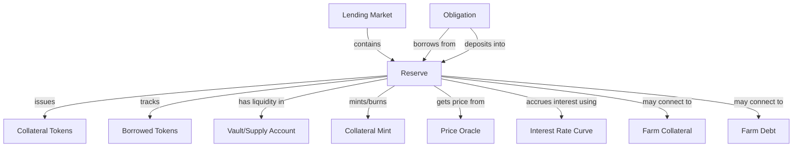
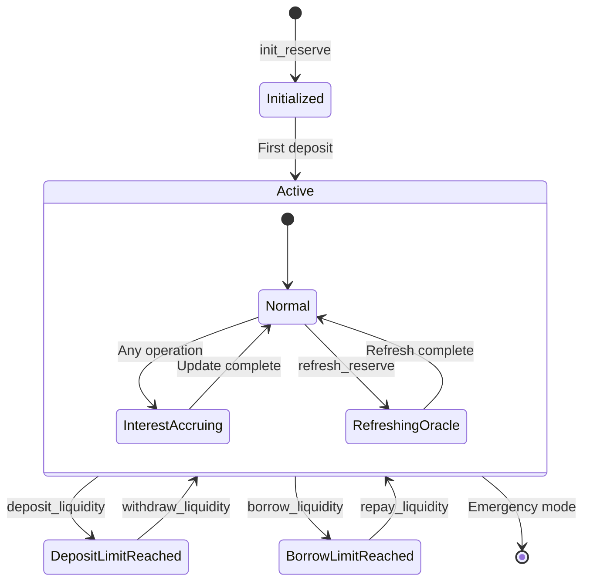

# Reserve Overview

## What is a Reserve?

A Reserve in the Kamino Lending protocol represents a specific token pool available for lending and borrowing. Each supported asset in the protocol has its own dedicated Reserve that manages all operations involving that asset.

## Real-World Analogy

In traditional finance, a Reserve is comparable to a bank's specialized department for a particular currency:

- It accepts deposits of a specific currency and issues interest-bearing certificates in return
- It lends that currency to borrowers who pay interest on their loans
- It manages the risk parameters specific to that currency
- It maintains a balance between deposits and loans to ensure liquidity

Similarly, a Kamino Lending Reserve:

- Accepts deposits of a specific token and issues interest-bearing collateral tokens in return
- Allows borrowing of that token against sufficient collateral in other reserves
- Has custom risk parameters based on the token's volatility and liquidity
- Dynamically adjusts interest rates to balance supply and demand

## Purpose in the Protocol

Reserves serve several critical functions:

1. **Liquidity Pools**: They aggregate user deposits to create lending liquidity for each asset
2. **Risk Isolation**: Each token's specific risk parameters are contained within its own Reserve
3. **Interest Rate Management**: Each Reserve dynamically adjusts interest rates based on utilization
4. **Collateralization**: Reserves track how their tokens are used as collateral in obligations
5. **Exchange Rate Tracking**: Reserves maintain the exchange rate between liquidity and collateral tokens

## Key Relationships

## Lifecycle of a Reserve

1. **Creation**: A Reserve is initialized by the lending market admin with specific risk parameters
2. **Deposit Phase**: Users deposit tokens into the Reserve and receive collateral tokens
3. **Borrowing Phase**: Users borrow tokens from the Reserve against collateral
4. **Interest Accrual**: Interest continuously accrues to lenders and borrowers
5. **Repayments/Withdrawals**: Users repay loans or withdraw deposits as needed
6. **Parameter Updates**: Risk parameters may be adjusted by governance

## Key Components

A Reserve consists of three main components:

### 1. Reserve Liquidity

This component tracks the actual tokens available for lending, borrowed amounts, and interest accrual:

- Token mint and supply accounts
- Available amount for borrowing
- Total borrowed amount with accrued interest
- Cumulative borrow rate for interest calculation
- Last update slot for interest accrual

### 2. Reserve Collateral

This component manages the collateral tokens that represent depositor shares of the Reserve:

- Collateral mint and supply accounts
- Total collateral token supply
- Exchange rate between collateral and liquidity

### 3. Reserve Config

This component contains all risk parameters and configuration settings:

- Optimal utilization point and interest rate curves
- Fee structure and recipients
- Loan-to-value and liquidation thresholds
- Deposit and borrow limits
- Protocol take rate

## Impact on Protocol Operations

The Reserve state directly affects several critical protocol operations:

1. **Exchange Rate Calculations**: Determines how many collateral tokens are minted for deposits
2. **Interest Rate Calculations**: Determines borrowing costs based on utilization
3. **Borrowing Capacity**: Influences how much users can borrow against collateral
4. **Liquidation Risk**: Defines when positions become eligible for liquidation
5. **Fee Generation**: Controls how protocol and referral fees are calculated

Understanding the Reserve structure is essential for comprehending the core lending and borrowing mechanics of the protocol.
