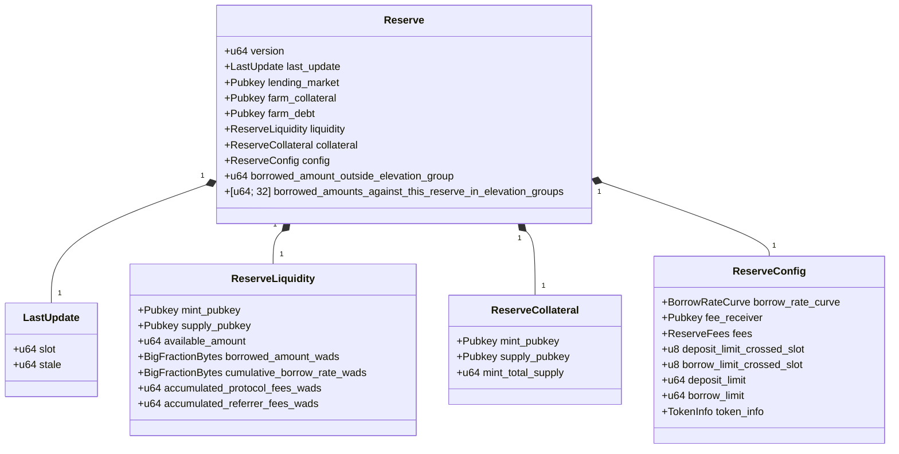
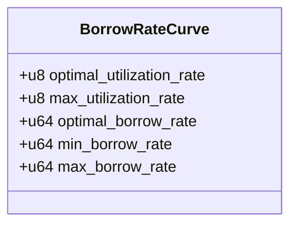
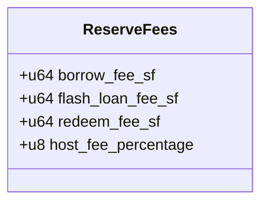
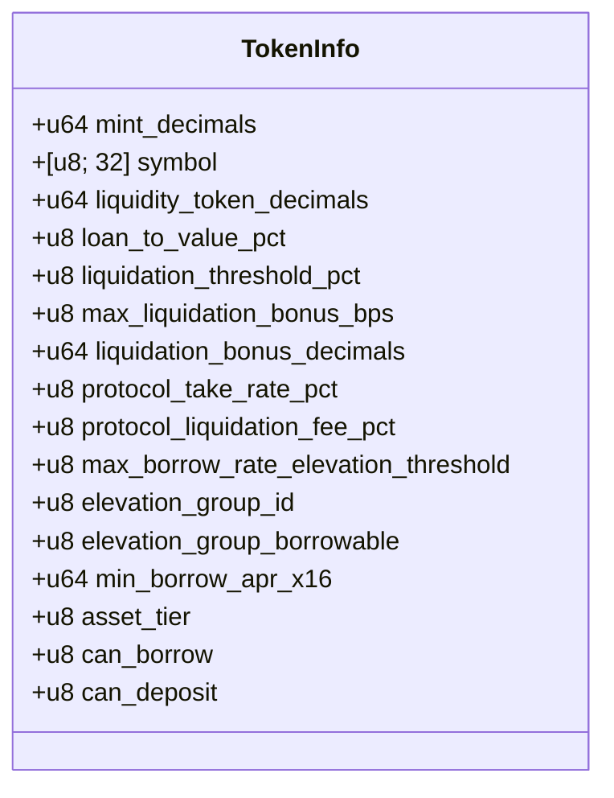

# Reserve Structure

The Reserve structure is one of the most complex and important data structures in the Kamino Lending protocol. It contains all the fields necessary to manage a specific token's lending pool.

## Data Structure Overview



## Field Descriptions

### Core Fields

| Field | Type | Description |
|-------|------|-------------|
| `version` | `u64` | Protocol version identifier, used for migrations and upgrades |
| `last_update` | `LastUpdate` | Tracks when the reserve was last updated |
| `lending_market` | `Pubkey` | Address of the parent lending market |
| `farm_collateral` | `Pubkey` | Optional address of a farming program for collateral rewards |
| `farm_debt` | `Pubkey` | Optional address of a farming program for debt rewards |

### Reserve Liquidity

The `liquidity` field contains a `ReserveLiquidity` structure with these fields:

| Field | Type | Description |
|-------|------|-------------|
| `mint_pubkey` | `Pubkey` | Address of the token mint |
| `supply_pubkey` | `Pubkey` | Address of the supply SPL Token account |
| `available_amount` | `u64` | Amount of tokens available for borrowing |
| `borrowed_amount_wads` | `BigFractionBytes` | Total amount borrowed including accrued interest (high precision) |
| `cumulative_borrow_rate_wads` | `BigFractionBytes` | Accumulated interest rate multiplier (high precision) |
| `accumulated_protocol_fees_wads` | `u64` | Accumulated fees for the protocol (high precision) |
| `accumulated_referrer_fees_wads` | `u64` | Accumulated fees for referrers (high precision) |

### Reserve Collateral

The `collateral` field contains a `ReserveCollateral` structure with these fields:

| Field | Type | Description |
|-------|------|-------------|
| `mint_pubkey` | `Pubkey` | Address of the collateral token mint |
| `supply_pubkey` | `Pubkey` | Address of the collateral supply SPL Token account |
| `mint_total_supply` | `u64` | Total supply of collateral tokens |

### Reserve Config

The `config` field contains a `ReserveConfig` structure with these fields:

| Field | Type | Description |
|-------|------|-------------|
| `borrow_rate_curve` | `BorrowRateCurve` | Parameters defining the interest rate model |
| `fee_receiver` | `Pubkey` | Account that receives collected fees |
| `fees` | `ReserveFees` | Fee structure for this reserve |
| `deposit_limit_crossed_slot` | `u8` | Slot when deposit limit was crossed (for time-based restrictions) |
| `borrow_limit_crossed_slot` | `u8` | Slot when borrow limit was crossed (for time-based restrictions) |
| `deposit_limit` | `u64` | Maximum allowed deposit amount |
| `borrow_limit` | `u64` | Maximum allowed borrow amount |
| `token_info` | `TokenInfo` | Information about the token in this reserve |

### Elevation Group Tracking

| Field | Type | Description |
|-------|------|-------------|
| `borrowed_amount_outside_elevation_group` | `u64` | Total amount borrowed outside any elevation group |
| `borrowed_amounts_against_this_reserve_in_elevation_groups` | `[u64; 32]` | Borrowed amounts per elevation group |

## Sub-Structures

### BorrowRateCurve



The `BorrowRateCurve` defines how interest rates change based on utilization:

| Field | Type | Description |
|-------|------|-------------|
| `optimal_utilization_rate` | `u8` | Target utilization rate (as percentage) |
| `max_utilization_rate` | `u8` | Maximum utilization rate before special rates apply (as percentage) |
| `optimal_borrow_rate` | `u64` | Borrow rate at optimal utilization (stored as scaled fraction) |
| `min_borrow_rate` | `u64` | Minimum borrow rate (stored as scaled fraction) |
| `max_borrow_rate` | `u64` | Maximum borrow rate (stored as scaled fraction) |

### ReserveFees



The `ReserveFees` structure defines various fees for the reserve:

| Field | Type | Description |
|-------|------|-------------|
| `borrow_fee_sf` | `u64` | Fee charged on borrows (scaled fraction) |
| `flash_loan_fee_sf` | `u64` | Fee charged on flash loans (scaled fraction) |
| `redeem_fee_sf` | `u64` | Fee charged when redeeming collateral (scaled fraction) |
| `host_fee_percentage` | `u8` | Percentage of fees allocated to the host/frontend |

### TokenInfo



The `TokenInfo` contains detailed information about the token and its risk parameters:

| Field | Type | Description |
|-------|------|-------------|
| `mint_decimals` | `u64` | Number of decimal places in the token |
| `symbol` | `[u8; 32]` | Token symbol (e.g., "SOL", "USDC") |
| `liquidity_token_decimals` | `u64` | Token decimal places (typically same as `mint_decimals`) |
| `loan_to_value_pct` | `u8` | Maximum loan-to-value ratio as a percentage |
| `liquidation_threshold_pct` | `u8` | LTV threshold for liquidation as a percentage |
| `max_liquidation_bonus_bps` | `u8` | Maximum bonus for liquidators in basis points |
| `liquidation_bonus_decimals` | `u64` | Decimal precision for liquidation bonus |
| `protocol_take_rate_pct` | `u8` | Percentage of interest taken by protocol |
| `protocol_liquidation_fee_pct` | `u8` | Protocol fee percentage on liquidations |
| `max_borrow_rate_elevation_threshold` | `u8` | Special threshold for elevated borrowing |
| `elevation_group_id` | `u8` | ID of the elevation group if applicable (0 = none) |
| `elevation_group_borrowable` | `u8` | Whether token can be borrowed in its elevation group |
| `min_borrow_apr_x16` | `u64` | Minimum annual borrow rate (fixed-point representation) |
| `asset_tier` | `u8` | Classification of asset (0=Regular, 1=IsolatedCollateral, 2=IsolatedDebt) |
| `can_borrow` | `u8` | Whether this token can be borrowed (1=yes, 0=no) |
| `can_deposit` | `u8` | Whether this token can be deposited (1=yes, 0=no) |

## Key Methods

The Reserve structure implements several important methods:

### Initialization

```rust
init(&mut self, params: InitReserveParams)
```
Initializes a new reserve with the provided parameters.

### Interest Rate Calculation

```rust
current_borrow_rate(&self) -> Result<Fraction>
```
Calculates the current borrow rate based on utilization and the borrow rate curve.

### Liquidity Operations

```rust
deposit_liquidity(&mut self, liquidity_amount: u64, collateral_amount: u64) -> Result<()>
```
Processes a deposit of tokens into the reserve.

```rust
redeem_collateral(&mut self, collateral_amount: u64) -> Result<u64>
```
Redeems collateral tokens for underlying tokens.

### Interest Accrual

```rust
accrue_interest(&mut self, current_slot: Slot, referral_fee_bps: u16) -> Result<()>
```
Accrues interest based on time elapsed since the last update.

### Borrow Calculations

```rust
calculate_borrow(&self, amount_to_borrow: u64, ...) -> Result<CalculateBorrowResult>
```
Calculates the results of a borrow operation including fees.

```rust
calculate_repay(&self, amount_to_repay: u64, borrowed_amount: Fraction) -> CalculateRepayResult
```
Calculates the results of a repay operation.

### Exchange Rate

```rust
collateral_exchange_rate(&self) -> CollateralExchangeRate
```
Calculates the current exchange rate between collateral tokens and underlying tokens.

## Detailed Implementation Notes

### Memory Layout

The Reserve structure has a carefully managed memory layout:
- Total size is exactly `RESERVE_SIZE` bytes
- The structure is 8-byte aligned for efficient memory access
- Padding fields ensure proper alignment and reserve space for future additions

### BigFractionBytes

High-precision values like borrowed amounts and cumulative interest rates use the `BigFractionBytes` type:
- Provides higher precision than standard integers
- Supports fractional values needed for accurate interest calculations
- Backed by the `BigFraction` utility type for mathematical operations

### Farm Integration

The reserve can optionally integrate with farming programs:
- `farm_collateral`: For providing rewards to lenders (collateral token holders)
- `farm_debt`: For providing rewards to borrowers

### Borrow Rate Curve

The interest rate model uses a two-slope curve:
1. Below optimal utilization: gradual increase from min to optimal rate
2. Above optimal utilization: steep increase from optimal to max rate

This design incentivizes maintaining utilization near the optimal point.

### Asset Tiers

Assets are categorized into tiers that affect how they can be used:
- Regular: Standard assets that can be used normally
- IsolatedCollateral: Can only be used as collateral with specific restrictions
- IsolatedDebt: Can only be borrowed with specific restrictions

These tiers help manage risk for volatile or specialized assets.
